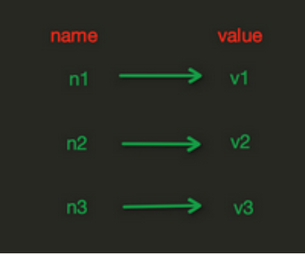
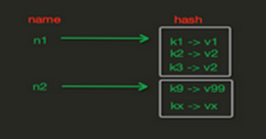
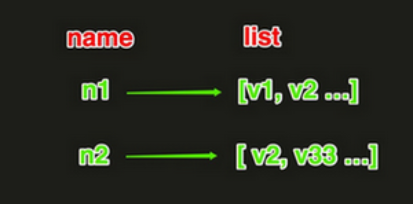

## 01.string

### 1.1 String存存储样式

- **注：**String操作，redis中的String在在内存中按照一个name对应一个value字典形式来存储

 </img>

### 1.2 set常用参数

- set(name, value, ex=None, px=None, nx=False, xx=False)
     - 1） ex，过期时间（秒）
     - 2） px，过期时间（毫秒）
     - 3） nx，如果设置为True，则只有name不存在时，当前set操作才执行

     - 4） xx，如果设置为True，则只有name存在时，当前set操作才执行

### 1.3 string常用命令

```python
import redis
r = redis.Redis(host='1.1.1.3', port=6379)

#1、打印这个Redis缓存所有key以列表形式返回：[b'name222', b'foo']
print( r.keys() )                      # keys *

#2、清空redis
r.flushall()

#3、设置存在时间：  ex=1指这个变量只会存在1秒，1秒后就不存在了
r.set('name', 'Alex')                 # ssetex name Alex
r.set('name', 'Alex',ex=1)             # ssetex name 1 Alex

#4、获取对应key的value
print(r.get('name'))                # get name

#5、删除指定的key
r.delete('name')                    # del 'name'

#6、避免覆盖已有的值：  nx=True指只有当字典中没有name这个key才会执行
r.set('name', 'Tom',nx=True)        # setnx name alex

#7、重新赋值： xx=True只有当字典中已经有key值name才会执行
r.set('name', 'Fly',xx=True)       # set name alex xx

#8、psetex(name, time_ms, value) time_ms，过期时间（数字毫秒 或 timedelta对象）
r.psetex('name',10,'Tom')          # psetex name 10000 alex

#10、mset 批量设置值;  mget 批量获取
r.mset(key1='value1', key2='value2')           # mset k1 v1 k2 v2 k3 v3
print(r.mget({'key1', 'key2'}))                # mget k1 k2 k3

#11、getset(name, value) 设置新值并获取原来的值
print(r.getset('age','100'))                    # getset name tom

#12、getrange(key, start, end)    下面例子就是获取name值abcdef切片的0-2间的字符（b'abc'）
r.set('name','abcdef')
print(r.getrange('name',0,2))

#13、setbit(name, offset, value)  #对name对应值的二进制表示的位进行操作
r.set('name','abcdef')
r.setbit('name',6,1)    #将a（1100001）的第二位值改成1，就变成了c（1100011）
print(r.get('name'))    #最后打印结果：b'cbcdef'

#14、bitcount(key, start=None, end=None) 获取name对应的值的二进制表示中 1 的个数

#15、incr(self,name,amount=1) 自增 name对应的值，当name不存在时，则创建name＝amount，否则自增

#16、derc 自动减1：利用incr和derc可以简单统计用户在线数量
#如果以前有count就在以前基础加1，没有就第一次就是1，以后每运行一次就自动加1
num = r.incr('count')

#17、num = r.decr('count')    #每运行一次就自动减1
#每运行一次incr('count')num值加1每运行一次decr后num值减1
print(num)            

#18、append(key, value) 在redis name对应的值后面追加内容
r.set('name','aaaa')
r.append('name','bbbb')
print(r.get('name'))        #运行结果： b'aaaabbbb'
```

## 02.Hash

### 2.1 Hash在内存存储样式

- 注： hash在内存中存储可以不像string中那样必须是字典，可以一个键对应一个字典

 </img>

### 2.2 Redis对Hash字典操作

```python
import redis
pool = redis.ConnectionPool(host='1.1.1.3', port=6379)

r = redis.Redis(connection_pool=pool)
#1 hset(name, key, value) name=字典名字，key=字典key，value=对应key的值
r.hset('info','name','tom')       # hset info name tom
r.hset('info','age','100')
print(r.hgetall('info'))           # hgetall info          {b'name': b'tom', b'age': b'100'}
print(r.hget('info','name'))      # hget info name         b'tom'

print(r.hkeys('info'))        #打印出”info”对应的字典中的所有key         [b'name', b'age']
print(r.hvals('info'))        #打印出”info”对应的字典中的所有value       [b'tom', b'100']


#2 hmset(name, mapping) 在name对应的hash中批量设置键值对
r.hmset('info2', {'k1':'v1', 'k2': 'v2','k3':'v3'}) #一次性设置多个值
print(r.hgetall('info2'))         #hgetall() 一次性打印出字典中所有内容
print(r.hget('info2','k1'))       #打印出‘info2’对应字典中k1对应的value
print(r.hlen('info2'))            # 获取name对应的hash中键值对的个数
print(r.hexists('info2','k1'))    # 检查name对应的hash是否存在当前传入的key
r.hdel('info2','k1')              # 将name对应的hash中指定key的键值对删除
print(r.hgetall('info2'))

#3 hincrby(name, key, amount=1)自增name对应的hash中的指定key的值，不存在则创建key=amount
r.hincrby('info2','k1',amount=10)  #第一次赋值k1=10以后每执行一次值都会自动增加10
print(r.hget('info2','k1'))

#4 hscan(name, cursor=0, match=None, count=None)对于数据大的数据非常有用，hscan可以实现分片的获取数据
# name，redis的name
# cursor，游标（基于游标分批取获取数据）
# match，匹配指定key，默认None 表示所有的key
# count，每次分片最少获取个数，默认None表示采用Redis的默认分片个数
print(r.hscan('info2',cursor=0,match='k*'))     #打印出所有key中以k开头的
print(r.hscan('info2',cursor=0,match='*2*'))     #打印出所有key中包含2的

#5 hscan_iter(name, match=None, count=None)
# match，匹配指定key，默认None 表示所有的key
# count，每次分片最少获取个数，默认None表示采用Redis的默认分片个数
for item in r.hscan_iter('info2'):
    print(item)
```

## 03.List

### 3.1 List内存中存储样式

 </img>

### 3.2 List常用操作

```python
import redis
pool = redis.ConnectionPool(host='10.1.0.51', port=6379)

r = redis.Redis(connection_pool=pool)

#1 lpush:反向存放   rpush正向存放数据
r.lpush('names','alex','tom','jack')         # 从右向左放数据比如：3,2,1（反着放）
print(r.lrange('names',0,-1))                 # 结果：[b'jack', b'tom']
r.rpush('names','zhangsan','lisi')           #从左向右放数据如：1,2,3（正着放）
print(r.lrange('names',0,-1))                 #结果：b'zhangsan', b'lisi']

#2.1  lpushx(name,value) 在name对应的list中添加元素，只有name已经存在时，值添加到列表最左边
#2.2  rpushx(name, value) 表示从右向左操作

#3 llen(name) name对应的list元素的个数
print(r.llen('names'))

#4 linsert(name, where, refvalue, value)) 在name对应的列表的某一个值前或后插入一个新值
# name，redis的name
# where，BEFORE或AFTER
# refvalue，标杆值，即：在它前后插入数据
# value，要插入的数据
r.rpush('name2','zhangsan','lisi')                           #先创建列表[zhangsan,lisi]
print(r.lrange('name2',0,-1))
r.linsert('name2','before','zhangsan','wangwu')         #在张三前插入值wangwu
r.linsert('name2','after','zhangsan','zhaoliu')         #在张三前插入值zhaoliu
print(r.lrange('name2',0,-1))

#5 r.lset(name, index, value)  对name对应的list中的某一个索引位置重新赋值
r.rpush('name3','zhangsan','lisi')                          #先创建列表[zhangsan,lisi]
r.lset('name3',0,'ZHANGSAN')                            #将索引为0的位置值改成'ZHANGSAN'
print(r.lrange('name3',0,-1))                            #最后结果：[b'ZHANGSAN', b'lisi']

#6 r.lrem(name, value, num) 在name对应的list中删除指定的值
# name，redis的name
# value，要删除的值
# num，  num=0，删除列表中所有的指定值；
# num=2,从前到后，删除2个；
# num=-2,从后向前，删除2个
r.rpush('name4','zhangsan','zhangsan','zhangsan','lisi')
r.lrem('name4','zhangsan',1)
print(r.lrange('name4',0,-1))

#7 lpop(name) 在name对应的列表的左侧获取第一个元素并在列表中移除，返回值则是第一个元素
r.rpush('name5','zhangsan','lisi')
r.rpop('name5')
print(r.lrange('name5',0,-1))

#8 lindex(name, index) 在name对应的列表中根据索引获取列表元素
r.rpush('name6','zhangsan','lisi')
print(r.lindex('name6',1))

#9 lrange(name, start, end) 在name对应的列表分片获取数据
r.rpush('num',0,1,2,3,4,5,6)
print(r.lrange('num',1,3))

#10 ltrim(name, start, end) 在name对应的列表中移除没有在start-end索引之间的值
r.rpush('num1',0,1,2,3,4,5,6)
r.ltrim('num1',1,2)
print(r.lrange('num1',0,-1))

#11 rpoplpush(src, dst) 从一个列表取出最右边的元素，同时将其添加至另一个列表的最左边
r.rpush('num2',0,1,2,3)
r.rpush('num3',100)
r.rpoplpush('num2','num3')
print(r.lrange('num3',0,-1))        #运行结果：[b'3', b'100']

#12 blpop(keys, timeout) 将多个列表排列，按照从左到右去pop对应列表的元素
#timeout，超时时间，当元素所有列表的元素获取完之后，阻塞等待列表内有数据的时间（秒）, 0 表示永远阻塞
r.rpush('num4',0,1,2,3)
r.blpop('num4',10)
print(r.lrange('num4',0,-1))
```

## 04.set集合

```python
import redis
r = redis.Redis(host='10.1.0.51', port=6379)

#1 sadd(name,values) name对应的集合中添加元素
#2 scard(name) 获取name对应的集合中元素个数
r.sadd('name0','alex','tom','jack')
print(r.scard('name0'))

#3 sdiff(keys, *args) 在第一个name对应的集合中且不在其他name对应的集合的元素集合
r.sadd('num6',1,2,3,4)
r.sadd('num7',3,4,5,6)               #在num6中有且在num7中没有的元素
print(r.sdiff('num6','num7'))        #运行结果：{b'1', b'2'}

#4 sdiffstore(dest, keys, *args)
#获取第一个name对应的集合中且不在其他name对应的集合，再将其新加入到dest对应的集合中
# 将在num7中不在num8中的元素添加到num9
r.sadd('num7',1,2,3,4)
r.sadd('num8',3,4,5,6)
r.sdiffstore('num9','num7','num8')
print(r.smembers('num9'))            #运行结果： {b'1', b'2'}

#5 sinter(keys, *args) 获取多一个name对应集合的交集
r.sadd('num10',4,5,6,7,8)
r.sadd('num11',1,2,3,4,5,6)
print(r.sinter('num10','num11'))    #运行结果： {b'4', b'6', b'5'}

#6 sinterstore(dest, keys, *args) 获取多一个name对应集合的并集，再讲其加入到dest对应的集合中
r.sadd('num12',1,2,3,4)
r.sadd('num13',3,4,5,6)
r.sdiffstore('num14','num12','num13')
print(r.smembers('num14'))          #运行结果： {b'1', b'2'}

#7 sismember(name, value) 检查value是否是name对应的集合的成员
r.sadd('name22','tom','jack')
print(r.sismember('name22','tom'))

#8 smove(src, dst, value) 将某个成员从一个集合中移动到另外一个集合
r.sadd('num15',1,2,3,4)
r.sadd('num16',5,6)
r.smove('num15','num16',1)
print(r.smembers('num16'))         #运行结果： {b'1', b'5', b'6'}

#9 spop(name) 从集合的右侧（尾部）移除一个成员，并将其返回
r.sadd('num17',4,5,6)
print(r.spop('num17'))

#10 srandmember(name, numbers) 从name对应的集合中随机获取 numbers 个元素
r.sadd('num18',4,5,6)
print(r.srandmember('num18',2))

#11 srem(name, values) 在name对应的集合中删除某些值
r.sadd('num19',4,5,6)
r.srem('num19',4)
print(r.smembers('num19'))           #运行结果： {b'5', b'6'}

#12 sunion(keys, *args) 获取多一个name对应的集合的并集
r.sadd('num20',3,4,5,6)
r.sadd('num21',5,6,7,8)
print(r.sunion('num20','num21'))    #运行结果： {b'4', b'5', b'7', b'6', b'8', b'3'}

#13 sunionstore(dest,keys, *args)
# 获取多个name对应的集合的并集，并将结果保存到dest对应的集合中
r.sunionstore('num22','num20','num21')
print(r.smembers('num22'))          #运行结果： {b'5', b'7', b'3', b'8', b'6', b'4'}

#14 sscan(name, cursor=0, match=None, count=None)
#   sscan_iter(name, match=None, count=None)
#同字符串的操作，用于增量迭代分批获取元素，避免内存消耗太大
```

## 05.zset集合

### 5.1 有序集合

- 有序集合，在集合的基础上，为每元素排序

- 元素的排序需要根据另外一个值来进行比较
- 对于有序集合，每一个元素有两个值，即：值和分数，分数专门用来做排序

### 5.2 redis操作有序集合

```python
import redis
pool = redis.ConnectionPool(host='10.1.0.51', port=6379)
r = redis.Redis(connection_pool=pool)

#1 zadd(name, *args, **kwargs) 在name对应的有序集合中添加元素
r.zadd('zz', n1=11, n2=22,n3=15)
print(r.zrange('zz',0,-1))                  #[b'n1', b'n3', b'n2']
print(r.zrange('zz',0,-1,withscores=True))  #[(b'n1', 11.0), (b'n3', 15.0), (b'n2', 22.0)]

#2 zcard(name) 获取name对应的有序集合元素的数量

#3 zcount(name, min, max) 获取name对应的有序集合中分数 在 [min,max] 之间的个数
r.zadd('name01', tom=11,jack=22,fly=15)
print(r.zcount('name01',1,20))

#4 zincrby(name, value, amount) 自增name对应的有序集合的 name 对应的分数

#5 zrank(name, value) 获取某个值在 name对应的有序集合中的排行（从 0 开始）
r.zadd('name02', tom=11,jack=22,fly=15)
print(r.zrank('name02','fly'))

#6 zrem(name, values) 删除name对应的有序集合中值是values的成员
r.zadd('name03', tom=11,jack=22,fly=15)
r.zrem('name03','fly')
print(r.zrange('name03',0,-1))            # [b'tom', b'jack']

#7 zremrangebyrank(name, min, max)根据排行范围删除
r.zadd('name04', tom=11,jack=22,fly=15)
r.zremrangebyrank('name04',1,2)
print(r.zrange('name04',0,-1))            # [b'tom']

#8 zremrangebyscore(name, min, max) 根据分数范围删除
r.zadd('name05', tom=11,jack=22,fly=15)
r.zremrangebyscore('name05',1,20)
print(r.zrange('name05',0,-1))

#9 zremrangebylex(name, min, max) 根据值返回删除

#10 zscore(name, value) 获取name对应有序集合中 value 对应的分数

#11 zinterstore(dest, keys, aggregate=None)                #11测试过代码报错，未解决
#获取两个有序集合的交集，如果遇到相同值不同分数，则按照aggregate进行操作
# aggregate的值为:  SUM  MIN  MAX
r.zadd('name09', tom=11,jack=22,fly=15)
r.zadd('name10', tom=12,jack=23,fly=15)
r.zinterstore('name11',2,'name09','name10')
print(r.zrange('name11',0,-1))
```

### 5.3 有序集合在命令行测试

```python
# 127.0.0.1:6379> zadd name222 11 zhangsan 12 lisi
    (integer) 2

# 127.0.0.1:6379> zrange name222 0 -1
    1) "zhangsan"
    2) "lisi"

# 127.0.0.1:6379> zadd name333 11 zhangsan 12 lisi
    (integer) 2

# 127.0.0.1:6379> zrange name333 0 -1
    1) "zhangsan"
    2) "lisi"

# 127.0.0.1:6379> zinterstore name444 2 name222 name333
    (integer) 2

# 127.0.0.1:6379> zrange name444 0 -1 withscores
    1) "zhangsan"
    2) "22"
    3) "lisi"
    4) "24"
```

