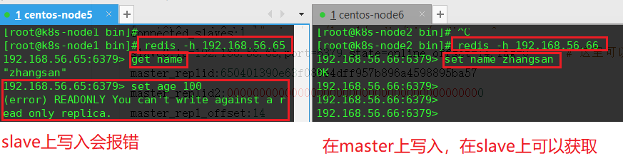
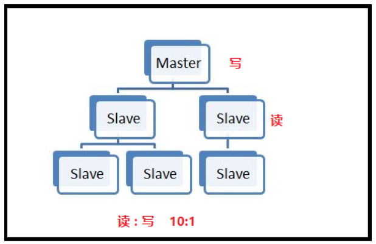

## 01.配置集群

- VMware版本号：16.0.0

| Master/Slave | 系统       | IP            | Redis版本   |
| ------------ | ---------- | ------------- | ----------- |
| Master       | CentOS 7.5 | 192.168.56.65 | redis-5.0.3 |
| Slave        | CentOS 7.5 | 192.168.56.66 | redis-5.0.3 |

### 1.1 安装redis

- 在master和slave中分别安装好redis-server
- [安装redis](http://v5blog.cn/pages/4d3a23/)

### 1.2 Master配置

- Master都是基本的配置，但要将 **bind 127.0.0.1** 改为 **bind 0.0.0.0** ，要不然Slave会连不上
- 日志提示“Error condition on socket for SYNC: Connection refused”。

```python
[root@k8s-node2 bin]# vim /usr/local/redis/bin/redis.conf
bind 0.0.0.0
```

### 1.3 Slave配置

- Slave除基本的配置外，需要增加 **slaveof 10.10.3.211 6379** 
- 如果有密码就配置 masterauth 

```python
[root@k8s-node2 bin]# vim /usr/local/redis/bin/redis.conf
bind 192.168.56.65
slaveof 192.168.56.66 6379
```

### 1.4 查看主从信息

```python
[root@k8s-node2 bin]# systemctl restart redis
[root@k8s-node2 bin]# redis -h 192.168.56.66 info Replication
# Replication
role:master
connected_slaves:1
slave0:ip=192.168.56.65,port=6379,state=online,offset=14,lag=0    # 这里可以看到redis从服务器信息
master_replid:650401390e63f086e4dff957b896a4598895ba57
master_replid2:0000000000000000000000000000000000000000
master_repl_offset:14
second_repl_offset:-1
repl_backlog_active:1
repl_backlog_size:1048576
repl_backlog_first_byte_offset:1
repl_backlog_histlen:14
```

### 1.5 测试是否自动同步

 </img>

## 02.主从概念

### 2.1 redis主从概念

- ⼀个master可以拥有多个slave，⼀个slave⼜可以拥有多个slave，如此下去，形成了强⼤的多级服务器集群架构
- master用来写数据，slave用来读数据，经统计：网站的读写比率是10:1
- 通过主从配置可以实现读写分离

 </img>

### 2.2 redis主从弊端

- 缺点：主节点宕机，无法继续使用
- 因为只有master可以进行写入


