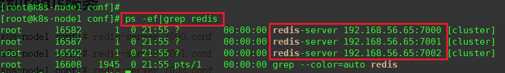
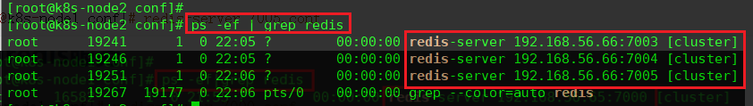
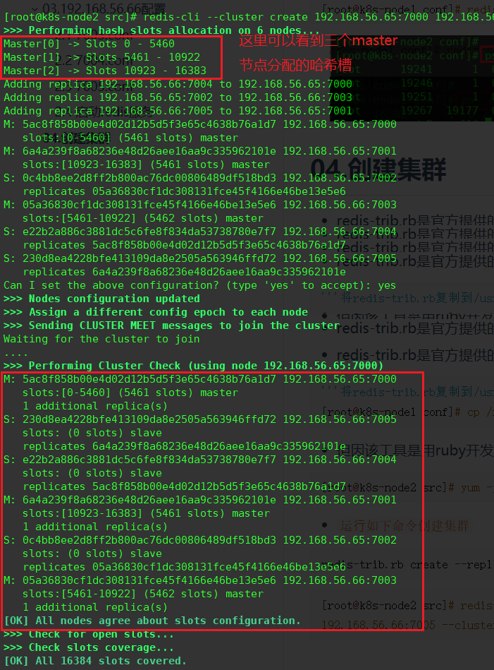
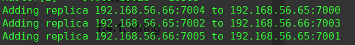

## 01.机器配置

- [redis各种集群模式](http://v5blog.cn/pages/76153a/)

- VMware版本号：16.0.0
- 在两台机器上分别安装好redis服务
- [安装redis](http://v5blog.cn/pages/4d3a23/)

| 系统       | IP            | 运行实例端口           | Redis版本   |
| ---------- | ------------- | ---------------------- | ----------- |
| CentOS 7.5 | 192.168.56.65 | 7000<br/>7001<br/>7002 | redis-5.0.3 |
| CentOS 7.5 | 192.168.56.66 | 7000<br/>7001<br/>7002 | redis-5.0.3 |

## 02.192.168.56.65配置

- 创建conf配置文件夹
- 三个⽂件的配置区别在`port、pidfile、cluster-config-file`三项

```python
[root@k8s-node1 ~]# mkdir /root/conf/
```

### 2.1 7000.conf

```python
[root@k8s-node1 ~]# vim /root/conf/7000.conf
port 7000
bind 192.168.56.65
daemonize yes
pidfile 7000.pid
cluster-enabled yes
cluster-config-file 7000_node.conf
cluster-node-timeout 15000
appendonly yes
```

### 2.2 7001.conf

```python
[root@k8s-node1 ~]# vim /root/conf/7001.conf
port 7001
bind 192.168.56.65
daemonize yes
pidfile 7001.pid
cluster-enabled yes
cluster-config-file 7001_node.conf
cluster-node-timeout 15000
appendonly yes
```

### 2.3 7002.conf

```python
[root@k8s-node1 ~]# vim /root/conf/7002.conf
port 7002
bind 192.168.56.65
daemonize yes
pidfile 7002.pid
cluster-enabled yes
cluster-config-file 7002_node.conf
cluster-node-timeout 15000
appendonly yes
```

### 2.4 启动redis服务

```python
[root@k8s-node1 conf]# redis-server 7000.conf
[root@k8s-node1 conf]# redis-server 7001.conf
[root@k8s-node1 conf]# redis-server 7002.conf
```

 </img>

## 03.192.168.56.66配置

- 创建conf配置文件夹
- 三个⽂件的配置区别在`port、pidfile、cluster-config-file`三项

```python
[root@k8s-node1 ~]# mkdir /root/conf/
```

### 2.1 7003.conf

```python
[root@k8s-node1 ~]# vim /root/conf/7003.conf
port 7003
bind 192.168.56.66
daemonize yes
pidfile 7003.pid
cluster-enabled yes
cluster-config-file 7003_node.conf
cluster-node-timeout 15000
appendonly yes
```

### 2.2 7004.conf

```python
[root@k8s-node1 ~]# vim /root/conf/7004.conf
port 7004
bind 192.168.56.66
daemonize yes
pidfile 7004.pid
cluster-enabled yes
cluster-config-file 7004_node.conf
cluster-node-timeout 15000
appendonly yes
```

### 2.3 7005.conf

```python
[root@k8s-node1 ~]# vim /root/conf/7005.conf
port 7005
bind 192.168.56.66
daemonize yes
pidfile 7005.pid
cluster-enabled yes
cluster-config-file 7005_node.conf
cluster-node-timeout 15000
appendonly yes
```

### 2.4 启动redis服务

```python
[root@k8s-node1 conf]# redis-server 7003.conf
[root@k8s-node1 conf]# redis-server 7004.conf
[root@k8s-node1 conf]# redis-server 7005.conf
```

 </img>

## 04.创建集群

### 4.1 创建集群

- redis-trib.rb是官方提供的Redis Cluster的管理工具，无需额外下载，默认位于源码包的src目录下

```python
'''将redis-trib.rb复制到/usr/local/bin/下，以便在任何⽬录下调⽤此命令'''
[root@k8s-node1 conf]# cp /root/redis-5.0.3/src/redis-trib.rb  /usr/local/bin/
```

- 但因该工具是用ruby开发的，所以需要准备相关的依赖环境

```python
[root@k8s-node2 src]# yum -y install ruby
```

- `运⾏如下命令创建集群`

```python
[root@k8s-node2 src]# redis-cli --cluster create 192.168.56.65:7000 192.168.56.65:7001 192.168.56.65:7002 192.168.56.66:7003 192.168.56.66:7004 192.168.56.66:7005 --cluster-replicas 1
```

### 4.2 查看集群创建结果

- 根据下图可以看出，当前搭建的主服务器为7000、7001、7003，对应的从服务器是7004、7005、7002

 </img>

### 4.3 数据验证

 </img>

- 在7002上写入数据，会自动将操作转发给7003
- 在7002和7003两台服务器中，`7003是master，master能写入`

```python
[root@k8s-node1 conf]# redis-cli -h 192.168.56.65 -c -p 7002
192.168.56.65:7002> set name tom
-> Redirected to slot [5798] located at 192.168.56.66:7003
OK
```

- 在7003中可以看到刚刚在7002中写入的数据

```
[root@k8s-node1 ~]# redis-cli -h 192.168.56.66 -c -p 7003
192.168.56.66:7003> get name
"tom"
```

- 在7000客户端去查找刚刚的数据，其实当前redis实例没有这条数据
- 会将请求转发给了7003这个redis进行查找

```
[root@k8s-node1 ~]# redis-cli -h 192.168.56.65 -c -p 7000
192.168.56.65:7000> get name
-> Redirected to slot [5798] located at 192.168.56.66:7003
"tom"
```

## 05.Python交互

### 5.1 安装redis-py-cluster

```python
pip install redis==2.10.6
pip install redis-py-cluster==1.3.5
```

- redis-py-cluster源码地址https://github.com/Grokzen/redis-py-cluster

### 5.2 python使用redis集群

```python
from rediscluster import *
if __name__ == '__main__':
  try:
    # 构建所有的节点，Redis会使⽤CRC16算法，将键和值写到某个节点上
    startup_nodes = [
        {'host': '192.168.56.65', 'port': '7000'},
        {'host': '192.168.56.65', 'port': '7001'},
        {'host': '192.168.56.65', 'port': '7002'},
        {'host': '192.168.56.66', 'port': '7003'},
        {'host': '192.168.56.66', 'port': '7004'},
        {'host': '192.168.56.66', 'port': '7005'},
    ]
    # 构建StrictRedisCluster对象
    src=StrictRedisCluster(startup_nodes=startup_nodes,decode_responses=True)
    # 设置键为name、值为itheima的数据
    result=src.set('name','itheima')
    print(result)
    # 获取键为name
    name = src.get('name')
    print(name)
  except Exception as e:
    print(e)
'''
打印结果：
True
itheima
'''
```

## 06.django中使用

- [参考](https://github.com/glumu/django-redis-cluster)

### 6.1 Requirement

Python 3.0+

Django>=1.9.6

redis>=2.10.5

redis-py-cluster>=1.2.0

msgpack-python>=0.4.7

### 6.2 How to install

```
$python setup.py install
or
$pip install django-redis-cluster
```

### 6.3 Django Settings

```python
CACHES = {
    'default': {
        'BACKEND': 'django_redis_cluster.cache.RedisClusterCache',
        "LOCATION": [
            "redis://127.0.0.1:7000/0",
            "redis://127.0.0.1:7001/0",
            "redis://127.0.0.1:7002/0",
        ],
        'OPTIONS': {
            "CLIENT_CLASS": "django_redis_cluster.client.DefaultClient",
        }
    }
}
```