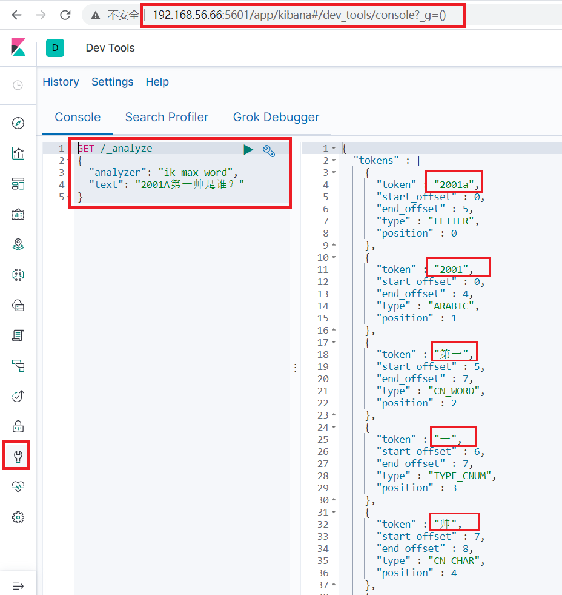
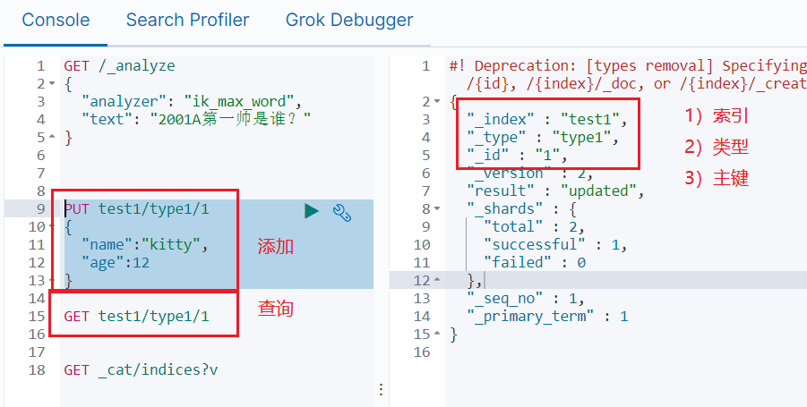

## 01.基本测试

### 1.1 测试分词功能

http://192.168.56.66:5601

```javascript
GET /*          ## 获取所有数据

DELETE /*        ## 删除所有数据

GET /_analyze     ## 测试分词
{
  "analyzer": "ik_max_word",
  "text": "2001A第一帅是谁？"
}
```

 </img>


### 1.2 测试添加数据

```javascript
PUT test1/type1/1
{
  "name":"kitty",
  "age":12
}
```

 </img>

## 02.商品文档的基础操作(CRUD)

### 2.1 新增商品

- 标准语法

```javascript
put /index/type/id
{
	k-v类型的数据
}
```

- 添加第一条数据

```javascript
put /goods/fruit/1
{
  "name":"xiangjiao",
  "describe":"haochi tian",
  "price":40,
  "producer":"feilvbin",
  "tags":["xiangjiao","haochi"]
}
```

- 添加第二条数据

```javascript
put /goods/fruit/2
{
  "name":"pingguo",
  "describe":" cui",
  "price":60,
  "producer":"zhongguo",
  "tags":["haokan","xiang"]
}
```

- 其中 goods表示要创建的索引名称(数据库),fruit表示要创建的数据类别（表）,1表示插入的数据的主键,这里需要明确一个概念就是倒排索引

2.2查询商品

标准语法:

GET /index /type/id

### 2.2 查询一条数据

- 标准语法:

```javascript
## GET /index /type/id
```

- 测试查询

```javascript
## GET /goods/fruit/1
## 查询结果如下:
{
  "_index" : "goods",
  "_type" : "fruit",
  "_id" : "1",
  "_version" : 1,               ----------------表示当前的操作版本号
  "found" : true,
  "_source" : {                ------------------表示元数据,内部信息就是当前的这条记录信息
    "name" : "xiangjiao",
    "describe" : "haochi tian",
    "price" : 40,
    "producer" : "feilvbin",
    "tags" : [
      "xiangjiao",
      "haochi"
    ]
  }
}
## 注意:带下划线的都是es自带的属性
```

### 2.3 修改商品

- 标准语法

```javascript
## POST /index/type/id/_update

{
	"doc": {
		"field": "vaule"
	}
}
```

- 测试修改

```javascript
## POST /goods/fruit/1/_update

{
  "doc": {
    "name":"yutou"
  }
}
```

- 可以同时修改多条属性的值,值与值之间用”,”号间隔,还有一种非主流的写法也是可以的

### 2.4 删除操作

- 标准语法:

```javascript
## DELETE /index/type/id

DELETE /goods/fruit/1
```

## 03.es查询操作

### 3.1 全部查询

- 标准语法:

```javascript
## GET /index/type/_search

GET /goods/fruit/_search                     ## 查询所有
```

- 查询结果说明
     - took：耗费了几毫秒
     - timed_out：是否超时，这里是没有
     - _shards：数据拆成了5个分片，所以对于搜索请求，会打到所有的primary shard
     - hits.total：查询结果的数量，多少个document
     - hits.max_score：score的含义，就是document对于一个search的相关度的匹配分数，越相关，就越匹配，分数也高
     - hits.hits：包含了匹配搜索的document的详细数据

- 查询结果

```javascript
{
  "took" : 1,                  ## 耗费了几毫秒
  "timed_out" : false,            ## 是否超时，这里是没有
  "_shards" : {
    "total" : 1,
    "successful" : 1,
    "skipped" : 0,
    "failed" : 0
  },
  "hits" : {
    "total" : {
      "value" : 1,
      "relation" : "eq"
    },
    "max_score" : 0.6931472,
    "hits" : [
      {
        "_index" : "goods",
        "_type" : "fruit",
        "_id" : "1",
        "_score" : 0.6931472,
        "_source" : {
          "name" : "xiangjiao",
          "describe" : "haochi tian",
          "price" : 40,
          "producer" : "feilvbin",
          "tags" : [
            "xiangjiao",
            "haochi"
          ]
        }
      }
    ]
  }
}
```

### 3.2 条件查询

- name=xiangjiao的

```javascript
## 方法1
GET goods/fruit/_search/?q=name:xiangjiao         ## 查询名字为xiangjiao的
## 方法2
GET goods/fruit/_search
{
  "query": {
    "match": {
      "name": "xiangjiao"
    }
  }
}
```

### 3.3 按条件查询和排序

- 查询 name=pingguo 使用价格进行正向排序

```javascript
GET goods/fruit/_search
{
	"query": {
		"match": {
			"name": "pingguo"
		}
	},
	"sort": [
	  {
	    "price": {
	      "order": "desc"
	    }
	  }
	]
}
```

### 3.4 分页查询

- 注意: 这里的检索结果是倒排索引,不是按照id排序的,是按照倒排的方式来进行检索的,再强调下,不是根据id排序
- 每页显示两条数据

```javascript
GET /goods/fruit/_search
{
	"query": {
		"match_all": {}
	},
	"from": 0,
	"size": 2
}
```

### 3.5 只显示指定字段

- 检索出来的内容也就只包含了name和price字段的内容

```javascript
GET /goods/fruit/_search
{
	"query": {
		"match_all": {}
	},
	"_source": ["name","price"], 
	"from": 0,
	"size": 2
}
```

### 3.6 多条件匹配查询

- 查询 name=xiangjiao 并且 price=25

```javascript
GET /goods/fruit/_search
{
  "query": {
    "bool": {
      "must": [
        {
          "match": {
            "name": "xiangjiao"
          }
        },
        {
          "match": {
            "price": "25"
          }
        }
      ]
    }
  }
}
```

- 查询 name=xiangjiao  或者 price=45

```javascript
GET /goods/fruit/_search
{
  "query": {
    "bool": {
      "should": [
        {
          "match": {
            "name": "xiangjiao"
          }
        },
        {
          "match": {
            "price": "45"
          }
        }
      ]
    }
  }
}
```

### 3.7 过滤查询

- 注意:filter于must/must_not/should是并列关系,同属于bool的子属性  
- lt:小于,  lte:小于等于,   gt:大于,  gte:大于等于

- 查询 `name=xiangjiao 或者 价格在 10~40`之间的水果

```javascript
GET /goods/fruit/_search
{
  "query": {
    "bool": {
      "should": [
        {
          "match": {
            "name": "xiangjiao"
          }
        }
      ],
      "filter": {
        "range": {
          "price": {
            "gte": 10,
            "lte": 40
          }
        }  
      }
    }
  }
}
```

### 3.8 全文检索

- 查询 name=pingguo 或者  name=xiangjiao的

```javascript
GET /goods/fruit/_search
{
  "query": {
    "match": {
      "name": "pingguo xiangjiao"
    }
  }
}
```