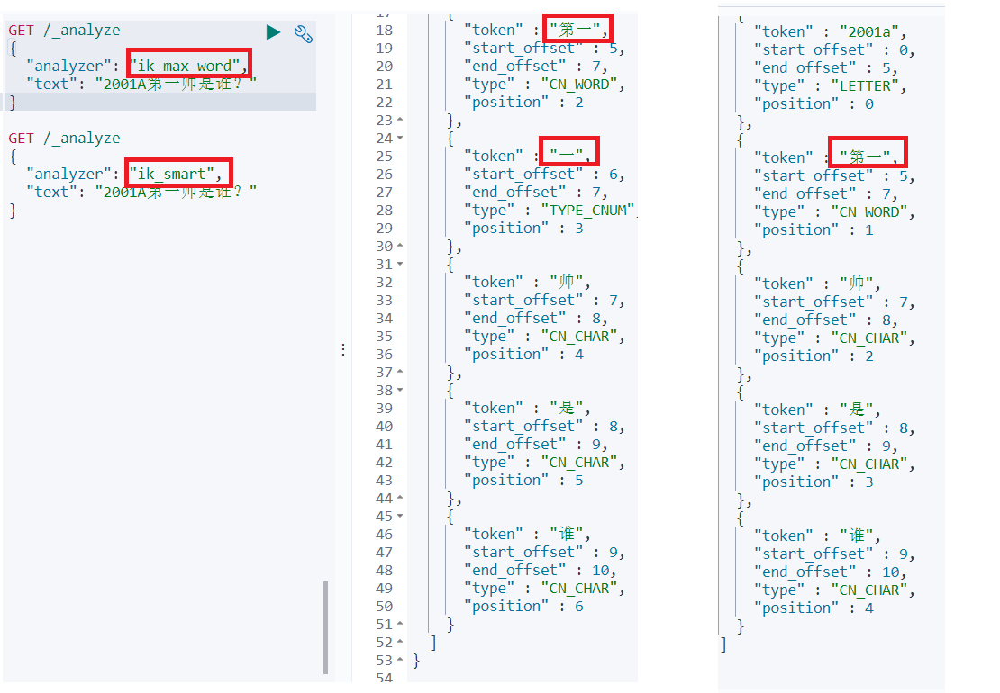

## 01.mapping映射

- 前面已经安装了ik中文分词器,这里就不介绍怎么安装了
- ik_max_word: 会将文本做最细粒度的拆分
- ik_smart: 会做最粗粒度的拆分

### 1.1 映射是什么

- 映射：指定字段类型，将时间域视为时间，数字域视为数字，字符串域视为全文或精确值字符串
- Elasticsearch 支持如下简单域类型：
     - 字符串: text   string(高版本废弃)
     - 整数 : byte, short, integer, long
     - 浮点数: float, double
     - 布尔型: boolean
     - 日期: date

### 1.2 设置mapping

```javascript
## 查看映射关系
GET /worker1/_mapping

## 创建映射
PUT /worker1
{
	"mappings": {
		"properties": {
			"name": {
				"type": "text"
			},
			"age": {
				"type": "long"
			},
			
		}
	}
}
```

### 1.3 添加和查询数据

```javascript
## 查询worker1中所有数据
GET /worker1/_search

## 不指定id在worker1中添加数据
POST /worker1/_doc
{
  "name":"tom",
  "age":18
}


## 指定id在worker1中添加数据
POST /worker1/_doc/2
{
  "name":"jack",
  "age":18
}
```

## 02.分析器

### 2.1 分析器类型

#### 2.1.1 三方中文分词器

- ik_max_word：会做细粒度拆分
- ik_smart：会做最粗粒度的拆分

 </img>

#### 2.2 自带分词器

- 标准分析器（standard）：标准分析器是Elasticsearch默认使用的分析器。
- 简单分析器（simple）：简单分析器在任何不是字母的地方分隔文本，将词条小写。
- `空格分析器`（whitespace）：空格分析器在空格的地方划分文本。
- `语言分析器`（english）：它们可以考虑指定语言的特点
     - 例如， 英语 分析器附带了一组英语无用词（常用单词，例如 and 或者 the ，它们对相关性没有多少影响），它们会被删除。 
     - 由于理解英语语法的规则，这个分词器可以提取英语单词的词干 。

### 2.2 在mapping中指定分析

```javascript
## 查看映射
GET /worker4/_mapping


## 创建mapping
PUT /worker
{
	"mappings": {
		"properties": {
			"name": {
				"type": "text",
				"analyzer": "whitespace"
			},
			"address": {
				"type": "text",
				"analyzer": "english"
			},
			"desc": {
				"type": "text",
				"analyzer": "ik_max_word"
			}
		}
	}
}
```

### 2.3 添加数据

```JavaScript
## 查询所有数据
GET /worker/_search

## 添加记录
POST /worker/_doc/1
{
  "name":"xiao-nai-qiang first",
  "address":"xiao-nai-qiang henan",
  "desc":"肖乃强是谁？"
}
```

### 2.4 whitespace空格分析器

```javascript
## 查看刚刚设置的mapping映射
GET /worker/_mapping
## 查询刚创建的数据 id=1
GET /worker/_doc/1

## 因为name使用的是"whitespace"空格分析器，所以 ?q=name:xiao 无法匹配xiao-nai-qiang 这个关键字
GET /worker/_search?q=name:xiao

## 只有完整查询 ?q=name:xiao-nai-qiang 才能匹配到数据
GET /worker/_search?q=name:xiao-nai-qiang
```

### 2.5 语言分析器（english）

```javascript
## 因为 note字段设置的是 "english" 语音分析器，所以通过 ?q=note:xiao 可以搜索到 xiao-nai-qiang
GET /worker4/_search?q=address:xiao
```

### 2.6 ik_max_word中文分词

```javascript
## ik_max_word中文分词，可以通过 ?q=desc:肖乃强 查询到 "肖乃强是谁？"
GET /worker/_search?q=desc:肖乃强
```