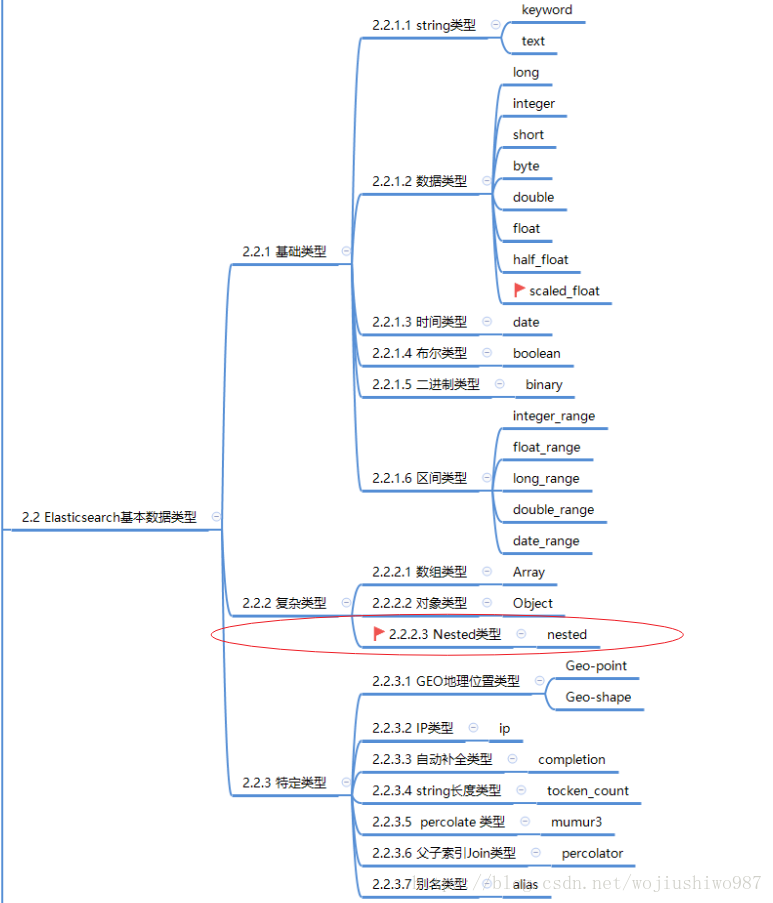

## 01.安装连接

python ES客户端：https://elasticsearch-py.readthedocs.io/ 

elasticsearch官方文档：https://www.elastic.co/guide/en/elasticsearch/reference/7.10/nested.html

### 1.1 安装elasticsearch客户端

```javascript
## pip install elasticsearch
```

### 1.2 创建索引

```javascript
from elasticsearch import Elasticsearch

## 1.连接ES
es = Elasticsearch(["192.168.56.66:9200",])
## 2.创建索引
es.indices.create(index='python_es01',ignore=400)   ## 注意:ignore可以忽略异常
## 3.删除索引
es.indices.delete(index='python_es01', ignore=[400, 404])

```

- 若需验证

```javascript
## es = Elasticsearch(['192.168.56.66:9200'], http_auth=('xiao', '123456'), timeout=3600)
```

- 然后在dev-tools中查看操作结果

> GET /python_es01

### 1.3 插入数据

```javascript
from elasticsearch import Elasticsearch
from datetime import datetime

es = Elasticsearch(["192.168.56.66:9200",])

## 其中index表示插入的索引,doc_type表示数据类型,id表示主键,body表示要插入索引的内容
## 注意:因为elasticsearch中的数据格式为json,所以python中提供的数据类型为dict
es.index(index="my-index", doc_type="test-type", id=1, body={"any": "data01", "timestamp": datetime.now()})
```

- 在dev-tools中操作

> get /my-index/test-type/1

### 1.4 查询数据

#### 1.4.1 法1:使用id查询

```javascript
from elasticsearch import Elasticsearch

es = Elasticsearch(["192.168.56.66:9200",])
result = es.get(index="my-index",doc_type="test-type",id="1")
print(result)
```

#### 1.4.2 法2：使用DevTools中方法进行查询

```javascript
from elasticsearch import Elasticsearch

es = Elasticsearch(["192.168.56.66:9200",])

body={
  "query":{
    "match_all": {}
  }
}
result2 = es.search(index="my-index",doc_type="test-type",body=body)
print(result2)
```

- 查询结果

```
{
	"_index": "my-index",
	"_type": "test-type",
	"_id": "1",
	"_version": 1,
	"_seq_no": 0,
	"_primary_term": 1,
	"found": true,
	"_source": {
		"any": "data01",
		"timestamp": "2021-02-03T11:00:33.396408"
	}
}
```

### 1.5 删除数据

- `等同于：`DELETE /my-index/test-type/1

```javascript
from elasticsearch import Elasticsearch

es = Elasticsearch(["192.168.56.66:9200",])
result = es.delete(index="my-index",doc_type="test-type",id=1)
print(result)
```

## 02.创建mapping

### 2.1 什么是mapping

- mapping 在中的作用就是约束，数据类型声明
- 它类似于静态语言中的数据类型声明，比如声明一个字段为`String`， 以后这个变量都只能存储`String`类型的数据。
- 同样的， 一个`number`类型的mapping 字段只能存储`number`类型的数据。

### 2.2 自动创建mapping

#### 2.2.1 自动创建数据

```javascript
put /goods/fruit/1
{
  "name":"xiangjiao",
  "describe":"haochi tian",
  "price":40,
  "producer":"feilvbin",
  "tags":["xiangjiao","haochi"]
}
```

#### 2.2.2 查看mapping映射

> GET /goods/_mapping

```json
{
  "goods" : {
    "mappings" : {
      "properties" : {
        "describe" : {
          "type" : "text",
          "fields" : {
            "keyword" : {
              "type" : "keyword",
              "ignore_above" : 256
            }
          }
        },
        "name" : {
          "type" : "text",
          "fields" : {
            "keyword" : {
              "type" : "keyword",
              "ignore_above" : 256
            }
          }
        },
        "price" : {
          "type" : "long"
        },
        "producer" : {
          "type" : "text",
          "fields" : {
            "keyword" : {
              "type" : "keyword",
              "ignore_above" : 256
            }
          }
        },
        "tags" : {
          "type" : "text",
          "fields" : {
            "keyword" : {
              "type" : "keyword",
              "ignore_above" : 256
            }
          }
        }
      }
    }
  }
}
```

### 2.3 mapping说明

http://www.ruanyifeng.com/blog/2017/08/elasticsearch.html

#### 2.3.1 mapping分词器

- `analyzer`是字段文本的分词器
- `search_analyzer`是搜索词的分词器
- `ik_max_word`分词器是插件`ik`提供的，可以对文本进行最大数量的分词

#### 2.3.2 域类型

- 字符串: `text` , `keyword`
     - `text`：当一个字段需要用于全文搜索(会被分词)
     - `keyword`：当一个字段需要按照`精确值`进行过滤、排序、聚合等操作时, 就应该使用keyword类型
- 整数 : `byte`, `short`, `integer`, `long`
     - byte  有符号的8位整数, 范围: [-128 ~ 127]

     - short 有符号的16位整数, 范围: [-32768 ~ 32767]

     - integer 有符号的32位整数, 范围: [$-2^{31}$ ~ $2^{31}$-1]

     - long  有符号的32位整数, 范围: [$-2^{63}$ ~ $2^{63}$-1]
- 浮点数: `float`, `double`
     -    float 32位单精度浮点数

     -    double  64位双精度浮点数
- 布尔型: `boolean`
     - 真值: true, "true", "on", "yes", "1"...

     - 假值: false, "false", "off", "no", "0", ""(空字符串), 0.0, 0
- 日期: `date`

 </img>


## 04.手动创建mapping

| ID   | 书名     | 作者   | 价格  | 描述         | 出版时间   |
| ---- | -------- | ------ | ----- | ------------ | ---------- |
| id   | name     | author | price | desc         | pub_date   |
| 1    | 三国演义 | 罗贯中 | 88    | 三国争雄     | 2014-9-12  |
| 2    | 水浒传   | 施耐庵 | 106   | 宋江梁山起义 | 2018-01-27 |
| 3    | 西游记   | 吴承恩 | 206   | 唐僧师徒四人 | 2020-10-10 |
| 4    | 红楼梦   | 曹雪芹 | 88    | 石头记       | 2021–09-18 |

```javascript
## -*- coding: utf-8 -*-
from elasticsearch import Elasticsearch

es = Elasticsearch(["192.168.56.66:9200",])
mappings = {
	"mappings": {
		"properties": {
			"name": {
				"type": "text",
				"analyzer": "ik_max_word",
				"search_analyzer": "ik_max_word"
			},
			"author": {
				"type": "text",
				"analyzer": "ik_max_word",
				"search_analyzer": "ik_max_word"
			},
			"price": {
				"type": "long",
			},
			"desc": {
				"type": "text",
				"analyzer": "ik_max_word",
				"search_analyzer": "ik_max_word"
			},
			"pub_date": {
				"type": "text",
				"analyzer": "ik_max_word",
				"search_analyzer": "ik_max_word"
			},
		}
	}
}
res = es.indices.create(index = 'books',body =mappings)
print(res)
```

- 在浏览器管理页面，查询mappings创建结果

> GET /books/_mapping


## 04.添加数据

### 4.1 for循环添加数据

| D    | 书名     | 作者   | 价格  | 描述         | 出版时间   |
| ---- | -------- | ------ | ----- | ------------ | ---------- |
| id   | name     | author | price | desc         | pub_date   |
| 1    | 三国演义 | 罗贯中 | 88    | 三国争雄     | 2014-09-12 |
| 2    | 水浒传   | 施耐庵 | 106   | 宋江梁山起义 | 2018-01-27 |

```javascript
from elasticsearch import Elasticsearch

es = Elasticsearch('192.168.56.66:9200')
list = [
    {
     "name": "三国演义",
     "author": "罗贯中",
     "price": 88,
     "desc": "三国争雄",
     "pub_date": "2014-09-12"
    },
    {
     "name": "水浒传",
     "author": "施耐庵",
     "price": 106,
     "desc": "宋江梁山起义",
     "pub_date": "2018-01-27"
    }
]
for item in list:
    res = es.index(index='books', body=item)
    print(res['created'])
```

### 4.2 bulk批量添加数据

| ID   | 书名   | 作者   | 价格  | 描述         | 出版时间   |
| ---- | ------ | ------ | ----- | ------------ | ---------- |
| id   | name   | author | price | desc         | pub_date   |
| 3    | 西游记 | 吴承恩 | 206   | 唐僧师徒四人 | 2020-10-10 |
| 4    | 红楼梦 | 曹雪芹 | 88    | 石头记       | 2021–09-18 |

```javascript
## -*- coding: utf-8 -*-
from elasticsearch import Elasticsearch
from elasticsearch.helpers import bulk

es = Elasticsearch(["192.168.56.66:9200",])
list = [
    {
     "name": "西游记",
     "author": "吴承恩",
     "price": 206,
     "desc": "唐僧师徒四人",
     "pub_date": "2020-10-10"
    },
    {
     "name": "红楼梦",
     "author": "曹雪芹",
     "price": 88,
     "desc": "石头记",
     "pub_date": "2021–09-18"
    }
]
ACTIONS = []
i = 10
for line in list:
    action = {
        "_index": 'books',
        "_id": i,  ## _id 也可以默认生成，不赋值
        "_source": {
            "name": line['name'],
            "author": line['author'],
            "price": line['price'],
            "desc": line['desc'],
            "pub_date": line['pub_date']}
    }
    i += 1
    ACTIONS.append(action)

## 批量处理
success, _ = bulk(es, ACTIONS, index='books', raise_on_error=True)
print('Performed %d actions' % success)
```

## 05.查询所有数据

### 5.1 查询所有数据

#### 5.1.1 查询所有数据

```python
from elasticsearch import Elasticsearch

es = Elasticsearch(["192.168.56.66:9200",])
result = es.search(index="es_test",)
print((result))
```

#### 5.1.2 根据body查询所有数据

```javascript
from elasticsearch import Elasticsearch

es = Elasticsearch(["192.168.56.66:9200",])
body = {
    "query":{
        "match_all":{}
    }
}
result = es.search(index="es_test",body=body)
print(result)
```

### 5.2 查询结果

```javascript
{
	"took": 0,
	"timed_out": false,
	"_shards": {
		"total": 1,
		"successful": 1,
		"skipped": 0,
		"failed": 0
	},
	"hits": {
		"total": {
			"value": 4,
			"relation": "eq"
		},
		"max_score": 1.0,
		"hits": [{
			"_index": "books",
			"_type": "_doc",
			"_id": "Vac9bXcBpdA8au-rDwE0",
			"_score": 1.0,
			"_source": {
				"name": "水浒传",
				"author": "施耐庵",
				"price": 106,
				"desc": "宋江梁山起义",
				"pub_date": "2018-01-27"
			}
		}, {
			"_index": "books",
			"_type": "_doc",
			"_id": "10",
			"_score": 1.0,
			"_source": {
				"name": "西游记",
				"author": "吴承恩",
				"price": 206,
				"desc": "唐僧师徒四人",
				"pub_date": "2020-10-10"
			}
		}, {
			"_index": "books",
			"_type": "_doc",
			"_id": "11",
			"_score": 1.0,
			"_source": {
				"name": "红楼梦",
				"author": "曹雪芹",
				"price": 88,
				"desc": "石头记",
				"pub_date": "2021–09-18"
			}
		}, {
			"_index": "books",
			"_type": "_doc",
			"_id": "VqdJbXcBpdA8au-r0AHI",
			"_score": 1.0,
			"_source": {
				"name": "三国演义",
				"author": "罗贯中",
				"price": 88,
				"desc": "三国争雄",
				"pub_date": "2014-09-12"
			}
		}]
	}
}
```

## 06.term和terms模糊查询

- term是代表完全匹配，即不进行分词器分析，文档中必须包含整个搜索的词汇
- terms与term区别是可以按照多个“关键字” 过滤

### 6.1 term

- `查找 title 字段中包含："电视"关键字的内容`
- term是代表完全匹配，即不进行分词器分析，文档中必须包含整个搜索的词汇

```javascript
from elasticsearch import Elasticsearch

es = Elasticsearch(["192.168.56.66:9200",])
body = {
  "query":{
    "term": {
      "name": {
        "value": "三国"     ## 查找 title 字段中包含："三国"关键字的内容
      }
    }
  }
}
result = es.search(index="books",body=body)
print(result)
```

### 6.2 terms

- `查找name字段包含："三国"或者"红楼"关键字`

```javascript
from elasticsearch import Elasticsearch

es = Elasticsearch(["192.168.56.66:9200",])
body = {
  "query":{
    "terms": {
      "name": [     ## 查找name字段包含："三国"或者"红楼"关键字
        "三国",
        "西游"
      ]
    }
  }
}
result = es.search(index="books",body=body)
print(result)
```

## 07.match和multi_match

- match：智能在一个字段匹配
- multi_match：多个字段同时匹配
- 作用：把搜索关键字 `先分词在搜索`
     -  比如"宝马多少马力"会被分词为"宝马 多少 马力", 所有有关"宝马 多少 马力", 那么所有包含这三个词中的一个或多个的文档就会被搜索出来。

### 7.1 match

```javascript
from elasticsearch import Elasticsearch

es = Elasticsearch(["192.168.56.66:9200",])
body = {
  "query":{
    "match": {
      "name": "三国"
    }
  }
}
result = es.search(index="books",body=body)
print(result)
```

### 7.2 multi_match

```javascript
from elasticsearch import Elasticsearch

es = Elasticsearch(["192.168.56.66:9200",])
body = {
  "query": {
    "multi_match": {
      "query": "吴承恩",                   #查询的内容为  吴承恩
      "fields": ["name","author"]          #查询 图书名称 或者 作者包含 吴承恩 关键字
    }
  }
}
result = es.search(index="books", body=body)
print(result)
```

## 08.ids根据多个id查询

```javascript
from elasticsearch import Elasticsearch

es = Elasticsearch(["192.168.56.66:9200",])
body = {
  "query": {
    "ids": {
      "values": [10,11]      ## 查询id为：10或者11的数据
    }
  }
}
result = es.search(index="books",body=body)
print(result)
```

## 09.复合查询bool

- must:必须都满足条件

- should:其中一个满足

- must_not:必须都不满足

### 9.1 must

- `图书名称同时包含："西游"   作者包含："唐僧"` 

```javascript
from elasticsearch import Elasticsearch

es = Elasticsearch(["192.168.56.66:9200",])
body = {
  "query": {
    "bool": {
      "must": [
        { "term": { "name": { "value": "西游" } } },
        { "term": { "desc": { "value": "唐僧" } } }
      ]
    }
  }
}

result = es.search(index="books",body=body)
print(result)
```

### 9.2 should

- 图书名称 包含 “西游” 或者 描述中 包含 “石头记”

```javascript
from elasticsearch import Elasticsearch

es = Elasticsearch(["192.168.56.66:9200",])
body = {
  "query": {
    "bool": {
      "should": [
        { "term": { "name": { "value": "西游" } } },
        { "term": { "desc": { "value": "石头记" } } }
      ]
    }
  }
}

result = es.search(index="books",body=body)
print(result)
```

### 9.3 must_not

图书名称 不包含 “西游” 和 描述中 不包含 “石头记”得所有图书

```javascript
from elasticsearch import Elasticsearch

es = Elasticsearch(["192.168.56.66:9200",])
body = {
  "query": {
    "bool": {
      "must_not": [
        { "term": { "name": { "value": "西游" } } },
        { "term": { "desc": { "value": "石头记" } } }
      ]
    }
  }
}

result = es.search(index="books",body=body)
print(result)
```


## 10.分页

### 10.1 分页查询

```javascript
from elasticsearch import Elasticsearch

es = Elasticsearch(["192.168.56.66:9200",])

body = {
  "query": {
    "match_all": {}   #这里是查询的条件部分
  },
  "from": 0,         #从第几条开始查
  "size": 2         #一次查多少条数据
}
result = es.search(index="books",body=body)
print(result)
```

### 10.2 范围查询加分页

```javascript
from elasticsearch import Elasticsearch

es = Elasticsearch(["192.168.56.66:9200",])
body = {
  "query": {
    "range": {      ## 查找图书价格在 10~100 之间的书籍
      "price": {
        "gte": 10,
        "lte": 100
      }
    }
  },
  "from": 0,
  "size": 10
}
result = es.search(index="books",body=body)
print(result)
```

## 11.前缀查询

### 11.前缀查询

```javascript
from elasticsearch import Elasticsearch

es = Elasticsearch(["192.168.56.66:9200",])
body = {
  "query": {
    "prefix": {
      "author": {
        "value": "吴"     ## 查找图书作者 姓 吴 
      }
    }
  }
}
result = es.search(index="books",body=body)
print(result)
```

## 12.通配符查询

### 12.通配符查询

- `*无忌`:  以无忌结尾的都要
- `张*: `   以张开头的都要
- `张*忌`:  张无忌,张有忌,张1234忌都是我的菜

```javascript
from elasticsearch import Elasticsearch

es = Elasticsearch(["192.168.56.66:9200",])
body = {
  "query": {
    "wildcard": {       #使用通配符
      "author": {
        "value": "*承恩"
      }
    }
  }
}
result = es.search(index="books",body=body)
print(result)
```

## 13.排序

### 13.排序

- Sort是数组,也可以同时对多个字段进行排序,`asc升序,desc降序`

```javascript
from elasticsearch import Elasticsearch

es = Elasticsearch(["192.168.56.66:9200",])
body = {
  "query": {
    "match_all": {}
  },
  "sort": [
    {
      "price": {
        "order": "desc"    ## 查找所有图书，以 价格 降序
      }
    }
  ]
}
result = es.search(index="books",body=body)
print(result)
```


## 14.聚合函数

### 14.聚合函数

- 求最小值:min
- 求最大值:max
- 求平均值:avg
- 求和:sum

```javascript
from elasticsearch import Elasticsearch

es = Elasticsearch(["192.168.56.66:9200",])
body = {
  "query": {
    "match_all": {}
  },
  "aggs": {               #这里是聚合函数的意思
    "价格最低书籍": {          #自定义的字段名称
      "min": {            #求最小值
        "field": "price"      #要求那个字段的最小值
      }
    }
  }
}
result = es.search(index="books",body=body)
print(result)
```

## 15.同时查询多条聚合函数

### 15.同时查询多条聚合函数

```javascript
from elasticsearch import Elasticsearch

es = Elasticsearch(["192.168.56.66:9200",])
body = {
  "query": {
    "match_all": {}
  },
  "aggs": {
    "图书总价格": {
      "sum": {
        "field": "price"
      }
    },
    "图书平均价格":{
      "avg": {
        "field": "price"
      }
    }
  }
}
result = es.search(index="books", body=body)
print(result)
```

## 16.过滤查询

### 16.过滤查询

```javascript
## 查询_id属性:
result = es.search(index="person",doc_type="daxia",filter_path=["hits.hits._id"])

## 查询_source属性:
result = es.search(index="person",doc_type="daxia",filter_path=["hits.hits._source"])

## 默认全查:
result = es.search(index="person",doc_type="daxia",filter_path=["hits.hits._*"])

## 查询当前数据总数
result = es.count(index="person",doc_type="daxia")
```


## 17.删除

### 17.1 关键字删除

```javascript
from elasticsearch import Elasticsearch

es = Elasticsearch(["192.168.56.66:9200",])
body = {
    "query":{
    "term": {
      "school.name": "华山派"
    }
  }
}
result = es.delete_by_query(index="person",doc_type="daxia",body=body)
print(result)
```

### 17.2 年龄范围删除

```javascript
from elasticsearch import Elasticsearch

es = Elasticsearch(["192.168.56.66:9200",])
body = {
    "query": {
    "range": {
      "age": {
        "lte": 20      #删除小于等于20岁的人
      }
    }
  }
}

result = es.delete_by_query(index="person",doc_type="daxia",body=body)
print(result)
```

## 18.按条件更新

### 18.按条件更新

- 重点: 更新查询条件为年龄小于等于20岁的人,
- 其中script中为脚本语法(有坑,详细内容还未查询),修改多项内容,内容与内容之间用”;”号间隔

```javascript
from elasticsearch import Elasticsearch

es = Elasticsearch(["192.168.56.66:9200",])
body = {
    "script": {
        "source": "ctx._source['age']=21;ctx._source['name']='renyy'"
    },
    "query": {
        "range": {
            "age": {
                "lte": 20
            }
        }
    }
}
result = es.update_by_query(index="person",doc_type="daxia",body=body)
print(result)
```