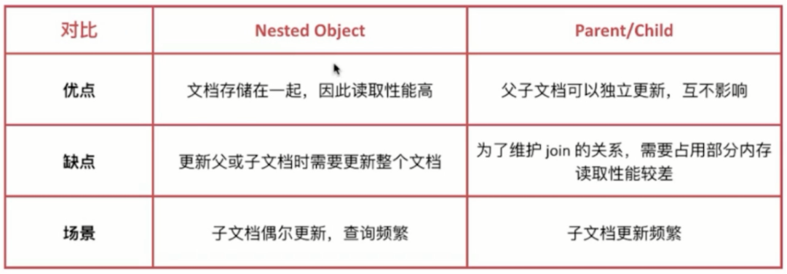

## 01.ES复杂类型

### 1.1 背景说明

https://blog.csdn.net/laoyang360/article/details/82950393

- 问题背景
     - 在elasticsearch中，我们可以将密切相关的实体存储在单个文档中。
     - 例如，我们可以通过传递一系列评论来存储博客文章及其所有评论。

- 如下，有一个文章，和这个文章相关的所有评论
- 现在假设我们想查找用户{name：john，age：34}评论过的所有博客帖子

| name    | age  |
| ------- | ---- |
| William | `34` |
| `John`  | 38   |
| Smith   | 33   |

### 1.2 文章示例

```json
{
  "title": "Invest Money",
  "body": "Please start investing money as soon...",
  "tags": ["money", "invest"],
  "published_on": "18 Oct 2017",
  "comments": [
    {
      "name": "William",
      "age": 34,
      "rating": 8,
      "comment": "Nice article..",
      "commented_on": "30 Nov 2017"
    },
    {
      "name": "John",
      "age": 38,
      "rating": 9,
      "comment": "I started investing after reading this.",
      "commented_on": "25 Nov 2017"
    },
    {
      "name": "Smith",
      "age": 33,
      "rating": 7,
      "comment": "Very good post",
      "commented_on": "20 Nov 2017"
    }
  ]
}
```

## 02.自动创建mapping方式测试

### 2.1 创建索引

```javascript
POST /article/1
{
  "title": "Invest Money",
  "body": "Please start investing money as soon...",
  "tags": ["money", "invest"],
  "published_on": "18 Oct 2017",
  "comments": [
    {
      "name": "William",
      "age": 34,
      "rating": 8,
      "comment": "Nice article..",
      "commented_on": "30 Nov 2017"
    },
    {
      "name": "John",
      "age": 38,
      "rating": 9,
      "comment": "I started investing after reading this.",
      "commented_on": "25 Nov 2017"
    },
    {
      "name": "Smith",
      "age": 33,
      "rating": 7,
      "comment": "Very good post",
      "commented_on": "20 Nov 2017"
    }
  ]
}
```

### 2.2 查看自动生成的类型

> `GET /article/_mapping`

```javascript
{
  "article" : {
    "mappings" : {
      "properties" : {
        "body" : {
          "type" : "text",
          "fields" : {
            "keyword" : {
              "type" : "keyword",
              "ignore_above" : 256
            }
          }
        },
        "comments" : {
          "properties" : {
            "age" : {
              "type" : "long"
            },
            "comment" : {
              "type" : "text",
              "fields" : {
                "keyword" : {
                  "type" : "keyword",
                  "ignore_above" : 256
                }
              }
            },
            "commented_on" : {
              "type" : "text",
              "fields" : {
                "keyword" : {
                  "type" : "keyword",
                  "ignore_above" : 256
                }
              }
            },
            "name" : {
              "type" : "text",
              "fields" : {
                "keyword" : {
                  "type" : "keyword",
                  "ignore_above" : 256
                }
              }
            },
            "rating" : {
              "type" : "long"
            }
          }
        },
        "published_on" : {
          "type" : "text",
          "fields" : {
            "keyword" : {
              "type" : "keyword",
              "ignore_above" : 256
            }
          }
        },
        "tags" : {
          "type" : "text",
          "fields" : {
            "keyword" : {
              "type" : "keyword",
              "ignore_above" : 256
            }
          }
        },
        "title" : {
          "type" : "text",
          "fields" : {
            "keyword" : {
              "type" : "keyword",
              "ignore_above" : 256
            }
          }
        }
      }
    }
  }
}
```

### 2.3 查询

- 现在假设我们想查找用户{name：john，age：34}评论过的所有博客帖子
- 显然评论中，没有这条数据，但是我们过滤后的结果却让人惊奇

| name    | age  |
| ------- | ---- |
| William | `34` |
| `John`  | 38   |
| Smith   | 33   |

### 2.4 过滤结果却可以找到数据

````javascript
GET /article/_search
{
  "query": {
    "bool": {
      "must": [
        {
          "match": {
            "comments.name": "John"
          }
        },
        {
          "match": {
            "comments.age": 34
          }
        }
      ]
    }
  }
}
````

### 2.5 分析原因

- elasticsearch中的内部对象无法按预期工作，这里的问题是elasticsearch（lucene）使用的库没有内部对象的概念
- 因此内部对象被扁平化为一个简单的字段名称和值列表。
- 我们的文档内部存储为：
     - 您可以清楚地看到，comments.name和comments.age之间的关系已丢失。
     - 这就是为什么我们的文档匹配john和34的查询

```javascript
{
  "title":                    [ invest, money ],
  "body":                     [ as, investing, money, please, soon, start ],
  "tags":                     [ invest, money ],
  "published_on":             [ 18 Oct 2017 ]
  "comments.name":            [ smith, john, william ],
  "comments.comment":         [ after, article, good, i, investing, nice, post, reading, started, this, very ],
  "comments.age":             [ 33, 34, 38 ],
  "comments.rating":          [ 7, 8, 9 ],
  "comments.commented_on":    [ 20 Nov 2017, 25 Nov 2017, 30 Nov 2017 ]
}
```

### 2.6 nested类型索引存储变化

```javascript
{
  {
    "comments.name":    [ john ],
    "comments.comment": [ after i investing started reading this ],
    "comments.age":     [ 38 ],
    "comments.rating":  [ 9 ],
    "comments.date":    [ 25 Nov 2017 ]
  },
  {
    "comments.name":    [ william ],
    "comments.comment": [ article, nice ],
    "comments.age":     [ 34 ],
    "comments.rating":   [ 8 ],
    "comments.date":    [ 30 Nov 2017 ]
  },
  {
    "comments.name":    [ smith ],
    "comments.comment": [ good, post, very],
    "comments.age":     [ 33 ],
    "comments.rating":   [ 7 ],
    "comments.date":    [ 20 Nov 2017 ]
  },
  {
    "title":            [ invest, money ],
    "body":             [ as, investing, money, please, soon, start ],
    "tags":             [ invest, money ],
    "published_on":     [ 18 Oct 2017 ]
  }
}
```


## 03.如何解决呢？

`官方地址：`https://www.elastic.co/guide/en/elasticsearch/reference/7.10/nested.html

- 要解决这个问题，我们只需要对elasticsearch的映射进行一些小改动。
- 如果您查看索引的映射，您会发现comments字段的类型是object。
- 我们需要更新它的类型为nested。

### 3.1 创建nested类型索引

- 我们可以通过运行以下查询来简单地更新索引的映射

```javascript
PUT /article_new
{
  "mappings": {
    "properties": {
      "title": {
        "type": "text"
      },
      "body": {
        "type": "text"
      },
      "tags": {
        "type": "keyword"
      },
      "published_on": {
        "type": "keyword"
      },
      "comments": {
        "type": "nested",
        "properties": {
          "name": {
            "type": "text"
          },
          "comment": {
            "type": "text"
          },
          "age": {
            "type": "short"
          },
          "rating": {
            "type": "short"
          },
          "commented_on": {
            "type": "text"
          }
        }
      }
    }
  }
}
```

### 3.2 nested添加数据

> `GET /article_new/_search`     ## 测试查询所有数据

```javascript
PUT /article_new/_doc/1
{
  "title": "Invest Money",
  "body": "Please start investing money as soon...",
  "tags": ["money", "invest"],
  "published_on": "18 Oct 2017",
  "comments": [
    {
      "name": "William",
      "age": 34,
      "rating": 8,
      "comment": "Nice article..",
      "commented_on": "30 Nov 2017"
    },
    {
      "name": "John",
      "age": 38,
      "rating": 9,
      "comment": "I started investing after reading this.",
      "commented_on": "25 Nov 2017"
    },
    {
      "name": "Smith",
      "age": 33,
      "rating": 7,
      "comment": "Very good post",
      "commented_on": "20 Nov 2017"
    }
  ]
}
```

### 3.3 使用nested需要方式查询

- 将映射更改为Nested类型后，我们可以查询索引的方式略有变化。 

- 我们需要使用Nested查询。

- | ame     | age  |
     | ------- | ---- |
     | William | `34` |
     | `John`  | 38   |
     | Smith   | 33   |

```javascript
GET /article_new/_search?pretty
{
  "query": {
    "bool": {
      "must": [
        {
          "nested": {
            "path": "comments",
            "query": {
              "bool": {
                "must": [
                  {
                    "match": {
                      "comments.name": "William"
                    }
                  },
                  {
                    "match": {
                      "comments.age": 34
                    }
                  }
                ]
              }
            }
          }
        }
      ]
    }
  }
}
```

### 3.4 Nested类型(删除)

- 序号为1的评论原来有三条，现在删除John的评论数据，删除后评论数为2条。

```javascript
POST  article_new/_doc/1/_update
{
 "script": {
    "lang": "painless",
    "source": "ctx._source.comments.removeIf(it -> it.name == 'John');"
 }
}
```

### 3.5 Nested类型(改)

- 将steve评论内容中的age值调整为25，同时调整了评论内容。

```json
POST article_new/_doc/1/_update
{
  "script": {
    "source": "for(e in ctx._source.comments){if (e.name == 'Smith') {e.age = 25; e.comment= 'very very good article...';}}" 
  }
}
```

### 3.6 Nested类型(聚合)

- 认知前提：nested聚合隶属于聚合分类中的Bucket聚合分类。
- 聚合article_new 中评论者年龄最小的值。

```javascript
GET article_new/_search
{
  "size": 0,
  "aggs": {
    "comm_aggs": {
      "nested": {
        "path": "comments"
      },
      "aggs": {
        "min_age": {
          "min": {
            "field": "comments.age"
          }
        }
      }
    }
  }
}
```

## 04.Nested类型的适用场景

 </img>