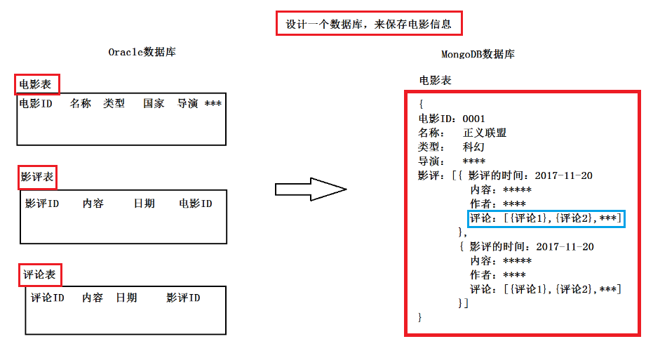

## 01.MongoDB介绍

### 1.1 什么是MongoDB ?

- MongoDB 是由C++语言编写的，是一个基于分布式文件存储的开源数据库系统。

- MongoDB是一个文档型的NoSQL数据库，文档型---> BSON文档（json的二进制）

- 保存数据：key-value

- 一般不支持事务

 </img>

### 1.2 MongoDB使用场景

- `1）更高的写入负载`
     - 默认情况下，MongoDB更侧重高数据写入性能，而非事务安全，MongoDB很适合业务系统中有大量“低价值”数据的场景。
     - 但是应当避免在高事务安全性的系统中使用MongoDB，除非能从架构设计上保证事务安全。

- `2）高可用性`
     - MongoDB的复副集(Master-Slave)配置非常简洁方便，此外，MongoDB可以快速响应的处理单节点故障，自动、安全的完成故障转移。
     - 这些特性使得MongoDB能在一个相对不稳定（如云主机）的环境中，保持高可用性。

- `3）表结构不明确，且数据在不断变大`

### 1.3 MongoDB应用举例

- 1.比如豆瓣影评中有1000部电影，每部电影有1000个影评，每个影评有1000个评论，那么查询笛卡尔积是1000*1000*1000

- 2.而使用MongoDB只需要存储1000条数据即可完成上述数据查询

 </img>

### 1.4 主要特点

- MongoDB 是一个面向文档存储的数据库，操作起来比较简单和容易。
- 你可以在MongoDB记录中设置任何属性的索引 (如：FirstName="Sameer",Address="8 Gandhi Road")来实现更快的排序。
- 你可以通过本地或者网络创建数据镜像，这使得MongoDB有更强的扩展性。
- 如果负载的增加（需要更多的存储空间和更强的处理能力） ，它可以分布在计算机网络中的其他节点上这就是所谓的`分片`。
- Mongo支持丰富的查询表达式。查询指令使用JSON形式的标记，可轻易查询文档中内嵌的对象及数组。
- MongoDb 使用update()命令可以实现替换完成的文档（数据）或者一些指定的数据字段 。
- Mongodb中的Map/reduce主要是用来对数据进行批量处理和聚合操作。
- Map和Reduce。Map函数调用emit(key,value)遍历集合中所有的记录，将key与value传给Reduce函数进行处理。
- Map函数和Reduce函数是使用Javascript编写的，并可以通过db.runCommand或mapreduce命令来执行MapReduce操作。
- GridFS是MongoDB中的一个内置功能，可以用于存放大量小文件。
- MongoDB允许在服务端执行脚本，可以用Javascript编写某个函数，直接在服务端执行，也可以把函数的定义存储在服务端，下次直接调用即可。
- MongoDB支持各种编程语言:RUBY，PYTHON，JAVA，C++，PHP，C#等多种语言。
- MongoDB安装简单。

### 1.5 MongoDB为什么快

- 写操作快原因
     - 写操作MongoDB比传统数据库快的根本原因是`Mongo使用的内存映射技术` 
     - 写入数据时候只要`在内存里完成就可以返回给应用程序`，这样并发量自然就很高
     - `而保存到硬体的操作则在后台异步完成`
     - 注意MongoDB在2.4就已经是默认安全写了（具体实现在驱动程序里）

- 读操作MongoDB快的原因是： 
     - 1）MongoDB的设计要求你`常用的数据可以在内存里装下`（这样大部分操作只需要读内存，自然很快） 
     - 2）文档性模式设计一般会是的你所需要的数据都相对集中在一起（内存或硬盘）
          - 大家知道硬盘读写耗时最多是随机读写所产生的磁头定位时间
          - 数据集中在一起则减少了关系性数据库需要从各个地方去把数据找过来（然后Join）所耗费的随机读时间

## 02.NoSQL与关系型数据库

### 2.1 关系型数据库的优点

- **易理解**
     - 因为行 + 列的二维表逻辑是非常贴近逻辑世界的一个概念
     - 关系模型相对网状、层次等其他模型更加容易被理解

- **操作方便**
     - 通用的SQL语言使得操作关系型数据库非常方便，支持join等复杂查询
     - Sql + 二维关系是关系型数据库最无可比拟的优点，这种易用性非常贴近开发者

- **数据一致性**
     - 支持ACID特性，可以维护数据之间的一致性，这是使用数据库非常重要的一个理由之一
     - 例如同银行转账，张三转给李四100元钱，张三扣100元，李四加100元
     - 而且必须同时成功或者同时失败，否则就会造成用户的资损

- **数据稳定**
     - 数据持久化到磁盘，没有丢失数据风险，支持海量数据存储

- **服务稳定**
     - 最常用的关系型数据库产品MySql、Oracle服务器性能卓越，服务稳定，通常很少出现宕机异常

### 2.2 关系型数据库的缺点

- 高并发下IO压力大
     - 数据按行存储，即使只针对其中某一列进行运算，也会将整行数据从存储设备中读入内存，导致IO较高
- 为维护索引付出的代价大
     - 为了提供丰富的查询能力，通常热点表都会有多个二级索引
     - 一旦有了二级索引，数据的新增必然伴随着所有二级索引的新增
     - 数据的更新也必然伴随着所有二级索引的更新
     - 这不可避免地降低了关系型数据库的读写能力，且索引越多读写能力越差。
     - 有机会的话可以看一下自己公司的数据库，除了数据文件不可避免地占空间外，索引占的空间其实也并不少
- 为维护数据一致性付出的代价大
     - 那么为了保证事务一致性，数据库就需要提供并发控制与故障恢复两种技术
     - 对于并发控制，其核心思想就是加锁，无论是乐观锁还是悲观锁，只要提供的隔离级别越高，那么读写性能必然越差
     - 故障恢复可以在系统异常的时候保证事务与数据库状态不会被破坏。
- 水平扩展后带来的种种问题难处理
     - 分布式事务处理都是需要考虑的问题，尤其是分布式事务处理，业界当前都没有特别好的解决方案
- 表结构扩展不方便
   - 由于数据库存储的是结构化数据，因此表结构schema是固定的，扩展不方便
     - 如果需要修改表结构，需要执行DDL语句修改，修改期间会导致锁表，部分服务不可用
- 全文搜索功能弱

### 2.3 什么是nosql

- NoSQL，指的是非关系型的数据库，NoSQL有时也称作Not Only SQL的缩写
- 是对不同于传统的关系型数据库的数据库管理系统的统称。

- NoSQL用于超大规模数据的存储。（例如谷歌或Facebook每天为他们的用户收集万亿比特的数据）。
- 这些类型的数据存储不需要固定的模式，无需多余操作就可以横向扩展。

### 2.4 CAP定理

- 对于一个分布式计算系统来说，不可能同时满足以下三点
     -  **一致性(Consistency)** (所有节点在同一时间具有相同的数据)
     -  **可用性(Availability)** (保证每个请求不管成功或者失败都有响应)
     -  **分隔容忍(Partition tolerance)** (系统中任意信息的丢失或失败不会影响系统的继续运作)

- 因此，根据 CAP 原理将 NoSQL 数据库分成了满足 CA 原则、满足 CP 原则和满足 AP 原则三 大类：
     -  CA - 单点集群，满足一致性，可用性的系统，通常在可扩展性上不太强大。
     -  CP - 满足一致性，分区容忍性的系统，通常性能不是特别高。
     -  AP - 满足可用性，分区容忍性的系统，通常可能对一致性要求低一些。