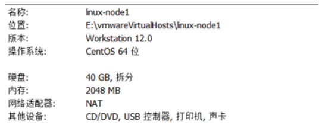
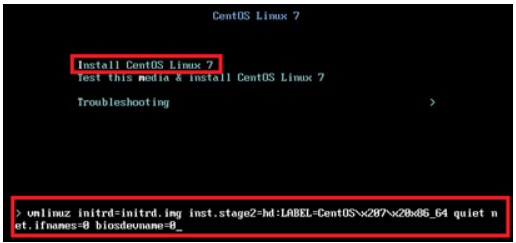
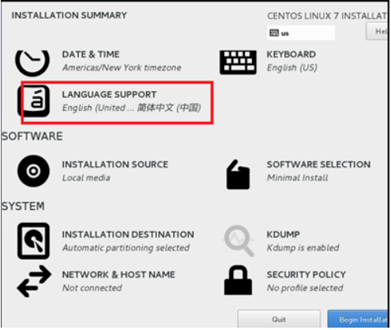
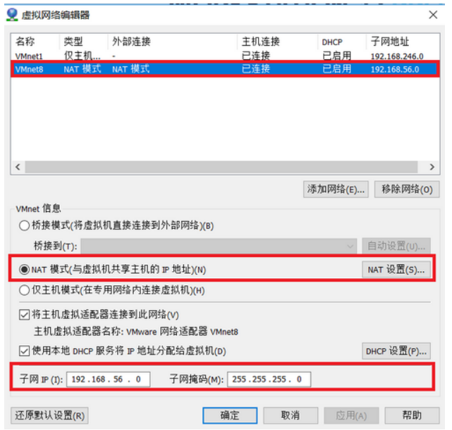

# 01.安装Linux操作系统

## 1.1 安装Linux系统

### 1.1.1 硬件配置如下

 </img>

### 1.1.2 修改网卡默认名

- 先把光标放到”install CentOS 7”，按 Tab键编辑内核参数，添加 (net.ifnames=0 biosdevname=0)

**作用：**<span style="color: red">使网卡名称为 eth0 这样的格式</span>

 </img>


### 1.1.3 选择安装语言

- 建议安装语言改成 简体中文，其他保持默认即可

 </img>


> #### 4.**设置完root密码等待安装完成重启即可完成系统安装**

> #### 5.**配置 VMware NAT 模式默认地址池**

 </img>

---

## 1.2 优化系统配置

### 1.2.1 配置网卡

[root@linux-node1 ~]#  <span style="color: red"> vim /etc/sysconfig/network-scripts/ifcfg-eth0 </span>

```shell
TYPE=Ethernet             # 网卡类型
BOOTPROTO=static          # 使用静态ip地址
DEFROUTE=yes
PEERDNS=no
PEERROUTES=yes
IPV4_FAILURE_FATAL=no
NAME=eth0                 # 网卡名称
# UUID=3dacb9a3-62a4-41cc-b9ab-44a20ee9157e
DEVICE=eth0               # 网卡设备名称
ONBOOT=yes                # 启用网卡
IPADDR=192.168.56.11      # 静态ip(必须与上面NAT中配置的地址同一网段)
NETMASK=255.255.255.0     # 子网掩码
GATEWAY=192.168.56.2      # 网关地址(VMware默认网关地址为 xxx.xxx.xxx.2 网段地址) 
```

### 1.2.2 重启网卡并关闭防火墙

```python
'''1.配置网卡'''
[root@linux-node1 ~]# systemctl restart network          # 重启网卡使配置生效
[root@linux-node1 ~]# systemctl disable NetworkManager     # 禁用NetworkManager
'''2.禁用防火墙'''
[root@linux-node1 ~]# systemctl disable firewalld        # 禁用防火墙
[root@linux-node1 ~]# firewall-cmd --state             # 防火墙是否关闭
'''3.关闭selinux防火墙'''
[root@linux-node1 ~]# vim /etc/selinux/config           # 关闭内核防火墙(重启生效)
SELINUX=disabled
[root@linux-node1 ~]# getenforce                    # selinux是否关闭

```

### 1.2.3 设置主机名

[root@linux-node1 ~]#  <span style="color: red"> vi /etc/hostname</span>

```python
linux-node1.example.com
```

### 1.2.4 设置主机名解析

[root@linux-node1 ~]#  <span style="color: red"> vi /etc/hosts </span>

```shell
192.168.56.11 linux-node1 linux-node1.example.com
192.168.56.12 linux-node2 linux-node2.example.com
```

### 1.2.5 设置DNS

[root@linux-node1 ~]#  <span style="color: red"> vi /etc/resolv.conf  </span>

```python
nameserver 192.168.56.2
```

### 1.2.6 安装最新epel yum源

[root@linux-node1 ~]#  <span style="color: red"> rpm -ivh https://mirrors.aliyun.com/epel/epel-release-latest-7.noarch.rpm </span>

### 1.2.7 yum安装 一些基础包

[root@linux-node1 ~]# <span style="color: red"> yum -y install net-tools vim lrzsz tree screen lsof tcpdump nc mtr nmap</span>

### 1.2.8 重启系统

[root@linux-node1 ~]# <span style="color: red"> yum update -y && reboot  </span>

# 02.系统基础服务

## 2.1 网络

- 像Windows机器一样，Linux也需要配置网卡才能连接网络
- Centos网卡默认位置在：<span style="color: red"> vim /etc/sysconfig/network-scripts/ifcfg-eth0 </span>

```shell
TYPE=Ethernet             # 网卡类型
BOOTPROTO=static          # 使用静态ip地址
DEFROUTE=yes
PEERDNS=no
PEERROUTES=yes
IPV4_FAILURE_FATAL=no
NAME=eth0                 # 网卡名称
# UUID=3dacb9a3-62a4-41cc-b9ab-44a20ee9157e
DEVICE=eth0               # 网卡设备名称
ONBOOT=yes                # 启用网卡
IPADDR=192.168.56.11      # 静态ip(必须与上面NAT中配置的地址同一网段)
NETMASK=255.255.255.0     # 子网掩码
GATEWAY=192.168.56.2      # 网关地址(VMware默认网关地址为 xxx.xxx.xxx.2 网段地址) 
```

- 网络服务管理命令

```python
[root@k8s-node2 ~]# systemctl status networking       # 查看当前网络服务状态
[root@k8s-node2 ~]# systemctl start networking       # 开启网络
[root@k8s-node2 ~]# systemctl stop networking        # 关闭网络服务
[root@k8s-node2 ~]# systemctl restart networking      # 重启网络服务
[root@k8s-node2 ~]# systemctl enable sshd           # 设置网络开机自启动
```

## 2.2 防火墙

- Linux的防火墙体系主要工作在网络层，针对TCP/IP数据包实施过滤和限制，属于典型的包过滤防火墙（或称网络层防火墙）。
- Linux的防火墙体系基于内核编码实现，因此具有非常稳定的性能和高效率，也因此被更加广泛采纳和应用。
- 为什么大多数机器都会关闭防火墙？
     - 1）防火墙的学习和管理较为复杂，需要专业人士维护
     - 2）服务器一般部署在内网中，被外网攻击的可能性小

## 2.3 sshd

- 在linux系统操作中，经常需要连接其他的主机，连接其他主机的服务是openssh-server（ssh）
- 它的功能是让远程主机可以通过网络访问sshd服务，开始一个安全shell。

# 03.配置源

- yum源头
- pip源
- apt-get

3.1 