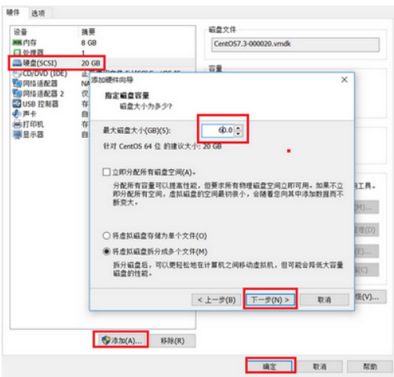
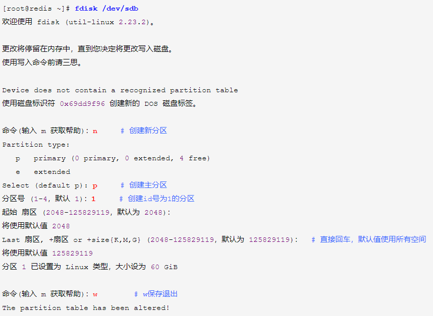
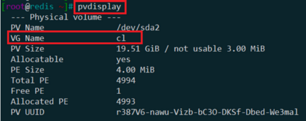
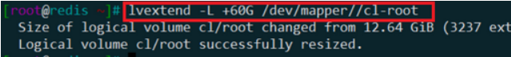
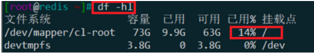

## 1.1 扩展硬盘空间实验说明

> #### 1.实验说明

- 在工作中linux服务器经常会磁盘空间不足，需要添加新的硬盘
- 下面以VMware添加60G硬盘到我们的linux服务器，并格式化，挂载使用全过程

> #### 2.实验步骤说明

- 第一步：添加一块 60G 的硬盘(真实服务器就是买一块硬盘，插入插槽即可)
- 第二步：创建分区
- 第三步：格式化磁盘
- 第四步：创建物理卷
- 第五步：卷组扩容

**参考博客：**https://www.cnblogs.com/xiaonq/p/10015249.html


## 1.2 添加一块硬盘

> #### 1.先给VMware添加一块60G硬盘

 </img>

> #### 2.必须重启虚拟机才能识别到新加磁盘

```python
[root@linux-node1 ~]# fdisk -l              # 查看硬盘信息和分区情况(下面这个sdb就是上面添加的硬盘)
磁盘 /dev/sdb：64.4 GB, 64424509440 字节，125829120 个扇区
Units = 扇区 of 1 * 512 = 512 bytes
扇区大小(逻辑/物理)：512 字节 / 512 字节
I/O 大小(最小/最佳)：512 字节 / 512 字节

sda（第一块盘）： sda1标识第一块盘中第一个分区
sdb（第二块盘）
sdc（第三开盘）
```


> #### 3.查看当前磁盘使用情况

```python
[root@redis ~]# df -hl           # 查看当前分区使用情况
文件系统              容量   已用   可用   已用%  挂载点
/dev/mapper/cl-root   13G    9.9G   2.8G    79%    /
devtmpfs              3.8G     0    3.8G    0%     /dev
```


## 1.3 格式化刚刚新加硬盘 /dev/sdb

> #### 1.创建分区

 </img>

> #### 2.格式化分区

```python
[root@redis ~]# mkfs.ext3 /dev/sdb1      # 将分区格式化为ext3类型
```


## 1.4 创建LVM扩展根分区

> #### 1.**创建物理卷** 

```python
[root@redis ~]# pvcreate /dev/sdb1      # 用刚刚添加硬盘，创建物理卷
```


> #### 2.查看创建的物理卷的详细信息

```python
[root@redis ~]# pvscan             # 查看当前所有物理卷
[root@redis ~]# pvdisplay          # 查看创建的物理卷的详细信息（我们需要获取现有根分区使用的卷组名称，这里是 “cl”）
```

 </img>


> #### 3.卷组扩容

```python
[root@redis ~]#  vgextend cl /dev/sdb1       # 对 cl 卷组扩容 
[root@redis ~]#  lvextend -L +60G /dev/mapper/cl-root  
```

 </img>


> #### 4.xfs用以下命令来扩磁盘空间

```python
[root@redis ~]#  xfs_growfs /dev/mapper/cl-root           # 扩展磁盘空间
[root@redis ~]#  df -hl                                   # 可以看到根分区已经扩展
```

 </img>

