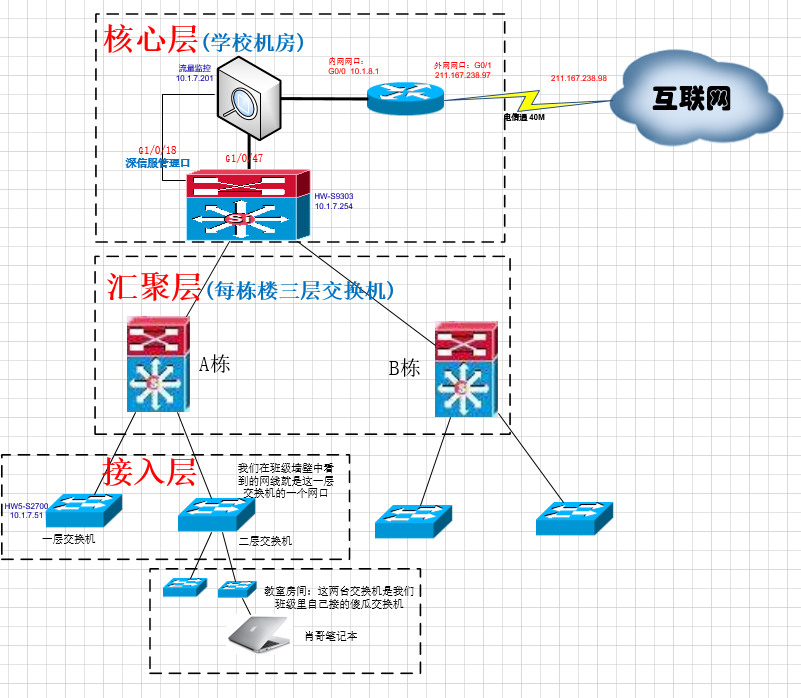

## 01.局域网与广域网

### 1.1 局域网

- 生活中我们的 每一个学校、公司都是一个局域网
- 局域网可以理解为我们自己使用路由器、交换机组成的内部网络
- 这个网络实现的是内部机器的通信，比如 咱们访问学校的 ftp 服务器上传课件就是通过局域网
- 我们电脑，通过内部网络访问 ftp 服务器，不经过 移动、联通等公网，所以速度特别快

### 1.2 广域网

- 生活中我们使用的 移动、联通、电信 等网络都是广域网的部分
- 广域网是连接不同地区局域网或城域网计算机通信的远程网。
- 它所覆盖的范围从几十公里到几千公里，它能连接多个地区、城市和国家，形成国际性的远程网络。
- 我们学校中的电脑访问百度，就是 通过学校局域网，连接广域网，最后到达百度服务器

## 02. 学校网络拓扑图

### 2.1 三层网络结构

- 三层网络架构采用层次化模型设计，即将复杂的网络设计分成几个层次，每个层次着重于某些特定功能
- **核心层：** 核心层是网络的高速交换主干，对整个网络的连通起到至关重要的作用。
- **汇聚层：**汇聚层是网络接入层和核心层的“中介”，就是在工作站接入核心层前先做汇聚，以减轻核心层设备的负荷。
- **接入层：**接入层一般直接接入我们的终端设备，服务器，电脑，在学校由于网卡有限，我们也会接入傻瓜交换机。

### 2.2 学校网络拓扑图

 </img>

