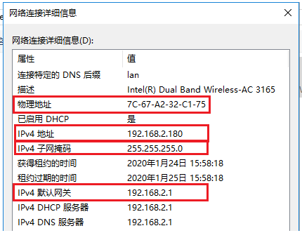
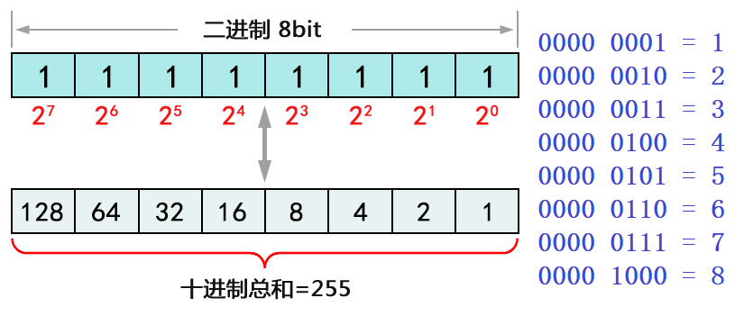
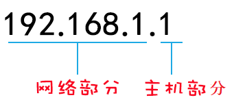

## 01.什么是IP地址

> #### 1.查看本机的 IP 和 MAC 地址

 </img>


> #### 2.MAC地址

- MAC地址（称为物理地址），是硬件设备(计算机/手机)等唯一标识。
- MAC地址对应于OSI参考模型的第二层数据链路层，交换机维护着计算机MAC地址和自身端口的数据库。
- MAC地址采用十六进制数表示，长度是6个字节（48位），分为前24位和后24位。<span style="color: red"> 7C-67-A2-32-C1-75</span>
- 前24位叫做组织唯一标志符（OUI），是由IEEE的注册管理机构给不同厂家分配的代码，区分了不同的厂家。
- 后24位是由厂家自己分配的，称为扩展标识符，同一个厂家生产的网卡中MAC地址后24位是不同的。


> #### 3.IP地址说明

- IP地址缩写为IP Adress，是一种在Internet上的给主机统一编址的地址格式，也称为网络协议（IP协议）地址。
- 它为互联网上的每一个网络和每一台主机分配一个逻辑地址，常见的IP地址，分为IPv4与IPv6两大类
- 当前广泛应用的是IPv4，目前IPv4几乎耗尽，下一阶段必然会进行版本升级到IPv6；


## 02.IP地址划分

> #### 1.IP地址格式

- IP地址(IPv4)由32位二进制数组成，分为4段（4个字节），每一段为8位二进制数
- 每一段8位二进制，中间使用英文的标点符号“.”隔开
- 由于二进制数太长，为了便于记忆和识别，把每一段8位二进制数转成十进制，大小为0至255。
- IP地址的这种表示法叫做“点分十进制表示法”。
- IP地址表示为：xxx.xxx.xxx.xxx（举个栗子：192.168.1.1 就是一个IP地址的表示。）


> #### 2.二进制十进制换算

 </img>


> #### 3.IP地址组成

- 计算机的IP地址由两部分组成，一部分为网络标识，一部分为主机标识，
- 同一网段内的计算机网络部分相同，主机部分不同同时重复出现。
- 路由器连接不同网段，负责不同网段之间的数据转发，交换机连接的是同一网段的计算机。
- 通过设置网络地址和主机地址，在互相连接的整个网络中保证每台主机的IP地址不会互相重叠，即IP地址具有了唯一性。

 </img>

```python
'''192.168.1.0/24 (192.168.1.1 255.255.255.0)'''
# 1. 此网段包含地址范围
192.168.1.0 ~ 192.168.1.255

# 2.网段中第一个地址为“网络地址”和最后一个地址为“广播地址”不可用
网络地址： 192.168.1.0
广播地址： 192.168.1.255

# 3.可用ip范围
192.168.1.1 ~ 192.168.1.254
```


## 03.IP地址分类

> #### 1.IP地址分类详解
>
> IP地址分A、B、C、D、E五类，其中A、B、C这三类是比较常用的IP地址，D、E类为特殊地址。

- **A类地址范围：**1.0.0.0 - 126.255.255.255  （A类网络默认子网掩码为255.0.0.0，也可写作/8）
- **B类地址范围：**128.0.0.0 - 191.255.255.255  （B类网络默认子网掩码为255.255.0.0，也可写作/16）
- **C类地址范围：**192.0.0.0 - 223.255.255.255  （C类网络默认子网掩码为255.255.255.0，也可写作/24）
- **D类地址范围：**224.0.0.0 - 239.255.255.255  （D类地址用于组播）
- **E类地址范围：**240.0.0.0 - 255.255.255.255  （E类地址用于Internet试验和开发）


> #### 2.公网IP

- 公有地址分配和管理由Inter NIC（因特网信息中心）负责
- 各级ISP使用的公网地址都需要向Inter NIC提出申请，由NIC统一发放，这样就能确保地址块不冲突


> #### 3.私网IP

- 创建IP寻址方案的人也创建了私网IP地址
- 这些地址可以被用于私有网络，在Internet没有这些IP地址，Internet上的路由器也没有到私有网络的路由表

```python
A类： 10.0.0.0 255.0.0.0                              # 保留了1个A类网络
B类： 172.16.0.0 255.255.0.0～172.31.0.0 255.255.0.0           # 保留了16个B类网络
C类： 192.168.0.0 255.255.255.0～192.168.255.0 255.255.255.0     # 保留了256个C类网络
```


