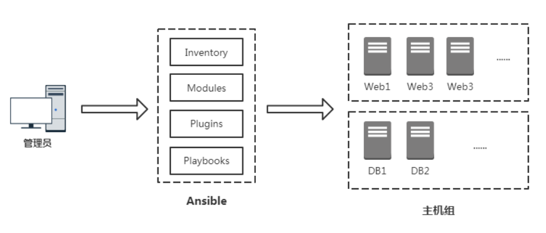

# 01.ansible简介

官方文档：http://www.ansible.com.cn/

## 1.1 ansible 是什么？

- ansible是新出现的自动化运维工具，基于Python开发，集合了众多运维工具（puppet、chef、func、fabric）的优点
- 实现了批量系统配置、批量程序部署、批量运行命令等功能。　　
- ansible是基于 paramiko 开发的,并且基于模块化工作，本身没有批量部署的能力。
- 真正具有批量部署的是ansible所运行的模块，ansible只是提供一种框架。
- ansible不需要在远程主机上安装client/agents，因为它们是基于ssh来和远程主机通讯的。
- ansible目前已经已经被红帽官方收购，是自动化运维工具中大家认可度最高的，并且上手容易，学习简单。
- 是每位运维工程师必须掌握的技能之一。

## 1.2 ansible 特点

- 1.部署简单，只需在主控端部署Ansible环境，被控端无需做任何操作；
- 2.默认使用SSH协议对设备进行管理；
- 3.有大量常规运维操作模块，可实现日常绝大部分操作；
- 4.配置简单、功能强大、扩展性强；
- 5.支持API及自定义模块，可通过Python轻松扩展；
- 6.通过Playbooks来定制强大的配置、状态管理；
- 7.轻量级，无需在客户端安装agent，更新时，只需在操作机上进行一次更新即可；
- 8.提供一个功能强大、操作性强的Web管理界面和RESTAPI接口——AWX平台。

## 1.3 ansible架构

- ansible系统由控制主机和被管理主机组成,控制主机不支持windows平台

- 下图为ansible的基本架构，从上图可以了解到其由以下部分组成：

     - Inventory：Ansible 管理的主机信息，包括 IP 地址、SSH 端口、账号、密码

          等； 

     - Modules：任务均有模块完成，也可以自定义模块，例如经常用的脚本； 

     - Plugins：

          - 使用插件增加 Ansible 核心功能，自身提供了很多插件，也可以自定义插件。
          - 例如 connection 插件，用于连接目标主机。
          - callback 插件可以将结果输出到其他地方。
          - vars 插件将定义的比变量注入到 Ansible 中运行。

     - Playbooks：“剧本”，模块化定义一系列任务，供外部统一调用。Ansible 核心功能

 </img>