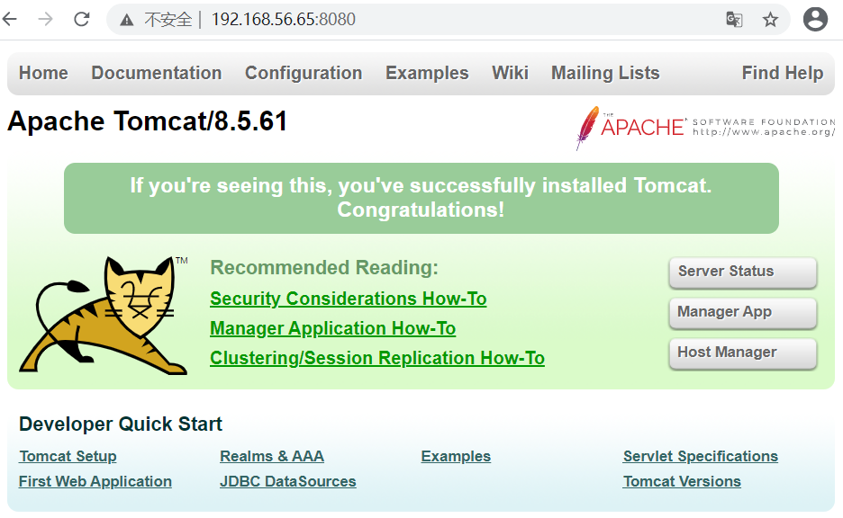

# 自动部署Tomcat

## 01.部署文件

```javascript
[root@k8s-node2 ~]# vim tomcat-palybook.yaml
```

```javascript
---
- hosts: webservers 
  gather_facts: no
  vars:
    tomcat_version: 8.5.61
    tomcat_install_dir: /usr/local
  tasks:
    - name: Install jdk1.8  #### 第一：安装 jdk 环境
      yum: name=java-1.8.0-openjdk state=present

    - name: Download tomcat  #### 第二：下载 Tomcat
      get_url: url=http://mirrors.hust.edu.cn/apache/tomcat/tomcat-8/v{{ tomcat_version }}/bin/apache-tomcat-{{ tomcat_version }}.tar.gz dest=/tmp

    - name: Unarchive tomcat-{{ tomcat_version }}.tar.gz  #### 第三：Tomcat是二进制包，解压即可使用
      unarchive:
        src: /tmp/apache-tomcat-{{ tomcat_version }}.tar.gz 
        dest: "{{ tomcat_install_dir }}"
        copy: no     # 如果是yes，ansible会到目标机器本地区拷贝，no 就会通过ansible服务机器上拷贝

    - name: Start tomcat   #### 第四：启动 Tomcat
      shell: cd {{ tomcat_install_dir }} &&
        mv apache-tomcat-{{ tomcat_version }} tomcat8 &&
        cd tomcat8/bin && nohup ./startup.sh &
```

## 02.部署

- 执行部署 Tomcat

```javascript
[root@k8s-node2 ~]# ansible-playbook tomcat-palybook.yaml --syntax-check       # 语法检查
[root@k8s-node2 ~]# ansible-playbook tomcat-palybook.yaml                 # 执行
```

- 查看Tomcat是否运行

```
[root@k8s-node2 ~]# ls /usr/local/tomcat8/
[root@k8s-node2 ~]# ps -ef|grep tomcat
```

- 访问Tomcat

 </img>