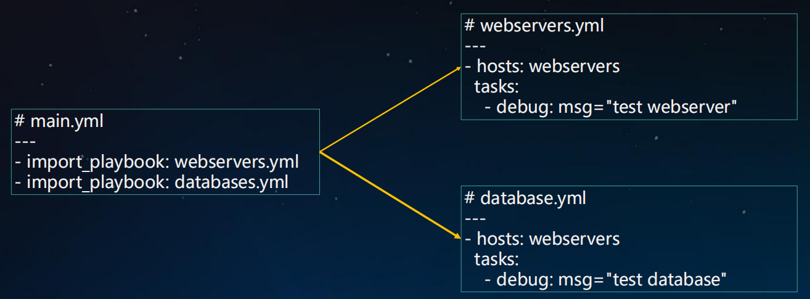
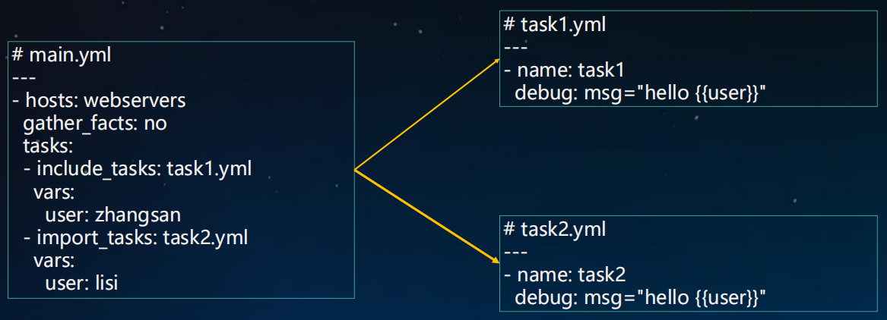

# 01.Playbook文件复用

## 1.1 include与import区别

- `include（动态）：在运行时导入`
     - --list-tags，--list-tasks不会显示到输出
     - 不能使用notify触发来自include*内处理程序名称（handlers）

- `import*（静态）：在Playbook解析时预先导入`
     -  不能与循环一起使用
     -  将变量用于目标文件或角色名称时，不能使用	inventory（主机/主机组等）中的变量

## 1.2 import_playbook

 </img>

## 1.3 include_tasks & import_tasks

 </img>

