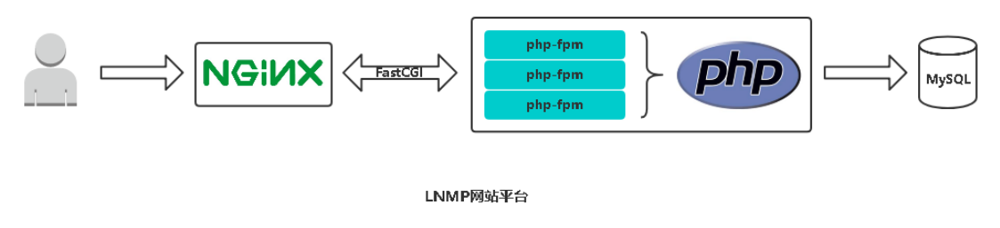

# 01.部署lnmp

## 1.1 lnmp说明

- 这里主要是一键部署PHP和nginx
- MySQL在架构中已经有了，就不部署了

 </img>

## 1.2 了解部署架构


## 02.目录结构

### 12.1.1 创建目录结构

```javascript
[root@k8s-node2 ~]# tree nginx_php
nginx_php
├── group_vars
├── hosts
├── roles
│   ├── common
│   │   └── tasks
│   ├── nginx
│   │   ├── files
│   │   ├── handlers
│   │   ├── tasks
│   │   └── templates
│   ├── php
│   │   ├── files
│   │   ├── handlers
│   │   └── tasks
│   └── wordpress
│       ├── tasks
│       └── templates
├── site.retry
└── site.yml

```

### 12.1.2 最终文件如下

```javascript
[root@k8s-node2 ~]# tree nginx_php
nginx_php
├── group_vars
│   └── all
├── hosts
├── roles
│   ├── common
│   │   └── tasks
│   │       └── main.yml
│   ├── nginx
│   │   ├── files
│   │   │   ├── nginx-1.15.3.tar.gz
│   │   │   ├── nginx.conf
│   │   │   └── nginx.service
│   │   ├── handlers
│   │   │   └── main.yml
│   │   ├── tasks
│   │   │   └── main.yml
│   │   └── templates
│   │       └── wordpress.conf
│   ├── php
│   │   ├── files
│   │   │   ├── php-5.6.38.tar.gz
│   │   │   ├── php-fpm.conf
│   │   │   ├── php-fpm.service
│   │   │   └── php.ini
│   │   ├── handlers
│   │   │   └── main.yml
│   │   └── tasks
│   │       └── main.yml
│   └── wordpress
│       ├── tasks
│       │   └── main.yml
│       └── templates
│           └── wp-config.php
├── site.retry
└── site.yml
```

# 03.nginx_php下配置文件

```javascript
[root@k8s-node2 ~]# tree nginx_php
nginx_php
├── group_vars
│   └── all
├── hosts
├── site.retry
└── site.yml
```

## 3.1 hosts

- 被控制主机列表

```javascript
[root@k8s-node2 nginx_php]# cat hosts 
[webservers]
192.168.56.65
```

## 3.2 site.yml 

```javascript
[root@k8s-node2 nginx_php]# cat site.yml 
---
- name: Install Nginx, PHP-FPM and Wordpress
  hosts: webservers
  remote_user: root

  roles:
    - role: common
    - role: nginx
      tags: ["nginx"]
    - role: php
      tags: ["php"]
    - role: wordpress
      tags: ["wp"]
```

## 3.3 site.retry

```javascript
[root@k8s-node2 nginx_php]# cat site.retry 
192.168.56.65
```

## 3.4 group_vars/all

```javascript
[root@k8s-node2 group_vars]# cat all 
---
# Nginx
nginx_version: 1.15.3 
http_port: 80
server_name: wp.ctnrs.com

# PHP
php_version: 5.6.38

# Wordpress 
wp_version: 4.9.4
db_host: 192.168.56.65
db_port: 3306
wp_db_name: wp
wp_db_user: wp
wp_db_password: MyNewPass4!
```

# 04.roles/common

```
[root@k8s-node2 ~]# tree nginx_php
├── roles
│   ├── common
│   │   └── tasks
│   │       └── main.yml
```

## 4.1 roles/common/tasks/main.yml

- `提前安装好编译需要的依赖包：gcc、make 等`
- 使用for循环安装

```javascript
[root@k8s-node2 tasks]# cat main.yml    # 提前安装好编译需要的依赖包：gcc、make 等
---
- name: Install deps
  yum: name={{ item }} state=present
  with_items:
    - gcc
    - make
    - zlib-devel
    - openssl-devel
    - pcre-devel
```

# 05.roles/nginx

```javascript
[root@k8s-node2 roles]# tree nginx/
nginx/
├── files
│   ├── nginx-1.15.3.tar.gz
│   ├── nginx.conf
│   └── nginx.service
├── handlers
│   └── main.yml
├── tasks
│   └── main.yml
└── templates
    └── wordpress.conf
```

## 5.1 tasks/main.yml 

```javascript
[root@k8s-node2 nginx]# cat tasks/main.yml 
---
- name: Copy nginx source pkg
  #get_url: url=http://nginx.org/download/nginx-{{ nginx_version }}.tar.gz dest=/tmp/nginx-{{ nginx_version }}.tar.gz
  copy: src=nginx-{{ nginx_version }}.tar.gz dest=/tmp

- name: Install nginx
  shell: cd /tmp &&
         tar zxf nginx-{{ nginx_version }}.tar.gz &&
         cd nginx-{{ nginx_version }} &&
         ./configure --prefix=/usr/local/nginx --user=nobody --group=nobody 
         --with-http_ssl_module --with-http_stub_status_module --with-stream=dynamic && 
         make && make install

- name: Mkdir /usr/local/nginx/conf/vhost
  file: dest=/usr/local/nginx/conf/vhost state=directory

- name: Copy nginx master configuration file
  copy: src=nginx.conf dest=/usr/local/nginx/conf
  notify: 
    - reload systemd
    - reload nginx

- name: Copy nginx configuration for wordpress
  template: src=wordpress.conf dest=/usr/local/nginx/conf/vhost/
  notify:
    - reload systemd
    - reload nginx

- name: Copy nginx systemctl service 
  copy: src=nginx.service dest=/usr/lib/systemd/system/

- name: Start service
  service: name=nginx state=started enabled=yes
```

## 5.2 handlers/main.yml

```javascript
[root@k8s-node2 nginx]# cat handlers/main.yml 
---
- name: reload systemd
  command: systemctl daemon-reload
- name: reload nginx
  service: name=nginx state=reloaded
```

## 5.3 files/nginx.conf

```javascript
[root@k8s-node2 roles]# cat nginx/files/nginx.conf 
user  nobody;
worker_processes  8;

error_log  logs/error.log  info;

pid        /var/run/nginx.pid;

events {
    worker_connections  2048;
}

http {
    include       mime.types;
    include       vhost/*.conf;

    default_type  application/octet-stream;
    log_format  main  '$remote_addr - $remote_user [$time_local] "$request" '
                      '$status $body_bytes_sent "$http_referer" '
                      '"$http_user_agent" "$http_x_forwarded_for"';

    sendfile        on;
    tcp_nopush     on;
    keepalive_timeout  65;
}
```

## 5.4 files/nginx.service

```javascript
[root@k8s-node2 files]# cat nginx.service 
[Unit]
Description=The NGINX HTTP and reverse proxy server
After=syslog.target network.target remote-fs.target nss-lookup.target

[Service]
Type=forking
PIDFile=/var/run/nginx.pid
ExecStartPre=/usr/local/nginx/sbin/nginx -t
ExecStart=/usr/local/nginx/sbin/nginx
ExecReload=/usr/local/nginx/sbin/nginx -s reload
ExecStop=/bin/kill -s QUIT $MAINPID
PrivateTmp=true

[Install]
WantedBy=multi-user.target
```

## 5.5 templates/wordpress.conf 

```javascript
[root@k8s-node2 nginx]# cat templates/wordpress.conf 
server {
    listen       {{ http_port }};
    server_name  {{ server_name }};
    root   html/wordpress;
    index index.php index.html;

    location ~* \.(gif|jpg|jpeg|png|css|js)$ {
       expires 30;
    }

    location ~ \.php$ {
        root           html/wordpress;
        fastcgi_pass   127.0.0.1:9000;
        fastcgi_index  index.php;
        fastcgi_param  SCRIPT_FILENAME  $document_root$fastcgi_script_name;
        include        fastcgi_params;
    }
}
```

# 06.roles/php

```javascript
[root@k8s-node2 roles]# tree php
php
├── files
│   ├── php-5.6.38.tar.gz
│   ├── php-fpm.conf
│   ├── php-fpm.service
│   └── php.ini
├── handlers
│   └── main.yml
└── tasks
    └── main.yml
```

## 6.1 tasks/main.yml

```javascript
[root@k8s-node2 php]# cat tasks/main.yml 
---
- name: Install php deps
  yum: name={{ item }} state=present
  with_items:
    - gd-devel 
    - libxml2-devel 
    - libcurl-devel 
    - libjpeg-devel 
    - libpng-devel 

- name: Copy php source pkg 
  #get_url: url=http://docs.php.net/distributions/php-{{ php_version }}.tar.gz dest=/tmp/nginx-{{ php_version }}.tar.gz
  copy: src=php-{{ php_version }}.tar.gz dest=/tmp

- name: Install php
  shell: cd /tmp && 
         tar zxf php-{{ php_version }}.tar.gz && 
         cd php-{{ php_version }} &&
         ./configure --prefix=/usr/local/php --with-config-file-path=/usr/local/php/etc 
         --with-mysql --with-mysqli --with-openssl --with-zlib --with-curl --with-gd \
         --with-jpeg-dir --with-png-dir --with-iconv --enable-fpm --enable-zip --enable-mbstring && 
         make -j 4 && make install

- name: Copy php configuration file
  copy: src=php.ini dest=/usr/local/php/etc/
  notify: 
    - reload systemd
    - reload restart php-fpm 

- name: Copy php-fpm configuration file
  copy: src=php-fpm.conf dest=/usr/local/php/etc/ 
  notify: 
    - reload systemd
    - reload restart php-fpm 

- name: Copy php-fpm.service
  copy: src=php-fpm.service dest=/usr/lib/systemd/system/

- name: Start php-fpm
  service: name=php-fpm state=started enabled=yes
```

## 6.2 handlers/main.yml

```javascript
[root@k8s-node2 php]# cat handlers/main.yml 
---
- name: reload systemd
  command: systemctl daemon-reload
- name: reload restart php-fpm
  service: name=php-fpm state=restarted
```

## 6.3 files/php-fpm.conf

```javascript
[root@k8s-node2 roles]# egrep -v ';' php/files/php-fpm.conf 
[global]
pid = /var/run/php-fpm.pid
error_log = /var/log/php-fpm.log
log_level = warning
emergency_restart_threshold = 1
emergency_restart_interval = 1
process_control_timeout = 5s
daemonize = yes
rlimit_files = 10240
[www]
user = nobody
group = nobody
listen = 127.0.0.1:9000
listen.owner = nobody
listen.group = nobody
pm = static 
pm.max_children = 200
pm.start_servers = 2
pm.min_spare_servers = 20
pm.max_spare_servers = 100
pm.max_requests = 500
slowlog = /var/log/$pool.log.slow
request_slowlog_timeout = 10
```

## 6.4  files/php-fpm.service

```javascript
[root@k8s-node2 php]# cat files/php-fpm.service
[Unit]
Description=The PHP FastCGI Process Manager
After=syslog.target network.target

[Service]
Type=simple
PIDFile=/var/run/php-fpm.pid
ExecStart=/usr/local/php/sbin/php-fpm --nodaemonize --fpm-config /usr/local/php/etc/php-fpm.conf
ExecReload=/bin/kill -USR2 $MAINPID

[Install]
WantedBy=multi-user.target
```

## 6.5 files/php.ini


# 07.roles/wordpress

```javascript
[root@k8s-node2 roles]# tree wordpress/
wordpress/
├── tasks
│   └── main.yml
└── templates
    └── wp-config.php
```

## 7.1 tasks/main.yml

```javascript
[root@k8s-node2 wordpress]# cat tasks/main.yml
---
- name: Download WordPress
  get_url: url=https://cn.wordpress.org/wordpress-{{ wp_version }}-zh_CN.tar.gz dest=/tmp/wordpress-{{ wp_version }}-zh_CN.tar.gz
  #copy: src=wordpress-{{ wp_version }}.tar.gz dest=/tmp

- name: Extract archive
  unarchive: src=/tmp/wordpress-{{ wp_version }}-zh_CN.tar.gz dest=/usr/local/nginx/html copy=no 

- name: Copy WordPress config file
  template: src=wp-config.php dest=/usr/local/nginx/html/wordpress

- name: Change ownership of WordPress installation
  file: path=/usr/local/nginx/html/wordpress owner=nobody group=nobody state=directory recurse=yes
```

## 7.2 templates/wp-config.php

```javascript
[root@k8s-node2 wordpress]# cat templates/wp-config.php
<?php
/**
 * WordPress基础配置文件。
 *
 * 这个文件被安装程序用于自动生成wp-config.php配置文件，
 * 您可以不使用网站，您需要手动复制这个文件，
 * 并重命名为“wp-config.php”，然后填入相关信息。
 *
 * 本文件包含以下配置选项：
 *
 * * MySQL设置
 * * 密钥
 * * 数据库表名前缀
 * * ABSPATH
 *
 * @link https://codex.wordpress.org/zh-cn:%E7%BC%96%E8%BE%91_wp-config.php
 *
 * @package WordPress
 */

// ** MySQL 设置 - 具体信息来自您正在使用的主机 ** //
/** WordPress数据库的名称 */
define('DB_NAME', '{{ wp_db_name }}');

/** MySQL数据库用户名 */
define('DB_USER', '{{ wp_db_user }}');

/** MySQL数据库密码 */
define('DB_PASSWORD', '{{ wp_db_password }}');

/** MySQL主机 */
define('DB_HOST', '{{ db_host }}');

/** 创建数据表时默认的文字编码 */
define('DB_CHARSET', 'utf8');

/** 数据库整理类型。如不确定请勿更改 */
define('DB_COLLATE', '');

/**#@+
 * 身份认证密钥与盐。
 *
 * 修改为任意独一无二的字串！
 * 或者直接访问{@link https://api.wordpress.org/secret-key/1.1/salt/
 * WordPress.org密钥生成服务}
 * 任何修改都会导致所有cookies失效，所有用户将必须重新登录。
 *
 * @since 2.6.0
 */
define('AUTH_KEY',         'put your unique phrase here');
define('SECURE_AUTH_KEY',  'put your unique phrase here');
define('LOGGED_IN_KEY',    'put your unique phrase here');
define('NONCE_KEY',        'put your unique phrase here');
define('AUTH_SALT',        'put your unique phrase here');
define('SECURE_AUTH_SALT', 'put your unique phrase here');
define('LOGGED_IN_SALT',   'put your unique phrase here');
define('NONCE_SALT',       'put your unique phrase here');

/**#@-*/

/**
 * WordPress数据表前缀。
 *
 * 如果您有在同一数据库内安装多个WordPress的需求，请为每个WordPress设置
 * 不同的数据表前缀。前缀名只能为数字、字母加下划线。
 */
$table_prefix  = 'wp_';

/**
 * 开发者专用：WordPress调试模式。
 *
 * 将这个值改为true，WordPress将显示所有用于开发的提示。
 * 强烈建议插件开发者在开发环境中启用WP_DEBUG。
 *
 * 要获取其他能用于调试的信息，请访问Codex。
 *
 * @link https://codex.wordpress.org/Debugging_in_WordPress
 */
define('WP_DEBUG', false);

/**
 * zh_CN本地化设置：启用ICP备案号显示
 *
 * 可在设置→常规中修改。
 * 如需禁用，请移除或注释掉本行。
 */
define('WP_ZH_CN_ICP_NUM', true);

/* 好了！请不要再继续编辑。请保存本文件。使用愉快！ */

/** WordPress目录的绝对路径。 */
if ( !defined('ABSPATH') )
	define('ABSPATH', dirname(__FILE__) . '/');

/** 设置WordPress变量和包含文件。 */
require_once(ABSPATH . 'wp-settings.php');
```

# 08.部署

- 添加目的主机的免密登录，在ansibe机器上执行

```javascript
[root@k8s-node2 ~]# ssh-keygen -t dsa
[root@k8s-node2 ~]# ssh-copy-id 192.168.56.65
```

- 部署

```javascript
[root@k8s-node2 nginx_php]# ansible-playbook -i hosts site.yml --syntax-check    # 先查看是否有语法错误
[root@k8s-node2 nginx_php]# ansible-playbook -i hosts site.yml              # 执行部署
```

