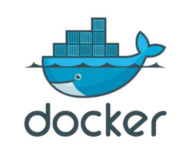
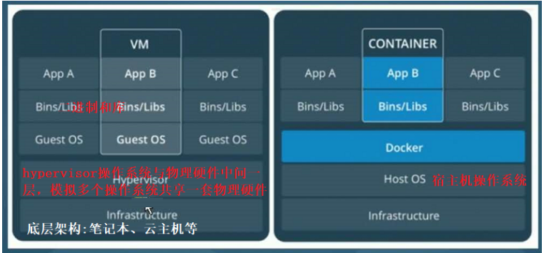
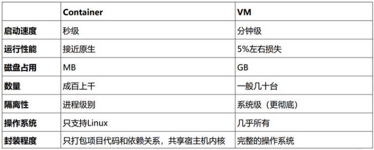
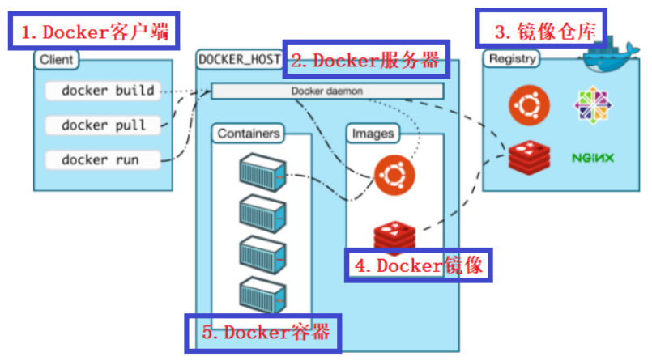

`更多内容见博客：`https://www.cnblogs.com/xiaonq/p/10241045.html

## 01.Docker是什么？(What)

### 1.1 什么是docker

- Docker是使用最广泛的开源**容器**引擎

- 一种操作系统基本的**虚拟化技术**

- 一种简单的应用程序打包工具

- 依赖Linux内核特性：**Namespace(资源隔离)** 和 **Cgroup（资源限制）**

- **注：**每个容器拥有一套和宿主机完全隔离的文件系统（共用linux内核），程序在这个虚拟容器里运行，就好像在真实的物理机上运行一样。
    - **容器：**
      - 容器是一个**操作系统级别下的虚拟化技术**，运行一个容器就行运行一个进程一样
      
      - 容器依赖linux内核特性：**Namespace（资源隔离）和Cgroups（资源限制）**
    - **资源隔离：**
      
         -  Linux Namespaces机制提供一种资源隔离方案，**每个namespace看上去就像一个单独的Linux系统**。
         - PID,IPC(进程通信),Network等系统资源不再是全局性的，而是属于某个特定的Namespace。　　
         - 每个namespace下的资源对于其他namespace下的资源都是透明，不可见的。
         - 系统中可以同时存在两个进程号为0,1,2的进程，由于属于不同的namespace，所以它们之间并不冲突。
         - 而在用户层面上只能看到属于用户自己namespace下的资源，例如使用ps命令只能列出自己namespace下的进程。
         - 这样每个namespace看上去就像一个单独的Linux系统。
    - **资源限制：**
        - 为了让容器中的进程更加可控，Docker 使用 Linux cgroups 来限制容器中的进程允许使用的系统资源。
        -  可以在启动容器是指定每个容器可以使用的 网络、磁盘、CPU以及内存 等

### 1.2 docker思想

- Docker的思想源于**集装箱**，集装箱解决了什么问题呢？
- 在早期运输货物需要不同分类的船，例如运输水果的船，运输生活用品的船
- 有了集装箱后，在大船上，可以把货物分类到不同的集装箱中，水果一个集装箱，生活用品一个集装箱
- 它们之间互不影响，只要把货物封装好集装箱里，就可以把不同类的货物一起运走。
- 通过Docker logo也可以看出所以然来**，Docker就像大船，集装箱就是容器**。
- 一条鲸鱼拖着若干个集装箱的经典形象已经深入人心。

 </img>

### 1.3 docker 与 虚拟机比较

- docker设计**小巧**，部署迁移快速，运行高效，**按照应用隔离**，管理人员可以看到所有容器的内容。

- 虚拟化技术比较**臃肿**，需要**先创建新的系统**，**按照系统隔离**，管理员无法看到系统内部信息。
- **举例：**
    - Docker就像手机中的各种APP，只需要一个系统就可以下载自己所需的应用
    - 虚拟化技术相当于苹果手机安装一个庞大软件，这个软件上安装安卓系统、魅族系统等，每个系统上还要安装各类应用。
    - esxi(VMware公司的产品)
    -  </img>
    -  </img>

### 1.4 Docker架构

- **Docker客户端(Client):**   docker 命令行工具，用户也可以通过 REST API 与服务器通信
- **Docker服务器(Docker daemon):**   服务器组件，以 Linux 后台服务的方式运行， Docker daemon 运行在 Docker host 上，负责创建、运行、监控容器，构建、存储镜像
- **Docker镜像(Image):**   可将 Docker 镜像看着只读模板，通过它可以创建 Docker 容器
- **镜像仓库(Registry):**  Registry 是存放 Docker 镜像的仓库，Registry 分私有和公有两种
- **Docker容器(Container):**   Docker 容器就是 Docker 镜像的运行实例

 </img>

```python
[root@linux-node1 ~]# docker run -itd --name redis -p 192.168.56.11:6380:6379 redis
[root@linux-node1 ~]# redis-cli -h 192.168.56.11  -p 6380 
```


## 02.docker技术应用与哪些场景?（Where）

### 2.1 场景一：节省项目环境部署时间

- <span style="color: red"> 单项目打包</span>
    - 每次部署项目到测试、生产等环境，都要部署一大堆依赖的软件、工具，时间久，出错概率大。
    -   Docker主要理念就是环境打包部署，可在任意Docker Engine运行。
    -  我们只需要将每个项目环境打包到镜像，push到镜像仓库，当有需要部署这个项目时，
    -  pull镜像启动容器，这个项目就可以访问了！一次构建多次部署，一劳永逸。

- <span style="color: red"> 整套项目打包</span>
    - 比如有一个产品可以整套部署到客户那里，以往都是派一名实施工程师到客户那部署。
    -  如果用了Docker，我们可以前期将这套项目封装打包起来，实现一键部署，分分钟钟搞定，就不需要再派人过去了。比如官方的Docker Compose编排工具。　　  
- <span style="color: red"> 新开源技术试用</span>
    - 有时，我们想调研一些开源项目，我们可以直接从公共镜像仓库pull项目官方做好镜像启动容器即可。

### 2.场景二：环境一致性

- 项目在开发电脑本地运行没问题，到了测试或生产环境就运行不起来。
- Docker将项目环境打包成镜像，可以在任何Docker Engine部署。

### 3.场景三：持续集成

- 一个项目版本快速迭代的测试场景，需要一个合理的CI（持续集成）/CD（持续部署）环境支撑。

- CI/CD是一个周期性自动化项目测试流程，包括构建、部署、测试、发布等工作，很少需要人工干预。

- Docker通过项目镜像构建和快速部署，打通测试环境与生产环境，高度保持多个环境之间一致性。

### 4.场景四：微服务

- 微服务指尽可能细粒度拆分业务程序架构，由多个独立服务组成业务系统。
-  Docker容器作为这些独立服务的部署单元，每个服务单独部署到一个docker容器中。


## 03.为什么要使用docker?（Why）

- 高效的利用资源

- 单台机器得部署多个应用；

- 应用之间互相隔离（微服务）；

- 应用之间不能发生资源抢占，每个应用只能使用事先注册申请的资源。
