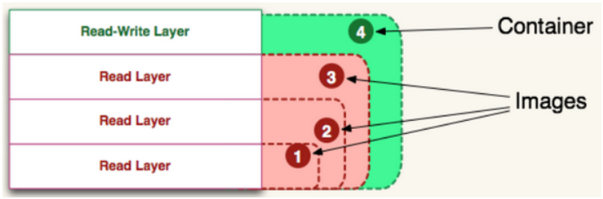

## 01.什么是docker镜像？(What)

### 1.1 docker镜像理论

- **docker镜像不包含Linux内核而又精简的Linux操作系统**
- docker镜像是一个分层存储的文件，一个镜像可以创建N个容器
- 可以这么理解，**docker 镜像是 docker 容器的静态视角，docker 容器是 docker 镜像的运行状态**。
    - docker镜像就是存储在磁盘里的没有linux内核只有linux文件系统的安装包
    - docker容器：docker镜像好比程序，docker容器好比我们把程序运行起来的进程
- 容器只是对docker镜像的引用，如果docker镜像删除，此镜像创建的容器也都失效

### 1.2 docker镜像从哪里来

- Docker Hub是由Docker公司负责维护的公共注册中心，包含大量的容器镜像，Docker工具默认从这个公共镜像库下载镜像。

- 地址：https://hub.docker.com/explore     # docker官方镜像和使用方法参考地址

- 配置镜像加速器：https://www.daocloud.io/mirror

```python
[root@linux-node2 ~]#  curl -sSL https://get.daocloud.io/daotools/set_mirror.sh | sh -s http://f1361db2.m.daocloud.io　　　　　　　
[root@linux-node2 ~]#  cat /etc/docker/daemon.json              # 执行上面命令后就会将镜像源修改成国内的地址
{"registry-mirrors": ["http://f1361db2.m.daocloud.io"]}
[root@linux-node2 ~]# systemctl restart docker                  # 重启docker生效
```

## 02.docker容器读写层

### 2.1 docker容器本质

- **容器其实是在镜像的最上面加了一层读写层**，在运行容器里文件改动时，会先从镜像里要写的文件复制到容器自己的文件系统中（读写层）。
- **如果容器删除了，最上面的读写层也就删除了，改动也就丢失了**。
- 所以无论多少个容器共享一个镜像，所做的写操作都是从镜像的文件系统中复制过来操作的，并不会修改镜像的源文件
- 若想持久化这些改动，可以通过docker commit 将容器保存成一个新镜像
-  </img>

### 2.2 查看docker容器工作目录内容

```python
[root@linux-node4 diff]# docker run -itd --name=web1 -p 192.168.56.14:81:80 nginx:latest
[root@linux-node4 diff]# docker inspect web1
[
    {
        # 存储驱动
        "GraphDriver": {
            "Data": {
                "LowerDir": "/var/lib/docker/overlay2/51692869029f819494bb402dc70aa2869b8d1848c3b65c549a010a260e44cc13-init/diff:/var/lib/docker/overlay2/09fa1314e484781dfc1fb25a6cf5df2502fe35dea9025a373a3cb0202732ccce/diff:/var/lib/docker/overlay2/162ec5c9be56e5d718011c09ed087eda04b755e1a68bd1953c60f175e6635e68/diff:/var/lib/docker/overlay2/7c1b27ff59a397ae7d6bd106db579e90476f57bb1ecef9fcb1a6f1ad5ce43b7c/diff",
                "MergedDir": "/var/lib/docker/overlay2/51692869029f819494bb402dc70aa2869b8d1848c3b65c549a010a260e44cc13/merged",
                "UpperDir": "/var/lib/docker/overlay2/51692869029f819494bb402dc70aa2869b8d1848c3b65c549a010a260e44cc13/diff",
                "WorkDir": "/var/lib/docker/overlay2/51692869029f819494bb402dc70aa2869b8d1848c3b65c549a010a260e44cc13/work"
            },
            "Name": "overlay2"
        },
        "NetworkSettings": {
            "Ports": {
                "80/tcp": [
                    {
                        "HostIp": "192.168.56.14",
                        "HostPort": "81"
                    }
                ]
            },
            "MacAddress": "02:42:ac:11:00:02",
            "Networks": {
                "bridge": {
                    "Gateway": "172.17.0.1",
                    "IPAddress": "172.17.0.2",
                    "IPPrefixLen": 16,
                }
            }
        }
    }
]
[root@linux-node4 diff]# cd /var/lib/docker/overlay2/51692869029f819494bb402dc70aa2869b8d1848c3b65c549a010a260e44cc13
[root@linux-node4 51692869029f819494bb402dc70aa2869b8d1848c3b65c549a010a260e44cc13]# ll    # 查看docker工作目录都哪些内容
diff  link  lower  merged  work
diff      # 读写层的差异（在读写层做的操作由这个容器单独管理）
merged    # 引用docker进行中的文件系统
work      # 项目工作目录
```


