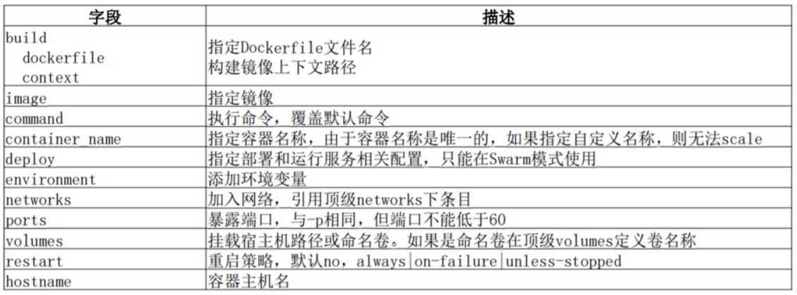
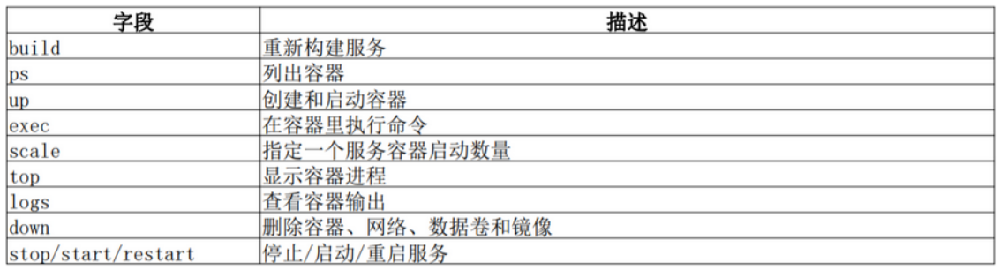

**更多内容见博客：**https://www.cnblogs.com/xiaonq/p/10256414.html

## 01.docker-compose理论部分

### 1.1 什么是docker-compose?（What）

- Compose是一个**定义和管理多容器的工具**，使用Python语言编写。

- 使用Compose配置文件描述多个容器应用的架构，比如使用什么镜像、数据卷、网络、映射端口等；

- 然后一条命令管理所有服务，比如启动、停止、重启等。

  

### 1.2 docker compose作用？（Where/Why）

- 现在我们要部署django项目，**需要django+nginx+mysql+redis**等
- 我们需要开启四个docker容器进行部署每一个组件，如果**每个容器单独管理太过于复杂,而且容器间启动先后顺序有依赖**，而且可能是给客户部署项目
- docker compose就是一个可以同时管理一个项目中的多个docker容器的工具，一键部署启动

### 1.3 docker-compose安装与基本使用？（How）

```python
[root@linux-node4 ~]# curl -L https://github.com/docker/compose/releases/download/1.15.0/docker-compose-`uname -s`-`uname -m` -o /usr/local/bin/docker-compose
[root@linux-node4 ~]# chmod +x /usr/local/bin/docker-compose
```


## 02. docker-compose语法

### 2.1 compose 配置常用字段

 </img>

### 2.2 docker-compose常用命令

 </img>

### 2.3 docker-compose配置文件说明

```python
version: '3'   # docker-compose版本号

services:      # 一级服务名称
  mysql:       # 服务名，可以通过服务名对容器进行管理（自己定义）
    #1.docker容器主机名
    hostname: mysql

    #2.指定拉取镜像或者使用Dockerfile构建
    image: mysql:5.7             # 指定拉取的镜像版本（方法1）
    build:                       # 构建nginx 容器（方法2）
      context: ./nginx           # 指定环境在当前目录的 nginx文件夹中
      dockerfile: Dockerfile     # 指定使用nginx文件夹中的Dockerfile进行构建

    #3.执行命令
    command: python manage.py migrate && python manage.py runserver 0.0.0.0:80
    command: uwsgi --ini uwsgi.ini                 # 启动uwsgi

    #4.指定容器挂载路径进行持久化
    volumes:              # 将mysql的 /var/lib/mysql数据路径挂载到本地进行持久化
      - ./mysql:/var/lib/mysql

    #5. 暴露端口 或者 映射端口
    expose:               # 开放的端口号，给docker容器之间通信访问
      - "3306"
    ports:
      - "80:80"           # 把端口映射给宿主机，提供服务

    #6.指定使用的网络
    networks:             
      - lnmp

    #7.当宿主机重启docker容器也自动重启
    restart: always

    #8. 添加环境变量   
    environment:          
      - MYSQL_ROOT_PASSWORD=root         # root密码
      - MYSQL_DATABASE=djangodocker      # 创建数据库
      - MYSQL_USER=django                # 创建一个普通用户
      - MYSQL_PASSWORD=django            # 普通用户密码
    #9. 添加依赖，必须先启动redis容器
    depends_on:
      - redis

networks:        # 创建网络
  lnmp: 
```

