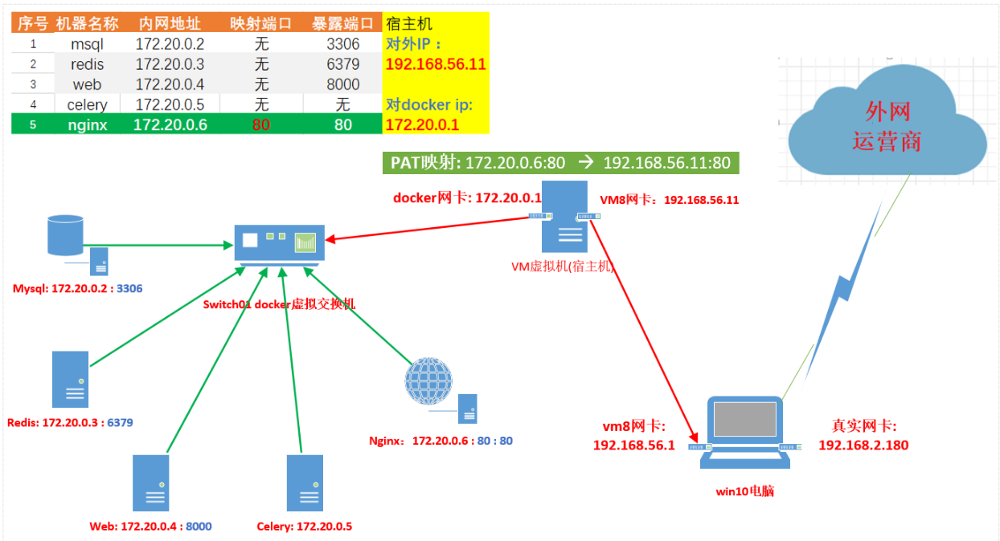
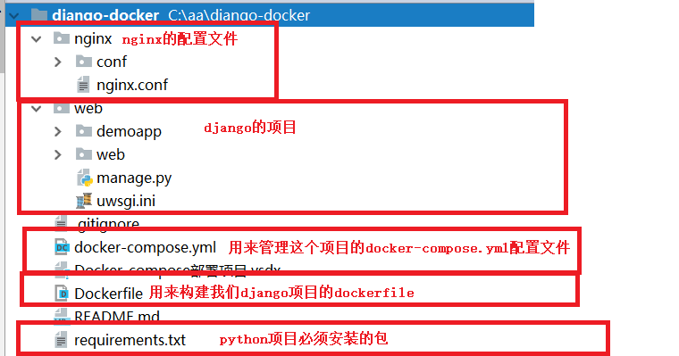

**更多内容见博客:** https://www.cnblogs.com/xiaonq/p/12377099.html

**项目地址:** https://gitee.com/edushiyanlou/django-docker

## 01.项目环境介绍

### 1.1 项目部署架构图

 </img>

### 1.2 项目目录结构说明

```python
django-docker                ## 项目根路径
│  .gitignore                    # git忽略不上传的文件
│  docker-compose.yml            # docker-compose文件
│  Dockerfile                    # 部署django项目的dockerfile
│  README.md                     # 项目Readme说明
│  requirements.txt              # 项目必须要安装的文件
│
├─nginx                      ## nginx容器配置文件
│  │  nginx.conf                 # /etc/nginx/nginx.conf配置文件
│  │
│  └─conf                        # /etc/nginx/conf.d配置nginx文件夹
│          default.conf
│
└─web                        ## 部署django项目的web容器
    │  manage.py
    │  uwsgi.ini                 # django项目的uwsgi配置文件 
    │
    ├─demoapp
    │  │  admin.py
    │  │  apps.py
    │  │  models.py
    │  │  tasks.py               # 配置celery任务文件
    │  │  tests.py
    │  │  urls.py
    │  │  views.py
    │  │  __init__.py
    │  │
    │  ├─migrations
    │  │      __init__.py        # 引入celery
    │  │
    │  └─templates
    │      └─demoapp
    │              celery_detail.html          # 查看具体celery执行结果页面
    │              celery_index.html           # 查看对应celery任务页面
    │              index.html                  # 项目主页面
    │
    └─web
            celery.py           # celery配置文件
            settings.py
            urls.py
            wsgi.py
            __init__.py
```


## 02.docker-compose.yml详释

### 2.1 docker-compose.yml详解

```python
version: '3'                       # cocker compose版本号

services:                          # 顶级配置文件
  mysql:                           # 服务名: 容器建通信、管理容器
    image: mysql:5.7               # 引入官方mysql镜像
    volumes:
      - ./mysql:/var/lib/mysql         # 把当前文件夹下的 ./mysql文件夹挂载到docker容器 /var/lib/mysql 路径下
    expose:
      - "3306"                        # 将当前容器的端口3306端口暴露给link到本容器的容器
    restart: always                   # 宿主机重启自动拉起这个docker容器
    environment:
      - MYSQL_ROOT_PASSWORD=root             # mysql服务器root密码root
      - MYSQL_DATABASE=djangodocker          # 创建数据库 djangodocker
      - MYSQL_USER=django                    # 创建一个用户 django
      - MYSQL_PASSWORD=django                # 用户密码为django

  nginx:
    image: nginx:alpine
    volumes:
      - ./nginx/nginx.conf:/etc/nginx/nginx.conf
      - ./nginx/conf:/etc/nginx/conf.d
      - ./web/staticfiles:/django_static
    ports:
      - "80:80"                             # 绑定容器的80端口到主机的80端口
    depends_on:
      - web                                 # 必须先启动web容器然才能启动nginx容器

  redis:
    image: redis:alpine
    expose:
      - "6379"
    restart: always

  web:
    build: .
    # command: python manage.py runserver 0:8000
    # ports:
    #   - "8000:8000"
    command: uwsgi --ini uwsgi.ini             # 启动uwsgi命令
    working_dir: /code/web                     # 项目工作路径
    volumes:
      - .:/code                                # 将当前文件夹下所有文件挂载到容器的 /code 文件夹
    expose:
      - "8000"
    depends_on:                                # 必须mysql和reids容器启动后才能启动web容器
      - mysql
      - redis

  celery:
    build: .
    command: celery -A web worker -l info
    working_dir: /code/web
    volumes:
      - .:/code
    depends_on:
      - mysql
      - redis

```

### 2.2 相似指令比较

```python
'''1. expose 与 ports 比较'''
# ports: 绑定容器的端口到主机的端口，这样就可以在外网访问docker容器的服务
# expose: 将当前容器的端口3暴露给link到本容器的容器，expose不会将端口暴露给主机

'''2. depends_on 与 links区别'''
# depends_on: 指定本容器启动依赖的容器必须先启动
# links: 保证容器如果ip变化也能访问(基本已经弃用，因为不使用link仍然可以通过容器名称访问)
```

### 2.3 简单测试

```python
[root@linux-node1 mysql-docker]# vim docker-compose.yml 
version: '3'
services:
  mysql:
    image: mysql:5.7
    volumes:
      - ./data:/var/lib/mysql
    ports:
      - "3306:3306"
    environment:
      - MYSQL_ROOT_PASSWORD=root
      - MYSQL_DATABASE=djangodb
[root@linux-node1 mysql-docker]# docker-compose -f docker-compose.yml up
```

### 2.4 文件说明

 </img>