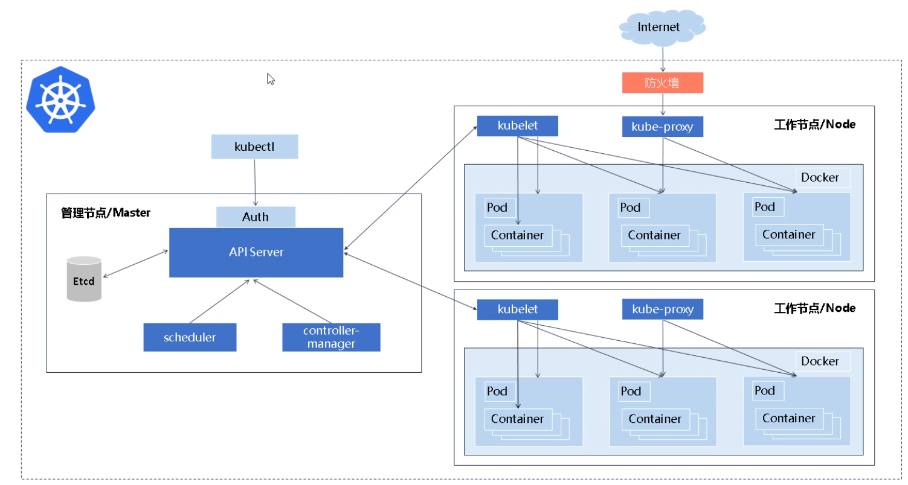
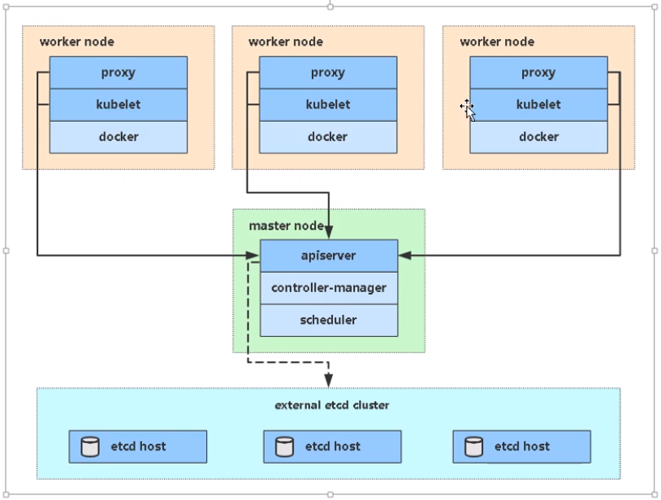

## 01.K8S中两种节点

==k8s集群分为管理节点和工作节点==

- `管理节点：`被称为master负载集群管理
     - 当我们需要创建一个容器时，他帮我们调度到一个合适节点
     - 当我们要执行具体某一个命令时，他可以帮组相应具体的请求
- `工作节点:`被称为pod,我们的容器都是跑在工作节点的

### 1.1 K8S架构详细图

 </img>

### 1.2 K8S组件简化图

 </img>

## 02.K8S中master中的四个组件

### 2.1 `kube-apiserver`

- Kubernetes API，集群的统一入口，各组件协调者，以RESTful API提供接口服务
- 所有对象资源的增删改查和监听操作都交给APIServer处理后再提交给Etcd数据库进行存储

- 而且还提供认证、授权、访问控制、API注册和发现等机制；

### 2.2 `kube-controller-manager`

==实质就是一个后台启动的控制器，节点多了删除，节点少了添加，节点故障切换等==

- controller manager 是通过API Server 进行协调的组件，绑定到单独的服务器Master上；
- 负责维护集群的状态，比如故障检测、自动扩展、滚动更新等；

### 2.3` kube-scheduler`

==调度器，比如我们创建容器，最终部署到那个节点合适，对各pod节点进行资源评估==

- scheduler是通过API Server 进行协调的组件，绑定到单独的服务器Master上；

- scheduler负责资源的调度，按照预定的调度策略将Pod调度到相应的机器上；

### 2.4 etcd

==etcd实质就是一个数据库，只要kube-master能够连接即可==

- 它是一个集群分布式键值数据库，它可以提供分布式数据的一致性。
- 用于保存集群状态数据，比如Pod、Service等对象信息

## 03.k8s中pod节点中两个重要组件

### 3.1 kubelet（Node Agent）

- 
- 接收APIServer中创建pod的请求，然后在本地调用docker的API去创建对应的容器
- kubelet负责管理pods和它们上面的容器，images镜像、volumes、etc。
- Agent负责监视绑定到其节点的一组Pod，并确保这些Pod正常运行，并且能实时返回这些Pod的运行状态。

### 3.2 kube-proxy

==实现将服务请求转发到具体那个docker容器的网络组件==

- kube-proxy网络代理和负载均衡，负责为Service提供cluster内部的服务发现和负载均衡；
- 由于一个服务部署在K8S中多个node节点中，想要统一的对外提供访问就要用kube-proxy组件实现

### 3.3 容器引擎

- docker