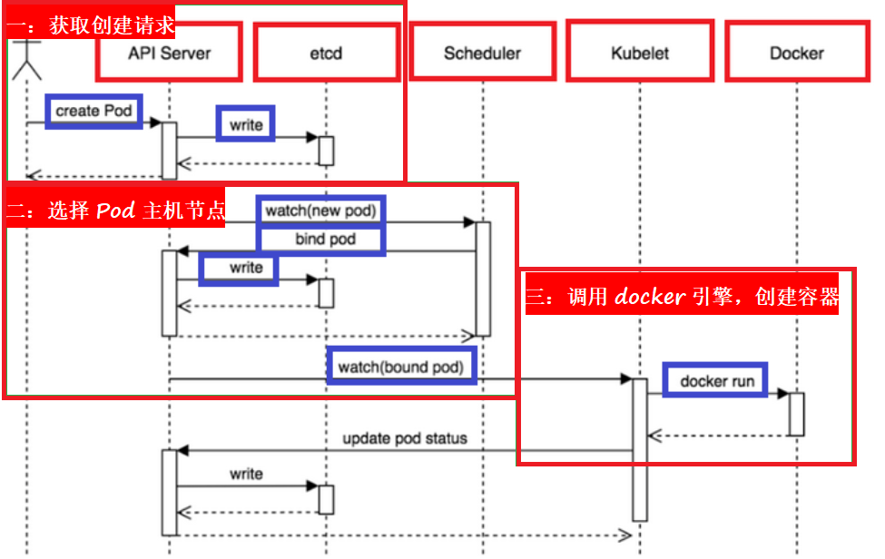

## 01.K8S工作原理

- 1.我们通过`kubectl`向`k8s Master`发出指令。
- 2.kubernetes Master主要是提供`API Server、Scheduler、Controller`组件，`接收kubectl的命令`
- 3.kubernetes Master主从Node节点`获取Node的资源信息`，并`发出调度任务`。
- 4.Node节点提供`kubelet、kube-proxy`，每个node节点都安装docker，是实际的执行者。
- 5.kubernetes不负责网络，所以一般是用flannel或者weave。
- 6.etcd负责服务发现和node信息存储。

 </img>

## 02.创建pod的流程

==一：获取创建请求==

- 1.用户提交创建Pod的请求，可以通过API Server的REST API ，也可用Kubectl命令行工具，支持Json和Yaml两种格式；

- 2.API Server 处理用户请求，存储Pod数据到Etcd；

- 3.Schedule通过和 API Server的watch机制，查看到新的pod，尝试为Pod绑定Node；

==二：选择Pod主机节点==

- 4.过滤主机：调度器用一组规则过滤掉不符合要求的主机（比如Pod指定了所需要的资源，那么就要过滤掉资源不够的主机）；

- 5.主机打分：对第一步筛选出的符合要求的主机进行打分，在主机打分阶段，调度器会考虑一些整体优化策略
     - 比如：把一个Replication Controller的副本分布到不同的主机上，使用最低负载的主机等；

- 6.选择主机：选择打分最高的主机，进行binding操作，结果存储到Etcd中；

==三：调用docker引擎，创建容器==

- 7.kubelet根据调度结果执行Pod创建操作：
     - 1）绑定成功后，会启动container, docker run,
     - 2）scheduler会调用API Server的API在etcd中创建一个bound pod对象，描述在一个工作节点上绑定运行的所有pod信息。
     - 3）运行在每个工作节点上的kubelet也会定期与etcd同步bound pod信息
     - 4）一旦发现应该在该工作节点上运行的bound pod对象没有更新，则调用Docker API创建并启动pod内的容器。

 </img>