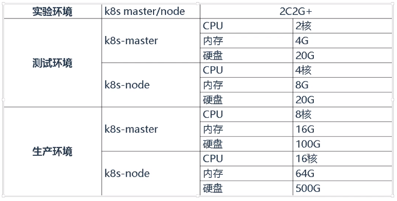

## 01.K8S部署的两种方法

### 1.1 kubeadm

- kubeadm是一个工具，提供kubeadm init和kubeadm join，用于快速部署kubernetes集群

- 部署地址：https://kubernetes.io/docs/reference/setup-tools/kubeadm/kubeadm/

- 特点：
     - kubeadm是一个自动化部署k8s集群的工具，只需要执行两条命令即可自动化部署
     - 缺点，自动化部署的方法，文件配置可能不熟悉，后期修改配置会复杂

### 1.2 二进制-推荐

- 从官方下载发行版本的二进制包，手动部署每个组件，组成kubernetes集群
- 下载地址： https://github.com/kubernetes/kubernetes/releases
- 特点：
     - 自己下载各个组件，安装配置，优点是每个配置，每个组件清晰
     - 缺点是，组件多，需要自己单独下载部署

### 1.3 总结

- kubeadm大概在企业中有40%的比例在使用
- 二进制方法部署大概有60%的比例在企业中使用
- 这两种方法最好都要学习，帮助大家理解

## 02.服务器硬件配置推荐

 </img>