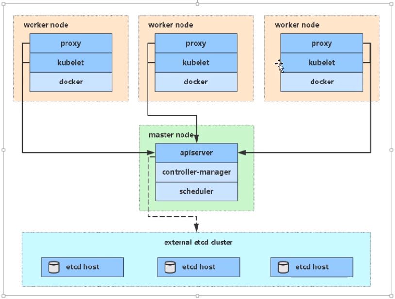

## 01.单k8s-master架构

| 角色          | IP            | 组件                                                         |
| ------------- | ------------- | ------------------------------------------------------------ |
| `k8s-master1` | 192.168.56.63 | kube-apiserver kube-controller-manager kube-scheduler etcd |
| `k8s-node1`   | 192.168.56.65 | kubelet kube-proxy docker etcd                |
| `k8s-node2`   | 192.168.56.66 | kubelet kube-proxy docker etcd                |

 </img>

## 02.多k8s-master架构

| 角色                    | IP                                          | 组件                                                         |
| ----------------------- | ------------------------------------------- | ------------------------------------------------------------ |
| `k8s-master1`           | 192.168.56.63                               | kube-apiserver kube-controller-manager kube-scheduler etcd |
| `k8s-master2`           | 192.168.56.64                               | kube-apiserver kube-controller-manager kube-scheduler |
| `k8s-node1`             | 192.168.56.65                               | kubelet kube-proxy docker etcd                |
| `k8s-node2`             | 192.168.56.66                               | kubelet kube-proxy docker etcd                |
| `Load Balancer(Master)` | 192.168.31.61 ==192.168.56.60（VIP）== | Nginx L4                                                     |
| `Load Balancer(Backup)` | 192.168.31.62                               | Nginx L4                                                     |

 </img>