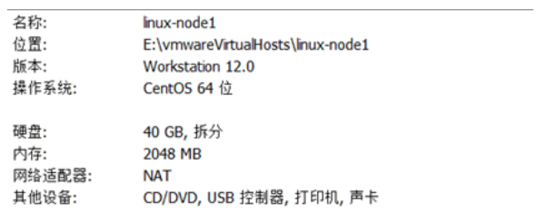

## 01.安装centos7机器操作系统

https://www.cnblogs.com/xiaonq/p/10233439.html#i1

- **1）硬件配置如下**

 </img>

- **2） 先把光标放到”install CentOS 7”，按 Tab键编辑内核参数，添加 (net.ifnames=0 biosdevname=0)**

 </img>

- **3） 建议安装语言改成 简体中文，其他保持默认即可**

 </img>

- **4）设置完root密码等待安装完成重启即可完成系统安装**
- **5）配置 VMware NAT 模式默认地址池**
     - ==编辑----》虚拟网络编辑器==

 </img>

## 02.系统初始化

### 2.1 配置网卡

```javascript
[root@linux-node1 ~]## vi /etc/sysconfig/network-scripts/ifcfg-eth0
[root@linux-node1 ~]## systemctl restart network
[root@linux-node1 ~]## systemctl disable firewalld
[root@linux-node1 ~]## systemctl disable NetworkManager
```

 </img>

### 2.2 关闭防火墙

```javascript
'''1.关闭防火墙'''
[root@linux-node1 ~]## systemctl stop firewalld          ## 临时关闭防火墙
[root@linux-node1 ~]## systemctl disable firewalld       ## 开机不启动
[root@linux-node1 ~]## firewall-cmd --state             ## 防火墙是否关闭
'''2.关闭selinux'''
[root@linux-node1 ~]## setenforce 0                  ## 临时关闭selinux
[root@linux-node1 ~]## vi /etc/selinux/config           ## 修改配置文件永久关闭selinux
SELINUX=disabled
[root@linux-node1 ~]## getenforce                    ## selinux是否关闭
```

### 2.3 更新yum源

```javascript
'''安装最新epel yum源'''
// 注：此地址中有各种源（https://opsx.alibaba.com/mirror）
[root@linux-node1 ~]## rpm -ivh https://mirrors.aliyun.com/epel/epel-release-latest-7.noarch.rpm
// yum安装 一些基础包
[root@linux-node1 ~]## yum -y install net-tools vim lrzsz tree screen lsof tcpdump nc mtr nmap wget ntpdate
```

### 2.4 设置 `主机名、域名、DNS`

````javascript
'''1.设置主机名 '''
[root@linux-node1 ~]## vi /etc/hostname                ## 方法1：重启生效，永久有效
lb-master
[root@localhost ~]## hostnamectl set-hostname lb-master     ## 方法2：即可生效，永久有效

'''2.设置主机名解析 '''
[root@linux-node1 ~]## vi /etc/hosts
192.168.56.61    lb-master
192.168.56.62    lb-slave
192.168.56.63    k8s-master1
192.168.56.64    k8s-master2
192.168.56.65    k8s-node1
192.168.56.66    k8s-node2
'''3.设置DNS '''
[root@linux-node1 ~]## vi /etc/resolv.conf
nameserver 192.168.56.2
````

### 2.5 同步时间&关闭swap

```javascript
'''1.同步系统时间 '''
[root@linux-node1 ~]## yum -y install ntpdate
[root@linux-node1 ~]## ntpdate time.windows.com         ## 同步时间
'''2.关闭swap'''
[root@linux-node1 ~]## swapoff -a                   ## 临时关闭swap
[root@linux-node1 ~]## vim /etc/fstab                ## 修改配置文件永久关闭swap
#/dev/mapper/cl-swap     swap                    ## 注释掉swap
```

### 2.6 重启系统

```javascript
[root@linux-node1 ~]##  yum update -y && reboot     ## 升级所有包同时也升级软件和系统内核, 并重启
[root@linux-node1 ~]##  getenforce              ## selinux是否关闭
[root@linux-node1 ~]##  firewall-cmd --state       ## 防火墙是否关闭
```

## 03.克隆5台虚拟机完成实验环境

### 3.1 各机器角色

| 角色                    | IP                                          | 组件                                                         |
| ----------------------- | ------------------------------------------- | ------------------------------------------------------------ |
| `k8s-master1`           | 192.168.56.63                               | kube-apiserver<br />kube-controller-manager<br />kube-scheduler<br />etcd |
| `k8s-master2`           | 192.168.56.64                               | kube-apiserver<br />kube-controller-manager<br />kube-scheduler |
| `k8s-node1`             | 192.168.56.65                               | kubelet<br />kube-proxy<br />docker<br />etcd                |
| `k8s-node2`             | 192.168.56.66                               | kubelet<br />kube-proxy<br />docker<br />etcd                |
| `Load Balancer(Master)` | 192.168.31.61<br />==192.168.56.60（VIP）== | Nginx L4                                                     |
| `Load Balancer(Backup)` | 192.168.31.62                               | Nginx L4                                                     |

### 3.2 克隆虚拟机

==**注：**克隆虚拟机必须要先关闭（shutdown）==

- 1）`右键 “管理” ----》“克隆” ----》`
- 2）选择 从哪个状态创建克隆

 </img>

- **3）克隆类型（创建完整克隆）**

 </img>

- 4）**新建虚拟机名称**

 </img>

- **5）点击 “完成” 即可完成虚拟机克隆**

- 6）**`对克隆的虚拟机进行一些简单修改`**

```javascript
[root@linux-node1 ~]##  vim /etc/hostname                      ## 修改主机名
lb-slave
[root@linux-node1 ~]##  vi /etc/sysconfig/network-scripts/ifcfg-eth0　  ## 修改网卡
IPADDR=192.168.56.62
[root@linux-node1 ~]##  reboot                              ## 重启
```