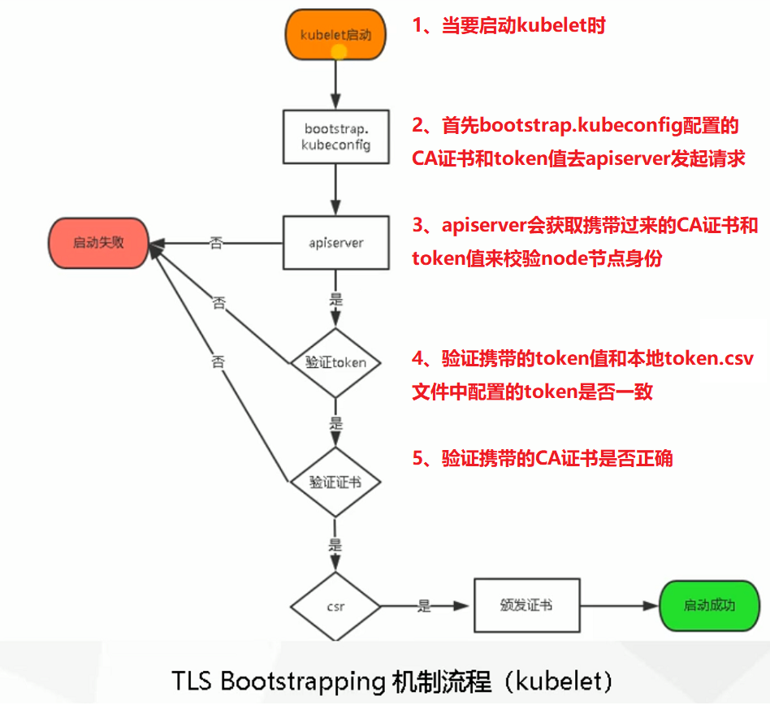

# 01.k8s单master集群结构

## 1.1 单k8s-master架构图

 </img>

## 1.2 k8s各组件ip规划

| 角色          | IP            | 组件                                                         |
| ------------- | ------------- | ------------------------------------------------------------ |
| `k8s-master1` | 192.168.56.63 | kube-apiserver<br />kube-controller-manager<br />kube-scheduler<br />`etcd` |
| `k8s-node1`   | 192.168.56.65 | kubelet<br />kube-proxy<br />docker<br />`etcd`              |
| `k8s-node2`   | 192.168.56.66 | kubelet<br />kube-proxy<br />docker<br />`etcd`              |

## 1.3 k8s与docker分层结构

 </img>

# 02.k8s-master1上签发证书

```javascript
# 1.为 etcd 三台机器的集群签发证书
# 2.为 kube-apiserver 签发证书
# 3.为 kube-proxy 签发证书
```

## 2.1 安装cfssl

- ==将TLS.tar.gz的二进制文件拖到 /root文件夹下==

`下载cfssl地址：`https://pkg.cfssl.org/

### 2.1.1 加压安装cfssl工具

```javascript
'''1.解压安装cfssl工具，以便给etcd和k8s生成证书'''
[root@k8s-master1 ~]# tar -xvf TLS.tar.gz 
[root@k8s-master1 ~]# cd TLS
cfssl.sh            // 安装cfssl的脚本，可以使用这个脚本到官网去下载cfssl相关组件
cfssl              // cfssl是用来生成自签生成证书的
cfssl-certinfo 
cfssljson  

etcd               // 存放k8s中的组件etcd文件夹
k8s                // 存放k8s中的k8s组件文件夹
[root@k8s-master1 TLS]# ./cfssl.sh           # 实质就是将cfssl、cfssl-certinfo、cfssljson 拷贝到/usr/local/bin目录，才能系统运行
[root@k8s-master1 TLS]# ls /usr/local/bin/     # 可以看到文件以及被拷贝到/usr/local/bin/文件夹下了
cfssl  cfssl-certinfo  cfssljson
```

### 2.1.2 TLS.tar.gz中文件说明

```javascript
[root@k8s-master1 ~]# tree /root/TLS
.
├── cfssl
├── cfssl-certinfo
├── cfssljson
├── cfssl.sh
├── etcd        # etcd数据库颁发CA证书的文件夹
│   ├── generate_etcd_cert.sh
│   ├── ca-config.json
│   └── server-csr.json
│   ├── ca-csr.json
└── k8s        # 为kube-apiserver和kube-proxy颁发CA证书的文件夹   
    ├── generate_k8s_cert.sh         # 生成证书的脚本
    ├── ca-config.json
    ├── ca-csr.json
    ├── kube-proxy-csr.json
    └── server-csr.json
```

## 2.2 为etcd组件签发证书

==/root/TLS/etcd有三个.json文件用来配置CA证书==

```javascript
[root@k8s-master1 TLS]# cd /root/TLS/etcd
[root@k8s-master1 etcd]# tree .
.
├── ca-config.json         # CA自己的配置文件(CA机构里的一些属性，比如域名有效期等)(自己创建)
├── ca-csr.json           # CA的配置文件(自己创建)
├── generate_etcd_cert.sh    # 用于自建CA,颁发证书脚本命令
└── server-csr.json        # 要对那些域名来颁发CA证书的配置文件(自己创建)
```

### 2.2.1 server-csr.json要对那些域名来颁发CA证书

- `指定可信任的ip地址，是所有包含etcd节点的IP`

```javascript
[root@k8s-master1 etcd]# vim /root/TLS/etcd/server-csr.json 
{
    "CN": "etcd",         # CN的名字是随便取
    "hosts": [           # 可信任的ip地址，是所有包含etcd节点的IP（这里在下面三台机器都部署了etcd）
        "192.168.56.63",
        "192.168.56.65",
        "192.168.56.66"
        ],
    "key": {            # 加密算法和长度
        "algo": "rsa",
        "size": 2048
    },
    "names": [           # 属性信息，那个国家、那个城市等
        {
            "C": "CN",
            "L": "BeiJing",
            "ST": "BeiJing"
        }
    ]
}
```

### 2.2.2 ca-config.json是CA机构里的一些属性:`无需改动`

- `配置CA机构里的一些属性：比如域名有效期等`

```javascript
[root@k8s-master1 etcd]# cat ca-config.json 
{
  "signing": {
    "default": {
      "expiry": "87600h"
    },
    "profiles": {
      "www": {
         "expiry": "87600h",
         "usages": [
            "signing",
            "key encipherment",
            "server auth",
            "client auth"
        ]
      }
    }
  }
}
```

### 2.2.3 ca-csr.json是CA的配置文件:`无需改动`

```javascript
[root@k8s-master1 etcd]# vim ca-csr.json 
{
    "CN": "etcd CA",
    "key": {
        "algo": "rsa",
        "size": 2048
    },
    "names": [
        {
            "C": "CN",
            "L": "Beijing",
            "ST": "Beijing"
        }
    ]
}
```

### 2.2.4 generate_etcd_cert.sh生成ca和证书命令脚本

```javascript
[root@k8s-master1 etcd]# cat generate_etcd_cert.sh
cfssl gencert -initca ca-csr.json | cfssljson -bare ca -
cfssl gencert -ca=ca.pem -ca-key=ca-key.pem -config=ca-config.json -profile=www server-csr.json | cfssljson -bare server
```

### 2.2.5 为etcd颁发证书

#### 2.2.5.1 使用cfssl创建一个CA机构证书

```javascript
'''初始化一个CA机构 '''
[root@k8s-master1 TLS]# cd /root/TLS/etcd
generate_etcd_cert.sh        // 用于自建CA的脚本
server-csr.json            // 要对那些域名来颁发CA证书的配置文件
ca-config.json             // CA自己的配置文件(CA机构里的一些属性，比如域名有效期等)
ca-csr.json               // CA的配置文件
# 初始化一个CA机构，生成CA的公钥和私钥，用来颁发域名证书
[root@k8s-master1 etcd]# cfssl gencert -initca ca-csr.json | cfssljson -bare ca -    # 初始化一个CA机构（下面两个文件）
[root@k8s-master1 etcd]# ls *pem                                      # 查看到已经生成了ca的公钥和私钥
ca-key.pem    // CA的私钥(key)
ca.pem       // CA机构的数字证书(公钥)
```

#### 2.2.5.2 正式为etcd颁发服务证书

```javascript
'''使用 cfssl工具和上面的配置文件，正式为etcd颁发证书  '''
# 命令解析 
-ca=ca.pem             // 指定使用哪一个CA机构
-ca-key=ca-key.pem       // 指定CA的key
-config=ca-config.json    // CA自己的配置文件
server-csr.json         // 颁发CA证书的配置文件
-bare server           // 生成以server开头的证书名称
[root@k8s-master1 etcd]# cfssl gencert -ca=ca.pem -ca-key=ca-key.pem -config=ca-config.json -profile=www server-csr.json | cfssljson -bare server
[root@k8s-master1 etcd]# ls *pem   # 需要用到的有下面四个.pem
ca-key.pem         // CA的私钥(key)
ca.pem            // CA机构的数字证书
server-key.pem      // 上面为etcd服务刚刚颁发的key
server.pem         // 上面为etcd服务刚刚颁发的证书
```


## 2.3 为kube-apiserver、kube-proxy签发证书

- ==为kube-apiserver和kube-proxy颁发CA证书==

```javascript
[root@k8s-master1 k8s]# cd /root/TLS/k8s/
[root@k8s-master1 k8s]# tree .
.
├── ca-config.json            # CA自己的配置文件(CA机构里的一些属性，比如域名有效期等)
├── ca-csr.json              # CA的配置文件
├── generate_k8s_cert.sh        # 用于自建CA,颁发证书脚本命令
├── kube-proxy-csr.json         # 要对那些域名来颁发CA证书的配置文件
└── server-csr.json            # 要对那些域名来颁发CA证书的配置文件
```

### 2.3.1 ca-config.json:CA机构配置属性:无需改动

==CA自己的配置文件(CA机构里的一些属性，比如域名有效期等)==

```javascript
[root@k8s-master1 k8s]# cat ca-config.json 
{
  "signing": {
    "default": {
      "expiry": "87600h"
    },
    "profiles": {
      "kubernetes": {
         "expiry": "87600h",
         "usages": [
            "signing",
            "key encipherment",
            "server auth",
            "client auth"
        ]
      }
    }
  }
}
```

### 2.3.2 ca-csr.json:CA配置文件:无需改动

==CA的配置文件==

```javascript
[root@k8s-master1 k8s]# cat ca-csr.json
{
    "CN": "kubernetes",
    "key": {
        "algo": "rsa",
        "size": 2048
    },
    "names": [
        {
            "C": "CN",
            "L": "Beijing",
            "ST": "Beijing",
      	    "O": "k8s",
            "OU": "System"
        }
    ]
}
```

### 2.3.3 kube-proxy-csr.json:CA为kube-proxy颁发证书配置文件

==要对那些域名来颁发CA证书的配置文件==

```javascript
[root@k8s-master1 k8s]# cat kube-proxy-csr.json
{
  "CN": "system:kube-proxy",
  "hosts": [],
  "key": {
    "algo": "rsa",
    "size": 2048
  },
  "names": [
    {
      "C": "CN",
      "L": "BeiJing",
      "ST": "BeiJing",
      "O": "k8s",
      "OU": "System"
    }
  ]
}
```

### 2.3.4 server-csr.json:修改需要访问apiserver地址

-  要对kube-apiserver颁发CA证书配置文件
- 指定都有哪些ip会访问我这个kube-apiserver可以多写一些，以免添加node节点要重新颁发证书
- k8s-node1和k8s-node2一般不需要添加

```javascript
[root@k8s-master1 k8s]# vim server-csr.json
{
    "CN": "kubernetes",
    # 证书添加可信任IP
    "hosts": [
      "10.0.0.1",      # kube-apiserver中第一个地址，默认用作apiserver负载均衡
      "127.0.0.1",
      # k8s官方内部访问kube-apiserver时需要用到的域名，也要添加
      "kubernetes",
      "kubernetes.default",
      "kubernetes.default.svc",
      "kubernetes.default.svc.cluster",
      "kubernetes.default.svc.cluster.local",
      
      # 指定都有哪些ip会访问我这个kube-apiserver可以多写一些，以免添加node节点要重新颁发证书
      # 在本次实验中有：kube-master1、kube-master2、Load Balancer(Master)、Load Balancer(Backup)
      # k8s-node1和k8s-node2一般不需要添加
      "192.168.31.60",
      "192.168.31.61",
      "192.168.31.62",
      "192.168.31.63",
      "192.168.31.64",
    ],
    "key": {
        "algo": "rsa",
        "size": 2048
    },
    "names": [
        {
            "C": "CN",
            "L": "BeiJing",
            "ST": "BeiJing",
            "O": "k8s",
            "OU": "System"
        }
    ]
}
```

### 2.3.5 generate_k8s_cert.sh:自建CA和证书脚本

==用于自建CA,颁发证书脚本命令==

```javascript
[root@k8s-master1 k8s]# cat generate_k8s_cert.sh
[root@k8s-master1 k8s]# cat generate_k8s_cert.sh 
# 创建CA机构
cfssl gencert -initca ca-csr.json | cfssljson -bare ca -
# 为k8s-apiserver颁发证书
cfssl gencert -ca=ca.pem -ca-key=ca-key.pem -config=ca-config.json -profile=kubernetes server-csr.json | cfssljson -bare server
# 为kube-proxy颁发证书
cfssl gencert -ca=ca.pem -ca-key=ca-key.pem -config=ca-config.json -profile=kubernetes kube-proxy-csr.json | cfssljson -bare kube-proxy
```

### 2.3.6 为kube-apiserver和kube-proxy生成证书

#### 2.3.6.1 执行生成证书脚本

```javascript
[root@k8s-master1 k8s]# cd /root/TLS/k8s/
[root@k8s-master1 k8s]# ./generate_k8s_cert.sh 
```

#### 2.3.6.2 会生成3对证书说明

- ==CA机构、kube-proxy、kube-apiserver==

```javascript
[root@k8s-master1 k8s]# cd /root/TLS/k8s
[root@k8s-master1 k8s]# ls *pem
ca-key.pem  ca.pem                  # CA机构的私钥和证书
kube-proxy-key.pem  kube-proxy.pem       # kube-proxy的私钥和证书，以便k8s-node通信
server-key.pem  server.pem            # kube-apiserver的证书和私钥
```

# 03.Etcd数据库集群部署

==在 k8s-master1-192.168.56.63 中执行以下操作==

Etcd下载地址：https://github.com/etcd-io/etcd/releases

==下面三台机器都要部署etcd集群==

```
192.168.56.63    k8s-master1
192.168.56.65    k8s-node1
192.168.56.66    k8s-node2
```

## 3.1 Etcd介绍

- etcd是CoreOS团队的开源项目，是构建一个高可用的分布式键值(key-value)数据库。
- etcd比较多的应用场景是用于服务发现，和共享配置
- etcd是由多个节点整体构建，对外服务的，每个节点都存储完整的数据
- etcd有一个主服务负责写数据，然后同步到其他从节点
- 当主服务挂掉后，会选举一个从服务成为新的主节点（所以一般etcd部署数量是基数个）

## 3.2 解压etcd.tar.gz域文件说明

```javascript
[root@k8s-master1 ~]# tar -xvf etcd.tar.gz       # 解压后会有下面两个文件
[root@k8s-master1 ~]# tree /root/etcd
├── etcd.service              # 配置如何启动etcd的服务的文件
├── bin                     
│   ├── etcd
│   └── etcdctl
├── cfg
│   └── etcd.conf            # etcd配置文件
└── ssl
```

## 3.3 etcd服务启动配置文件说明

### 3.3.1 etcd.service

```javascript
[root@k8s-master1 ~]# cd etcd
[root@k8s-master1 etcd]# cat etcd.service 
[Unit]
Description=Etcd Server
After=network.target
After=network-online.target
Wants=network-online.target

[Service]
Type=notify
EnvironmentFile=/opt/etcd/cfg/etcd.conf               # 指定etcd服务配置文件位置
ExecStart=/opt/etcd/bin/etcd \
        --name=${ETCD_NAME} \
        --data-dir=${ETCD_DATA_DIR} \
        --listen-peer-urls=${ETCD_LISTEN_PEER_URLS} \
        --listen-client-urls=${ETCD_LISTEN_CLIENT_URLS},http://127.0.0.1:2379 \
        --advertise-client-urls=${ETCD_ADVERTISE_CLIENT_URLS} \
        --initial-advertise-peer-urls=${ETCD_INITIAL_ADVERTISE_PEER_URLS} \
        --initial-cluster=${ETCD_INITIAL_CLUSTER} \
        --initial-cluster-token=${ETCD_INITIAL_CLUSTER_TOKEN} \
        --initial-cluster-state=new \
        
        # 其他客户端调用etcd使用的证书
        --trusted-ca-file=/opt/etcd/ssl/ca.pem \      # 指定自签证书CA文件位置
        --cert-file=/opt/etcd/ssl/server.pem \       # 上面CA机构颁发的数字证书
        --key-file=/opt/etcd/ssl/server-key.pem \      # 上面CA机构颁发的私钥
        
        # etcd集群内部端口使用的证书
        --peer-cert-file=/opt/etcd/ssl/server.pem \
        --peer-key-file=/opt/etcd/ssl/server-key.pem \
        --peer-trusted-ca-file=/opt/etcd/ssl/ca.pem
Restart=on-failure
LimitNOFILE=65536

[Install]
WantedBy=multi-user.target
```

### 3.3.2 etcd.conf

- ==主要是修改etcd中的ip和当前机器ip对应==

```javascript
[root@k8s-master1 cfg]# cat /root/etcd/cfg/etcd.conf      # 编辑etcd的配置文件
#[Member]
ETCD_NAME="etcd-1"                             # etcd名称随便取，但是在集群内唯一
ETCD_DATA_DIR="/var/lib/etcd/default.etcd"            # etcd数据存放的位置
ETCD_LISTEN_PEER_URLS="https://192.168.56.63:2380"       # etcd内部通信的ip和端口
ETCD_LISTEN_CLIENT_URLS="https://192.168.56.63:2379"     # 外部程序会使用这个ip和端口来对etcd操作

#[Clustering]
ETCD_INITIAL_ADVERTISE_PEER_URLS="https://192.168.56.63:2380"    # 集群通告的地址
ETCD_ADVERTISE_CLIENT_URLS="https://192.168.56.63:2379"        # 外部程序会使用这个ip和端口来对etcd操作
### 集群中所有节点信息： 节点名称=ip:端口
ETCD_INITIAL_CLUSTER="etcd-1=https://192.168.56.63:2380,etcd-2=https://192.168.56.65:2380,etcd-3=https://192.168.56.66:2380"
ETCD_INITIAL_CLUSTER_TOKEN="etcd-cluster"                  # 集群内部通信简单的token认证
ETCD_INITIAL_CLUSTER_STATE="new"                        # 集群的状态：new（新集群）  exsiting(集群加入新节点)
```

## 3.4 将cfssl生成的证书拷贝到ssl文件夹下

```javascript
[root@k8s-master1 ssl]# cp /root/TLS/etcd/{ca,server,server-key}.pem /root/etcd/ssl/
```

## 3.5 将etcd配置文件统一下发到所有etcd节点机器

```javascript
'''1.下发etcd配置文件到三台机器的/opt/文件夹中 '''
[root@k8s-master1 ~]# scp -r /root/etcd   root@192.168.56.63:/opt/            # k8s-master1
[root@k8s-master1 ~]# scp -r /root/etcd   root@192.168.56.65:/opt/            # k8s-node1
[root@k8s-master1 ~]# scp -r /root/etcd   root@192.168.56.66:/opt/            # k8s-node2
 
'''2.下发etcd启动文件到/usr/lib/systemd/system中 '''
[root@k8s-master1 ~]# scp -r /root/etcd.service   root@192.168.56.63:/usr/lib/systemd/system            # k8s-master1
[root@k8s-master1 ~]# scp -r /root/etcd.service   root@192.168.56.65:/usr/lib/systemd/system            # k8s-node1
[root@k8s-master1 ~]# scp -r /root/etcd.service   root@192.168.56.66:/usr/lib/systemd/system            # k8s-node2
```

## 3.6 修改其他两台etcd中配置

==修改k8s-node1-192.168.56.65中etcd配置文件==

```javascript
[root@k8s-node1 cfg]# vim /opt/etcd/cfg/etcd.conf 
#[Member]
ETCD_NAME="etcd-2"                              # 修改etcd名字
ETCD_DATA_DIR="/var/lib/etcd/default.etcd"
ETCD_LISTEN_PEER_URLS="https://192.168.56.65:2380"        # 所有ip修改成当前机器的物理ip
ETCD_LISTEN_CLIENT_URLS="https://192.168.56.65:2379"

#[Clustering]
ETCD_INITIAL_ADVERTISE_PEER_URLS="https://192.168.56.65:2380"
ETCD_ADVERTISE_CLIENT_URLS="https://192.168.56.65:2379"
ETCD_INITIAL_CLUSTER="etcd-1=https://192.168.56.63:2380,etcd-2=https://192.168.56.65:2380,etcd-3=https://192.168.56.66:2380"
ETCD_INITIAL_CLUSTER_TOKEN="etcd-cluster"
ETCD_INITIAL_CLUSTER_STATE="new"
```

==修改k8s-node2-192.168.56.66中etcd配置文件==

```javascript
[root@k8s-node1 cfg]# vim /opt/etcd/cfg/etcd.conf 
#[Member]
ETCD_NAME="etcd-3"
ETCD_DATA_DIR="/var/lib/etcd/default.etcd"
ETCD_LISTEN_PEER_URLS="https://192.168.56.66:2380"
ETCD_LISTEN_CLIENT_URLS="https://192.168.56.66:2379"

#[Clustering]
ETCD_INITIAL_ADVERTISE_PEER_URLS="https://192.168.56.66:2380"
ETCD_ADVERTISE_CLIENT_URLS="https://192.168.56.66:2379"
ETCD_INITIAL_CLUSTER="etcd-1=https://192.168.56.63:2380,etcd-2=https://192.168.56.65:2380,etcd-3=https://192.168.56.66:2380"
ETCD_INITIAL_CLUSTER_TOKEN="etcd-cluster"
ETCD_INITIAL_CLUSTER_STATE="new"
```

## 3.7 启动etcd服务

==k8s-master1 / k8s-node1 / k8s-node2 三台机器都要启动==

```javascript
[root@k8s-master1 ~]# systemctl daemon-reload      # 重新载入配置
[root@k8s-master1 ~]# systemctl start etcd        # 启动etcd
[root@k8s-master1 ssl]# systemctl enable etcd      # 设置etcd服务开机自启动
[root@k8s-master1 ssl]# tail -f /var/log/messages -f           # 查看etcd日志（etcd的日志存放在系统日志中）
```

==查看etcd集群状态==

```javascript
[root@k8s-master1 ~]#  
/opt/etcd/bin/etcdctl \
--ca-file=/opt/etcd/ssl/ca.pem --cert-file=/opt/etcd/ssl/server.pem --key-file=/opt/etcd/ssl/server-key.pem \
--endpoints="https://192.168.56.63:2379,https://192.168.56.65:2379,https://192.168.56.66:2379" \
cluster-health

#################  输出下面信息，证明etcd集群服务正常 #####################
member 498280cf84315325 is healthy: got healthy result from https://192.168.56.65:2379
member 9db6a5f8c1a09bff is healthy: got healthy result from https://192.168.56.63:2379
member bd02d01955e959f9 is healthy: got healthy result from https://192.168.56.66:2379
cluster is healthy
```

# 04.k8s-master1部署apiserver、controller-manager、scheduler

## 4.1 下载k8s-master二进制包(包含所有组件)

> **下载的二进制包包含 k8s-master和 k8s-node节点中所需的所有组件**
>
> ` kube-apiserver  kube-controller-manager  kubectl  kube-scheduler`

- 进入GitHub中的k8s仓库：https://github.com/kubernetes/kubernetes/
    -  </img>

- 跳转到：https://github.com/kubernetes/kubernetes/releases
- 下载1.16.11版本：https://github.com/kubernetes/kubernetes/releases/tag/v1.16.11
    -  </img>


- https://github.com/kubernetes/kubernetes/blob/master/CHANGELOG/CHANGELOG-1.16.md#v11611
    - 一定要看清楚，下载k8s server二进制包(Server binaries),这个包包含了k8s-master和k8s-node所需所有组件
    -  </img>

## 4.2 部署apiserver、controller-manager、scheduler

==将k8s-master.tar.gz拖入到/root/下==

```javascript
[root@k8s-master1 ~]# tar -xvf k8s-master.tar.gz 
[root@k8s-master1 ~]# tree /root/
├── kube-apiserver.service             # kube-apiserver启动文件
├── kube-controller-manager.service       # kube-controller-manager启动文件
├── kube-scheduler.service             # kube-scheduler启动文件
                  
├── kubernetes    # 文件夹：k8s服务中下载的组件拷贝到这个文件夹中（如果是其他版本，自行复制对应版本组件放到这里）
    ├── bin     # 四个可执行文件，都是下载k8s服务的二进制包
    │   ├── kube-apiserver
    │   ├── kube-controller-manager
    │   ├── kubectl
    │   └── kube-scheduler
    ├── cfg
    │   ├── kube-apiserver.conf
    │   ├── kube-controller-manager.conf
    │   ├── kube-scheduler.conf
    │   └── token.csv
    ├── logs
    └── ssl 
 [root@k8s-master1 ssl]# cp /root/TLS/k8s/*pem /root/kubernetes/ssl/    # 将刚刚为kube-apiserver和kube-proxy颁发的证书拷贝到ssl文件夹
```

### 4.4.1 三个服务管理脚本

- `apiserver、controller-manager、scheduler`

#### 4.1.1.1 kube-apiserver.service

- ==kube-apiserver启动管理脚本==

```javascript
[root@k8s-master1 ~]# cat kube-apiserver.service 
[Unit]
Description=Kubernetes API Server
Documentation=https://github.com/kubernetes/kubernetes

[Service]
EnvironmentFile=/opt/kubernetes/cfg/kube-apiserver.conf
ExecStart=/opt/kubernetes/bin/kube-apiserver $KUBE_APISERVER_OPTS
Restart=on-failure

[Install]
WantedBy=multi-user.target
```


#### 4.4.1.2 kube-controller-manager.service

- ==kube-controller-manager启动管理脚本==

```javascript
[root@k8s-master1 ~]# cat kube-controller-manager.service 
[Unit]
Description=Kubernetes Controller Manager
Documentation=https://github.com/kubernetes/kubernetes

[Service]
EnvironmentFile=/opt/kubernetes/cfg/kube-controller-manager.conf
ExecStart=/opt/kubernetes/bin/kube-controller-manager $KUBE_CONTROLLER_MANAGER_OPTS
Restart=on-failure

[Install]
WantedBy=multi-user.target
```

#### 4.4.1.3 kube-scheduler.service

- ==kube-scheduler服务启动管理脚本==

```javascript
[root@k8s-master1 ~]# cat kube-scheduler.service 
[Unit]
Description=Kubernetes Scheduler
Documentation=https://github.com/kubernetes/kubernetes

[Service]
EnvironmentFile=/opt/kubernetes/cfg/kube-scheduler.conf
ExecStart=/opt/kubernetes/bin/kube-scheduler $KUBE_SCHEDULER_OPTS
Restart=on-failure

[Install]
WantedBy=multi-user.target
```

### 4.4.2 kube-apiserver.conf配置文件

> `注： kube-apiserver.conf 只需要修改 连接etcd地址和kube-apiserver绑定地址即可，其他保持默认`
>
> ==更多配置文件请参考官方：==https://kubernetes.io/docs/reference/command-line-tools-reference/kube-apiserver/
>
> `https://kubernetes.io/` =》 Documentation =》Reference =》 Command line tools reference

```javascript

[root@k8s-master1 cfg]# cat kube-apiserver.conf 
KUBE_APISERVER_OPTS="--logtostderr=false \
--v=2 \                                    # 指定k8s服务输出日志级别
--log-dir=/opt/kubernetes/logs \                  # 指定输出的k8s日志存放路径

# 配置当前 kube-apiserver连接那几个 etcd数据库
--etcd-servers=https://192.168.56.63:2379,https://192.168.56.65:2379,https://192.168.56.66:2379 \
--bind-address=192.168.56.63 \                   # 当前 kube-apiserver绑定的地址(本机地址)
--secure-port=6443 \                          # 当前 kube-apiserver绑定的端口号
--advertise-address=192.168.56.63 \                #  kube-apiserver通告地址，告诉其他的k8s-node机器用哪个地址来连接当前apiserver
--allow-privileged=true \                       # 运行创建容器时可以使用超级权限
--service-cluster-ip-range=10.0.0.0/24 \             # service服务发现时指定虚拟ip地址段
# 启用准入控制插件，k8s高级功能，比如：资源配额限制，node自动注册等
--enable-admission-plugins=NamespaceLifecycle,LimitRanger,ServiceAccount,ResourceQuota,NodeRestriction \     
--authorization-mode=RBAC,Node \                  # 授权模式：为指定用户赋予权限，访问api时使用RBAC来判断是否有权限

# 启用bootstrap-token功能，当机器很多事可以自动为kubelet颁发证书
--enable-bootstrap-token-auth=true \                

--token-auth-file=/opt/kubernetes/cfg/token.csv \        # 指定token的位置路径
--service-node-port-range=30000-32767 \               # k8s-node服务启动的端口号范围

# 配置kube-apiserver连接kubelet使用的证书
--kubelet-client-certificate=/opt/kubernetes/ssl/server.pem \        
--kubelet-client-key=/opt/kubernetes/ssl/server-key.pem \
# 配置 kube-apiserver使用https时使用的证书
--tls-cert-file=/opt/kubernetes/ssl/server.pem  \
--tls-private-key-file=/opt/kubernetes/ssl/server-key.pem \
--client-ca-file=/opt/kubernetes/ssl/ca.pem \
# service-account使用的私钥
--service-account-key-file=/opt/kubernetes/ssl/ca-key.pem \         # 
# 连接etcd时使用的证书
--etcd-cafile=/opt/etcd/ssl/ca.pem \
--etcd-certfile=/opt/etcd/ssl/server.pem \
--etcd-keyfile=/opt/etcd/ssl/server-key.pem \

# apiserver日志相关配置
--audit-log-maxage=30 \
--audit-log-maxbackup=3 \
--audit-log-maxsize=100 \
--audit-log-path=/opt/kubernetes/logs/k8s-audit.log"            
```

### 4.4.3 kube-controller-manager.conf配置文件

```javascript
[root@k8s-master1 cfg]# cat kube-controller-manager.conf 
# 日志相关配置
KUBE_CONTROLLER_MANAGER_OPTS="--logtostderr=false \
--v=2 \
--log-dir=/opt/kubernetes/logs \

--leader-elect=true \                      # 集群选举
--master=127.0.0.1:8080 \                   # 指定连接 kube-apiserver的ip地址（apiserver默认会监听8080端口，无需额外配置）
--address=127.0.0.1 \

# 允许安装cni插件，cni插件能自动分配ip
--allocate-node-cidrs=true \
--cluster-cidr=10.244.0.0/16 \
--service-cluster-ip-range=10.0.0.0/24 \       # 指定集群pod分配的ip段

# 集群签名的两个证书,当node加入集群时为他颁发证书的ca
--cluster-signing-cert-file=/opt/kubernetes/ssl/ca.pem \
--cluster-signing-key-file=/opt/kubernetes/ssl/ca-key.pem  \

# 用于签发service-account时的CA
--root-ca-file=/opt/kubernetes/ssl/ca.pem \
--service-account-private-key-file=/opt/kubernetes/ssl/ca-key.pem \

# 为每个node颁发证书的有效期：10年
--experimental-cluster-signing-duration=87600h0m0s"
```

### 4.4.4 kube-scheduler.conf配置文件

```javascript
[root@k8s-master1 cfg]# cat kube-scheduler.conf 
# 基本日志配置
KUBE_SCHEDULER_OPTS="--logtostderr=false \
--v=2 \
--log-dir=/opt/kubernetes/logs \

--leader-elect \                       # 指定参加集群中的kube-scheduler选举

--master=127.0.0.1:8080 \                # 指定连接 kube-apiserver的ip地址（apiserver默认会监听8080端口，无需额外配置）
--address=127.0.0.1"
```

### 4.4.5 token.csv

==在node中只要携带下面这个token值，就可以为其自动颁发证书,不过需要对kubelet-bootstrap赋权==

```javascript
[root@k8s-master1 cfg]# cat token.csv 
c47ffb939f5ca36231d9e3121a252940,kubelet-bootstrap,10001,"system:node-bootstrapper"

####  格式：token, 用户, uid, 用户组   ####
```

### 4.4.6 grep检查是否所有ip都被正确修改

```javascript
[root@k8s-master1 cfg]# grep 192  /root/kubernetes/cfg/*
/root/kubernetes/cfg/kube-apiserver.conf:--etcd-servers=https://192.168.56.63:2379,https://192.168.56.65:2379,https://192.168.56.66:2379 \
/root/kubernetes/cfg/kube-apiserver.conf:--bind-address=192.168.56.63 \
/root/kubernetes/cfg/kube-apiserver.conf:--advertise-address=192.168.56.63 \
```

### 4.4.7 将3个.service文件移动到工作目录下并启动服务

```javascript
'''1.将 /root/kubernetes/下的配置文件全部拷贝到工作目录 /opt/ 文件夹下 '''
# 必须确保为kube-apiserver、kube-proxy签发证书
[root@k8s-master1 ~]# cd /root
[root@k8s-master1 ~]# cp -r ./kubernetes/ /opt/
'''2.将kube-apiserver、kube-controller-manager、kube-scheduler管理命令移动到系统工作路径下'''
[root@k8s-master1 ~]# cd /root
[root@k8s-master1 ~]# mv kube-apiserver.service kube-controller-manager.service kube-scheduler.service   /usr/lib/systemd/system

 '''3.启动kube-apiserver '''
[root@k8s-master1 ~]# systemctl start kube-apiserver
[root@k8s-master1 ~]# systemctl enable kube-apiserver
[root@k8s-master1 ~]# ps -ef | grep kube-apiserver
[root@k8s-master1 ~]# ls /opt/kubernetes/logs/             # kube-apiserver所有日志都在这里
'''4.启动kube-controller-manager'''
[root@k8s-master1 ~]# systemctl start kube-controller-manager
[root@k8s-master1 ~]# systemctl enable kube-controller-manager
[root@k8s-master1 ~]# tail -f /opt/kubernetes/logs/kube-controller-manager.INFO 
'''5.启动kube-scheduler'''
[root@k8s-master1 ~]# systemctl start kube-scheduler
[root@k8s-master1 ~]# systemctl enable kube-scheduler
[root@k8s-master1 ~]# tail -f /opt/kubernetes/logs/kube-scheduler.INFO 
```

### 4.4.8 将kubectl移动到系统变量中

```javascript
[root@k8s-master1 ~]# cp /opt/kubernetes/bin/kubectl /usr/local/bin/
[root@k8s-master1 ~]# kubectl get node        # 查看当前k8s中节点
[root@k8s-master1 ~]# kubectl get cs         # 查看当前集群
NAME                 AGE
scheduler            <unknown>
controller-manager   <unknown>
etcd-2               <unknown>
etcd-1               <unknown>
etcd-0               <unknown>
```

### 4.4.9 为kubelet-bootstrap授权

==在token.csv文件中虽然配置了kubelet-bootstrap账号可以为新加入 k8s-node自动颁发证书，但是需要进行授权==

```javascript
[root@k8s-master1 ~]# 
kubectl create clusterrolebinding kubelet-bootstrap \
--clusterrole=system:node-bootstrapper \
--user=kubelet-bootstrap
```

# 05.k8s-node1中部署kubelet、kube-proxy

==将k8s-node.tar.gz包上传到k8s-node1的/root/下==

```javascript
[root@k8s-node1 ~]# tar -xvf k8s-node.tar.gz
[root@k8s-node1 ~]# tree .
.
├── cni-plugins-linux-amd64-v0.8.2.tgz            # cni二进制插件
├── daemon.json                            # docker的配置文件
├── docker-18.09.6.tgz                        # docker的二进制文件，离线安装docker
├── docker.service                           # docker的服务管理命令
├── k8s-node.tar.gz                          # k8s-node节点配置
├── kubelet.service                          # kubelet服务管理命令
├── kube-proxy.service                        # kube-proxy服务管理命令
└── kubernetes
    ├── bin
    │   ├── kubelet                       # k8s-master会自动给kubelet颁发证书
    │   └── kube-proxy                     # kube-proxy证书要从k8s-master上下发过来
    ├── cfg
    │   ├── bootstrap.kubeconfig
    │   ├── kubelet.conf
    │   ├── kubelet-config.yml
    │   ├── kube-proxy.conf
    │   ├── kube-proxy-config.yml
    │   └── kube-proxy.kubeconfig
    ├── logs
    └── ssl
```

## 5.1 配置文件说明

==.service结尾的是服务管理命令配置文件==
==.conf后缀的是服务主配置文件==
==.yml 结尾的也是一些服务主要的配置文件==
==.kubeconfig结尾的是连接kube-apiserver配置文件==

### 5.1.1 docker安装配置相关文件

#### 5.1.1.1 docker.service

==docker服务管理命令：无需修改==

```javascript
[root@k8s-node1 ~]# cat /root/docker.service 
[Unit]
Description=Docker Application Container Engine
Documentation=https://docs.docker.com
After=network-online.target firewalld.service containerd.service
Wants=network-online.target

[Service]
Type=notify
ExecStart=/usr/bin/dockerd
ExecReload=/bin/kill -s HUP $MAINPID
TimeoutSec=0
RestartSec=2
Restart=always
StartLimitBurst=3
StartLimitInterval=60s
LimitNOFILE=infinity
LimitNPROC=infinity
LimitCORE=infinity
TasksMax=infinity
Delegate=yes
KillMode=process

[Install]
WantedBy=multi-user.target
```

#### 5.1.1.2 daemon.json

==配置docker一些属性==

```javascript
[root@k8s-node1 ~]# cat /root/daemon.json 
{
    "registry-mirrors": ["http://bc437cce.m.daocloud.io"],            # 配置docker镜像加速地址
    "insecure-registries": ["192.168.31.70"]                     # 自建镜像仓库的可信任地址
}
```

#### 5.1.1.3 安装docker

> `docker二进制包下载：`https://download.docker.com/linux/static/stable/x86_64/

```javascript
'''1.二进制方式安装docker '''
[root@k8s-node1 ~]# cd /root/
[root@k8s-node1 ~]# tar xvf docker-18.09.6.tgz
[root@k8s-node1 ~]# mv /root/docker/* /usr/bin/      # 这样就完成了docker的安装，和yum安装的方式效果完全一致
[root@k8s-node1 ~]# docker                    # 测试docker是否安装成功
'''2.docer服务管理命令移动到系统工作目录下 '''
[root@k8s-node1 ~]# mv /root/docker.service /usr/lib/systemd/system        # 将docker启动停止的管理命令移动到系统路径下
'''3.docker属性配置目录 '''
[root@k8s-node1 ~]# mkdir /etc/docker                        # docker属性配置文件默认在此文件夹中
[root@k8s-node1 ~]# mv /root/daemon.json /etc/docker/             # 将docker属性配置文件 deamon.json移动到指定文件夹，以便docker加载
 
'''4.docker管理命令 '''
[root@k8s-node1 ~]# systemctl start docker
[root@k8s-node1 ~]# systemctl enable docker
```


### 5.1.2 kubelet服务安装相关配置文件

#### 5.1.2.0 kubelet启动流程图解

 </img>

#### 5.1.2.1 kubelet.service:无需修改

==.service结尾的是服务管理命令配置文件：无需修改==

- 指定kubelet.conf路径

```javascript
[root@k8s-node1 ~]# cat kubelet.service 
[Unit]
Description=Kubernetes Kubelet
After=docker.service
Before=docker.service

[Service]
EnvironmentFile=/opt/kubernetes/cfg/kubelet.conf
ExecStart=/opt/kubernetes/bin/kubelet $KUBELET_OPTS
Restart=on-failure
LimitNOFILE=65536

[Install]
WantedBy=multi-user.target
```

#### 5.1.2.2  kubelet.conf

==.conf后缀的是服务主配置文件:无需修改==

- `配置当前节点注册到k8s中显示的名称，保持唯一`
- 指定kubelet.kubeconfig、bootstrap.kubeconfig、kubelet-config.yml配置文件路径
- 指定k8s-master1中颁发证书的路径

```javascript
[root@k8s-node1 cfg]# cat kubelet.conf 
# 基本日志配置
KUBELET_OPTS="--logtostderr=false \
--v=2 \
--log-dir=/opt/kubernetes/logs \

--hostname-override=k8s-node1 \                              # 配置当前节点注册到k8s中显示的名称，保持唯一
--network-plugin=cni \                                    # 启动网络插件 cni

# 指定三个配置文件路径
--kubeconfig=/opt/kubernetes/cfg/kubelet.kubeconfig \               # 颁发证书时会自动生成这个配置文件 
--bootstrap-kubeconfig=/opt/kubernetes/cfg/bootstrap.kubeconfig \
--config=/opt/kubernetes/cfg/kubelet-config.yml \

--cert-dir=/opt/kubernetes/ssl \                             # 指定k8s-master为我自动颁发的证书我存放到那个路径下
--pod-infra-container-image=lizhenliang/pause-amd64:3.0"            # 启动每一个pod都会先启动这一个镜像，这个镜像主要管理pod的命名空间
```

#### 5.1.2.3 kubelet-config.yml:无需改动

==.yml 结尾的也是一些服务主要的配置文件:无需修改==

- 指定CA证书路径

```javascript
[root@k8s-node1 cfg]# cat kubelet-config.yml 
kind: KubeletConfiguration
apiVersion: kubelet.config.k8s.io/v1beta1
address: 0.0.0.0              
port: 10250                  # 当前kubelet的监听端口
readOnlyPort: 10255             # kubelet暴露的指标端口，一般用不上
cgroupDriver: cgroupfs           # 配置驱动，要和docker info中显示的驱动一致
clusterDNS:                  # 这个是kubelet默认配置的内部dns地址，这个地址是预留的，以便我们后续自己部署dns服务
- 10.0.0.2
clusterDomain: cluster.local      # 集群的域
failSwapOn: false              # 关闭使用swap
authentication:               # 配置必须通过授权才能访问k8s
  anonymous:
    enabled: false
  webhook:
    cacheTTL: 2m0s
    enabled: true
  x509:
    clientCAFile: /opt/kubernetes/ssl/ca.pem        # 指定CA证书路径
authorization:
  mode: Webhook
  webhook:
    cacheAuthorizedTTL: 5m0s
    cacheUnauthorizedTTL: 30s
evictionHard:
  imagefs.available: 15%
  memory.available: 100Mi
  nodefs.available: 10%
  nodefs.inodesFree: 5%
maxOpenFiles: 1000000
maxPods: 110
```

#### 5.1.2.4 bootstrap.kubeconfig 

==.kubeconfig结尾的是连接kube-apiserver配置文件，帮要加入集群的node节点，使用这个配置文件获取证书==

- 指定 kubelet携带CA证书的路径
- `指定集群中 k8s-master服务地址`
- `指定 token值一定要和k8s-master1中token.csv配置的token值一致`

```javascript
[root@k8s-node1 cfg]# cat bootstrap.kubeconfig 
apiVersion: v1
clusters:
- cluster:
    certificate-authority: /opt/kubernetes/ssl/ca.pem       # 携带CA的证书去请求
    server: https://192.168.56.63:6443                  # k8s-master1的地址
  name: kubernetes
contexts:
- context:
    cluster: kubernetes
    user: kubelet-bootstrap
  name: default
current-context: default
kind: Config
preferences: {}
users:
- name: kubelet-bootstrap
  user:
    token: c47ffb939f5ca36231d9e3121a252940               # 这个token值一定要和k8s-master1中token.csv配置的token值一致
```


### 5.1.3 kube-proxy服务安装相关配置文件

#### 1.1.3.1 kube-proxy.service:无需改动

==.service结尾的是服务管理命令配置文件：无需修改==

- 指定 kube-proxy.conf 配置文件路径

```javascript
[root@k8s-node1 ~]# cat kube-proxy.service 
[Unit]
Description=Kubernetes Proxy
After=network.target

[Service]
EnvironmentFile=/opt/kubernetes/cfg/kube-proxy.conf
ExecStart=/opt/kubernetes/bin/kube-proxy $KUBE_PROXY_OPTS
Restart=on-failure
LimitNOFILE=65536

[Install]
WantedBy=multi-user.target
```

#### 1.1.3.2 kube-proxy.conf:无需改动

==.conf后缀的是服务主配置文件==

- 指定kube-proxy-config.yml配置文件位置

```javascript
[root@k8s-node1 cfg]# cat kube-proxy.conf 
# 日志配置
KUBE_PROXY_OPTS="--logtostderr=false \
--v=2 \
--log-dir=/opt/kubernetes/logs \
--config=/opt/kubernetes/cfg/kube-proxy-config.yml"    # 指定kube-proxy-config.yml配置文件路径
```

#### 1.1.3.3 kube-proxy-config.yml

==.yml 结尾的也是一些服务主要的配置文件：无需修改==

- 指定 kube-proxy.kubeconfig  文件位置
- `指定当前注册到k8s服务的节点名称，唯一即可`

```javascript
[root@k8s-node1 cfg]# cat kube-proxy-config.yml 
kind: KubeProxyConfiguration
apiVersion: kubeproxy.config.k8s.io/v1alpha1
address: 0.0.0.0                               # 监听地址
metricsBindAddress: 0.0.0.0:10249                   # 暴露端口
clientConnection:
  kubeconfig: /opt/kubernetes/cfg/kube-proxy.kubeconfig        # 客户端连接配置文件位置
hostnameOverride: k8s-node1                            # 当前注册到k8s服务的节点名称，唯一即可
clusterCIDR: 10.0.0.0/24                              # 集群service的段
mode: ipvs                                       # 使用ipvs模式进行负载均衡，比iptables负载均衡好
ipvs:
  scheduler: "rr"
iptables:
  masqueradeAll: true
```

#### 1.1.3.4 kube-proxy.kubeconfig 

==.kubeconfig结尾的是连接kube-apiserver配置文件==

- 指定 kubelet携带CA证书的路径
- `指定集群中 k8s-master服务地址`
- 指定 kube-proxy.pem 证书路径
- `指定 token值一定要和k8s-master1中token.csv配置的token值一致`

```javascript
[root@k8s-node1 cfg]# cat kube-proxy.kubeconfig 
apiVersion: v1
clusters:
- cluster:
    certificate-authority: /opt/kubernetes/ssl/ca.pem             # 指定CA的路径
    server: https://192.168.56.63:6443                       # 指定k8s-master1服务地址
  name: kubernetes
contexts:
- context:
    cluster: kubernetes
    user: kube-proxy
  name: default
current-context: default
kind: Config
preferences: {}
users:
- name: kube-proxy
  user:
    client-certificate: /opt/kubernetes/ssl/kube-proxy.pem         # 指定前面在kube-master1上为kube-proxy生成的证书位置
    client-key: /opt/kubernetes/ssl/kube-proxy-key.pem
```

### 5.1.4 grep检查是否所有ip和主机名都被正确修改

```javascript
[root@k8s-node1 cfg]# grep 192 /root/kubernetes/cfg/*
/root/kubernetes/cfg/bootstrap.kubeconfig:    server: https://192.168.56.63:6443
/root/kubernetes/cfg/kube-proxy.kubeconfig:    server: https://192.168.56.63:6443

[root@k8s-node1 cfg]# grep hostname /root/kubernetes/cfg/*
/root/kubernetes/cfg/kubelet.conf:--hostname-override=k8s-node1 \
/root/kubernetes/cfg/kube-proxy-config.yml:hostnameOverride: k8s-node1
```

## 5.2 安装kubelet和kube-proxy

==一定要保证/root/kubernetes/cfg/下的配置文件完成修改==

### 5.2.1 k8s-node1中添加证书启动kubelet和kube-proxy

```javascript
'''1.在 k8s-ndoe1中将kubelet配置移动到 /opt 目录下'''
[root@k8s-node1 ~]# cp -r /root/kubernetes/   /opt/
[root@k8s-node1 ~]# mv kubelet.service kube-proxy.service /usr/lib/systemd/system
'''2.在 k8s-master1中将kubelet和kube-proxy证书拷贝到192.168.56.65的/opt/kubernetes/ssl/下 '''
[root@k8s-master1 k8s]# cd /root/TLS/k8s/
[root@k8s-master1 k8s]# scp ca.pem kube-proxy.pem kube-proxy-key.pem    root@192.168.56.65:/opt/kubernetes/ssl/
'''3.在 k8s-ndoe1中将操作，启动kubelet'''
[root@k8s-node1 ~]# systemctl start kubelet                                 # 启动kubelet
[root@k8s-node1 ~]# systemctl enable kubelet                                 # 启动kubelet
[root@k8s-node1 ~]# tail -f /opt/kubernetes/logs/kubelet.INFO                       # 查看kubelet启动日志
# 可以看到日志中输出：使用引导kubeconfig生成TLS客户端证书、密钥和kubeconfig文件
Using bootstrap kubeconfig to generate TLS client cert, key and kubeconfig file  
```

```javascript
[root@k8s-node2 cfg]# systemctl start kube-proxy
```

### 5.2.2 在k8s-master1中允许给node1颁发证书

```javascript
'''1.自k8s-master1中允许k8s-node1颁发证书请求  '''
[root@k8s-master1 k8s]# kubectl get csr     # 查看是否有新客户端请求颁发证书
NAME                                                   AGE     REQUESTOR           CONDITION
node-csr-roupJEd8XryztUvgCtPQOEOmP1wWqU_03uz_yjBfRoM   4m17s   kubelet-bootstrap   Pending
# 使用kubect certificate命令，允许这个证书加入集群中，并为其颁发证书
[root@k8s-master1 k8s]# kubectl certificate approve node-csr-roupJEd8XryztUvgCtPQOEOmP1wWqU_03uz_yjBfRoM
certificatesigningrequest.certificates.k8s.io/node-csr-roupJEd8XryztUvgCtPQOEOmP1wWqU_03uz_yjBfRoM approved
[root@k8s-master1 k8s]# kubectl get node
NAME        STATUS     ROLES    AGE     VERSION
k8s-node1   NotReady   <none>   2m25s   v1.16.0      # 可以看到状态是NotReady，因为我们还没有部署cni插件

'''2.在 k8s-node1中可以看到有错误日志产生，提示没有cni插件，但是在node1中生成了.pem和.kubeconfig文件'''
[root@k8s-node1 ssl]# tail -f /opt/kubernetes/logs/kubelet.INFO 
Unable to update cni config: no networks found in /etc/cni/net.d
'''2.1 kubelet-client-2020-12-18-04-26-54.pem是k8s-master1自动颁发的证书'''
[root@k8s-node1 ssl]# ls /opt/kubernetes/ssl/
kubelet-client-2020-12-18-04-26-54.pem      # 在k8s-node1中可以看到已经生成了一个kubelet-client-开头的证书
'''2.1  kubelet.kubeconfig是自动生成的连接 k8s-apiserver的配置文件'''
[root@k8s-node1 ssl]# cat /opt/kubernetes/cfg/kubelet.kubeconfig 
```

# 06.k8s-node2部署kubelet、kube-proxy

## 6.1 中仿照node1再次执行一次即可

# 07.部署CNI网络

## 7.1 下载cni插件

- `下载地址：` https://github.com/containernetworking/plugins/releases
-  </img>

## 7.2 安装cni插件

### 7.2.1 k8s-node1安装cni

````javascript
[root@k8s-node1 ~]# mkdir -p  /opt/cni/bin          # 二进制可执行脚本路径，默认k8s会到这个路径，找二进制可执行文件，为每一个pod创建ip
[root@k8s-node1 ~]# mkdir -p  /etc/cni/net.d         # 生成配置信息目录
'''将文件解压到 /opt/cni/bin 文件夹下 '''
[root@k8s-node1 ~]# tar -xvf cni-plugins-linux-amd64-v0.8.2.tgz -C /opt/cni/bin/
 
'''拷贝到 k8s-node2只要有k8s-kubelet就需要部署cni '''
[root@k8s-node1 ~]# scp -r /opt/cni/ root@192.168.56.66:/opt/
````

### 7.2.2 k8s-master1部署执行部署 kube-flannel

==将kube-flannel.yaml上传到k8s-master1的 /root/文件夹==

#### 7.2.2.1 kube-flannel.yaml说明

```javascript
'''1.对 kube-flannel.yaml配置文件简单说明'''
[root@k8s-master1 ~]# cat /root/kube-flannel.yaml      # 主要有下面三个配置地方需要注意一下
apiVersion: apps/v1
kind: DaemonSet            # 1.以DaemonSet方式部署，每一个node上都会部署一个flannel

  net-conf.json: |
    {
      # 2.这个网络配置要和/opt/kubernetes/cfg/kube-controller-manager.conf中配置的 --cluster-cidr=10.244.0.0/16 \ 同一网段
      "Network": "10.244.0.0/16",     
      "Backend": {
        "Type": "vxlan"            # 使用vxlan网络模式
      } 
    }
    
        operator: In
        values:
          - amd64     # 3.只在amd64的平台部署
          
```

#### 7.2.2.2 k8s-master1中执行部署kube-flannel命令

```javascript
'''2.在k8s-master1中执行部署kube-flannel命令'''
[root@k8s-master1 ~]# kubectl apply -f kube-flannel.yaml      # 执行部署 kube-flannel命令
# 需要到仓库中下载：lizhenliang/flannel镜像所以需要一个比较长的时间
# 如果实在是太慢，可以在需要加入的所有node节点，自行下载：docker pull lizhenliang/flannel:v0.11.0-amd64
podsecuritypolicy.policy/psp.flannel.unprivileged created
clusterrole.rbac.authorization.k8s.io/flannel created
clusterrolebinding.rbac.authorization.k8s.io/flannel created
serviceaccount/flannel created
configmap/kube-flannel-cfg created
daemonset.apps/kube-flannel-ds-amd64 created
[root@k8s-node1 docker]# systemctl restart kube-proxy    # 如果某一个节点状态问题，可以到对应node中重启 kube-proxy组件
```

#### 7.2.2.3 对k8s集群状态查看，是否正常

```javascript
'''3.由于需要到网上下载lizhenliang/flannel镜像，所以需要耗费几分钟时间，node节点状态才能正常  '''
[root@k8s-master1 ~]# kubectl get pods -n kube-system
NAME                          READY   STATUS                  RESTARTS   AGE
kube-flannel-ds-amd64-ptsbg   0/1     Init:ImagePullBackOff   0          8m58s
kube-flannel-ds-amd64-q2bt9   0/1     Init:0/1                0          8m58s
[root@k8s-master1 ~]# kubectl describe pod kube-flannel-ds-amd64-ptsbg -n kube-system
[root@k8s-master1 ~]# kubectl logs kube-flannel-ds-amd64-ptsbg -n kube-system
Error from server (Forbidden): Forbidden (user=kubernetes, verb=get, resource=nodes, subresource=proxy) ( pods/log kube-flannel-ds-amd64-ptsbg)
'''经过十分钟的等待，终于两个node节点变成了Running状态 '''
[root@k8s-master1 ~]# kubectl get pods -n kube-system  
NAME                          READY   STATUS    RESTARTS   AGE
kube-flannel-ds-amd64-ptsbg   1/1     Running   1          37m
kube-flannel-ds-amd64-q2bt9   1/1     Running   0          37m
[root@k8s-master1 ~]# kubectl get node    # 可以看到两个node节点现在工作都正常了
NAME      STATUS   ROLES    AGE    VERSION
k8s-node1   Ready    <none>   5h4m   v1.16.0
k8s-node2   Ready    <none>   4h2m   v1.16.0

[root@k8s-node1 docker]# tail -f /opt/kubernetes/logs/kubelet.INFO    # 在k8s-node1中查看，kubelet日志也没有报错了
```

## 7.3 授权apiserver访问kubelet

- `为提供安全性，kubelet禁止匿名访问，必须授权才可以。`

- 在k8s-master1中进行授权，可以访问node的日志，pod的日志

### 7.3.1 apiserver-to-kubelet-rbac.yaml文件说明

==将apiserver-to-kubelet-rbac.yaml文件拖入到k8s-master1的/root/路径下==

```javascript
[root@k8s-master1 ~]# cat apiserver-to-kubelet-rbac.yaml 
apiVersion: rbac.authorization.k8s.io/v1
kind: ClusterRole
metadata:
  annotations:
    rbac.authorization.kubernetes.io/autoupdate: "true"
  labels:
    kubernetes.io/bootstrapping: rbac-defaults
  name: system:kube-apiserver-to-kubelet
rules:
  - apiGroups:
      - ""
    resources:
      - nodes/proxy
      - nodes/stats
      - nodes/log
      - nodes/spec
      - nodes/metrics
      - pods/log
    verbs:
      - "*"
---
apiVersion: rbac.authorization.k8s.io/v1
kind: ClusterRoleBinding
metadata:
  name: system:kube-apiserver
  namespace: ""
roleRef:
  apiGroup: rbac.authorization.k8s.io
  kind: ClusterRole
  name: system:kube-apiserver-to-kubelet
subjects:
  - apiGroup: rbac.authorization.k8s.io
    kind: User
    name: kubernetes
```

### 7.3.2 在k8s-master1中授权apiserver访问kubelet

```javascript
''' 在k8s-master1中执行授权命令 '''
[root@k8s-master1 ~]# kubectl apply -f apiserver-to-kubelet-rbac.yaml 
clusterrole.rbac.authorization.k8s.io/system:kube-apiserver-to-kubelet created
clusterrolebinding.rbac.authorization.k8s.io/system:kube-apiserver created
```


```javascript
'''可以看到不再报错 '''
[root@k8s-master1 ~]# kubectl logs kube-flannel-ds-amd64-ptsbg -n kube-system     # 可以看到不再报错
'''查看集群中pod详细信息  '''
[root@k8s-master1 ~]# kubectl get pods -n kube-system -o wide
NAME                  READY   STATUS    RESTARTS   AGE   IP          NODE     NOMINATED NODE   READINESS GATES
kube-flannel-ds-amd64-ptsbg   1/1     Running   1       53m   192.168.56.65   k8s-node1   <none>           <none>
kube-flannel-ds-amd64-q2bt9   1/1     Running   0       53m   192.168.56.66   k8s-node2   <none>           <none>
```


## 7.4 在k8s-master1中创建一个pod测试集群是否成功

```javascript
[root@k8s-master1 ~]# kubectl create deployment web --image=nginx
deployment.apps/web created
[root@k8s-master1 ~]# kubectl get pods -o wide       # 可以看到这个pod实际部署到了 k8s-node2 节点上
NAME             READY   STATUS      RESTARTS   AGE   IP       NODE      NOMINATED NODE   READINESS GATES
web-d86c95cc9-2wk82   0/1   ContainerCreating   0    68s   <none>    k8s-node2   <none>           <none>
[root@k8s-master1 ~]# kubectl describe pod web-d86c95cc9-2wk82           # 查看当前pod详细信息
[root@k8s-master1 ~]# kubectl expose deployment web --port=80 --type=NodePort
service/web exposed
[root@k8s-master1 ~]# kubectl get pods,svc
NAME               READY   STATUS              RESTARTS   AGE
pod/web-d86c95cc9-2wk82   0/1     ContainerCreating   0          4m59s

NAME                 TYPE     CLUSTER-IP   EXTERNAL-IP   PORT(S)      AGE
service/kubernetes     ClusterIP    10.0.0.1     <none>      443/TCP      6h
service/web          NodePort    10.0.0.221   <none>      80:30464/TCP   39s
```

- 测试访问

```
http://192.168.56.65:30464/
http://192.168.56.66:30464/
```

-  </img>

# 08.此时使用三台机器部署单mster集群完成

## 8.1 对于单maser中服务管理命令说明

- k8s-master1中服务管理命令(192.168.56.63)

```powershell
systemctl start etcd
systemctl start kube-apiserver
systemctl start kube-controller-manager
systemctl start kube-scheduler

systemctl enable etcd
systemctl enable kube-apiserver
systemctl enable kube-controller-manager
systemctl enable kube-scheduler
```

- k8s-node1（192.168.56.65）和k8s-node2（192.168.56.66）中服务管理命令

```shell
systemctl start etcd
systemctl start kubelet
systemctl start kube-proxy

systemctl enable etcd
systemctl enable kubelet
systemctl enable kube-proxy
```


