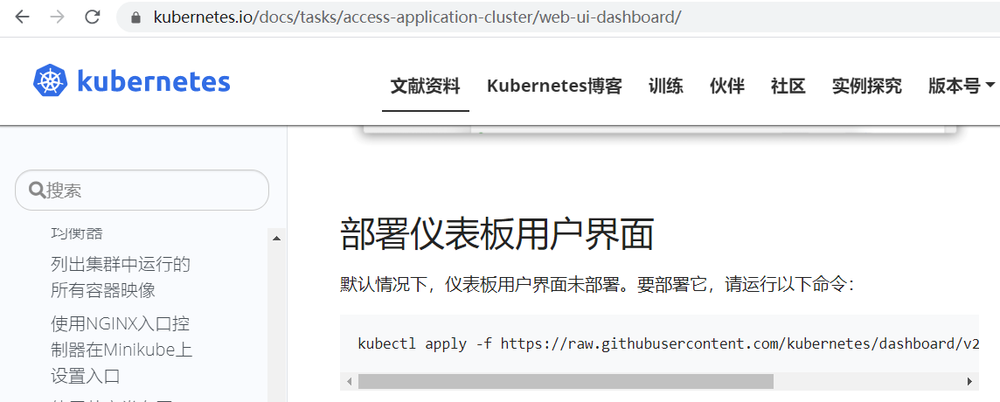
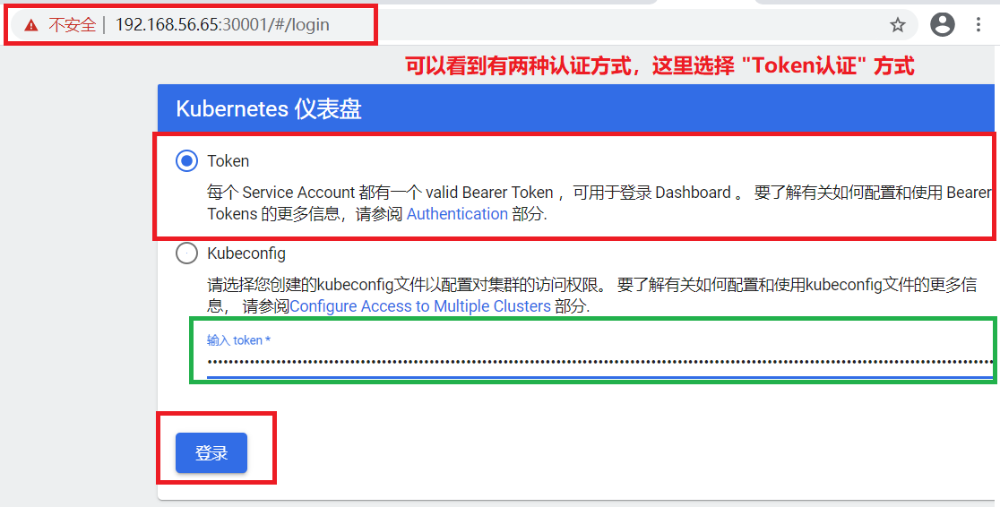
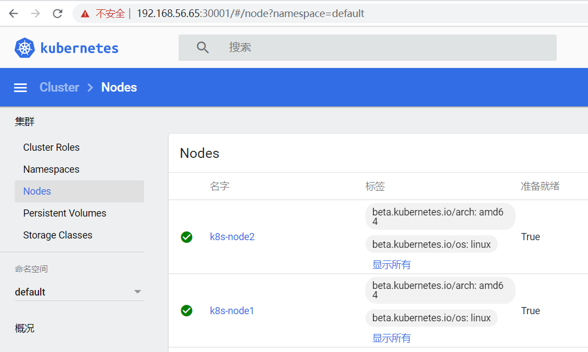

## 01.部署WebUI仪表盘

### 1.1 WebUI仪表盘官网

- 官网地址：https://kubernetes.io/docs/tasks/access-application-cluster/web-ui-dashboard/
- GitHub地址：https://github.com/kubernetes/dashboard
-  </img>

### 1.2 安装WebUI

```javascript
'''1.下载WebUI配置文件 '''
[root@k8s-master1 ~]## wget https://raw.githubusercontent.com/kubernetes/dashboard/v2.0.0/aio/deploy/recommended.yaml
[root@k8s-master1 ~]## mv recommended.yaml dashboard.yaml
[root@k8s-master1 ~]## vim /root/dashboard.yaml 
## 这个是官方原始配置，默认使用 kubectl proxy代理模式
spec:
  ports:
    - port: 443
      targetPort: 8443
  selector:
    k8s-app: kubernetes-dashboard

## 需要将上面的配置添加两个产生：type: NodePort 和 nodePort: 30001 
spec:
  type: NodePort                ## 官方默认使用 kubectl proxy代理模式，这里我们修改成NodePort模式
  ports:
    - port: 443
      targetPort: 8443
      nodePort: 30001           ## 添加nodePort暴露端口为，30001
  selector:
    k8s-app: kubernetes-dashboard

[root@k8s-master1 ~]## kubectl apply -f dashboard.yaml     ## 执行部署WebUI命令
namespace/kubernetes-dashboard created           ## 可以看到输出的信息，命名空间被修改成了，kubernetes-dashboard
serviceaccount/kubernetes-dashboard created
service/kubernetes-dashboard created
secret/kubernetes-dashboard-certs created
secret/kubernetes-dashboard-csrf created
secret/kubernetes-dashboard-key-holder created
configmap/kubernetes-dashboard-settings created
role.rbac.authorization.k8s.io/kubernetes-dashboard created
clusterrole.rbac.authorization.k8s.io/kubernetes-dashboard created
rolebinding.rbac.authorization.k8s.io/kubernetes-dashboard created
clusterrolebinding.rbac.authorization.k8s.io/kubernetes-dashboard created
deployment.apps/kubernetes-dashboard created
service/dashboard-metrics-scraper created
deployment.apps/dashboard-metrics-scraper created
'''1.可以看到创建了两个 pod容器，由于需要拉取官方镜像，所以其中一个状态是：ContainerCreating，需要等待 '''
[root@k8s-master1 ~]## kubectl get pods -n kubernetes-dashboard
NAME                                        READY   STATUS              RESTARTS   AGE
dashboard-metrics-scraper-c79c65bb7-rpk6c   0/1     ContainerCreating   0          2m22s
kubernetes-dashboard-56484d4c5-2kxsw        1/1     Running             0          2m22s
 
[root@k8s-master1 ~]## kubectl --namespace=kubernetes-dashboard describe pod dashboard-metrics-scraper-c79c65bb7-rpk6c
Warning  Failed    kubelet, k8s-node1  Error: ErrImagePull
Normal   BackOff   kubelet, k8s-node1  Back-off pulling image "kubernetesui/dashboard:v2.0.0"
Warning  Failed    kubelet, k8s-node1  Error: ImagePullBackOff
Normal   Pulling   kubelet, k8s-node1  Pulling image "kubernetesui/dashboard:v2.0.0"  ## ContainerCreating原因很清晰，还在下载镜像
## 注：如果长时间下载不成功，可以到对应node节点中，修改 /etc/docker/daemon.json 添加国内镜像加速地址

'''经过一段时间等待，两个容器的状态重要变成 Running状态  '''
[root@k8s-master1 ~]## kubectl get pods -n kubernetes-dashboard
NAME                                        READY   STATUS    RESTARTS   AGE
dashboard-metrics-scraper-c79c65bb7-rpk6c   1/1     Running   0          15m
kubernetes-dashboard-56484d4c5-2kxsw        1/1     Running   0          15m

 '''查看WebUI对外暴露的端口'''
[root@k8s-master1 ~]## kubectl get pods,svc -n kubernetes-dashboard
NAME                       TYPE      CLUSTER-IP   EXTERNAL-IP   PORT(S)       AGE
service/dashboard-metrics-scraper   ClusterIP   10.0.0.31    <none>      8000/TCP      17m
service/kubernetes-dashboard      NodePort   10.0.0.219    <none>      443:30001/TCP   17m

```

### 1.3  为WebUI生成认证Token

- ==将 dashboard-adminuser.yaml 文件上传到 k8s-master1 的 /root/ 文件夹下==

```javascript
[root@k8s-master1 ~]## vim /root/dashboard-adminuser.yaml 

apiVersion: v1
kind: ServiceAccount                 ## 首先创建一个 ServiceAccount，token都是由ServiceAccount创建
metadata:
  name: admin-user
  namespace: kubernetes-dashboard
---
apiVersion: rbac.authorization.k8s.io/v1
kind: ClusterRoleBinding
metadata:
  name: admin-user
roleRef:
  apiGroup: rbac.authorization.k8s.io
  kind: ClusterRole
  name: cluster-admin                ## 将ServiceAccount授权，加入到 cluster-amdin组中，这个组具有对k8s超级管理员权限
subjects:
- kind: ServiceAccount
  name: admin-user
  namespace: kubernetes-dashboard
[root@k8s-master1 ~]## kubectl apply -f dashboard-adminuser.yaml       ## 执行创建用户命令
serviceaccount/admin-user created
clusterrolebinding.rbac.authorization.k8s.io/admin-user created

'''创建完成后，可以通过下面命令获取到token '''
[root@k8s-master1 ~]## kubectl -n kubernetes-dashboard describe secret $(kubectl -n kubernetes-dashboard get secret | grep admin-user | awk '{print $1}')
 token:      eyJhbGciOiJSUzI1NiIsImtpZCI6IlVxY0FtRThTcmN2V2tpS0s4VF8za2xTUzUtOUhHdlUyeUhIcWdNVTNFODAifQ.eyJpc3MiOiJrdWJlcm5ldGVzL3NlcnZpY2VhY2NvdW50Iiwia3ViZXJuZXRlcy5pby9zZXJ2aWNlYWNjb3VudC9uYW1lc3BhY2UiOiJrdWJlcm5ldGVzLWRhc2hib2FyZCIsImt1YmVybmV0ZXMuaW8vc2VydmljZWFjY291bnQvc2VjcmV0Lm5hbWUiOiJhZG1pbi11c2VyLXRva2VuLXFsc2NoIiwia3ViZXJuZXRlcy5pby9zZXJ2aWNlYWNjb3VudC9zZXJ2aWNlLWFjY291bnQubmFtZSI6ImFkbWluLXVzZXIiLCJrdWJlcm5ldGVzLmlvL3NlcnZpY2VhY2NvdW50L3NlcnZpY2UtYWNjb3VudC51aWQiOiJjZDMxNjQ3NS04NThiLTRiMDYtODc0Yi0yY2Q2MmI0YzQ5YWMiLCJzdWIiOiJzeXN0ZW06c2VydmljZWFjY291bnQ6a3ViZXJuZXRlcy1kYXNoYm9hcmQ6YWRtaW4tdXNlciJ9.n9JFgi9jeucrwAnXSj5ZCmIZLwzxCheTsrrC9gkXm6NBMAhPet3pQZTTN5YOMX-POn-CQUEFyM9b8Ulk5h94BMalg5jbEmUCgJWXjOUsSudTYvB8m_Xa92rnA6Lo8qRLQWpXfKE6NoAO0MYvRKLBMxL-Oj4II-_DTsbd9bU1lkACR2_vG3Z1pPLDmsfCpBaGfcNg9IIWdHffFYOFgzlvjAue6qizblvosfX-QVcj3UKUd84IlYxVeqb4DdiITVjKk6L0269sMngc9oPFu0HvKDvgVm3ArZZ9HZFJgRnOrpVE6GVG1KKgk1X-B8hAVN-2rSXgkGRNFnprT_RDx0BlWg
```

### 1.4 访问WebUI

- `访问地址：`https://192.168.56.65:30001/      （任意node节点地址都可以访问）
-  </img>

-  </img>


## 02.部署K8S集群内部DNS

### 2.1 集群内部DNS说明

- 是为了内部 service 提供 DNS解析的

- 部署完DNS后就可以使用 服务名称 来转发到后面的 pod中

- 如果部署DNS那就必须使用 10.0.0.221 这些内部IP来访问，在程序中只能写死，不方便

- ```javascript
     [root@k8s-master1 ~]## kubectl get svc
     NAME         TYPE      CLUSTER-IP      EXTERNAL-IP   PORT(S)        AGE
     kubernetes   ClusterIP    10.0.0.1        <none>      443/TCP        21h
     web         NodePort    10.0.0.221      <none>      80:30464/TCP     15h
     ```

- coredns如果使用的是kubeadm部署，会自动部署好，我们使用二进制部署，所以需要单独安装一下

### 2.2 安装 coredns

==将 coredns.yaml 上传到 k8s-master1 的 /root/ 文件夹下==

```javascript
[root@k8s-master1 ~]## cat /root/coredns.yaml 
 
spec:
  selector:
    k8s-app: kube-dns
  ## 配置文件中最重要的就是 clusterIP,这个ip是我们为dns服务单独固定下来的一个ip，kubelet就是通过这个ip向他发送请求
  clusterIP: 10.0.0.2       ## 所有node节点的 /opt/kubernetes/cfg/kubelet.conf 都配置了10.0.0.2 作为clusterDNS
```


```javascript
[root@k8s-master1 ~]## kubectl apply -f coredns.yaml 
serviceaccount/coredns created
clusterrole.rbac.authorization.k8s.io/system:coredns created
clusterrolebinding.rbac.authorization.k8s.io/system:coredns created
configmap/coredns created
deployment.apps/coredns created
service/kube-dns created

'''查看coredns还在ContainerCreating状态 '''
[root@k8s-master1 ~]## kubectl get pods -n kube-system
NAME                  READY   STATUS              RESTARTS   AGE
coredns-6d8cfdd59d-mbkzq     0/1     ContainerCreating   0          42s
kube-flannel-ds-amd64-ptsbg   1/1     Running             2          16h
kube-flannel-ds-amd64-q2bt9   1/1     Running             4          16h
'''查看pod详情，已经开始启动了 '''
[root@k8s-master1 ~]## kubectl --namespace=kube-system describe pod coredns-6d8cfdd59d-mbkzq
 Normal  Pulling    109s      kubelet, k8s-node2  Pulling image "lizhenliang/coredns:1.2.2"
 Normal  Pulled     65s       kubelet, k8s-node2  Successfully pulled image "lizhenliang/coredns:1.2.2"
 Normal  Created    65s       kubelet, k8s-node2  Created container coredns
 Normal  Started    65s       kubelet, k8s-node2  Started container coredns
```


### 2.3 测试coredns是否可以解析

#### 2.3.1 启动busybox容器

- ==将 bs.yaml 上传到 k8s-master1 的 /root/ 文件中==

- busybox 这个镜像是一个测试小工具

```javascript
[root@k8s-master1 ~]## kubectl apply -f bs.yaml 
pod/busybox created
[root@k8s-master1 ~]## kubectl get pods -o wide    ## 等待镜像启动成功，下面显示还是 ContainerCreating 状态
NAME             READY   STATUS       RESTARTS   AGE   IP         NODE     NOMINATED NODE   READINESS GATES
busybox           0/1   ContainerCreating   0      52s   <none>     k8s-node2   <none>         <none>
web-d86c95cc9-2wk82  1/1    Running         1      15h   10.244.1.5  k8s-node2   <none>         <none>
```

#### 2.3.2 使用 busybox 的pod来测试dns

```javascript
'''可以看到集群中启动了一个pod： 名字：web ==》 IP：10.0.0.221 '''
[root@k8s-master1 ~]## kubectl get svc
NAME         TYPE        CLUSTER-IP   EXTERNAL-IP   PORT(S)        AGE
web          NodePort    10.0.0.221   <none>        80:30464/TCP   15h
[root@k8s-master1 ~]## kubectl exec -it busybox sh      ## 进入 busybox 容器内部
/ ## ping web                                ## 可以看到能够使用名字 web来 ping通 10.0.0.221，证明dns有效
PING web (10.0.0.221): 56 data bytes
64 bytes from 10.0.0.221: seq=0 ttl=64 time=0.034 ms
64 bytes from 10.0.0.221: seq=1 ttl=64 time=0.078 ms
```