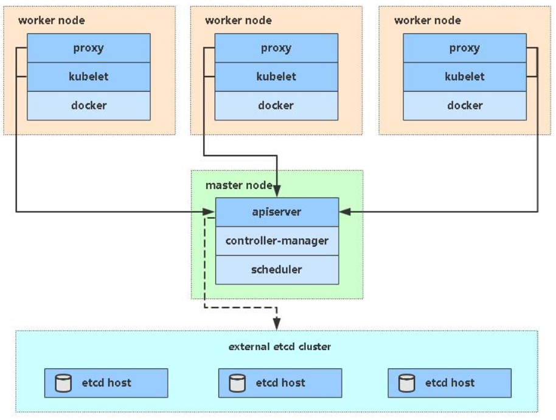
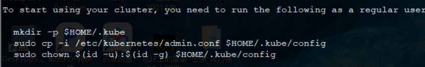
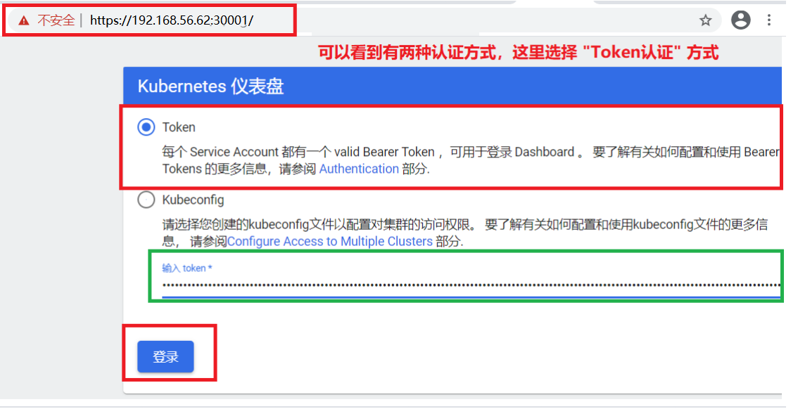
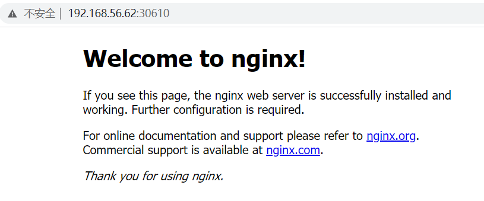

```javascript
1、安装docker
2、创建一个master节点
kubeadm init
3、讲一个Node节点加入到当前集群
kubeadm join <Master节点的IP和端口>
4、部署容器网络CNI
kubectl apply -f calico.yaml
5、部署Web UI（DashBoard）
```

# 01.kubeadm安装k8s集群架构

## 1.1 kubeadm介绍

- kubeadm是官方社区推出的一个用于快速部署kubernetes集群的工具。
- 这个工具能通过两条指令完成一个kubernetes集群的部署
- kubeadm不单纯是简化部署k8s集群，采用了容器化部署k8s组件（`只有 kubelet是非容器化部署的`）

```python
# 创建一个 Master 节点
$ kubeadm init
# 将一个 Node 节点加入到当前集群中
$ kubeadm join <Master节点的IP和端口 >
```

## 1.2 kubeadm安装架构说明

| 角色       | IP            |
| ---------- | ------------- |
| k8s-master | 192.168.31.61 |
| k8s-node1  | 192.168.31.62 |
| k8s-node2  | 192.168.31.63 |

 </img>


# 02.环境准备【所有节点】

## 2.1 安装要求

在开始之前，部署Kubernetes集群机器需要满足以下几个条件：

### 2.1.1 操作系统和硬件要求

- 1、操作系统要求

    -  一台或多台机器，操作系统 CentOS7.x-86_x64（最好是7.4~7.8版本）

    -  如果是7.1~7.3版本的建议更新一下内核

    - ```javascript
        [root@k8s-master1 ~]# yum update -y  &&  reboot
        ```

- 2、硬件配置

    - 2GB或更多RAM，2个CPU或更多CPU，硬盘30GB或更多

- 3、网络要求

    - 集群中所有机器之间网络互通，可以访问外网，需要拉取镜像

### 2.1.2 关闭防火墙和swap分区

```javascript
'''1.关闭防火墙'''
[root@lb-master ~]# systemctl stop firewalld
[root@lb-master ~]# systemctl disable firewalld

'''2.关闭selinux'''
[root@lb-master ~]# sed -i 's/enforcing/disabled/' /etc/selinux/config        # 永久
[root@lb-master ~]# setenforce 0      # 临时

'''2.关闭swap'''
[root@lb-master ~]# swapoff -a        # 临时
[root@lb-master ~]# vim /etc/fstab     # 永久(注释掉下面即可)
#/dev/mapper/cl-swap     swap                    swap    defaults        0 0
[root@lb-master ~]# free -m          # 查看是否已经关闭
```

### 2.1.3 修改主机名

```javascript
'''1.修改三台机器主机名  '''
[root@lb-master ~]# hostnamectl set-hostname k8s-master
[root@lb-slave ~]# hostnamectl set-hostname k8s-node1
[root@k8s-master1 ~]# hostnamectl set-hostname k8s-node2

'''2.添加hosts解析  '''
[root@lb-master ~]# vim /etc/hosts     # 添加下面域名解析     
192.168.56.61 k8s-master
192.168.56.62 k8s-node1
192.168.56.63 k8s-node2
```

### 2.1.4 将桥接的IPv4流量传递到iptables的链

```javascript
[root@lb-master ~]#  cat > /etc/sysctl.d/k8s.conf << EOF
net.bridge.bridge-nf-call-ip6tables = 1
net.bridge.bridge-nf-call-iptables = 1
EOF
 
[root@lb-master ~]#  sysctl --system      # 生效
```

### 2.1.5 同步时间

- k8s的https证书会根据时间来检查有效期

```javascript
[root@lb-master ~]#  yum install ntpdate -y
[root@lb-master ~]#  ntpdate time.windows.com
```


# 03. 安装Docker/kubeadm/kubelet【所有节点】

- Kubernetes默认CRI（容器运行时）为Docker，因此先安装Docker。
- k8s-master节点和所有node节点都需要安装这些组件

## 3.1 安装Docker

```javascript
[root@k8s-master ~]#  yum -y install wget
[root@k8s-master ~]#  wget https://mirrors.aliyun.com/docker-ce/linux/centos/docker-ce.repo -O /etc/yum.repos.d/docker-ce.repo
[root@k8s-master ~]#  yum -y install docker-ce
[root@k8s-master ~]#  systemctl enable docker && systemctl start docker
```

- 配置镜像下载加速器：

```javascript
[root@k8s-master ~]#  cat > /etc/docker/daemon.json << EOF
{
  "registry-mirrors": ["https://b9pmyelo.mirror.aliyuncs.com"]
}
EOF
[root@k8s-master ~]#  systemctl restart docker
[root@k8s-master ~]#  docker info
```

## 3.2 添加阿里云YUM软件源

```javascript
[root@k8s-master ~]#  cat > /etc/yum.repos.d/kubernetes.repo << EOF
[kubernetes]
name=Kubernetes
baseurl=https://mirrors.aliyun.com/kubernetes/yum/repos/kubernetes-el7-x86_64
enabled=1
gpgcheck=0
repo_gpgcheck=0
gpgkey=https://mirrors.aliyun.com/kubernetes/yum/doc/yum-key.gpg https://mirrors.aliyun.com/kubernetes/yum/doc/rpm-package-key.gpg
EOF
```

## 3.3 安装kubeadm，kubelet和kubectl

- `由于版本更新频繁，这里指定版本号部署`

```javascript
[root@k8s-master ~]#  yum install -y kubelet-1.19.0 kubeadm-1.19.0 kubectl-1.19.0
[root@k8s-master ~]#  systemctl enable kubelet
```

- k8s-master
    - kube-apiserver
    - kube-scheduler
    - kube-controller-manager
    - etcd
- k8s-node
    - kubelet
    - kube-proxy

# 04.  kubeadm init部署k8s-master

- ==只需要在k8s-master-192.168.56.61上安装即可==

```javascript
https://kubernetes.io/zh/docs/reference/setup-tools/kubeadm/kubeadm-init/#config-file 
https://kubernetes.io/docs/setup/production-environment/tools/kubeadm/create-cluster-kubeadm/#initializing-your-control-plane-node 
```

## 4.1 法1：使用命令行部署k8s-master

### 4.1.1 执行部署k8s-master命令

```javascript
[root@k8s-master ~]#  kubeadm init \
  --apiserver-advertise-address=192.168.56.61 \
  --image-repository registry.aliyuncs.com/google_containers \
  --kubernetes-version v1.19.0 \
  --service-cidr=10.96.0.0/12 \
  --pod-network-cidr=10.244.0.0/16 \
  --ignore-preflight-errors=all
```

- --apiserver-advertise-address 集群通告地址
- --image-repository  由于默认拉取镜像地址k8s.gcr.io国内无法访问，这里指定阿里云镜像仓库地址
- --kubernetes-version K8s版本，与上面安装的一致
- --service-cidr 集群内部虚拟网络，Pod统一访问入口
- --pod-network-cidr Pod网络，，与下面部署的CNI网络组件yaml中保持一致

### 4.1.2 将集群的配置文件复制到指定位置

 </img>

```javascript
[root@k8s-master ~]#  mkdir -p $HOME/.kube
[root@k8s-master ~]#  sudo cp -i /etc/kubernetes/admin.conf $HOME/.kube/config
[root@k8s-master ~]#  sudo chown $(id -u):$(id -g) $HOME/.kube/config
```

- 确定k8s-master是否安装成功

```javascript
[root@k8s-master ~]# kubectl get nodes
NAME         STATUS     ROLES    AGE     VERSION
k8s-master   NotReady   master   3h37m   v1.19.0
```

- 这个信息一定要留着，一会node节点加入集群还要用

```javascript
kubeadm join 192.168.56.61:6443 --token k82ja8.p4bu6a1kcq119kts \
    --discovery-token-ca-cert-hash sha256:ea23b5c494bf8fff4577b66bbfeeea65ac72ac80e3e3d93e5f1ed62936a48ef9 
```


## 4.2 法2：使用配置文件引导

### 4.2.1 编辑kubeadm.conf配置文件

```javascript
[root@k8s-master ~]#  vi kubeadm.conf
apiVersion: kubeadm.k8s.io/v1beta2
kind: ClusterConfiguration
kubernetesVersion: v1.18.0
imageRepository: registry.aliyuncs.com/google_containers 
networking:
  podSubnet: 10.244.0.0/16 
  serviceSubnet: 10.96.0.0/12 

[root@k8s-master ~]#  kubeadm init --config kubeadm.conf --ignore-preflight-errors=all  
```

### 4.2.2 拷贝kubectl使用的连接k8s认证文件到默认路径

```javascript
[root@k8s-master ~]#  mkdir -p $HOME/.kube
[root@k8s-master ~]#  sudo cp -i /etc/kubernetes/admin.conf $HOME/.kube/config
[root@k8s-master ~]#  sudo chown $(id -u):$(id -g) $HOME/.kube/config
```

- 确定k8s-master是否安装成功

```javascript
[root@k8s-master ~]#  kubectl get nodes
NAME         STATUS   ROLES    AGE   VERSION
k8s-master     Ready    master   2m   v1.18.0
```

## 4.3 kubeadm init初始化工作

- 1、[preflight] 环境检查和拉取镜像  kubeadm  config  images pull

- 2、[certs] 生成k8s证书 和  etcd 证书，为了使用https

    - ```javascript
        [root@k8s-master ~]# ll /etc/kubernetes/pki/
        total 56
        -rw-r--r-- 1 root root 1269 Dec 27 21:04 apiserver.crt
        -rw-r--r-- 1 root root 1135 Dec 27 21:04 apiserver-etcd-client.crt
        -rw------- 1 root root 1679 Dec 27 21:04 apiserver-etcd-client.key
        -rw------- 1 root root 1675 Dec 27 21:04 apiserver.key
        -rw-r--r-- 1 root root 1143 Dec 27 21:04 apiserver-kubelet-client.crt
        -rw------- 1 root root 1675 Dec 27 21:04 apiserver-kubelet-client.key
        -rw-r--r-- 1 root root 1066 Dec 27 21:04 ca.crt
        -rw------- 1 root root 1679 Dec 27 21:04 ca.key
        drwxr-xr-x 2 root root  162 Dec 27 21:04 etcd
        -rw-r--r-- 1 root root 1078 Dec 27 21:04 front-proxy-ca.crt
        -rw------- 1 root root 1675 Dec 27 21:04 front-proxy-ca.key
        -rw-r--r-- 1 root root 1103 Dec 27 21:04 front-proxy-client.crt
        -rw------- 1 root root 1679 Dec 27 21:04 front-proxy-client.key
        -rw------- 1 root root 1675 Dec 27 21:04 sa.key
        -rw------- 1 root root  451 Dec 27 21:04 sa.pub
        ```

- 3、[kubeconfig] 生成 kubeconfig 配置文件，配置其他组件连接kube-apiserver

- 4、[kubelet-start] 生成 kubelet配置文件

- 5、[control-plane] 部署管理节点组件，用镜像启动容器

- 6、[etcd] 使用镜像部署etcd数据库

- 7、[upload-config] [kubelet] [upload-certs] 上传配置文件到k8s中

- 8、[mark-conrol-plane] 添加角色是 master还是node

- 9、[bootstrap-token] 自动为kubelet颁发证书的token

- 10、[addons] 部署插件，CoreDNS、kube-proxy

- 11、最后：拷贝连接k8s集群认证文件到默认路径下

    - ```javascript
        [root@k8s-master ~]#  mkdir -p $HOME/.kube
        [root@k8s-master ~]#  sudo cp -i /etc/kubernetes/admin.conf $HOME/.kube/config
        [root@k8s-master ~]#  sudo chown $(id -u):$(id -g) $HOME/.kube/config
        ```

- 12、加入node节点

    - ```javascript
        kubeadm join 192.168.56.61:6443 --token n4s486.e19tb1cth8bo3w0z \
            --discovery-token-ca-cert-hash sha256:3e4a7f11a8b4fa1b7c8740426736813198f8d77670d705335fef56edfbb80869 
        ```

## 4.4 如果kubeadm init执行失败如何解决

- 执行 `kubeadm reset `重置环境，k8s-maser节点和k8s-node节点都需要执行
- 然后从新执行 kubeadm init  命令安装


# 05. 加入Kubernetes Node

## 5.1 将k8s-node1和node2节点加入集群

- 在192.168.56.62/63（Node）执行

- 向集群添加新节点，执行在kubeadm init输出的kubeadm join命令

```javascript
kubeadm join 192.168.56.61:6443 --token n4s486.e19tb1cth8bo3w0z \
    --discovery-token-ca-cert-hash sha256:3e4a7f11a8b4fa1b7c8740426736813198f8d77670d705335fef56edfbb80869 
```

- 在k8s-master上查看当前节点状态,由于缺少CNI网络组件，所以当前是NotReady状态

```javascript
'''1.查看集群状态 '''
[root@k8s-master ~]# kubectl get nodes
NAME         STATUS     ROLES    AGE     VERSION
k8s-master    NotReady   master    4m25s    v1.19.0
k8s-node1     NotReady   <none>    21s     v1.19.0
k8s-node2     NotReady   <none>    17s     v1.19.0
'''2.查看kubelet日志，找到报错原因 '''
[root@k8s-master ~]# journalctl -u kubelet > k1.log     
[root@k8s-master ~]# tail -f k1.log 
# 可以参考kubelet日志，可以看到报cni网络更新错误（Unable to update cni config: no networks found in /etc/cni/net.d）
```

## 5.2 重新生成token

- 默认token有效期为24小时，当过期之后，该token就不可用了。
- 这时就需要重新创建token，操作如下：

```
$ kubeadm token create
$ kubeadm token list
$ openssl x509 -pubkey -in /etc/kubernetes/pki/ca.crt | openssl rsa -pubin -outform der 2>/dev/null | openssl dgst -sha256 -hex | sed 's/^.* //'
63bca849e0e01691ae14eab449570284f0c3ddeea590f8da988c07fe2729e924

$ kubeadm join 192.168.31.61:6443 --token nuja6n.o3jrhsffiqs9swnu --discovery-token-ca-cert-hash sha256:63bca849e0e01691ae14eab449570284f0c3ddeea590f8da988c07fe2729e924
```

或者直接命令快捷生成：kubeadm token create --print-join-command

<https://kubernetes.io/docs/reference/setup-tools/kubeadm/kubeadm-join/>

# 06. 部署容器网络（CNI）

https://kubernetes.io/docs/setup/production-environment/tools/kubeadm/create-cluster-kubeadm/#pod-network 

https://docs.projectcalico.org/getting-started/kubernetes/quickstart 

- 注意：只需要部署下面其中一个，推荐Calico。

- Calico是一个纯三层的数据中心网络方案，Calico支持广泛的平台，包括Kubernetes、OpenStack等。

- Calico 在每一个计算节点利用 Linux Kernel 实现了一个高效的虚拟路由器（ vRouter） 来负责数据转发，而每个 vRouter 通过 BGP 协议负责把自己上运行的 workload 的路由信息向整个 Calico 网络内传播。

- 此外，Calico  项目还实现了 Kubernetes 网络策略，提供ACL功能。

- 下载完后还需要修改里面定义Pod网络（CALICO_IPV4POOL_CIDR），与前面kubeadm init指定的一样

- 修改完后应用清单

```javascript
[root@k8s-master ~]# wget https://docs.projectcalico.org/manifests/calico.yaml
[root@k8s-master ~]# vim calico.yaml
# 搜索 "CALICO_IPV4POOL_CIDR"关键字，将value中默认的value: "192.168.0.0/16" 修改成 value: "10.244.0.0/16"
# 必须要和部署k8s-maser中指定的地址相同
- name: CALICO_IPV4POOL_CIDR
  value: "10.244.0.0/16"

[root@k8s-master ~]#  kubectl apply -f calico.yaml
[root@k8s-master ~]#  kubectl get pods -n kube-system
[root@k8s-master ~]#  cat calico.yaml | grep image              # calico要下载很多镜像，从docker官网，会比较慢
          image: docker.io/calico/cni:v3.17.1
          image: docker.io/calico/cni:v3.17.1
          image: docker.io/calico/pod2daemon-flexvol:v3.17.1
          image: docker.io/calico/node:v3.17.1
          image: docker.io/calico/kube-controllers:v3.17.1
[root@k8s-master ~]#  kubectl get node                      # 当部署完成后就可以看到所有节点都变成 Ready状态
NAME         STATUS   ROLES    AGE   VERSION
k8s-master    Ready    master   42m   v1.19.0
k8s-node1     Ready    <none>   38m   v1.19.0
k8s-node2     Ready    <none>   38m   v1.19.0
```

# 07. 部署 Dashboard

## 7.1 下载recommended.yaml配置文件

```javascript
[root@k8s-master ~]#  wget https://raw.githubusercontent.com/kubernetes/dashboard/v2.0.3/aio/deploy/recommended.yaml
```

- 如果国内无法打开 raw.githubusercontent.com 怎么办

```javascript
上https://www.ipaddress.com查一下raw.githubusercontent.com的ipv4地址，比如我现在查到的是199.232.96.133
[root@k8s-master ~]# vim /etc/hosts
199.232.96.133 raw.githubusercontent.com
```

## 7.2 修改配置文件并部署

- 默认Dashboard只能集群内部访问，修改Service为NodePort类型，暴露到外部：

```javascript
[root@k8s-master1 ~]# vim  recommended.yaml
# 这个是官方原始配置，默认使用 kubectl proxy代理模式
spec:
  ports:
    - port: 443
      targetPort: 8443
  selector:
    k8s-app: kubernetes-dashboard

# 需要将上面的配置添加两个产生：type: NodePort 和 nodePort: 30001 
spec:
  type: NodePort                # 官方默认使用 kubectl proxy代理模式，这里我们修改成NodePort模式
  ports:
    - port: 443
      targetPort: 8443
      nodePort: 30001           # 添加nodePort暴露端口为，30001
  selector:
    k8s-app: kubernetes-dashboard
 
[root@k8s-master1 ~]#  kubectl apply -f recommended.yaml
[root@k8s-master1 ~]#  kubectl get pods -n kubernetes-dashboard
NAME                             READY    STATUS    RESTARTS   AGE
dashboard-metrics-scraper-6b4884c9d5-gl8nr   1/1     Running    0       13m
kubernetes-dashboard-7f99b75bf4-89cds      1/1     Running    0       13m
```

## 7.3 获取认证token并登陆

### 7.3.1 获取token

- 访问地址：https://NodeIP:30001

- 创建service account并绑定默认cluster-admin管理员集群角色：

```javascript
# 创建用户
[root@k8s-master1 ~]#  kubectl create serviceaccount dashboard-admin -n kube-system
# 用户授权
[root@k8s-master1 ~]#  kubectl create clusterrolebinding dashboard-admin --clusterrole=cluster-admin --serviceaccount=kube-system:dashboard-admin
# 获取用户Token
[root@k8s-master1 ~]#  kubectl describe secrets -n kube-system $(kubectl -n kube-system get secret | awk '/dashboard-admin/{print $1}')
```


### 7.3.2 使用token登录Dashboard

- `访问地址：`https://192.168.56.62:30001/      （任意node节点地址都可以访问）
-  </img>

# 08. 测试kubernetes集群

- 验证Pod工作
- 验证Pod网络通信
- 验证DNS解析

## 8.1 部署nginx服务

> 在Kubernetes集群中创建一个pod，验证是否正常运行

```javascript
[root@k8s-master ~]#  kubectl create deployment nginx --image=nginx
[root@k8s-master ~]#  kubectl expose deployment nginx --port=80 --type=NodePort
[root@k8s-master ~]#  kubectl get pod,svc
NAME                         READY   STATUS    RESTARTS   AGE
pod/nginx-6799fc88d8-8sz6l   1/1     Running   0          2m56s

NAME               TYPE      CLUSTER-IP     EXTERNAL-IP   PORT(S)        AGE
service/kubernetes    ClusterIP    10.96.0.1       <none>     443/TCP        109m
service/nginx        NodePort    10.102.92.185    <none>     80:30610/TCP     2m44s
[root@k8s-master ~]#  kubectl get pod,svc
NAME              TYPE     CLUSTER-IP      EXTERNAL-IP   PORT(S)      AGE
service/kubernetes   ClusterIP   10.96.0.1       <none>      443/TCP      110m
service/nginx       NodePort   10.102.92.185    <none>      80:30610/TCP   4m31s
```

- 访问地址：http://192.168.56.62:30610/

 </img>

## 8.2 查CoreDNS组件

```javascript
[root@k8s-master ~]# kubectl get pod -n kube-system
NAME                           READY    STATUS    RESTARTS   AGE
calico-kube-controllers-744cfdf676-7kjk2   1/1     Running   0          77m
calico-node-n4k82                   1/1     Running   0          77m
calico-node-t6b45                   1/1     Running   0          77m
calico-node-tl7dc                   1/1     Running   0          77m
coredns-6d56c8448f-kpncp              1/1     Running   0          116m
coredns-6d56c8448f-vx9vw              1/1     Running   0          116m
etcd-k8s-master                    1/1     Running   0          116m
kube-apiserver-k8s-master             1/1     Running   0          116m
kube-controller-manager-k8s-master       1/1     Running   0          116m
kube-proxy-829s7                   1/1     Running   0          116m
kube-proxy-jm2wt                   1/1     Running   0          112m
kube-proxy-qcgxk                   1/1     Running   0          112m
kube-scheduler-k8s-master             1/1     Running   0          116m
```

# 09.k8s-cni通信常见问题

- 1、统一管理这些k8s node网段，保障每个容器分配不一样的ip
    - 给每个docker主机分配唯一的网段
- 2、要知道转发哪个docker主机？
    - 做好记录，每个docker主机对应的网段
- 3、怎么实现这个转发（从docker主机1上容器发送到另一台docker主机上容器）
    - 可以使用iptables或者把宿主机当做一个路由器，配置路由表

# 10.查看集群状态

## 10.1.1 查看集群状态命令

```javascript
[root@k8s-master ~]# kubectl api-resources | more        # 查看集群中都有哪些资源（别买等）
[root@k8s-master ~]# kubectl get cs                 # 查看master组件状态
[root@k8s-master ~]# kubectl get node                # 查看node状态

[root@k8s-master ~]# kubectl cluster-info             # 查看Apiserver代理的URL
[root@k8s-master ~]# kubectl describe <资源> <名称>       # 查看资源信息
[root@k8s-master ~]# kubectl describe node k8s-master       # 查看资源信息
```

## 10.1.2 解决Unhealthy状态

- 解决scheduler和controller-manager的Unhealthy状态

```javascript
[root@k8s-master ~]# kubectl get cs                # 查看master组件状态
Warning: v1 ComponentStatus is deprecated in v1.19+
NAME            STATUS     MESSAGE       ERROR
scheduler         Unhealthy   Get "http://127.0.0.1:10251/healthz": dial tcp 127.0.0.1:10251: connect: connection refused   
controller-manager   Unhealthy   Get "http://127.0.0.1:10252/healthz": dial tcp 127.0.0.1:10252: connect: connection refused   
etcd-0           Healthy    {"health":"true"} 

'''将--port=0参数注释，然后重启kubelet  '''
[root@k8s-master ~]# vim /etc/kubernetes/manifests/kube-controller-manager.yaml    # 注释掉 - --port=0
    #- --port=0
[root@k8s-master ~]# vim /etc/kubernetes/manifests/kube-scheduler.yaml 
    #- --port=0
[root@k8s-master ~]# systemctl restart kubelet
```


