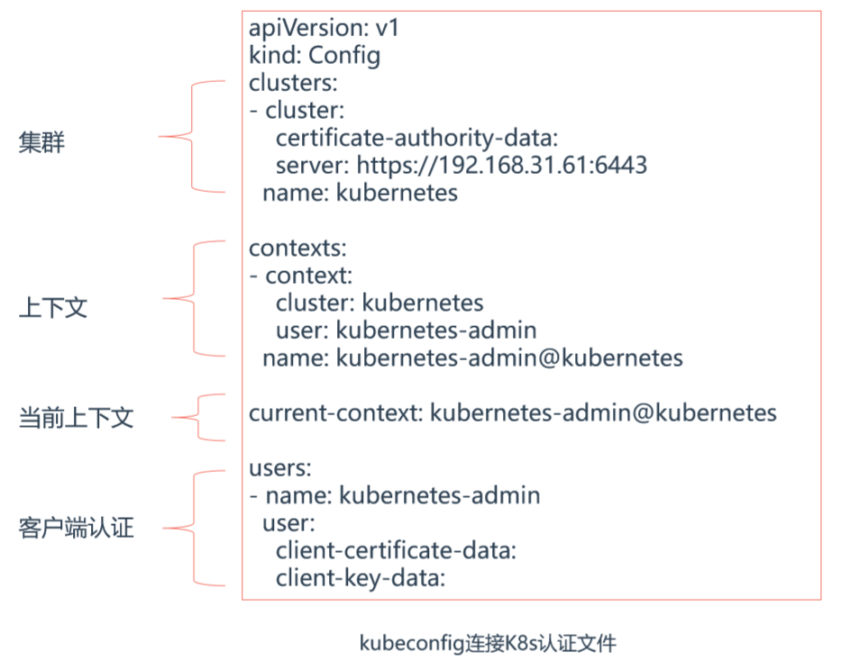

# 01.kubectl与kubeconfig关系

## 1.1 kube-apiserver两个端口

- localhost:8080  非安全端口，是kubectl默认先连接8080
- 如果你配置kubeconfig（`/root/.kube/config`）就直接走这个配置连接的安全端口
- masterip:6443   安全端口

## 1.2 在node节点中配置apiserver配置文件

```javascript
'''1.在k8s-node1和k8s-node2中创建 /root/.kube 文件夹 '''
[root@k8s-node1 ~]# mkdir -p $HOME/.kube

'''2.在k8s-master复制admin.conf配置文件到node1和node2中 '''
[root@k8s-master ~]# scp /etc/kubernetes/admin.conf   root@192.168.56.62:/root/.kube/config
[root@k8s-master ~]# scp /etc/kubernetes/admin.conf   root@192.168.56.63:/root/.kube/config

'''3.配置完后就可以在node节点中执行kubectl命令，通过apiserver接口查看k8s集群状态  '''
[root@k8s-node2 .kube]# kubectl get node
NAME        STATUS   ROLES    AGE     VERSION
k8s-master    Ready    master     5h58m   v1.19.0
k8s-node1     Ready    <none>    5h54m   v1.19.0
k8s-node2     Ready    <none>    5h54m   v1.19.0
```

## 1.3 kubeconfig配置文件

- kubectl使用kubeconfig认证文件连接K8s集群， 使用kubectl  config指令生成kubeconfig文件
- 了解一下基本结构即可

 </img>


# 02.牛刀小试-快速部署一个网站

## 2.1 使用k8s集群部署一个网站

- 使用docker构建了一个镜像，并把这个镜像推送到了 docker-hub 公用的镜像仓库中

```javascript
[root@k8s-master ~]# docker pull lizhenliang/java-demo       # 测试一下，镜像是否可以被拉取
'''1.使用Deployment控制器部署镜像'''
[root@k8s-master ~]# kubectl create deployment web --image=lizhenliang/java-demo 
[root@k8s-master ~]# kubectl get deploy,pods              # 查看镜像是否在部署
NAME                  READY   STATUS    RESTARTS   AGE
pod/nginx-6799fc88d8-8sz6l   1/1     Running   0        4h31m
pod/web-674477549d-snfqx    1/1     Running   0        2m26s
[root@k8s-master ~]# kubectl describe pod web-674477549d-snfqx    # 查看镜像部署详细过程

'''2.使用Service将Pod暴露出去'''
[root@k8s-master ~]# kubectl expose deployment web --port=80 --target-port=8080 --type=NodePort

'''3.访问应用  ''' 
[root@k8s-master ~]# kubectl get svc    # 端口随机生成，通过get svc获取
NAME        TYPE       CLUSTER-IP      EXTERNAL-IP   PORT(S)      AGE
web         NodePort    10.96.215.154    <none>      80:32610/TCP   13s
http://NodeIP:Port   ==》  http://192.168.56.62:32610/
```

## 2.2 镜像分类

- 基础镜像，例如centos、ubuntu
- 环境镜像，例如jdk、nginx
- 项目镜像，例如kubernetesui/dashboard

# 03.kubectl管理工具命令概要

## 3.1 安装kubectl命令行管理工具补全插件

```javascript
[root@k8s-master ~]# yum -y install  bash-completion
[root@k8s-master ~]# source <(kubectl completion bash) 
[root@k8s-master ~]# kubectl create deployment           # 使用下面命令测试是否可以使用tab键补全
```

## 3.2 kubectl常用命令

```javascript
kubectl get pods --show-labels      # 查看标签
kubectl get pods -l app=nginx      # 根据标签查询资源
```

| 功能说明                 | 命令                                                |
| :----------------------- | :-------------------------------------------------- |
| node                     |                                                     |
| 查看服务器节点           | kubectl get nodes                                   |
| 查看服务器节点详情       | kubectl get nodes -o wide                           |
| 节点打标签               | kubectl label nodes <节点名称> labelName=<标签名称> |
| 查看节点标签             | kubectl get node --show-labels                      |
| 删除节点标签             | kubectl label  node <节点名称> labelName-           |
| pod                      |                                                     |
| 查看pod节点              | kubectl get pod                                     |
| 查看pod节点详情          | kubectl get pod -o wide                             |
| 查看所有名称空间下的pod  | kubectl get pod --all-namespaces                    |
| 根据yaml文件创建pod      | kubectl apply -f <文件名称>                         |
| 根据yaml文件删除pod      | kubectl delete -f <文件名称>                        |
| 删除pod节点              | kubectl delete pod <pod名称> -n <名称空间>          |
| 查看异常的pod节点        | kubectl get pods -n <名称空间> \| grep -v Running   |
| 查看异常pod节点的日志    | kubectl describe pod <pod名称> -n <名称空间>        |
| svc                      |                                                     |
| 查看服务                 | kubectl get svc                                     |
| 查看服务详情             | kubectl get svc -o wide                             |
| 查看所有名称空间下的服务 | kubectl get svc --all-namespaces                    |


