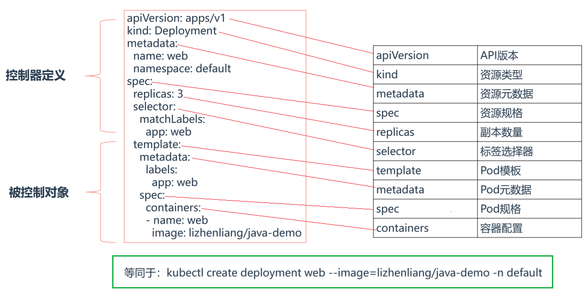
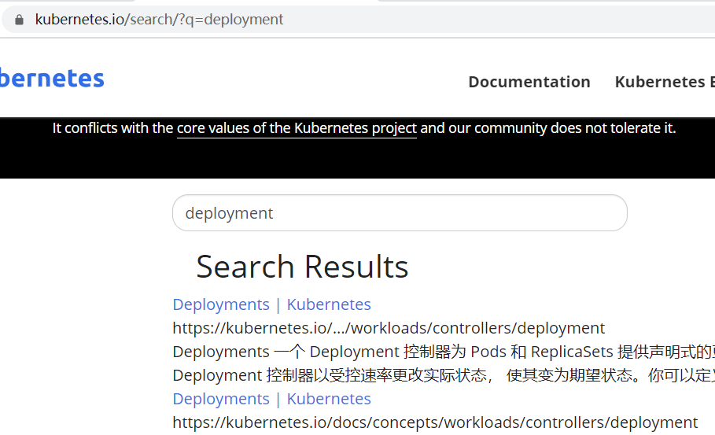

# 01.YAML文件格式说明

## 1.1 YAML格式说明

- K8s是一个容器编排引擎，使用YAML文件编排要部署应用，因此在学习之前，应先了解YAML语法格式：

-  缩进表示层级关系
- 不支持制表符“tab”缩进，使用空格缩进 
- 通常开头缩进 2 个空格 
- 字符后缩进 1 个空格，如冒号、逗号等 
- “---” 表示YAML格式，一个文件的开始
- “#”注释

## 1.2 官网pod编排文件示例

- 官方pod参考示例：https://kubernetes.io/zh/docs/concepts/workloads/pods/

```yaml
apiVersion: batch/v1
kind: Job
metadata:
  name: hello
spec:
  template:
    # 这里是 Pod 模版
    spec:
      containers:
      - name: hello
        image: busybox
        command: ['sh', '-c', 'echo "Hello, Kubernetes!" && sleep 3600']
      restartPolicy: OnFailure
    # 以上为 Pod 模版
```


# 02.YAML文件创建资源对象

## 2.1 使用YAML部署java-demo 

- `等同于：` kubectl create deployment web --image=lizhenliang/java-demo -n default 

```yaml
apiVersion: apps/v1 
kind: Deployment 
metadata: 
  name: web 
  namespace: default 
spec: 
  replicas: 3 
  selector: 
    matchLabels: 
    app: web 
  template: 
    metadata: 
    labels: 
      app: web 
    spec: 
      containers: 
      - name: web 
        image: lizhenliang/java-demo
```

 </img>

## 2.2 使用YAML部署nginx服务

### 2.2.1 查看官方示例

> 官网搜索 deployment即可找到官方部署nginx示例

 </img>

```yaml
[root@k8s-master ~]# vim deployment.yaml

apiVersion: apps/v1
kind: Deployment
metadata:
  name: nginx-deployment
  labels:
    app: nginx
spec:
  replicas: 3
  selector:
    matchLabels:
      app: nginx
  template:
    metadata:
      labels:
        app: nginx
    spec:
      containers:
      - name: nginx
        image: nginx:1.14.2
        ports:
        - containerPort: 80
```

### 2.2.2 使用功官方示例部署nginx服务

- 使用上面的 deployment.yaml部署

```javascript
[root@k8s-master ~]# kubectl create -f deployment.yaml       # create命令，只能第一次创建使用这个命令，基本不用
'''将你需要创建的资源描述到YAML文件中'''
[root@k8s-master ~]#  kubectl apply -f deployment.yaml            # 部署
[root@k8s-master ~]#  kubectl delete -f  deployment.yaml           # 卸载
```

- 查看pod是否启动

```javascript
[root@k8s-master ~]# kubectl get pods
NAME                                READY   STATUS    RESTARTS   AGE
nginx-deployment-66b6c48dd5-56nml   1/1     Running   0          6m14s
nginx-deployment-66b6c48dd5-n2xw7   1/1     Running   0          6m14s
nginx-deployment-66b6c48dd5-r6t4j   1/1     Running   0          6m14s
[root@k8s-master ~]# kubectl delete service  web     # 删除具体某一个pod
service "web" deleted
```

# 03.YAML文件中字段太多，记不住怎么办

## 3.1 生成Deployment的YAML文件

```javascript
'''1.如果以前已经创建过pod名字为web的deployment，可以使用下面命令删除  '''
[root@k8s-master ~]# kubectl delete deploy web
'''2.使用create命令到处YAML文件  '''
[root@k8s-master ~]# kubectl create deployment web --image=lizhenliang/java-demo -n default --dry-run=client -o yaml > deployment-export.yaml
[root@k8s-master ~]# cat deployment-export.yaml    # 删除注释中不需要的字段
apiVersion: apps/v1
kind: Deployment
metadata:
  # creationTimestamp: null
  labels:
    app: web
  name: web
  namespace: default
spec:
  replicas: 1
  selector:
    matchLabels:
      app: web
  strategy: {}
  template:
    metadata:
      # creationTimestamp: null
      labels:
        app: web
    spec:
      containers:
      - image: lizhenliang/java-demo
        name: java-demo
        resources: {}
# status: {}
```

## 3.2 生成Service的YAML文件

```javascript
[root@k8s-master ~]# kubectl expose deployment web --port=80 --target-port=8080 --type=NodePort -n default --dry-run=client -o yaml > service-export.yaml
[root@k8s-master ~]# cat service-export.yaml     # 删除注释中不需要的字段
apiVersion: v1
kind: Service
metadata:
  # creationTimestamp: null
  labels:
    app: web
  name: web
spec:
  ports:
  - port: 80
    protocol: TCP
    targetPort: 8080
  selector:
    app: web
  type: NodePort
# status:
#   loadBalancer: {}
```

## 3.3 使用生成的文件创建资源

```javascript
[root@k8s-master ~]#  kubectl apply -f  deployment-export.yaml         # 部署deployment
[root@k8s-master ~]#  kubectl apply -f  service-export.yaml           # 部署service
[root@k8s-master ~]#  kubectl delete -f  xxx.yaml                  # 卸载
[root@k8s-master ~]#  kubectl get pods,svc
NAME         TYPE      CLUSTER-IP     EXTERNAL-IP   PORT(S)    AGE
service/web   NodePort    10.104.173.209   <none>    80:32390/TCP   3s

#####  可以使用下面地址访问 #####
http://192.168.56.63:32390/
```


> Pod容器的字段拼写忘记了 

kubectl explain pods.spec.containers kubectl explain deployment


