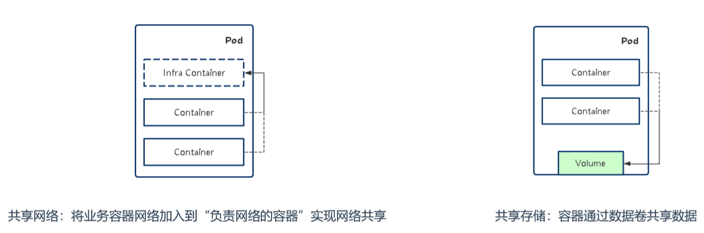
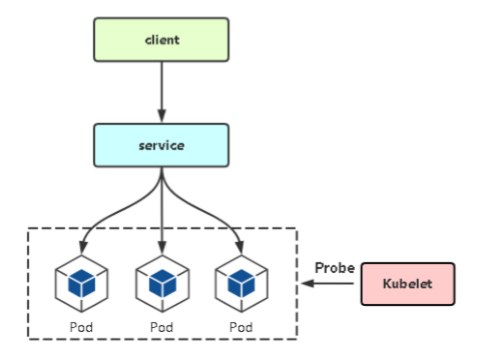
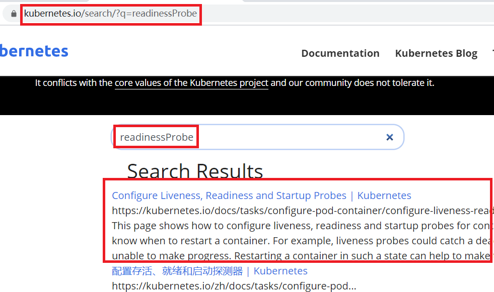

# 01.深入理解Pod对象：基本管理

## 1.1 Pod基本概念

- `Pod是Kubernetes创建和管理的最小单元`，`一个Pod由一个容器 或多个容器组成`，这些容器共享存储、网络。 
- Pod特点：
    - 一个Pod可以理解为是`一个应用实例`，提供服务 
    - Pod中容器始终部署在一个Node上
    - Pod中容器共享网络、存储资源 
    - `Kubernetes直接管理Pod`，而不是容器

## 1.2 Pod存在的意义

- Pod主要用法：
    - `运行单个容器：`最常见的用法，在这种情况下，可以==将Pod看做是单个容器的抽象封装==
    - `运行多个容器：`==封装多个紧密耦合且需要共享资源的应用程序==
- 如果有这些需求，你可以一个pod运行多个容器：
    - 两个应用之间发生文件交互
    - 两个应用需要通过127.0.0.1或者socket通信
    - 两个应用需要发生频繁的调用

## 1.3 Pod资源共享实现机制 

- 方法1：共享网络
    -  同一个pod中启动多个容器，那么就会使用同一套网络
    -  比如在同一个pod部署两个容器，nginx和busybox
    -  无论是在 在busybox的容器环境中，通过 curl http://127.0.0.1:80 可以访问到nginx页面
- 方法2：数据卷共享数据
    - 在同一pod中启动多个容器，多个容器挂载同一个数据卷
    - 挂载数据卷的这个文件夹在容器内部就可以用来共享数据

 </img>


## 1.4 Pod管理命令

### 1.4.1 导出创建pod的YAML

- 导出创建pod的YAML文件

```javascript
[root@k8s-master ~]#  kubectl get pods
[root@k8s-master ~]#  kubectl get pods web-674477549d-5d6zc -o yaml > pod.yaml
[root@k8s-master ~]#  cat pod.yaml     # 删除 pod.yaml中多余内容，只留下一些内容
 
apiVersion: v1
kind: Pod
metadata:
  labels:
    app: web
  name: web-674477549d-5d6zc
  namespace: default
spec:
  containers:
  - image: lizhenliang/java-demo
    imagePullPolicy: Always
    name: java-demo
```

### 1.4.2 共享网络：共享数据

- 部署busybox和nginx两个容器

- 修改创建pod的YAML文件，完成部署busybox和nginx两个容器

```yaml
[root@k8s-master ~]# vim pod-net-test.yaml

apiVersion: v1
kind: Pod
metadata:
  labels:
    app: test
  name: pod-net-test
  namespace: default
spec:
  containers:
  - image: busybox
    name: test
  - image: nginx
    name: web
```

```javascript
[root@k8s-master ~]# kubectl apply -f pod-net-test.yaml         # 部署pod
[root@k8s-master ~]# kubectl delete -f pod-net-test.yaml         # 删除刚刚部署的pod 
[root@k8s-master ~]# kubectl get pod -w                    # 查看当前pod状态
NAME        READY   STATUS    RESTARTS   AGE
pod-net-test   2/2    Running    0       29s
[root@k8s-master ~]# kubectl describe pod pod-net-test          # 查看pod详细日志信息
```

- 测试在busybox容器中可以通过http://127.0.0.1:80 访问nginx容器的页面

```javascript
[root@k8s-master ~]# kubectl exec -it pod-net-test -c test -- sh     # 进入busybox容器
/ # wget http://127.0.0.1:80                      # 在busybox容器中可以正常访问nginx的页面

[root@k8s-master ~]# kubectl exec -it pod-net-test -c web -- sh     # 进入nginx容器 
# echo 'nginx' > /usr/share/nginx/html/index.html        # 可以修改nginx网站页面，在busybox可以正常到修改后的内容
```

### 1.4.3 volume共享数据

- 修改创建pod的YAML文件，添加数据卷，完成部署busybox和nginx两个容器

```javascript
[root@k8s-master ~]# vim pod-volume-test.yaml 

apiVersion: v1
kind: Pod
metadata:
  labels:
    app: test
  name: pod-volume-test
  namespace: default
spec:
  containers:
  - image: busybox
    name: test
    command: ["/bin/sh","-c","sleep 360000"]
    volumeMounts:
    - name : log
      mountPath: /data
  - image: nginx
    name: web
    volumeMounts:
    - name : log
      mountPath: /data

  volumes:
  - name: log
    emptyDir: {}
```

- 部署pod

```javascript
[root@k8s-master ~]# kubectl apply -f pod-volume-test.yaml          # 部署pod
[root@k8s-master ~]# kubectl delete -f pod-volume-test.yaml          # 删除刚刚部署的pod 
[root@k8s-master ~]# kubectl get pod -w                       # 查看当前pod状态
NAME           READY   STATUS    RESTARTS   AGE
pod-volume-test   2/2     Running   0        8m59s
[root@k8s-master ~]# kubectl describe pod pod-volume-test          # 查看pod详细日志信息
```

- 测试pod通过volume来共享文件夹

````javascript
[root@k8s-master ~]# kubectl exec -it pod-volume-test -c test -- sh     # 进入busybox容器
/ # cd /data            # 在busybox容器中的/data文件夹和nginx容器文件夹共享，在其中一个容器修改，在另一个容器中可以看到

[root@k8s-master ~]# kubectl exec -it pod-volume-test -c web -- sh     # 进入nginx容器 
# cd /data             # 在busybox容器中的/data文件夹和nginx容器文件夹共享，在其中一个容器修改，在另一个容器中可以看到
````


## 1.5 重启策略+健康检查（应用自修复）

### 1.5.1 重启策略

- `Always`：当容器终止退出后，总是重启容器，默认策略。 

- OnFailure：当容器异常退出（退出状态码非0）时，才重启容器。 

- Never：当容器终止退出，从不重启容器。 

### 1.5.2 健康检查有以下两种类型

- livenessProbe（存活检查）：如果检查失败，将杀死容器，根据Pod 的restartPolicy来操作。 
- readinessProbe（就绪检查）：如果检查失败，Kubernetes会把 Pod从service endpoints中剔除。 
- startupProbe（启动检查）：

 </img>

### 1.5.3 支持以下三种检查方法

- httpGet：发送HTTP请求，返回200-400范围状态码为成功。 
- exec：执行Shell命令返回状态码是0为成功。 
- tcpSocket：发起TCP Socket建立成功。

### 1.5.4 重启策略+健康检查

- 在官网搜索 readlinessProbe 关键字，可以看到官方示例

- ```javascript
    https://kubernetes.io/zh/docs/tasks/configure-pod-container/configure-liveness-readiness-startup-probes/
    ```

-  </img>

```yaml
[root@k8s-master ~]# vim pod-check.yaml

apiVersion: v1
kind: Pod
metadata:
  labels:
    test: liveness
  name: pod-check
spec:
  containers:
  - name: liveness
    image: busybox
    args:
    - /bin/sh
    - -c
    - touch /tmp/healthy; sleep 30; rm -rf /tmp/healthy; sleep 600
    livenessProbe:
      exec:
        command:
        - cat
        - /tmp/healthy
      initialDelaySeconds: 5     # 容器启动多少秒后进行健康检查
      periodSeconds: 5         # 每个多少秒进行健康检查
```

- 部署后即可看到健康检查失败后会自动重启

```javascript
[root@k8s-master ~]# kubectl apply  -f pod-check.yaml
[root@k8s-master ~]# kubectl get pods
NAME       READY    STATUS    RESTARTS   AGE
pod-check    1/1     Running    0       34s
[root@k8s-master ~]# kubectl describe pod pod-check     # 可以看到健康检查发现异常，会自动重启
failed: cat: can't open '/tmp/healthy': No such file or directory
```


## 1.6 Pod注入环境变量

- 变量值几种定义方式：
    - 自定义变量值
    -  变量值从Pod属性获取
    - 变量值从Secret、ConfigMap获取

```yaml
apiVersion: v1
kind: Pod
metadata:
  name: pod-envars
spec:
  containers:
    - name: test
      image: busybox
      command: [ "sh", "-c", "sleep 36000"]
      env:
        - name: MY_NODE_NAME
          valueFrom:
            fieldRef:
              fieldPath: spec.nodeName
        - name: MY_POD_NAME
          valueFrom:
            fieldRef:
              fieldPath: metadata.name
        - name: MY_POD_NAMESPACE
          valueFrom:
            fieldRef:
              fieldPath: metadata.namespace
        - name: MY_POD_IP
          valueFrom:
            fieldRef: fieldPath: status.podIP
        - name: ABC
          value: 123456
```

## 1.7 Init Container

- Init Container：顾名思义，用于初始化工作，执行完就结束，可以理解为一次性任务。
    - 支持大部分应用容器配置，但不支持健康检查 
    - 优先应用容器执行

- 应用场景： 
    - 环境检查：例如确保应用容器依赖的服务启动后再启动应用容器 
    - 初始化配置：例如给应用容器准备配置文件

- 示例：部署一个web网站，网站程序没有打到镜像中，而是希望从代码 仓库中动态拉取放到应用容器中。

```yaml
apiVersion: v1
kind: Pod
metadata:
  name: init-demo
spec:
  initContainers:
  - name: download
    image: busybox
    command:
    - wget
    - "-O"
    - "/opt/index.html"
    - http://www.ctnrs.com
    volumeMounts:
    - name: wwwroot
      mountPath: "/opt"
containers:
- name: nginx
  image: nginx
  ports:
  - containerPort: 80
  volumeMounts:
  - name: wwwroot
    mountPath: /usr/share/nginx/html
volumes:
- name: wwwroot
  emptyDir: {}
```


- 因此，Pod中会有这几种类型的容器：
    - Infrastructure Container：基础容器
        - 维护整个Pod网络空间
    - InitContainers：初始化容器
        - 先于业务容器开始执行
    - Containers：业务容器
        - 并行启动