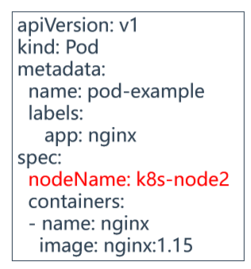

# 01.深入理解Pod对象调度

## 1.1 创建一个Pod的工作流程 

- Kubernetes基于list-watch机制的控制器架构，实现组件间交 互的解耦。

- 其他组件监控自己负责的资源，当这些资源发生变化时，kubeapiserver会通知这些组件，这个过程类似于发布与订阅

> 创建pod的整体流程

- 1.用户提交创建Pod的请求，可以通过API Server的REST API ，也可用Kubectl命令行工具，支持Json和Yaml两种格式；
- 2.API Server 处理用户请求，存储Pod数据到Etcd；
- 3.Schedule通过和 API Server的watch机制，查看到新的pod，尝试为Pod绑定Node；
- 4.过滤主机：调度器用一组规则过滤掉不符合要求的主机（比如Pod指定了所需要的资源，那么就要过滤掉资源不够的主机）；
- 5.主机打分：对第一步筛选出的符合要求的主机进行打分，在主机打分阶段，调度器会考虑一些整体优化策略
    - 比如：把一个Replication Controller的副本分布到不同的主机上，使用最低负载的主机等；
- 6.选择主机：选择打分最高的主机，进行binding操作，结果存储到Etcd中；
- 7.kubelet根据调度结果执行Pod创建操作：
    - 1）绑定成功后，会启动container, docker run
    - 2）scheduler会调用API Server的API在etcd中创建一个bound pod对象，描述在一个工作节点上绑定运行的所有pod信息。
    - 3）运行在每个工作节点上的kubelet也会定期与etcd同步bound pod信息
    - 4）一旦发现应该在该工作节点上运行的bound pod对象没有更新，则调用Docker API创建并启动pod内的容器。

 </img>


## 1.2 Pod中影响调度的主要属性

## 1.3 资源限制对Pod调度的影响

 </img>


## 1.4 nodeSelector & nodeAffinity

### 1.4.1 nodeSelector匹配节点标签 

nodeSelector：

用于将Pod调度到匹配Label的Node上，如果没有匹配的标签会调度失败。 

作用： 

- 约束Pod到特定的节点运行 
-  完全匹配节点标签 

应用场景：

-  专用节点：根据业务线将Node分组管理
-  配备特殊硬件：部分Node配有SSD硬盘、GPU

> 第一步：给k8s-node1中打标签 `disktype=ssd` 

```javascript
[root@k8s-node2 ~]# kubectl label node k8s-node1 disktype=ssd       # 将k8s-node1打一个标签为ssd
node/k8s-node1 labeled
[root@k8s-node2 ~]# kubectl get node --show-labels              # 可以查看到k8s-node1节点上就有了这个标签 
```

> 2.添加nodeSelector字段到Pod配置中

```yaml
[root@k8s-master ~]# vim pod-nodeselector.yaml 

apiVersion: v1
kind: Pod
metadata:
  name: pod-nodeselector
spec:
  nodeSelector:
    disktype: "ssd"
  containers:
  - name: web
    image: nginx
```

> 第三步：验证当前节点是否按照预期部署

- 部署,可以看到只会部署到k8s-node1节点，因为node1节点有  disktype: "ssd" 标记

```javascript
[root@k8s-master ~]# kubectl apply -f pod-nodeselector.yaml 
[root@k8s-master ~]# kubectl get pods -o wide
NAME            READY   STATUS  RESTARTS   AGE    IP        NODE    NOMINATED NODE   READINESS GATES
pod-nodeselector    1/1   Running    0     117s   10.244.36.74  k8s-node1   <none>         <none>
```

### 1.4.2 nodeAffinitty

nodeAffinity：节点亲和性，与nodeSelector作用一样，但相比更灵活，

满足更多条件，诸如：

- 匹配有更多的逻辑组合，不只是字符串的完全相等
- 调度分为软策略和硬策略，而不是硬性要求
- 硬（required）：必须满足
-  软（preferred）：尝试满足，但不保证
- 操作符：In、NotIn、Exists、DoesNotExist、Gt、Lt

 </img>

## 1.5 Taint（污点）

Taints：避免Pod调度到特定Node上

Tolerations：允许Pod调度到持有Taints的Node上

应用场景： 

- 专用节点：根据业务线将Node分组管理，希望在默认情况下不调度该节点，只有配置了污点容忍才允许分配 
- 配备特殊硬件：部分Node配有SSD硬盘、GPU，希望在默认情况下不调度该节点，只有配置了污点容忍才允许分配
- 基于Taint的驱逐

## 1.6 Tolerations（污点容忍）

 </img>

## 1.7 nodeName

- nodeName：指定节点名称，用于将Pod调度到指定的Node上，不经过调度器
-  </img>