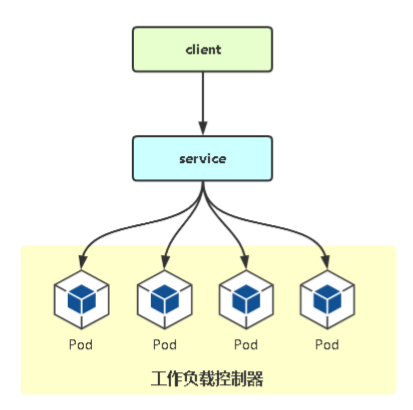

# 01.工作负载控制器是什么

工作负载控制器（Workload Controllers）是K8s的一个抽象概念，用于更高级层次对象，部署和管理Pod。 

常用工作负载控制器：

- Deployment ： 无状态应用部署 
- StatefulSet ： 有状态应用部署
- DaemonSet ： 确保所有Node运行同一个Pod
- Job ： 一次性任务
- Cronjob ： 定时任务

控制器的作用： 

- 管理Pod对象
- 使用标签与Pod关联
- 控制器实现了Pod的运维，例如滚动更新、伸缩、副本管理、维护Pod状态等。

 </img>


# 02.Deployment

## 2.1 Deployment功能介绍

本质：在升级时，杀掉旧的镜像，部署新镜像

- Deployment的功能：
    - 管理Pod和ReplicaSet 
    - 具有上线部署、副本6设定、滚动升级、回滚等功能
    - 提供声明式更新，例如只更新一个新的Image

- 应用场景：网站、API、微服务

- 项目生命周期

 </img>


## 2.2 部署nginx 1.15版本

```yaml
[root@k8s-master ~]# vim deployment.yaml

apiVersion: apps/v1
kind: Deployment
metadata:
  name: web
  namespace: default
spec:
  replicas: 3
  selector:
    matchLabels:
      app: nginx
  template:
    metadata:
      labels:
        app: nginx
    spec:
      containers:
      - name: web
        image: nginx:1.15
```


```javascript
[root@k8s-master ~]# kubectl delete -f .               # 一键卸载所有部署的服务（当前文件夹下所有部署文件）
[root@k8s-master ~]# kubectl apply -f deployment.yaml 
[root@k8s-master ~]# kubectl get pods -o wide            # 确定pod是否被正确部署
[root@k8s-master ~]# kubectl expose deployment web --port=80 --target-port=80 --type=NodePort
http://192.168.56.62:30610/
```

## 2.3 Deployment：滚动升级

```javascript
[root@k8s-master ~]# kubectl get ep
NAME           ENDPOINTS                                AGE
kubernetes     192.168.56.61:6443                            2d2h
nginx        10.244.169.129:80,10.244.169.130:80,10.244.36.66:80      2d
web          10.244.169.129:80,10.244.169.130:80,10.244.36.66:80     4m32s
```


### 2.3.1 修改.yaml文件升级

- 直接修改deployment.yaml文件中 image: nginx:1.15修改成image: nginx:1.18

### 1.3.2 kubectl set命令行升级

```javascript
[root@k8s-master ~]# kubectl set image deployment/web web=nginx:1.16
[root@k8s-master ~]# kubectl describe deployment web               # 确定是否已经升级为 nginx:1.16
```

## 2.4 Deployment：水平扩缩容

 </img>

## 2.5 Deployment：回滚

```javascript
'''1.查看当前pod升级历史记录 '''
[root@k8s-master ~]# kubectl rollout history deployment web
deployment.apps/web 
REVISION  CHANGE-CAUSE
1         <none>
2         <none>
[root@k8s-master ~]#  kubectl rollout undo deployment/web               # 回滚上一个版本 
[root@k8s-master ~]#  kubectl rollout undo deployment/web --to-revision=2     # 回滚历史指定版
'''2.可以看到pod回滚到了 nginx:1.5版本'''
[root@k8s-master ~]# kubectl describe deployment web
```

## 2.6 下线

```javascript
[root@k8s-master ~]#  kubectl delete deploy/web
[root@k8s-master ~]#  kubectl delete svc/web
```


# 03.DaemonSet

- 在每一个Node上运行一个Pod
- 新加入的Node也同样会自动运行一个Pod
- 应用场景：网络插件（kube-proxy、calico）、其他Agent


# 04.Job


 </img>

# 05.CronJob

 </img>