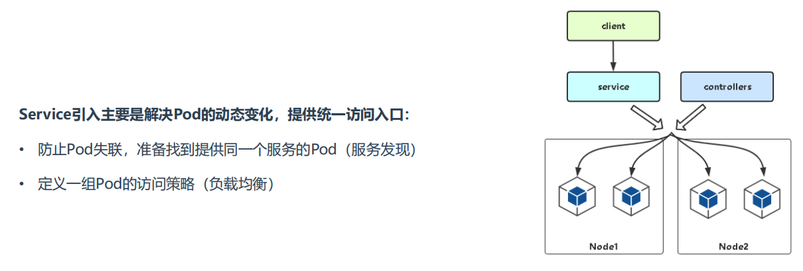
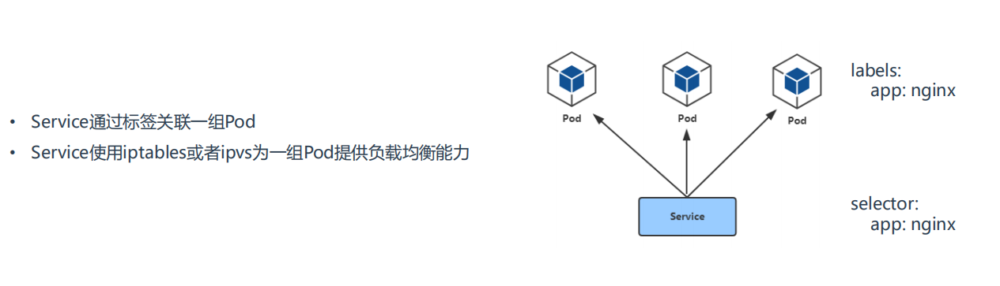
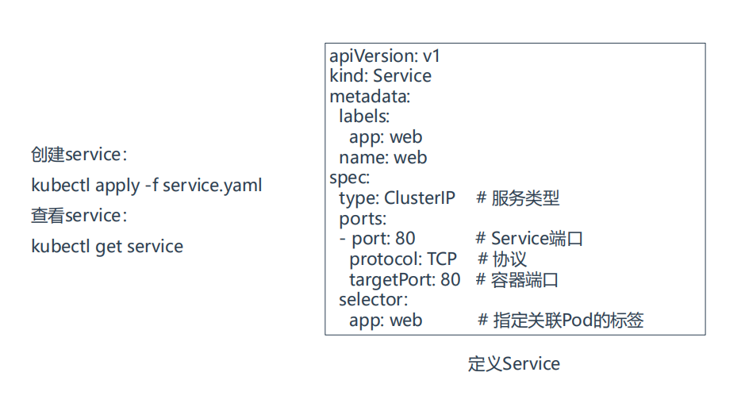
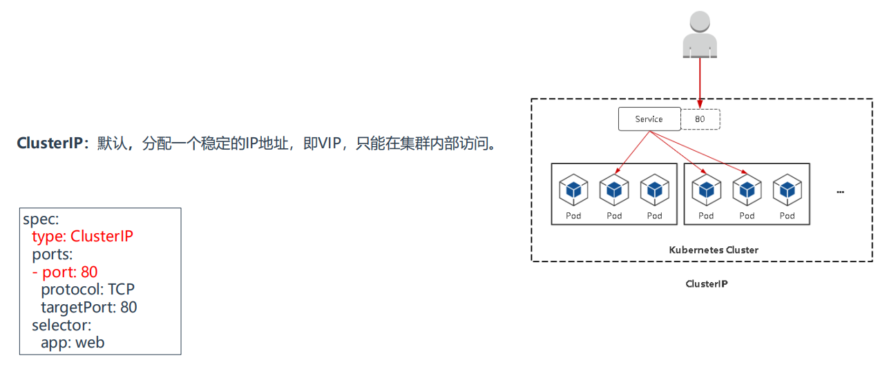
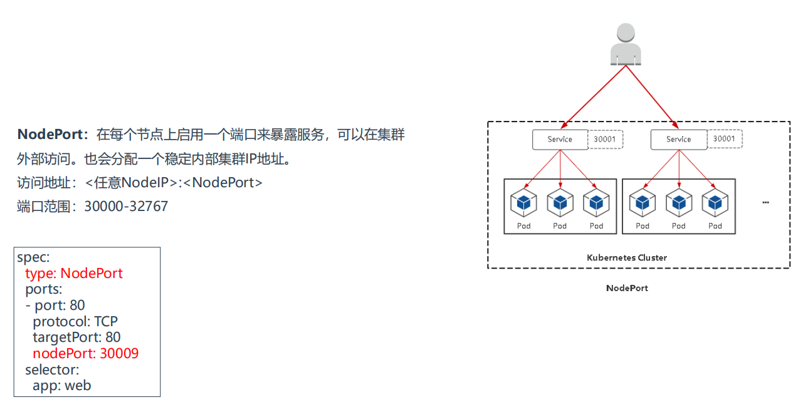
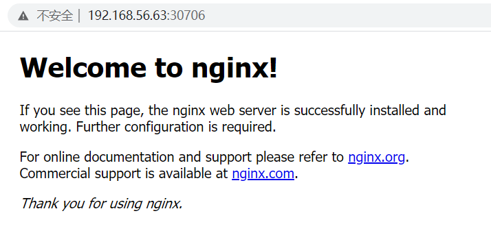
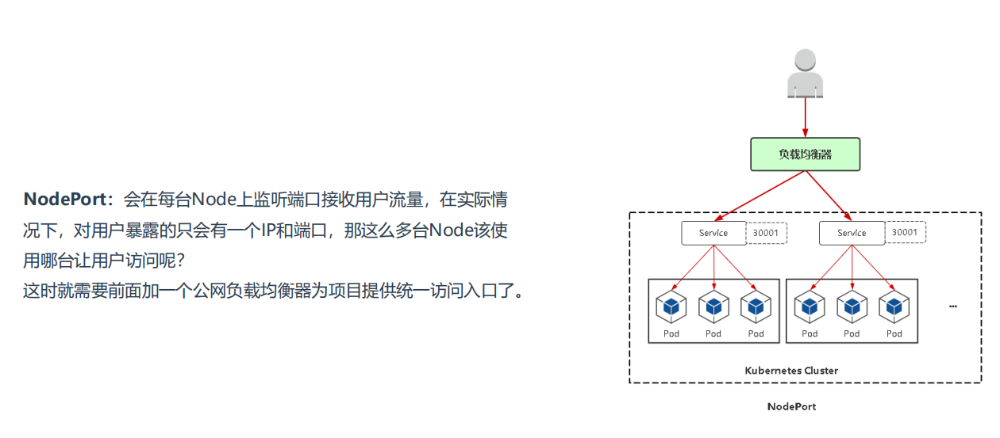
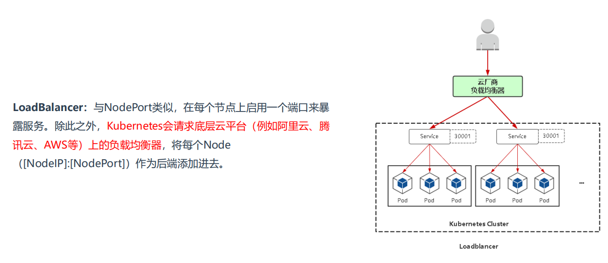

# 01.Service基本概念

## 1.1 Service是什么？

- 背景：每个Pod具有IP地址，当使用Deployment控制器时，Pod的IP地址往往动态变化。
- 解决方法：通过Service可以获得稳定的IP地址，且在Service的生命周期有效，与Pod的IP地址变化与否无关。
- 实质：Service本质就是一个LB负载均衡器

## 1.2 Service存在的意义

 </img>

## 1.3 Pod与Service的关系

 </img>

# 02.Service定义和创建

 </img>

## 2.1 先使用yaml文件部署三个nginx

```javascript
[root@k8s-master ~]# vim deployment.yaml

apiVersion: apps/v1
kind: Deployment
metadata:
  name: nginx-deployment
  labels:
    app: nginx
spec:
  replicas: 3
  selector:
    matchLabels:
      app: nginx
  template:
    metadata:
      labels:
        app: nginx
    spec:
      containers:
      - name: nginx
        image: nginx:1.14.2
        ports:
        - containerPort: 80
```

- 可以查看刚刚部署nginx服务标签：nginx

```javascript
[root@k8s-master ~]# kubectl get pods --show-labels
NAME                       READY   STATUS    RESTARTS     AGE   LABELS
nginx-6799fc88d8-s5rnz           1/1    Running   0          24d   app=nginx,pod-template-hash=6799fc88d8
nginx-deployment-66b6c48dd5-hxv7h   1/1     Running   0          70s   app=nginx,pod-template-hash=66b6c48dd5
nginx-deployment-66b6c48dd5-jjkk4   1/1     Running   0          70s   app=nginx,pod-template-hash=66b6c48dd5
nginx-deployment-66b6c48dd5-tsgvb   1/1     Running   0          70s   app=nginx,pod-template-hash=66b6c48dd5
```

- 查看当前机器部署了那些服务

```javascript
[root@k8s-master ~]# kubectl get svc
NAME         TYPE      CLUSTER-IP    EXTERNAL-IP    PORT(S)        AGE
kubernetes   ClusterIP     10.96.0.1     <none>        443/TCP        24d
nginx        NodePort    10.108.41.4   <none>        80:31434/TCP    24d
```

## 2.2 Service定义与创建

```javascript
[root@k8s-node2 ~]# vim service.yaml
apiVersion: v1
kind: Service
metadata:
  name: web
  namespace: default
spec:
  ports:
  - port: 80        # Service端口
    protocol: TCP    # 协议
    targetPort: 80   # 容器端口（程序启动端口，比如django默认是8000端口）
  selector: 
    app: nginx      # 指定关联Pod的标签（上面已经查到了，app=nginx）
  type: ClusterIP      # 服务类型
```

- 创建service

```javascript
[root@k8s-master ~]# kubectl apply -f service.yaml 
```

## 2.3 通过Service访问nginx集群

```javascript
[root@k8s-master ~]# kubectl get svc
NAME         TYPE        CLUSTER-IP     EXTERNAL-IP   PORT(S)        AGE
kubernetes    ClusterIP    10.96.0.1       <none>      443/TCP        24d
nginx        NodePort    10.108.41.4      <none>      80:31434/TCP    24d
web         ClusterIP    10.105.53.183     <none>       80/TCP       2m40s
[root@k8s-master ~]# curl 10.105.53.183        # 可以通过web的地址访问后面三个nginx集群

[root@k8s-master ~]# kubectl delete svc web2     # 可以删除其中一个
```

# 03.Service三种常用类型

- **`ClusterIP`：集群内部使用**

- **`NodePort`：对外暴露应用（集群外）**

- **`LoadBalancer`：对外暴露应用，适用公有云**

## 3.1 ClusterIP（VIP）

 </img>

## 3.2 NodePort

 </img>

### 3.2.1 先使用yaml文件部署三个nginx

```javascript
[root@k8s-master ~]# vim deployment.yaml

apiVersion: apps/v1
kind: Deployment
metadata:
  name: nginx-deployment
  labels:
    app: nginx
spec:
  replicas: 3
  selector:
    matchLabels:
      app: nginx
  template:
    metadata:
      labels:
        app: nginx
    spec:
      containers:
      - name: nginx
        image: nginx:1.14.2
        ports:
        - containerPort: 80
```

- 可以查看刚刚部署nginx服务标签：nginx

```javascript
[root@k8s-master ~]# kubectl get pods --show-labels
NAME                       READY   STATUS    RESTARTS     AGE   LABELS
nginx-6799fc88d8-s5rnz           1/1    Running   0          24d   app=nginx,pod-template-hash=6799fc88d8
nginx-deployment-66b6c48dd5-hxv7h   1/1     Running   0          70s   app=nginx,pod-template-hash=66b6c48dd5
nginx-deployment-66b6c48dd5-jjkk4   1/1     Running   0          70s   app=nginx,pod-template-hash=66b6c48dd5
nginx-deployment-66b6c48dd5-tsgvb   1/1     Running   0          70s   app=nginx,pod-template-hash=66b6c48dd5
```

### 3.2.2 使用NodePort创建Service

```javascript
[root@k8s-node2 ~]# vim service-nodeport.yaml
apiVersion: v1
kind: Service
metadata:
  name: web-nodeport
  namespace: default
spec:
  ports:
  - port: 80        # Service端口
    protocol: TCP    # 协议
    targetPort: 80    # 容器端口（程序启动端口，比如django默认是8000端口）
    nodePort: 30706   # 指定NodePort监听的外网端口
  selector: 
    app: nginx      # 指定关联Pod的标签（上面已经查到了，app=nginx）
  type: NodePort      # 服务类型(只需要把服务类型修改成NodePort即可)
```

- 创建Service

```javascript
[root@k8s-master ~]# kubectl apply -f service-nodeport.yaml 

```

### 3.2.3 访问

- 访问地址：<任意NodeIP>:NodePort

- 端口范围：30000-32767

 </img>

### 3.2.4 NodePort存在弊端

 </img>

## 3.3 LoadBalancer

### 3.3.1 LB说明

- 负责均衡器有哪些：nginx、LVS、haproxy

- 私有云：SLB

 </img>

### 3.3.2 配置LB

- 直接找一个nginx配置反向代理即可

```javascript
stream {
    log_format  main  '$remote_addr $upstream_addr - [$time_local] $status $upstream_bytes_sent';
    access_log  /var/log/nginx/django-access.log  main;
    upstream django-apiserver {
                server 192.168.56.62:30706;
                server 192.168.56.63:30706;
            }
   
    server {
       listen 88;
       proxy_pass django-apiserver;
    }
}
```


