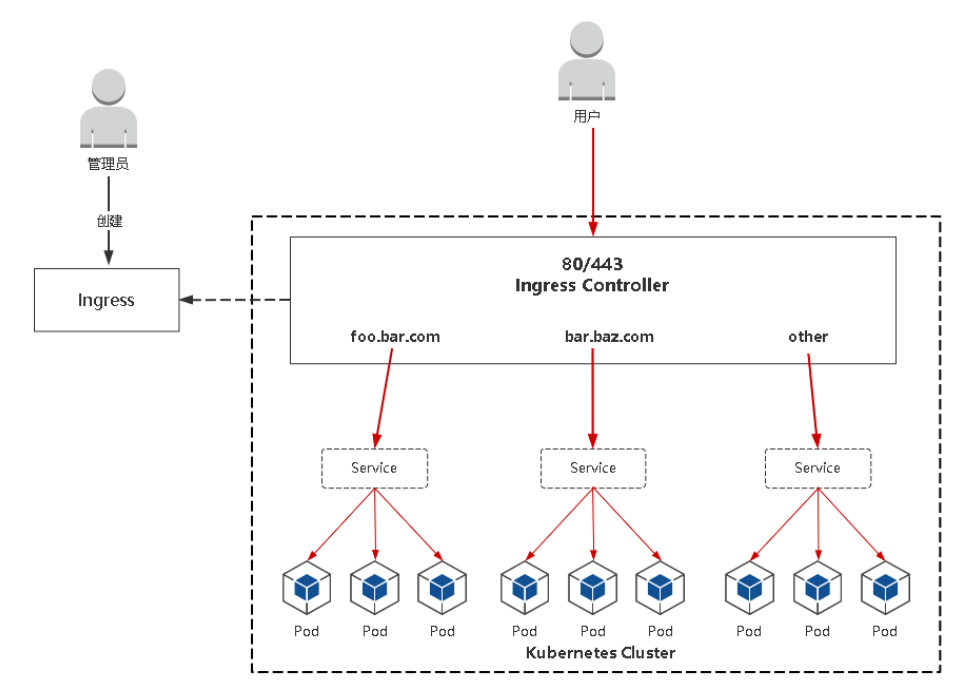
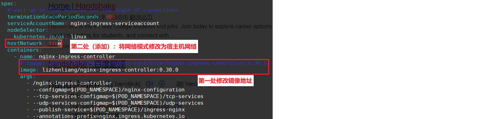
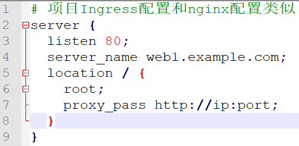
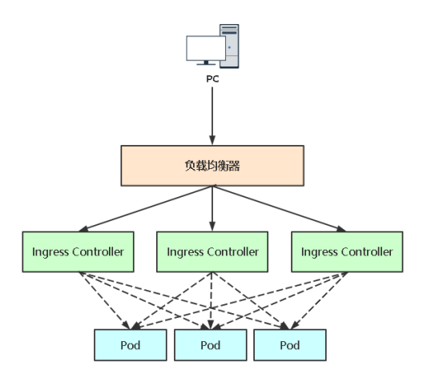

# 01.Ingress是什么

## 1.1 NodePort存在不足

`NodePort对外暴露端口存在的不足`：

- 一个端口只能一个服务使用，端口需提前规划

- 只支持4层负载均衡

## 1.2 Ingress(最佳对外暴露端口方案)

- **`Ingress：`**
  - Ingress是K8s中的一个抽象资源，给管理员提供一个暴露应用的入口定义方法
  - Ingress公开了从集群外部到集群内服务的HTTP和HTTPS路由的规则集合
- **`Ingress Controller`：**
  - Ingress Controller根据Ingress生成具体的路由规则，并对Pod负载均衡器
  - Ingress Controller实质作用就是`根据域名进行转发`

 </img>

## 1.3 Ingress Contronler怎么工作的？

- Ingress Contronler通过与 Kubernetes API 交互，动态的去感知集群中 Ingress 规则变化，然后读取它

- 按照自定义的规则，规则就是写明了哪个域名对应哪个service，生成一段 Nginx 配置，应用到管理的Nginx服务，然后热加载生效。

- 以此来达到Nginx负载均衡器配置及动态更新的问题。

- **流程包流程：客户端 ->Ingress Controller（nginx） -> 分布在各节点Pod**

# 02.安装Ingress Controller（k8s-master安装）

- 这里使用 ingress-nginx 作为控制器
  - 除了ingress-nginx还有很多控制器：[HAProxy Ingress](https://haproxy-ingress.github.io/)等
  - 其他控制器：https://kubernetes.io/docs/concepts/services-networking/ingress-controllers/
- **部署文件注意事项：（修改两个地方）**
  - （第一处）镜像地址修改成国内的：lizhenliang/nginx-ingress-controller:0.30.0 
  - （第二处）将Ingress Controller暴露，一般使用宿主机网络（hostNetwork: true）或者使用NodePort
  -  </img>

```javascript
[root@k8s-master ~]# wget https://raw.githubusercontent.com/kubernetes/ingress-nginx/nginx-0.30.0/deploy/static/mandatory.yaml
[root@k8s-master ~]# cp mandatory.yaml ingress-controller.yaml   # 重命名方便理解文件

[root@k8s-master ~]# vi mandatory.yaml ingress-controller.yaml   # 修改下面这两个地方
hostNetwork: true                # 第一处，在containers同级上添加"hostNetwork: true"
containers:
  - name: nginx-ingress-controller
    # image: quay.io/kubernetes-ingress-controller/nginx-ingress-controller:0.30.0
    image: lizhenliang/nginx-ingress-controller:0.30.0   # 第二处，注释原有国外镜像，修改成国内的个人镜像  
```

- `部署Ingress Controller` : 部署完成可以看到宿主机监听了 80和 443端口

```javascript
[root@k8s-master ~]# kubectl apply -f ingress-controller.yaml  
[root@k8s-master ~]# kubectl get pods,svc -n ingress-nginx -o wide
NAME                              READY   STATUS    RESTARTS   AGE   IP      NODE    NOMINATED NODE   READINESS GATES
pod/nginx-ingress-controller-5dc64b58f-fljtd   1/1    Running   0    14m   192.168.56.62   k8s-node1   <none>      <none>
```

# 03.使用Ingress部署应用

## 3.1 部署Service

 </img>

```javascript
[root@k8s-master ~]#  vim app.yaml
apiVersion: apps/v1
kind: Deployment
metadata:
  name: web1
  namespace: default
spec:
  replicas: 3
  selector:
    matchLabels:
      app: web1
  template:
    metadata:
      labels:
        app: web1
    spec:
      containers:
      - name: web
        image: nginx:1.18
---
apiVersion: v1
kind: Service
metadata:
  name: web1
  namespace: default
spec:
  ports:
  - port: 80        # Service端口
    protocol: TCP    # 协议
    targetPort: 80   # 容器端口（程序启动端口，比如django默认是8000端口）
  selector: 
    app: nginx      # 指定关联Pod的标签（上面已经查到了，app=nginx）
  type: ClusterIP      # 服务类型

[root@k8s-master ~]# kubectl apply -f app.yaml 
[root@k8s-master ~]# kubectl get pods,svc
```

## 3.2 使用Ingress部署应用

```javascript
[root@k8s-master ~]# vim ingress-web1.yaml

apiVersion: networking.k8s.io/v1
kind: Ingress
metadata:
  name: web1
spec:
  rules:
  - host: web1.example.com
    http:
      paths:
      - path: /
        pathType: Prefix
        backend:
          service:
            name: web1
            port:
              number: 80
 
[root@k8s-master ~]# kubectl apply -f ingress-web1.yaml
[root@k8s-master ~]# kubectl get ingress            # 查看创建的资源
Warning: extensions/v1beta1 Ingress is deprecated in v1.14+, unavailable in v1.22+; use networking.k8s.io/v1 Ingress
NAME   CLASS    HOSTS              ADDRESS   PORTS   AGE
web1   <none>   web1.example.com             80      2m
```

## 3.3 配置域名记录

- 修改 C:\Windows\System32\drivers\etc\hosts 记录
- 添加： 192.168.56.62  web1.example.com 
- 因为刚刚创建的 Ingress被部署到了 192.168.56.62  机器中，所以这里使用域名解析也必须是他

```javascript
[root@k8s-master ~]# kubectl get pods,svc -n ingress-nginx -o wide
NAME                              READY   STATUS    RESTARTS   AGE   IP      NODE    NOMINATED NODE   READINESS GATES
pod/nginx-ingress-controller-5dc64b58f-fljtd   1/1    Running   0    14m   192.168.56.62   k8s-node1   <none>      <none>
```

# 04.Ingress Controller高可用方案

- 上面部署方案很明显，Ingress Controller只部署到了其中一台节点上，这样是单点故障

## 4.1 DaemonSet重新部署Ingress Controller

```javascript
[root@k8s-master ~]# kubectl delete deploy nginx-ingress-controller -n ingress-nginx   # 删除ingress-nginx服务
[root@k8s-master ~]# vim ingress-controller.yaml    # 修改配置
# 1) 将 kind: Deployment 修改成 ==》 kind: DaemonSet
# 2）删除 replicas: 1 这行配置
[root@k8s-master ~]# kubectl apply -f ingress-controller.yaml  
```

- 可以看到 k8s集群中所有节点都部署了 ingress-controller（所有节点这样就都可以访问服务了）

```javascript
[root@k8s-master ~]# kubectl get pods,svc -n ingress-nginx -o wide
NAME                       READY   STATUS    RESTARTS   AGE   IP              NODE    NOMINATED NODE   READINESS GATES
pod/nginx-ingress-controller-f9wvw   1/1     Running   0          56m   192.168.56.62   k8s-node1   <none>           <none>
pod/nginx-ingress-controller-wpf6w   1/1     Running   0          56m   192.168.56.63   k8s-node2   <none>           <none>
```

## 4.2 企业中部署Ingress方案

- 上面DaemonSet在所有k8s节点都部署了 Ingress Controller，但是真实环境肯k8s集群太大，容易浪费资源
- 所以，一般Ingress Controller会以==DaemonSet+nodeSelector==`部署到几台特定的node节点中`

- 然后将这几台挂载到公网负载均衡器对外提供服务

 </img>