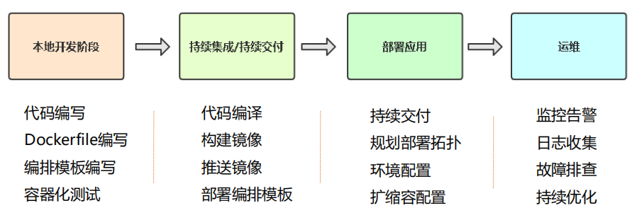

# 01.在k8s平台部署项目流程

## 1.1 容器交付流程

 </img>

## 1.2 在K8s平台部署项目流程

 </img>


## 1.3 项目熟悉

- 1、项目代码构成（有哪些文件）
  - 配置文件在哪里（mysql地址、redis地址）
- 2、依赖服务（MySQL、Redis、rabbitMQ）
- 3、项目提供服务端口
- 4、文件持久化（比如上传文件）

# 02.安装Harbor

## 2.1 安装Docker

```javascript
[root@k8s-master ~]#  yum -y install wget
[root@k8s-master ~]#  wget https://mirrors.aliyun.com/docker-ce/linux/centos/docker-ce.repo -O /etc/yum.repos.d/docker-ce.repo
[root@k8s-master ~]#  yum -y install docker-ce
[root@k8s-master ~]#  systemctl enable docker && systemctl start docker
```

- 配置镜像下载加速器：

```javascript
[root@k8s-master ~]#  cat > /etc/docker/daemon.json << EOF
{
  "registry-mirrors": ["https://b9pmyelo.mirror.aliyuncs.com"]
}
EOF
[root@k8s-master ~]#  systemctl restart docker
[root@k8s-master ~]#  docker info
```

## 2.2 安装docker compose

```javascript
# 安装docker compose
curl -L https://github.com/docker/compose/releases/download/1.24.1/docker-compose-`uname -s`-`uname -m` -o /usr/local/bin/docker-compose
chmod +x /usr/local/bin/docker-compose
docker-compose --version  # 测试docker-compose是否安装好
```

- 开启Linux系统的IP转发功能

```javascript
'''开启Linux系统的IP转发功能 '''
# 1. 出于安全考虑，Linux系统默认是禁止数据包转发的
# 2. 所谓转发即当主机拥有多于一块的网卡时，将收到的数据包转发给其他网卡
[root@linux-node4 ~]# vim /etc/sysctl.conf 
net.ipv4.ip_forward=1
[root@linux-node4 ~]# systemctl restart network
[root@linux-node4 ~]# sysctl net.ipv4.ip_forward   # 输出为1时则证明是成功的
```

## 2.3 安装Harbor

```javascript
'''安装Harbor镜像仓库'''
# 1、下载离线安装包
https://github.com/goharbor/harbor/releases

# 2、解压并配置访问地址'''
[root@k8s-node1 ~]# tar zxvf harbor-offline-installer-v1.1.1.tgz 
[root@k8s-node1 harbor]# cd harbor
[root@k8s-node1 harbor]# vi harbor.yml
'''
hostname = 192.168.56.66
harbor_admin_password = Harbor12345
'''

# 3、准备配置
[root@k8s-node1 harbor]# ./prepare

# 4、导入镜像并启动
[root@k8s-node1 harbor]# ./install.sh

# 5、查看容器状态
[root@k8s-node1 harbor]# docker-compose ps

安装完成后可以登录Harbor：http://192.168.56.66
用户名：admin
密码：Harbor12345
```

- 新建一个项目

 </img>


# 03.Java应用部署

## 3.1 拉取代码编译

- 1、拉取代码编译，构建一个可以部署的包

```javascript
[root@k8s-master ~]# yum install java-1.8.0-openjdk maven git -y
[root@k8s-master ~]# git clone https://github.com/lizhenliang/tomcat-java-demo
# 需要切换到 tomcat-java-demo 文件夹
[root@k8s-master ~]# mvn clean package -Dmaven.test.skip=true               # 代码编译构建（生成可部署包 target/xxx.war）
[root@k8s-master ~]# unzip target/*.war -d target/ROOT                     # 解压构建文件
```

## 3.2 制作镜像推送到镜像仓库

- `1）制作镜像`
  - 1、基础镜像：centos、ubuntu
  - 2、环境镜像：jdk、nginx
  - 3、项目镜像：dashboard（自己写的项目打包成镜像）

```javascript
[root@k8s-master ~]# cd tomcat-java-demo/     # 在项目根路径中添加一个Dockerfile用来构建项目镜像
[root@k8s-master ~]# vim Dockerfile
FROM tomcat 
LABEL maintainer zhangsan
RUN rm -rf /usr/local/tomcat/webapps/*
ADD target/ROOT /usr/local/tomcat/webapps/ROOT
```

- `2）构建镜像`

```javascript
[root@k8s-master ~]# docker build -t java-demo .             # 构建镜像
[root@k8s-master ~]# docker run -d -p 8888:8080 java-demo       # 先使用镜像简单测试
http://192.168.56.61:8888        # 测试页面中访问
```

- `3）登录harber仓库`配置可信任（如果仓库是HTTPS访问不用配置）
  - ==因为我们这里的harbor没有配置https，所以，所有docker都要添加对harbor的信任==

```javascript
[root@k8s-master ~]# vi /etc/docker/daemon.json
{
  "registry-mirrors": ["https://b9pmyelo.mirror.aliyuncs.com"],
  "insecure-registries": ["192.168.56.66"]
}
[root@k8s-master ~]# docker login 192.168.56.66
# 用户名： admin
# 密  码： Harbor12345
```

- 4）把镜像推送到镜像仓库

```javascript
[root@k8s-master ~]#  docker tag java-demo 192.168.56.66/demo/java-demo:v1      # 给刚刚的java-demo镜像打一个标签
[root@k8s-master ~]#  docker push  192.168.56.66/demo/java-demo:v1           # 推送到镜像仓库
[root@k8s-master tomcat-java-demo]# docker run -d -p 8889:8080 java-demo2 192.168.56.66/demo/java-demo:v1    # 测试部署
http://192.168.56.61:8889/    # 测试访问
```

## 3.3 使用控制器部署

### 3.3.1 添加k8s集群的harbor认证

- 在k8s-master中添加 harbor认证的用户名密码

```javascript
# 将镜像仓库认证凭据保存在K8s Secret中,k8s中会保存harbor的用户名和密码，k8s在yaml指定这个secret凭据即可
kubectl create secret docker-registry registry-auth --docker-username=admin --docker-password=Harbor12345 --docker-server=192.168.56.66
# 下面在deployment.yaml中使用这个认证凭据
imagePullSecrets:
- name: registry-auth
```

- 在所有k8s的node节点中添加harbor信任

```javascript
[root@k8s-master ~]# vi /etc/docker/daemon.json
{
  "registry-mirrors": ["https://b9pmyelo.mirror.aliyuncs.com"],
  "insecure-registries": ["192.168.56.66"]
}
[root@k8s-master ~]# systemctl restart docker
```

### 3.3.2 deplyment部署java-demo

- 在官网搜索deployment：https://kubernetes.io/docs/home/
- 1）`在官网找到deployment配置案例`（搜索：deployment）

 </img>

- 2）`在官网找到 资源限额 配置案例`（搜索：redinessProbe）

```javascript
[root@k8s-master ~]# vim deployment.yaml

apiVersion: apps/v1          # 版本
kind: Deployment            # 资源类型
metadata:                 # 元数据
  name: java-demo           # 名字修改成合适的（要修改）
  labels:                # 标签是标记deployment对象的，用不到，这里随便改一下即可
    app: java-demo
spec:
  replicas: 3              # 指定副本数（根据项目需要指定运行数量）
  selector:               #### 标签选择器非常重要，控制器关联pod时使用的选择器（至少配置项目两个标签）
    matchLabels:
      project: www          # 第一个，project是声明你的项目的，这里随便取了一个标签（www）
      app: java-demo           # 第二个，具体的应用名称，这里就取 java-demo
  template:
    metadata:
      labels:            #### 这里是pod的标签 ，必须要和上面保持一一对应(deployment会根据这两个标签来选择合适的pod)
        project: www
        app: java-demo
    spec:                #### 这里指的容器相关的配置，部署那个镜像
      imagePullSecrets:                       ### 这里添加harbor拉取镜像的认证配置
      - name: registry-auth                    ### registry-auth 就是上面创建凭据的名称（使用上面的harbor用户名密码拉取）
      containers:
      - name: web                            # 把这个容器的名字取名为 web
        image: 192.168.56.66/demo/java-demo:v1       # 这里写镜像仓库的地址
        ports:
        - containerPort: 8080                   # 项目运行的端口默认是 8080
        # 1）配置资源限额（官方搜索：resources）
        resources:                           # 配置资源限额
          requests:
            cpu: 0.5
            memory: 500Mi
          limits:
            cpu: 1
            memory: 1Gi
        # 2）存活健康检查（官方搜索：livenessProbe）
        livenessProbe:
          httpGet:
            path: /                     # 检查路径是项目 根路径
            port: 8080                   # 这里是Tomcat，所以端口是 8080端口
          initialDelaySeconds: 50            # 容器启动后50秒后进行第一处健康检查
          periodSeconds: 10                # 再隔10秒进行第二次健康检查
        # 3）就绪健康检查（官方搜索：readinessProbe）
        readinessProbe:
          httpGet:
            path: /
            port: 8080
          initialDelaySeconds: 50            # 容器启动后50秒后进行第一处健康检查
        # 4）mountPath配置挂载配置文件到容器中的目录
        # 默认项目的配置文件就在：/usr/local/tomcat/webapps/ROOT/WEB-INF/classes/application.yml 路径下
        volumeMounts:
        - name: config
          mountPath: "/usr/local/tomcat/webapps/ROOT/WEB-INF/classes/application.yml"
          subPath: application.yml              # 使用subPath，解决挂载文件后覆盖文件夹其他文件问题
      # 5）配置configmap（使用卷挂载到容器指定路径下）
      volumes:
      - name: config
        configMap:
          name: java-demo-config         # 引用 刚刚 configmap中创建的名称
          items:
          - key: "application.yml"        # 这个key是创建configmap时指定的key
            path: "application.yml"       # 挂载到容器中显示的文件名
 
 
[root@k8s-master ~]# kubectl apply -f deployment.yaml                 # 部署 deployment（现部署configMap ）
[root@k8s-master ~]# kubectl delete -f deployment.yaml                 # 卸载 deployment
[root@k8s-master ~]# kubectl get pods                             # 查看节点状态
[root@k8s-master ~]# kubectl describe pod java-demo-7b8bbcd587-6nmml        # 查找具体pod报错日志

```

- 检查挂载是否成功

```javascript
# 确定配置文件是否成功挂载
[root@k8s-master ~]# kubectl get pods
[root@k8s-master ~]# kubectl exec -it java-demo-5dbfd444f9-86d66 -- bash
[root@k8s-master ~]# cd /usr/local/tomcat/webapps/ROOT/WEB-INF/classes/
```


- configMap配置：保存项目配置文件

```javascript
[root@k8s-master ~]#  vim configmap.yaml
apiVersion: v1            # 版本
kind: ConfigMap            # 资源类型
metadata:                # 源数据
  name: java-demo-config      # 名字
data:
    # 指定一个key,上面要引用这个key
    application.yml: |
        server:
          port: 8080
        spring:
          datasource:
            url: jdbc:mysql://localhost:3306/test?characterEncoding=utf-8
            username: root
            password: 123456789
            driver-class-name: com.mysql.jdbc.Driver
          freemarker:
            allow-request-override: false
            cache: true
            check-template-location: true
            charset: UTF-8
            content-type: text/html; charset=utf-8
            expose-request-attributes: false
            expose-session-attributes: false
            expose-spring-macro-helpers: false
            suffix: .ftl
            template-loader-path:
              - classpath:/templates/
[root@k8s-master ~]# kubectl apply -f configmap.yaml   # 创建configmap
```

## 3.4 创建Service关联到对应pod

```yaml
[root@k8s-master ~]# vim service.yaml

apiVersion: v1
kind: Service
metadata:
  name: java-demo 
spec:
  selector:       # 这里的标签选择器一定要和deployment中配置的一致
    project: www
    app: java-demo
  ports:
    - protocol: TCP
      port: 80
      targetPort: 8080
[root@k8s-master ~]# kubectl apply -f service.yaml 
[root@k8s-master ~]# kubectl get ep                    # 可以看到已经关联到了对应的pod
NAME            ENDPOINTS                                      AGE
java-demo       10.244.169.155:8080,10.244.169.156:8080,10.244.36.88:8080      24s
```

## 3.5 创建Ingress暴露端口

```yaml
[root@k8s-master ~]# vim ingress.yaml
apiVersion: networking.k8s.io/v1
kind: Ingress
metadata:
  name: java-demo
spec:
  rules:
  - host: java.example.com
    http:
      paths:
      - path: /
        pathType: Prefix
        backend:
          service:
            name: java-demo
            port:
              number: 80
```

- 部署ingress

```javascript
[root@k8s-master ~]# kubectl apply -f ingress.yaml        # 部署
[root@k8s-master ~]# kubectl get ingress
NAME        CLASS    HOSTS              ADDRESS   PORTS   AGE
java-demo   <none>   java.example.com             80      30s
[root@k8s-master ~]# kubectl get pods,svc -n ingress-nginx -o wide     # 查看哪些pod节点添加了Ingress
NAME                                 READY   STATUS    RESTARTS   AGE   IP    NODE   NOMINATED NODE   READINESS GATES
pod/nginx-ingress-controller-f9wvw   1/1     Running   1          22h   192.168.56.62   k8s-node1   <none>         <none>
pod/nginx-ingress-controller-wpf6w   1/1     Running   1          22h   192.168.56.63   k8s-node2   <none>         <none>
```

- 添加域名解析（两个节点都可以）

  -  修改 C:\Windows\System32\drivers\etc\hosts 记录
  -  添加： 192.168.56.62  java.example.com
  -  因为刚刚创建的 Ingress被部署到了 192.168.56.62  机器中，所以这里使用域名解析也必须是他

## 3.6 k8s部署一个mysql数据库(不用部署)

- 数据库还是推荐传统方式部署
- 因为数据库消耗io，如果部署外k8s中，会增加物理机的io开销
- 另外就是安全性也是问题

```javascript
[root@k8s-master ~]# vim mysql.yaml
apiVersion: v1
kind: Secret
metadata:
  name: java-demo-db
  namespace: default
type: Opaque
data:
  mysql-root-password: "MTIzNDU2"    # 这里是base64保存的mysql密码，实际是123456
  mysql-password: "MTIzNDU2"
---
apiVersion: apps/v1
kind: Deployment
metadata:
  name: java-demo-db
  namespace: default
spec:
  selector:
    matchLabels:
      project: www
      app: mysql
  template:
    metadata:
      labels:
        project: www
        app: mysql
    spec:
      containers:
      - name: db
        image: mysql:5.7.30
        resources:        # 1）配置资源限额
          requests:
            cpu: 500m
            memory: 512Mi
          limits:
            cpu: 500m
            memory: 512Mi
        env:               # 2）配置环境变量
        - name: MYSQL_ROOT_PASSWORD
          valueFrom:
            secretKeyRef:
              name: java-demo-db
              key: mysql-root-password
        - name: MYSQL_PASSWORD
          valueFrom:
            secretKeyRef:
              name: java-demo-db
              key: mysql-password
        - name: MYSQL_USER
          value: "aliang"        # 创建一个普通用户 aliang
        - name: MYSQL_DATABASE      # 创建一个数据库名字为 k8s
          value: "k8s"
        ports:
        - name: mysql
          containerPort: 3306      # 监听端口
        livenessProbe:            # 健康检查，使用 ping命令
          exec:
            command:
            - sh
            - -c
            - "mysqladmin ping -u root -p${MYSQL_ROOT_PASSWORD}"
          initialDelaySeconds: 30
          periodSeconds: 10
        readinessProbe:
          exec:
            command:
            - sh
            - -c
            - "mysqladmin ping -u root -p${MYSQL_ROOT_PASSWORD}"
          initialDelaySeconds: 5
          periodSeconds: 10
        volumeMounts:             # 挂载的数据卷
        - name: data
          mountPath: /var/lib/mysql
        
      volumes:
      - name: data
        persistentVolumeClaim:
          claimName: java-demo-db
---
apiVersion: v1
kind: PersistentVolumeClaim
metadata:
  name: java-demo-db
  namespace: default
spec:
  storageClassName: "managed-nfs-storage"
  accessModes:
    - "ReadWriteOnce"
  resources:
    requests:
      storage: "8Gi"
---
apiVersion: v1
kind: Service
metadata:
  name: java-demo-db
  namespace: default
spec:
  type: ClusterIP
  ports:
  - name: mysql
    port: 3306
    targetPort: mysql
  selector:
    project: www
    app: mysql

[root@k8s-master ~]# kubectl apply -f mysql.yaml
```

## 3.7 增加公网负载均衡器

### 3.7.1 应用访问架构图

 </img>

### 3.7.2 安装nginx

- `在 192.168.56.66中部署`

```javascript
'''1. 配置nginx YUM源'''
[root@linux-node1 /] vim /etc/yum.repos.d/nginx.repo
​```
[nginx]
name=nginx repo
# 下面这行centos根据你自己的操作系统修改比如：OS/rehel
# 6是你Linux系统的版本，可以通过URL查看路径是否正确
baseurl=http://nginx.org/packages/centos/7/$basearch/
gpgcheck=0
enabled=1
​```
'''2. 安装nginx'''
[root@linux-node1 /] yum -y install nginx
```

### 3.7.3 使用nginx部署公网负载均衡器

- 1）客户端访问：`java.example.com:81 `（java.example.com 解析地址 192.168.56.66）
- 2）192.168.56.66是公网负载均衡器，`将请求转发给 Ingress Controller`（192.168.56.62、192.168.56.63）
- 3）Ingress Controller会`根据请求地址 java.example.com 分发到对应的pod节点中`

```json
# vim /etc/nginx/nginx.conf

# ingress controller所在节点
upstream java-demo {
  server 192.168.56.62:80;
  server 192.168.56.63:80;
}

# 如果需要代理多个服务，只需要在这里添加 server 块，server_name 修改成对应的即可
server {
  listen 81;
  server_name java.example.com;
  location / {
    proxy_pass http://java-demo;
    proxy_set_header Host $Host;
  }
}
```

### 3.7.4 测试访问

- 添加域名解析（两个节点都可以）
  - 修改 C:\Windows\System32\drivers\etc\hosts 记录
  - 添加： 192.168.56.66  java.example.com
  - 然后通过：http://java.example.com:81/    访问网站

- 访问结果

 </img>

