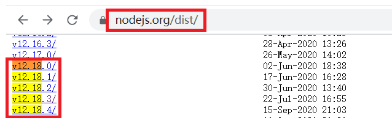

## 01.vue.js安装

### 1.1 什么是vue

- Vue.js是一套构建用户界面的渐进式框架,可以当成js库来使用
- Vue的核心库只关注视图层,实现页面和数据之间的双向绑定,类似于后端模板语言
- Vue.js是前端三大新框架：Angular.js、React.js、Vue.js之一
- Vue.js的文档和文件的地址
     - 文档地址: https://cn.vuejs.org/v2/guide/
     - vue.js文件地址: <https://cn.vuejs.org/v2/guide/installation.html

### 1.2 Vue的MVVM

- 1.Vue是基于MVVM模式实现的
     - M：model表示模型，机器可读性强的数据
     - V：view表示视图，人眼可读性强的数据
     - VM：viewModel表示视图模型
          - 将机器可读性强的数据转化成人眼可读性强的数据
          - 将人眼可读性强的数据转化成机器可读性强的数据（前端的本质）

- 2.数据由视图流入模型通过事件监听实现，数据由模型流入视图通过数据的绑定实现的，这就是数据的双向绑定（MVVM模式的标识）

### 1.3 vuejs与jquery

- 1.在过去，前端的任务就是为页面绑定一些交互，处理一些数据，浏览器兼容性问题是最主要的问题，所以jquery的出现就是为了解决这类问题
- 2.随着前端的发展，前端的业务越来越多，如何能够保证代码的安全，可靠，兼容，可延展性，可维护是现在的主要问题
- 3.jqeury没有将前端业务逻辑抽象分离，所有代码写在一起，很难维护，很难拓展，所以一些框架呼之欲出
- 4.将业务分成模型，视图，控制器，提高代码的可维护性等，但是开发很慢，所以MVVM模式的框架就出现了，vue就是其中的代表之一。

## 02.Vue环境安装

### 2.1 三个重要工具

- `1.npm: `Nodejs下的包管理器。
- `2.webpack:` 把所有浏览器端需要发布的静态资源做相应的准备，比如`资源的合并和打包`。
- `3.vue-cli: `用户生成Vue工程模板

### 2.2 win10安装

- 1.下载node.js： [https://nodejs.org/en/](https://nodejs.org/en/)  （选择左边，不要选最新的）

- 2.安装完成node.js后就会生成npm工具，安装完成后即可下载其他工具

- 3.利用npm安装vue.js： npm install vue -g 

- 4.安装完成后会将文件下载到：D:\nodejs\node_global\node_modules 目录下

- 5.我们使用vue.js时只需到 D:\nodejs\node_global\node_modules 文件夹下，复制 vue.js 只需在使用时引用即可

- 6.npm install -g cnpm -registry=https://registry.npm.taobao.org      # 设置淘宝的仓库路径

### 2.3 linux安装

- 选择合适版本：[选择node版本](https://nodejs.org/dist/)

 </img>

- 安装

```bash
[root@linux-node1 ~]# wget https://nodejs.org/dist/v12.18.3/node-v12.18.3-darwin-x64.tar.gz
[root@linux-node1 ~]# tar -xvf node-v12.18.3-darwin-x64.tar.gz 
[root@linux-node1 ~]# ln -s ~/node-v12.18.3-darwin-x64/bin/node /usr/bin/node
[root@linux-node1 ~]# ln -s ~/node-v12.18.3-darwin-x64/bin/npm /usr/bin/npm
[root@linux-node1 ~]# node -v
```

### 2.4 vue安装报错整理

- 1、如果你的项目里存在 package-lock.json 文件，删除它。并且删除 node_modules。然后再 npm install。

- 2、第一步不行的话。运行 npm cache clean --force 或者 npm cache verify 。然后再 npm install。

- 3、如果上面的都不行，就升级 npm 。 npm i -g npm

- 解决安装慢问题：npm install --registry=https://registry.npm.taobao.org 

## 03.vue.js基本使用

### 3.1 vue.js语法概念

- 导入vue.js库
- 创建vue实例对象
- 绑定(关联)页面元素
- vue对象中参数解释
     - el: 表示需要关联,绑定的页面元素
     - data: 表示页面中双向绑定的数据,json形式
     - methods: 表示vue对象中的方法

 </img>

### 3.2 简单页面

```html
<!DOCTYPE html>
<html lang="en">
    <head>
      <meta charset="UTF-8">
      <title>Hello World</title>
    </head>
    <body>
        <div id="itany">
          {{msg}} <!-- 两对大括号{{}}称为模板，用来进行数据的绑定显示在页面中 -->
        </div>

        <h3>
          {{msg}}
        </h3>
    </body>
    <script src="https://cdn.jsdelivr.net/npm/vue/dist/vue.js"></script>
    <script>
        window.onload=function(){

            Vue.config.devtools=false;   //配置是否允许vue-devtools检查代码，方便调试，生产环境中需要设置为false
            Vue.config.productionTip=false;  //阻止vue启动时生成生产消息

            var vm=new Vue({
                el:'#itany', //指定关联的元素
                data:{ //存储数据
                    msg:'Hello World'
                }
            });
        }
    </script>
</html>
```

