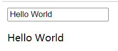

## 01.插值 {{}}

````html
<!DOCTYPE html>
<html lang="en">
    <body>
        <div id="itany">
          {{msg}} <!-- 两对大括号{{}}称为模板，用来进行数据的绑定显示在页面中 -->
        </div>
    </body>
    <script src="https://cdn.jsdelivr.net/npm/vue/dist/vue.js"></script>
    <script>
        window.onload=function(){
            var vm=new Vue({
                el:'#itany', //指定关联的元素
                data:{ //存储数据
                    msg:'Hello World'
                }
            });
        }
    </script>
</html>
````

## 02.v-model

 </img>

```html
<!DOCTYPE html>
<html lang="en">
    <body>
        <div id="itany">
            <input v-model="msg">
            <p>{{msg}}</p>
        </div>
    </body>
    <script src="https://cdn.jsdelivr.net/npm/vue/dist/vue.js"></script>
    <script>
        window.onload=function(){
            var vm=new Vue({
                el:'#itany', //指定关联的元素
                data:{ //存储数据
                    type:'Hello World'
                }
            });
        }
    </script>
</html>
```

## 03.v-if

```html
<!DOCTYPE html>
<html lang="en">
    <body>
        <div id="itany">
            <div v-if="type === 'A'">
                A
            </div>
            <div v-else-if="type === 'B'">
                B
            </div>
            <div v-else-if="type === 'C'">
                C
            </div>
            <div v-else>
                Not A/B/C
            </div>
        </div>
    </body>
    <script src="https://cdn.jsdelivr.net/npm/vue/dist/vue.js"></script>
    <script>
        window.onload=function(){
            var vm=new Vue({
                el:'#itany', //指定关联的元素
                data:{ //存储数据
                    type: "A"
                }
            });
        }
    </script>
</html>
```

## 04.v-show

```html
<!DOCTYPE html>
<html lang="en">
    <head>
        <meta charset="UTF-8">
    </head>
    <body>
        <div id="itany">
            <div v-show="true">v-show为真</div>
            <div v-show="false">v-show为假</div>
        </div>
    </body>
    <script src="https://cdn.jsdelivr.net/npm/vue/dist/vue.js"></script>
    <script>
        window.onload=function(){
            var vm=new Vue({
                el:'#itany', //指定关联的元素
                data:{ //存储数据
                    type: "A"
                }
            });
        }
    </script>
</html>
```

## 05.v-for

```html
<!DOCTYPE html>
<html lang="en">
    <head>
        <meta charset="UTF-8">
    </head>
    <body>
        <div id="itany">
            <ul id="example-1">
                <li v-for="(item, index) in lst">
                    {{ item}}--{{index}}
                </li>
            </ul>

            <ul id="example-2">
                <li v-for="(item, index) in dic">
                    {{ item.name }}--{{ item.age }}---{{ index }}
                </li>
            </ul>
        </div>
    </body>
    <script src="https://cdn.jsdelivr.net/npm/vue/dist/vue.js"></script>
    <script>
        window.onload=function(){
            var vm=new Vue({
                el:'#itany', //指定关联的元素
                data:{ //存储数据
                    lst: ["A","B","C"],
                    dic: [
                            {name: "zhangsan",age: 18},
                            {name: "lisi",age: 20},
                        ],
                }
            });
        }
    </script>
</html>
```

