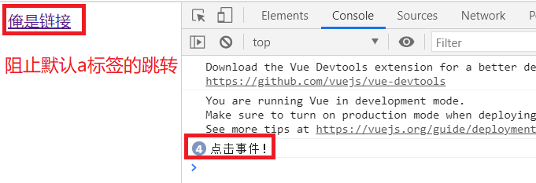

## 01.常用事件

- click点击事件
- enter事件

```html
<!DOCTYPE html>
<html lang="en">
    <head>
        <meta charset="UTF-8">
    </head>
    <body>
        <div id="itany">
            <button @click="clickMethod()">点击事件</button>
            <input @keyup.enter="enterMethod()" placeholder="enter事件">
        </div>
    </body>
    <script src="https://cdn.jsdelivr.net/npm/vue/dist/vue.js"></script>
    <script>
        window.onload=function(){
            var vm=new Vue({
                el:'#itany', //指定关联的元素
                data:{ },
                methods: {
                    clickMethod(){
                        console.log("点击事件！")
                    },
                    enterMethod(){
                        console.log("enter事件")
                    }
                }
            });
        }
    </script>
</html>
```

## 02.事件冒泡和默认行为

- 事件冒泡：当内存外层都绑定 如 点击事件时，只让最内层事件执行

- 默认行为：如 a 标签点击默认会跳转到 href 地址中，然其点击后不跳转

- 一次触发：`<button @click.once="print">  只触发一次 </button>`

- 阻止默认事件：

- ```html
     <a href="http://www.baidu.com" @click.prevent="clickMethod">俺是链接</a>
     ```

 </img>

## 03.防止多次提交

```html
<!DOCTYPE html>
<html lang="en">
    <head>
        <meta charset="UTF-8">
    </head>
    <body>
        <div id="itany">
            <button @click="submit()" :disabled="isDisable">点击</button>
        </div>
    </body>
    <script src="https://cdn.jsdelivr.net/npm/vue/dist/vue.js"></script>
    <script>
        window.onload=function(){
            var vm=new Vue({
                el:'#itany', //指定关联的元素
                data:{
                    isDisable: false
                },
                methods: {
                    submit() {
                        this.isDisable = true
                        setTimeout(() => {
                            this.isDisable = false
                        }, 1000)
                    }
                }
            });
        }
    </script>
</html>
```

