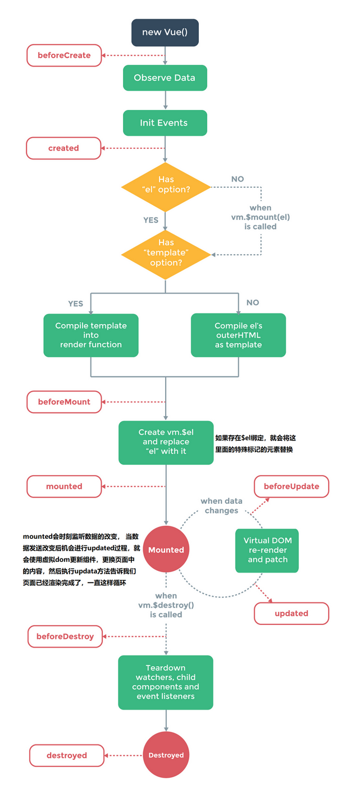

## 01.生命周期是什么

- 1.Vue将组件看成是一个有生命的个体，跟人一样，定义了各个阶段，

- 2.`组件的生命周期`：组件的创建过程

- 3.`组件生命周期钩子函数`：当组件处在某个阶段，要执行某个方法，来通知我们组件进入某个阶段，这个方法就是组件生命周期的钩子函数

- 4.`组件的创建过程`：这些方法在组件中直接定义，会按照顺序执行，没有参数，作用域都是组件实例化对象

## 02.钩子函数执行顺序

 </img>

## 03.生命周期代码演示

### 3.1 八大钩子函数作用

- 第一：页面加载过程
     -  1）beforeCreate：组件实例刚刚创建，还未进行数据观测和事件配置
     -  2）created：实例已经创建完成，并且已经进行数据观测和事件配置
     -  3）beforeMount：模板编译之前，还没挂载
     -  4）mounted：模板编译之后，已经挂载，此时才会渲染页面，才能看到页面上数据的展示
- 第二：页面更新过程
     - 5）beforeUpdate：组件更新之前
     - 6）updated：组件更新之后
- 第三：页面销毁过程
     - beforeDestroy：组件销毁之前
     - destroyed：组件销毁之后

### 3.2 代码演示

```html
<!DOCTYPE html>
<html lang="en">
<head>
    <meta charset="UTF-8">
    <title>Vue生命周期</title>
</head>
<body>
    <div id="itany">
        {{msg}}
        <br>

        <button @click="update">更新数据</button>
        <button @click="destroy">销毁组件</button>
    </div>
</body>
    <script src="https://cdn.jsdelivr.net/npm/vue/dist/vue.js"></script>
    <script>
        window.onload=function(){
            let vm=new Vue({
                el:'#itany',
                data:{
                    msg:'welcome to itany'
                },
                methods:{
                    update(){
                        this.msg='欢迎来到南京网博！';
                    },
                    destroy(){
                        // this.$destroy();
                        vm.$destroy();
                    }
                },
                beforeCreate(){
                    alert('组件实例刚刚创建，还未进行数据观测和事件配置');
                },
                created(){  //常用！！！
                    alert('实例已经创建完成，并且已经进行数据观测和事件配置');
                },
                beforeMount(){
                    alert('模板编译之前，还没挂载');
                },
                mounted(){ //常用！！！
                    alert('模板编译之后，已经挂载，此时才会渲染页面，才能看到页面上数据的展示');
                },
                beforeUpdate(){
                    alert('组件更新之前');
                },
                updated(){
                    alert('组件更新之后');
                },
                beforeDestroy(){
                    alert('组件销毁之前');
                },
                destroyed(){
                    alert('组件销毁之后');
                }
            });
        }
    </script>
</html>
```

