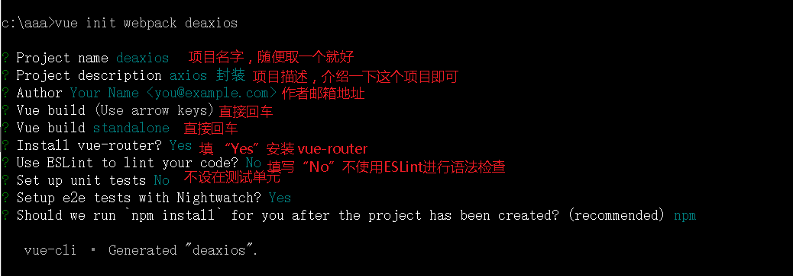
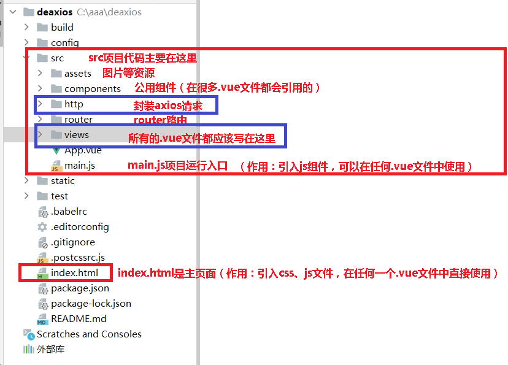
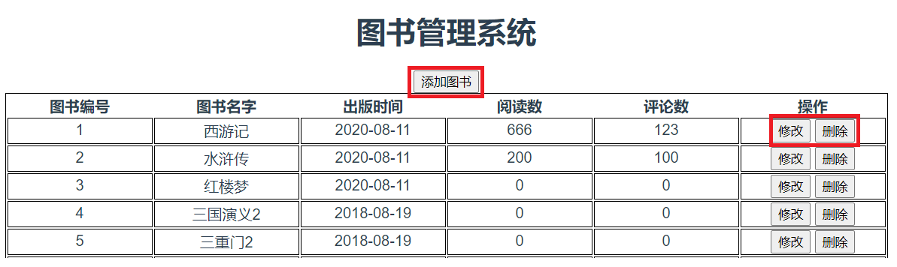

## 01. 始vue化项目

https://www.cnblogs.com/xiaonq/p/11027880.html

### 1.1 创建vue项目

```python
cd c:\tmp
cnpm install vue-cli -g        # 安装vue脚手架：https://www.cnblogs.com/xiaonq/p/9700784.html  
# cnpm install webpack         # vue init慢，可以先执行这个
vue init webpack deaxios        # 使用脚手架创建项目 deaxios（项目名，随便取得）
cd deaxios                 # 进入项目
cnpm install axios@0.19.2       # 安装axios
cnpm i element-ui -S          # 安装element-ui到当前项目
```

 </img>

### 1.2 前端项目结构规范

 </img>

## 02.封装axios


### 2.1 创建`src/http`文件夹

- 用来放网络请求相关的文件

### 2.2 `src/http/index.js`

- 文件夹下, 创建`index.js`文件, 对axios进行封装

```javascript
import axios from 'axios'

// 第一步：设置axios
// 1.1 设置后端请求地址
axios.defaults.baseURL = "http://127.0.0.1:8000/"
// 1.2 全局设置网络超时
axios.defaults.timeout = 10000;
// 1.3 设置请求头信息
axios.defaults.headers.post['Content-Type'] = 'application/json';
axios.defaults.headers.put['Content-Type'] = 'application/json';


// 第二：设置拦截器
/**
 * 请求拦截器(当前端发送请求给后端前进行拦截)
 * 例1：请求拦截器获取token设置到axios请求头中，所有请求接口都具有这个功能
 * 例2：到用户访问某一个页面，但是用户没有登录，前端页面自动跳转 /login/ 页面
 */
// 2.1 请求拦截器
axios.interceptors.request.use(
  config => {
    // 每次发送请求之前判断是否存在token，如果存在，则统一在http请求的header都加上token，不用每次请求都手动添加了
    const token = localStorage.getItem("token")
    // console.log(token)
    if (token) {
      config.headers.Authorization = 'JWT ' + token
    }
    return config;
  },
  error => {
    return Promise.error(error);
  })

// 2.2 响应拦截器
axios.interceptors.response.use(
  // 请求成功
  res => res.status === 200 || res.status === 201 || res.status === 204? Promise.resolve(res) : Promise.reject(res),
  // 请求失败
  error => {
    if (error.response) {
      // 判断一下返回结果的status == 401？  ==401跳转登录页面。  ！=401passs
      // console.log(error.response)
      if (error.response.status === 401) {
        // 跳转不可以使用this.$router.push方法、
        // this.$router.push({path:'/login'})
        window.location.href = "http://127.0.0.1:8888/"
      } else {
        // errorHandle(response.status, response.data.message);
        return Promise.reject(error.response);
      }
      // 请求已发出，但是不在2xx的范围
    } else {
      // 处理断网的情况
      // eg:请求超时或断网时，更新state的network状态
      // network状态在app.vue中控制着一个全局的断网提示组件的显示隐藏
      // 关于断网组件中的刷新重新获取数据，会在断网组件中说明
      // store.commit('changeNetwork', false);
      return Promise.reject(error.response);
    }
  });


// 第三：封装axios请求
// 3.1 封装get请求
export function axios_get(url, params) {
  return new Promise(
    (resolve, reject) => {
      axios.get(url, {params:params})
        .then(res => {
          // console.log("封装信息的的res", res)
          resolve(res.data)
        }).catch(err => {
        reject(err.data)
      })
    }
  )
}

// 3.2 封装post请求
export function axios_post(url, data) {
  return new Promise(
    (resolve, reject) => {
      // console.log(data)
      axios.post(url, JSON.stringify(data))
        .then(res => {
          // console.log("封装信息的的res", res)
          resolve(res.data)
        }).catch(err => {
        reject(err.data)
      })
    }
  )
}

// 3.3 封装put请求
export function axios_put(url, data) {
  return new Promise(
    (resolve, reject) => {
      // console.log(data)
      axios.put(url, JSON.stringify(data))
        .then(res => {
          // console.log("封装信息的的res", res)
          resolve(res.data)
        }).catch(err => {
        reject(err.data)
      })
    }
  )
}

// 3.4 封装delete请求
export function axios_delete(url, data) {
  return new Promise(
    (resolve, reject) => {
      // console.log(data)
      axios.delete(url, { params: data })
        .then(res => {
          // console.log("封装信息的的res", res)
          resolve(res.data)
        }).catch(err => {
        reject(err.data)
      })
    }
  )
}
```

### 2.3 `src/http/apis.js` 

- 目录下创建 apis.js文件, 用来写 接口地址列表

```javascript
import { axios_get, axios_post, axios_delete, axios_put } from './index.js'

export const getBookList = p => axios_get("/book/book/", p)
export const addBook = p => axios_post("/book/book/", p)
export const updateBook = p => axios_put("/book/book/" + p.id + '/', p)
export const delBook = p => axios_delete("/book/book/" + p.id, p)
export const getBook = (p) => axios_get("/book/book/" + p.id, p)
```

## 03.写页面

### 3.1 router/index.js

```python
import Vue from 'vue'
import Router from 'vue-router'
import Books from "@/components/Books";

Vue.use(Router)

export default new Router({
  routes: [
    { path: '/books', name: 'Books', component: Books },                 // 测试图书增删改查案例
  ]
})
```

### 3.2 components/Books.vue

```javascript
<template>
  <div>
    <h1>图书管理系统</h1>
      <div>
        <button @click="requestAddBook">添加图书</button>
      </div>
      <table style='margin: auto; border: solid 1px black;'>
        <tr>
          <th>图书编号</th>
          <th>图书名字</th>
          <th>出版时间</th>
          <th>阅读数</th>
          <th>评论数</th>
          <th>操作</th>
        </tr>
        <tr
          v-for="(book, index) in books"
          :key="book.id"
        >
          <td>{{book.id}}</td>
          <td>{{book.btitle}}</td>
          <td>{{book.bpub_date}}</td>
          <td>{{book.bread}}</td>
          <td>{{book.bcomment}}</td>
          <td>
            <button @click="requestUpdateBook(book)">修改</button>
            <button @click="requestDelBook(book.id)">删除</button>
          </td>
        </tr>
      </table>
  </div>
</template>

<script>
import { getBookList, addBook, updateBook, delBook } from '@/http/apis'

export default {
  components: {

  },
  data() {
    return {
      books: [],
      // 图书列表：[{"id":1,"btitle":"西游记","bpub_date":"2020-08-11","bread":666,"bcomment":123,"is_delete":false}]
    }
  },
  methods: {
    // 1.获取图书列表
    requestBookkList() {
      getBookList().then((data) => {
        // books: [{btitle: "西游记", bpub_date: "2020-08-11", bread: 100, bcomment: 50}]
        this.books = data.results
      })
    },

    // 2.添加图书
    requestAddBook() {
      const data = {
        btitle: "货币战争",
        bpub_date: "2020-11-12",
        bread: 0,
        bcomment: 0
      }
      addBook(data).then((res) => {
        // this.requestBookkList()
      }).catch(err=>{
        console.log(err)

      })
    },
    // 3.修改图书
    requestUpdateBook(book) {
      const data = {
        id: book.id,
        btitle: book.btitle + "修改后",
        bpub_date: "2020-11-12",
        bread: 0,
        bcomment: 0
      }
      updateBook(data).then((res) => {
        this.requestBookkList()
      }).catch(err=>{
        console.log(err)
      })
    },

    // 4.删除图书
    requestDelBook(bookid){
      let params = {
        id: bookid
      }
      delBook(params).then((res)=>{
        this.requestBookkList()
      }).catch(err=>{
        console.log(err)
      })
    },
  },
  created() {
    this.requestBookkList()
  }
}
</script>
<style>
table tr td {
  width: 150px;
  border: solid 1px black;
}
</style>
```

### 3.3 页面效果

 </img>

### 3.4 后台接口

[图书管理后端](http://v5blog.cn:81/pages/49ae81/)