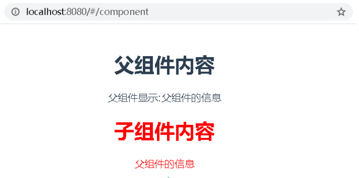
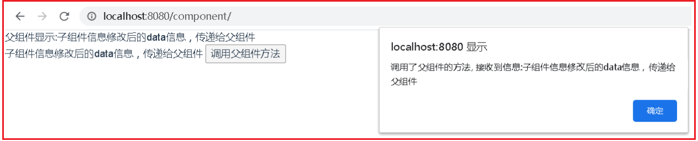

## 01.组件定义

```python
1.定义组件并引用
2.父组件向子组件传值
3.子组件向父组件传值
# 组件间传值：vuex （https://www.cnblogs.com/xiaonq/p/9697921.html）
```

### 1.1 什么是组件

- Html中有组件，是一段可以被复用的结构代码
- Css中有组件，是一段可以被复用的样式
- Js中有组件，是一段可以被复用的功能
- Vue中也有组件，指的就是一个模块，是一个独立的，完整的（包含html，css，js等），可以直接拿来用的

### 1.2 组件特性

- 组件的实例化对象，跟vue实例化对象一样，因此，我们也可以将vue实例化对象看成组件
- 组件间是独立的，因此数据要独立存储，方法要独立定义，`彼此间不能共享`。


## 02.父组件向子组件传值

### 2.1 定义子组件

> `src/views/components-demo/components/Child.vue`

```javascript
<template>
  <div style="color: red">
    <h1>子组件内容</h1>
    <p>{{data}}</p>
  </div>
</template>

<script>
export default {
  // 子组件要使用父组件的数据，只需要一步，在 props中接收父组件的属性
  props: ['data'],  // 接收父组件给子组件定义的属性
}
</script>
```

### 2.2 定义父组件

> `src/views/components-demo/Father.vue`

```javascript
<template>
  <div>
    <h1>父组件内容</h1>
    父组件显示:{{msg}}
    <!--3.第三步：把父组件的某一个属性传递给子组件-->
    <Child
      :data='msg'
    ></Child>
  </div>
</template>

<script>
// @指定的是src路径
import Child from '@/views/demo/Child'   // 1.第一步：在父组件中导入子组件
export default {
  // 2.第二步：父组件中注册子组件
  components: {
    Child
  },
  data() {
    return {
      msg: '父组件的信息'
    }
  },
  methods: {

  }
}
</script>
```

### 2.3 `router/index.js`

```javascript
import Father from '@/views/demo/Father'

Vue.use(Router)

export default new Router({
  routes: [
    { path: '/component', name: 'Father', component: Father },
  ]
})
```

### 2.4 测试

```javascript
http://localhost:8080/component/
```

- 子组件中可以通过 定义 `props`属性来接收父组件的数据

 </img>

## 03.子组件向父组件传值

### 3.1 子组件向父组件传值

- `components/Child.vue`

> `src/views/components-demo/components/Child.vue`

```javascript
<template>
  <div>{{data}}
    <button @click="emitfather">调用父组件方法</button>
  </div>
</template>
<script>
  export default {
    props: ['data'], // 接收父组件给子组件定义的属性
    methods: {
      emitfather() {
        console.log('调用emitfather方法')
        //1.子组件调用父组件方法，并传值
        // $emit 触发当前实例上的事件，也可以简单的理解为触发父组件上的事件（向上冒泡）
        this.$emit('changeMsg', '子组件信息修改后的data信息，传递给父组件')
      }
    }
  }
</script>
```

### 3.2 给子组件添加事件

> `src/views/components-demo/Father.vue`

```javascript
<template>
  <div>
    父组件显示:{{msg}}
    <!--4.把父组件的一个方法传递给子组件-->
    <Child
      :data='msg'
      @changeMsg='change'
    ></Child>
  </div>
</template>
<script>
//1.导入
import Child from '@/views/demo/Child'
export default {
  //2.注册
  components: {
    Child,
  },
  data() {
    return {
      msg: '父组件的信息'
    }
  },
  methods: {
    //3.在父组件中定义一个change方法，可以在子组件中触发并传值给父组件
    change(data) {
      // data接收是子组件中传递的数据
      // debugger
      alert('调用了父组件的方法, 接收到信息:'+data)
      this.msg = data  // 更新父组件的内容
    }
  }
}
</script>
```

### 3.3 测试

- 点击 "调用父组件方法" 就会调用

```javascript
http://localhost:8080/component/
```

 </img>

