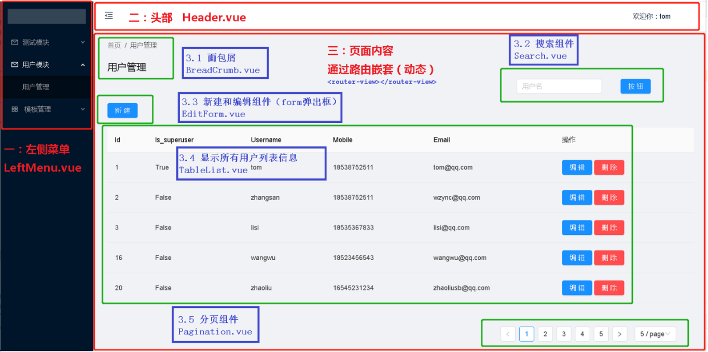

## 01.目录与布局

[前端](https://gitee.com/eduworkflow/opwf-front/)
[后端](https://gitee.com/eduworkflow/opwf_project)

### 1.1 目录结构

```javascript
src
│  App.vue
│  main.js
│
├─components          # 公用组件
│  └─layout
│     Header.vue
│     Home.vue
│     LeftMenu.vue
│
├─http              # 后端请求封装
│     apis.js
│     index.js
│
├─router             # 路由
│     index.js
│
└─views              # 前端页面文件夹
    └─user-manage
        │  index.vue   # 页面主页面
        │
        └─components   # 页面组件
                BreadCrumb.vue      # 面包屑组件
                EditForm.vue       # 增加和修改组件
                Pagination.vue      # 分页组件
                Search.vue         # 搜索组件
                TableList.vue       # 数据展示table框页面
```

### 1.2 页面布局

 </img>

## 02.main.js和router

```javascript
src
│  App.vue
│  main.js
│
├─router             # 路由
│     index.js
```

### 2.1 main.js

```javascript
import Vue from 'vue'
import App from './App'
import router from './router'

// 使用 elementui
// npm i element-ui -S 安装到当前项目
import ElementUI from 'element-ui'
import 'element-ui/lib/theme-chalk/index.css'
Vue.use(ElementUI)

// 使用ant-design-vue
import Antd from 'ant-design-vue';
import 'ant-design-vue/dist/antd.css';
Vue.config.productionTip = false
Vue.use(Antd);


router.beforeEach((to, from, next) => {
  // debugger
  if (to.path =='/login' || localStorage.getItem("token")) {
      next()
  } else {
      alert("尚未登录，请先登录")
      return next("/login")
  }
})

/* eslint-disable no-new */
new Vue({
  el: '#app',
  router,
  components: { App },
  template: '<App/>'
})
```

### 2.2 router/index.js

```javascript
import Vue from 'vue'
import Router from 'vue-router'

import Home from '@/components/layout/Home'
const page = name => () => import('@/views/' + name)
Vue.use(Router)

export default new Router({
  mode: 'history',
  routes: [
    { path: '/home', name: 'Home', component: Home },
    // 用户管理模块
    { path: '/',component: Home,name: 'home',
      children: [
        { path: '/userlist', component: page('user-manage/index'), name: '获取所有用户' },
        { path: '/rolelist', component: page('role-manage/index'), name: '获取所有角色' },
      ]
    },
  ]
})

// 解决在当前路径下，跳转到当前路径下的报错问题
// const originalPush = Router.prototype.push
// Router.prototype.push = function push(location) {
//   return originalPush.call(this, location).catch(err => err)
// }
const originalReplace = Router.prototype.replace;
Router.prototype.replace = function replace(location) {
  return originalReplace.call(this, location).catch(err => err);
};
```

## 03.头部和左侧菜单

```javascript
src
├─components          # 公用组件
│  └─layout
│     Header.vue
│     Home.vue
│     LeftMenu.vue
```

### 3.1 layout/Header.vue

```html
<template>
        <div style="float:right;margin-right: 80px">

          <div>
            <span style="margin-left: 20px;display: inline-block">欢迎你：{{username}}</span>
            <a @click="logout" style="margin-left: 20px;display: inline-block">注销登录</a>
          </div>
        </div>
</template>
<script>
export default{
    data(){
        return{
          username:localStorage.getItem('username')
        }
    },
    methods:{
      logout(){
        localStorage.clear()
        this.$router.push('/login')
      }
    }
}
</script>
```

### 3.2  layout/LeftMenu.vue

```html
<template>
  <div style="width: 200px">
    <a-menu
      :default-selected-keys="['1']"
      :default-open-keys="['sub1']"
      mode="inline"
      theme="dark"
      :inline-collapsed="collapsed"
      :selected-keys="[current]"
      @click="handleClick"
    >

      <a-sub-menu key="sub1">
        <span slot="title">
          <a-icon type="mail" />
          <span>用户模块</span>
        </span>
        
        <a-menu-item key="userlist">用户管理</a-menu-item>
        <a-menu-item key="rolelist">角色管理</a-menu-item>
      </a-sub-menu>

    </a-menu>
  </div>
</template>

<script>
export default {
  data() {
    return {
      collapsed: false,
      current: '1',
    };
  },
  methods: {
    toggleCollapsed() {
      this.collapsed = !this.collapsed;
    },
    handleClick(e) {
      this.current = e.key;
      this.$router.replace({ path: '/' })
      this.$router.push({path: e.key });
    },
  },
};
</script>
```

### 3.3 layout/Home.vue

```html
<template>
    <a-layout id="components-layout-demo-custom-trigger">

        <!--左侧菜单-->
        <a-layout-sider v-model="collapsed" :trigger="null" collapsible>
          <div class="logo" />
          <leftmenu :menu_number='1' />
        </a-layout-sider>

        <!--模板头部-->
        <a-layout>
            <a-layout-header style="background: rgb(255, 255, 255); padding: 0">

                <a-icon
                  class="trigger"
                  :type="collapsed ? 'menu-unfold' : 'menu-fold'"
                  @click="() => (collapsed = !collapsed)"
                />
                <headermenu />
            </a-layout-header>

            <!-- 显示内容-->
            <div style="margin-top: 20px;margin-left: 30px;margin-right: 30px">
              <!-- 嵌套路由-->
              <router-view></router-view>
            </div>
        </a-layout>
    </a-layout>
</template>

<script>
//导入组件
import leftmenu from './LeftMenu.vue';
import headermenu from './Header.vue'

export default {
  name: "home",
  data () {
    return {
      collapsed: false,
    }
  },
  //注册组件标签
  components:{
    'leftmenu':leftmenu,
    'headermenu':headermenu,
  },
  mounted:function(){

  },
  methods:{

  }
}
</script>

<style scoped>
#components-layout-demo-custom-trigger .trigger {
  font-size: 18px;
  line-height: 64px;
  padding: 0 24px;
  cursor: pointer;
  transition: color 0.3s;
}

#components-layout-demo-custom-trigger .trigger:hover {
  color: #1890ff;
}

#components-layout-demo-custom-trigger .logo {
  height: 32px;
  background: rgba(255, 255, 255, 0.2);
  margin: 16px;
}
</style>
```

## 04.axios封装

```
src
├─http              # 后端请求封装
│     apis.js
│     index.js
```

### 4.1 http/index.js

```javascript
import axios from 'axios'

// 第一步：设置axios
axios.defaults.baseURL = "http://192.168.56.100:8888/"

//全局设置网络超时
axios.defaults.timeout = 10000;

//设置请求头信息
axios.defaults.headers.post['Content-Type'] = 'application/json';
axios.defaults.headers.put['Content-Type'] = 'application/json';


// 第二：设置拦截器
/**
 * 请求拦截器(当前端发送请求给后端前进行拦截)
 * 例1：请求拦截器获取token设置到axios请求头中，所有请求接口都具有这个功能
 * 例2：到用户访问某一个页面，但是用户没有登录，前端页面自动跳转 /login/ 页面
 */
axios.interceptors.request.use(
    config => {
        // 每次发送请求之前判断是否存在token，如果存在，则统一在http请求的header都加上token，不用每次请求都手动添加了
        const token = localStorage.getItem("token")
        if (token) {
            config.headers.Authorization = 'JWT ' + token
        }
        return config;
    },
    error => {
        return Promise.error(error);
    })

axios.interceptors.response.use(
    // 请求成功
    res => res.status === 200 || res.status === 201 || res.status === 204 ? Promise.resolve(res) : Promise.reject(res),
    // res => res.status === 201 ? Promise.resolve(res) : Promise.reject(res),
    // 请求失败
    error => {
        if (error.response) {
            // 判断一下返回结果的status == 401？  ==401跳转登录页面。  ！=401passs
            // console.log(error.response)
            if (error.response.status === 401) {
               // 跳转不可以使用this.$router.push方法、
               //  this.$router.push({path:'/login'})
                window.location.href = "http://127.0.0.1:8080/login/"
            } else {
                // errorHandle(response.status, response.data.message);
                return Promise.reject(error.response);
            }
            // 请求已发出，但是不在2xx的范围
        } else {
            // 处理断网的情况
            // eg:请求超时或断网时，更新state的network状态
            // network状态在app.vue中控制着一个全局的断网提示组件的显示隐藏
            // 关于断网组件中的刷新重新获取数据，会在断网组件中说明
            // store.commit('changeNetwork', false);
            return Promise.reject(error.response);
        }
    });

// 第三：封装axios请求
// 3.1 封装get请求
export function axios_get(url, params) {
    return new Promise(
        (resolve, reject) => {
            axios.get(url, {params:params})
                .then(res => {
                    // console.log("封装信息的的res", res)
                    resolve(res.data)
                }).catch(err => {
                    reject(err.data)
                })
        }
    )
}

// 3.2 封装post请求
export function axios_post(url, data) {
    return new Promise(
        (resolve, reject) => {
            // console.log(data)
            axios.post(url, JSON.stringify(data))
                .then(res => {
                    // console.log("封装信息的的res", res)
                    resolve(res.data)
                }).catch(err => {
                    reject(err.data)
                })
        }
    )
}

// 3.3 封装put请求
export function axios_put(url, data) {
    return new Promise(
        (resolve, reject) => {
            // console.log(data)
            axios.put(url, JSON.stringify(data))
                .then(res => {
                    // console.log("封装信息的的res", res)
                    resolve(res)
                }).catch(err => {
                    reject(err)
                })
        }
    )
}

// 3.4 封装delete请求
export function axios_delete(url, data) {
    return new Promise(
        (resolve, reject) => {
            // console.log(data)
            axios.delete(url, { params: data })
                .then(res => {
                    // console.log("封装信息的的res", res)
                    resolve(res.data)
                }).catch(err => {
                    reject(err.data)
                })
        }
    )
}
```

### 4.2 http/apis.js

```javascript
import { axios_get, axios_post, axios_delete, axios_put } from './index.js'
// 用户管理
export const getUserInfo = (params, headers) => { return axios_get('/user/user/' + params.id, params, headers) }  // 获取一个具体用户信息
export const getUserList = (params, headers) => axios_get("/user/user/", params, headers)
export const addUser = (params, headers) => axios_post("/user/user/", params, headers)
export const updateUser = (params, headers) => { return axios_put('/user/user/' + params.id + '/', params, headers) }  // 获取一个具体用户信息
export const deleteUser = (params, headers) => { return axios_delete('/user/user/' + params.id + '/', params, headers) }  // 获取一个具体用户信息
```

