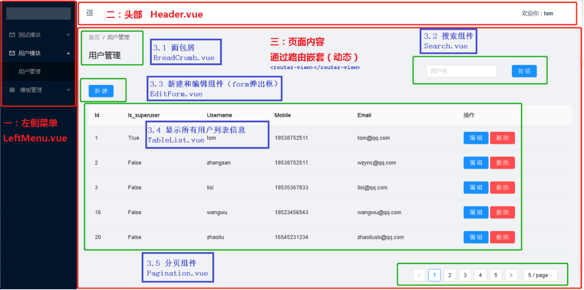

## 00.页面展示

### 0.1 目录结构

```javascript
src
└─views              # 前端页面文件夹
    └─user-manage
        │  index.vue   # 页面主页面
        │
        └─components   # 页面组件
                BreadCrumb.vue      # 面包屑组件
                EditForm.vue       # 增加和修改组件
                Pagination.vue      # 分页组件
                Search.vue         # 搜索组件
                TableList.vue       # 数据展示table框页面
```

### 0.2 页面展示

[前端](https://gitee.com/eduworkflow/opwf-front/)
[后端](https://gitee.com/eduworkflow/opwf_project)

 </img>

## 01.index.vue

```html
<template>
  <a-layout-content>
    <!-- 1.面包屑-->
    <a-row>
      <a-col :span="23">
        <BreadCrumb></BreadCrumb>
      </a-col>
    </a-row>

    <!--2.搜索-->
    <a-row>
      <a-col :span="23">
        <Search style="float: right"
        :filterData.sync="filterData"
        @filterUser="filterUser"
        ></Search>
      </a-col>
    </a-row>

    <!--3.弹出框-->
    <a-row style="margin-top: 20px;margin-bottom: 20px;">
      <a-button type="primary" @click="showModal" style="float: left">
        新建
      </a-button>
      <a-col :span="23">
        <EditForm
        :visible.sync="visible"
        :editData="editData"
        @requestAddUser="requestAddUser"
        ></EditForm>
      </a-col>
    </a-row>

    <!--4.table框展示数据-->
    <a-row>
      <TableList
      :tableData="tableData"
      :visible.sync="visible"
      :editData.sync="editData"
      @requestDeleteUser="requestDeleteUser"
      ></TableList>
    </a-row>

    <!-- 5.分页组件-->
    <a-row>
      <div style="margin-right: 30px; float: right;margin-top: 50px;margin-bottom: 100px">
        <Pagination
          @receivePagition="receivePagition"
          :total.sync="totalCount"
        >
        </Pagination>
      </div>
    </a-row>
  </a-layout-content>
</template>

<script>
import { getUserList, getUserInfo, addUser, updateUser, deleteUser } from '@/http/apis'

import BreadCrumb from "./components/BreadCrumb";
import Search from "./components/Search";
import EditForm from "./components/EditForm";
import TableList from "./components/TableList";
import Pagination from "./components/Pagination";

// Pagination分页中假数据
const data = [
  {
    "id": 11,
    "is_superuser": false,
    "username": "tom110",
    "mobile": "18538752512",
    "email": "",
  },
  {
    "id": 12,
    "is_superuser": false,
    "username": "tom110",
    "mobile": "18538752512",
    "email": "",
  },
];

export default {
  name: "index-usermanage",
  components:{
    BreadCrumb,
    Search,
    EditForm,
    TableList,
    Pagination
  },
  created(){
    this.initUserList()        // 获取所有用户列表
  },
  data(){
    return {
      // 1.获取所有的用户信息
      tableData: data,  // 初始化页面中，表格中显示的所有用户信息

      // 2.编辑或修改时显示的弹出框
      visible: false,   // 添加和是否显示弹出框
      editData: {       // 添加和修改用户时，弹出框中进行双向绑定的数据
        username: '',
        password: '123456',
        email:'',
        mobile:''
      },

      // 3.过滤和分页中的绑定数据
      totalCount: 0,     // Pagination分页组件中，后端user表中查询有多少条数据，用来分页
      filterData:{
        page: 1,         // Pagination分页组件中默认显示第一页
        page_size: 5,    // Pagination组件中默认每页显示10条数据
        username: '',    // Search组件中使用username搜索用户
      },
    }
  },
  methods:{
    // 一.初始化时显示所有用户
    initUserList(){
      getUserList(this.filterData).then(resp => {
        this.tableData = resp.results
        this.totalCount = resp.count
      }).catch(err=>{
        console.log(err)
        alert('获取用户失败')
      })
    },

    // 二.修改或添加用户时显示弹出框
    // 2.1 显示弹出框
    showModal() {
      this.editData = {
        username: 'tom',
        password: '123456',
        email:'tom@qq.com',
        mobile:'18538752555'
      }
      this.visible = true;
    },
    // 2.2 添加获取修改用户时进行后端请求
    requestAddUser(){
      const userId = this.editData.id
      if(userId){
        console.log(this.editData,'修改数据')
        updateUser(this.editData).then(resp => {
          this.initUserList()
        }).catch(err=>{
          console.log(err)
          alert('更新用户失败')
        })
      }else {
        addUser(this.editData).then(resp => {
          this.initUserList()
        }).catch(err=>{
          console.log(err)
          alert('创建用户失败')
        })
      }
    },

    // 三.删除指定用户
    requestDeleteUser(){
      deleteUser(this.editData).then(resp => {
        this.initUserList()
      }).catch(err=>{
        console.log(err)
        alert('更新用户失败')
      })
    },

    // 四：过滤、分页
    // 4.1 过滤搜素用户（过滤条件已经双向绑定，直接调用 initUserList方法即可）
    filterUser(){
      this.initUserList()
    },
    // 4.2 分页时接收Pagination子组件中，当前页，和 每页显示多少条数据
    receivePagition(pageParams){
      this.filterData.page = pageParams.page;
      this.filterData.page_size = pageParams.page_size;
      this.initUserList()
    },

    // 五.获取指定用户（这个接口只是一个样例,与页面功能无关）
    requestGetUserInfo(){
      getUserInfo({id: 1}).then(resp => {
        console.log(resp,99999999999999)
      }).catch(err=>{
        console.log(err)
      })
    },
  }
}
</script>

<style scoped>

</style>
```

## 02.components/BreadCrumb.vue

### 2.1 index.vue导入

```html
<template>
  <a-layout-content>
    <!-- 第三：组件引用-->
    <a-row>
      <a-col :span="23">
        <BreadCrumb></BreadCrumb>
      </a-col>
    </a-row>
  </a-layout-content>
</template>

<script>
// 第一：导入组件
import BreadCrumb from "./components/BreadCrumb";

export default {
  name: "index-usermanage",
  data(){
    return {
      
    }
  },
  // 第二：注册组件
  components:{
    BreadCrumb,
  },
  created(){

  },
  methods:{
  
  },
  
}
</script>

<style scoped>

</style>
```

### 2.2 BreadCroumb.vue

```html
<template>
  <div>
    <a-breadcrumb>
      <a-breadcrumb-item>首页</a-breadcrumb-item>
      <a-breadcrumb-item><a href="">用户管理</a></a-breadcrumb-item>
    </a-breadcrumb>
    <a-col :span="23" style="margin-top: 20px">
      <h2>用户管理</h2>
    </a-col>
  </div>
</template>

<script>
export default {
  name: "BreadCrumb"
}
</script>

<style scoped>

</style>
```

## 03.components/Search.vue

### 3.1  index.vue导入

```javascript
<template>
  <a-layout-content>
    <!--第三：组件引用-->
    <a-row>
      <a-col :span="23">
        <Search style="float: right"
        :filterData.sync="filterData"
        @filterMethod="filterMethod"
        ></Search>
      </a-col>
    </a-row>
  </a-layout-content>
</template>

<script>
// 一：导入组件
import Search from "./components/Search";

export default {
  name: "index-usermanage",
  // 二：注册组件
  components:{
    Search,
  },
  data(){
    return {
      // 父组件中过滤绑定数据，传递到子组件中
      filterData:{
        page: 1,         // Pagination分页组件中默认显示第一页
        page_size: 5,    // Pagination组件中默认每页显示10条数据
        username: '',    // Search组件中使用username搜索用户
      },
    }
  },
  methods:{
    // 在搜索子组件中点击“搜索”触发当前方法
    filterMethod(){
      this.initList()
    },
    initList(){
      getUserList(this.filterData).then(resp => {
        this.tableData = resp.results
        this.totalCount = resp.count
      }).catch(err=>{
        console.log(err)
        alert('获取用户失败')
      })
    },
      
      
  }
}
</script>

<style scoped>

</style>
```

### 3.2 Search.vue

```javascript
<template>
  <div>
    <template>
      <div class="search-input">
        <a-button type="primary" @click="searchSubmit">
          按钮
        </a-button>
      </div>
      <div class="search-input">
        <a-input  v-model="filterData.username" placeholder="用户名" />
      </div>
    </template>
  </div>
</template>

<script>
export default {
  name: "Search",
  data(){
    return {

    }
  },
  props: ['filterData'],     // 父组件中绑定的搜索表单数据
  methods:{
    // 点击搜索按钮，触发搜索事件
    searchSubmit(){
      this.$emit('filterMethod')    // 触发父组件中的filterUser方法进行过滤搜索功能
    }
  }

}
</script>

<style scoped>
.search-input {
  float: right;
  margin-right: 40px
}
</style>
```

## 04.components/EditForm.vue

### 4.1 index.vue导入

```javascript
<template>
  <a-layout-content>

    <!--三：引用组件-->
    <a-row style="margin-top: 20px;margin-bottom: 20px;">
      <a-button type="primary" @click="showModal" style="float: left">
        新建
      </a-button>
      <a-col :span="23">
        <EditForm
        :visible.sync="visible"
        :editData="editData"
        @requestAdd="requestAdd"
        ></EditForm>
      </a-col>
    </a-row>

  </a-layout-content>
</template>

<script>
            
import { addUser, updateUser } from '@/http/apis'
// 第一：导入组件
import EditForm from "./components/EditForm";

export default {
  name: "index-usermanage",
  
  // 第二：注册组件
  components:{
    EditForm,
  },
  data(){
    return {
      // 2.编辑或修改时显示的弹出框
      visible: false,   // 添加和是否显示弹出框
      editData: {       // 添加和修改用户时，弹出框中进行双向绑定的数据
        username: '',
        password: '123456',
        email:'',
        mobile:''
      },
        
    }
  },

  methods:{
    // 二.修改或添加用户时显示弹出框
    // 2.1 显示弹出框
    showModal() {
      this.editData = {
        username: 'tom',
        password: '123456',
        email:'tom@qq.com',
        mobile:'18538752555'
      }
      this.visible = true;
    },
      
    // 2.2 添加获取修改用户时进行后端请求
    requestAdd(){
      const id = this.editData.id
      if(id){
        console.log(this.editData,'修改数据')
        updateUser(this.editData).then(resp => {
          this.initList()
        }).catch(err=>{
          console.log(err)
          alert('更新用户失败')
        })
      }else {
        addUser(this.editData).then(resp => {
          this.initList()
        }).catch(err=>{
          console.log(err)
          alert('创建用户失败')
        })
      }
    },

  }
}
</script>

<style scoped>

</style>

```

### 4.2 EditForm.vue

```javascript
<template>
  <div>
    <a-modal
      title="Title"
      :visible="visible"
      @ok="handleOk"
      @cancel="handleCancel"
    >
      <div v-show="!editData.id">
        <label>用户名：</label>
        <a-auto-complete
          v-model="editData.username"
          style="width: 200px"
          placeholder="input here"
        />
      </div>

      <div v-show="editData.id">
        <label>用户名：</label>
        <a-auto-complete
          :disabled="true"
          :readOnly="true"
          v-model="editData.username"
          style="width: 200px"
          placeholder="input here"
        />
      </div>

      <div v-show="!editData.id">
        <label>密码：</label>
        <a-auto-complete
          v-model="editData.password"
          style="width: 200px"
          placeholder="input here"
        />
      </div>

      <div>
        <label>手机号：</label>
        <a-auto-complete
          v-model="editData.mobile"
          style="width: 200px"
          placeholder="input here"
        />
      </div>

      <div>
        <label>邮箱：</label>
        <a-auto-complete
          v-model="editData.email"
          style="width: 200px"
          placeholder="input here"
        />
      </div>
    </a-modal>
  </div>
</template>
<script>
export default {
  data() {
    return {

    };
  },
  props:['visible','editData'],
  methods: {
    // 弹出框点击确认时调用此函数
    handleOk(e) {
      this.$emit('update:visible', false)
      this.$emit('requestAdd')
    },

    // 弹出框点击取消时调用此函数
    handleCancel(e) {
      this.$emit('update:visible', false)
    },
  },
};
</script>
```

## 05 components/TableList.vue

### 5.1 index.vue导入

```html
<template>
  <a-layout-content>

    <!--三：引入组件-->
    <a-row>
      <TableList
      :tableData="tableData"
      :visible.sync="visible"
      :editData.sync="editData"
      @requestDelete="requestDelete"
      ></TableList>
    </a-row>

  </a-layout-content>
</template>

<script>
import { getUserList, addUser, updateUser, deleteUser } from '@/http/apis'

// 一：导入组件
import TableList from "./components/TableList";

// Pagination分页中假数据
const data = [
  {
    "id": 11,
    "is_superuser": false,
    "username": "tom110",
    "mobile": "18538752512",
    "email": "",
  },
  {
    "id": 12,
    "is_superuser": false,
    "username": "tom110",
    "mobile": "18538752512",
    "email": "",
  },
];

export default {
  name: "index-usermanage",
  
  // 二：注册组件
  components:{
    TableList,
  },
  created(){
    this.initList()        // 获取所有用户列表
  },
  data(){
    return {
      // 1.table框中绑定数据（后端表中数据列表）
      tableData: data,  // 初始化页面中，表格中显示的所有用户信息

      // 2.编辑或修改时显示的弹出框
      visible: false,   // 添加和是否显示弹出框
      editData: {       // 添加和修改用户时，弹出框中进行双向绑定的数据
        username: '',
        password: '123456',
        email:'',
        mobile:''
      },

      // 3.过滤和分页中的绑定数据
      totalCount: 0,     // 在获取用户数据时把数据总量替换到这里，可以进行分页
 
    }
  },
  methods:{
    // 一.初始化时显示所有用户
    initList(){
      getUserList(this.filterData).then(resp => {
        this.tableData = resp.results
        this.totalCount = resp.count
      }).catch(err=>{
        console.log(err)
        alert('获取用户失败')
      })
    },

    // 二.修改或添加用户时显示弹出框
    // 2.2 添加获取修改用户时进行后端请求
    requestAdd(){
      const userId = this.editData.id
      if(userId){
        console.log(this.editData,'修改数据')
        updateUser(this.editData).then(resp => {
          this.initUserList()
        }).catch(err=>{
          console.log(err)
          alert('更新用户失败')
        })
      }else {
        addUser(this.editData).then(resp => {
          this.initUserList()
        }).catch(err=>{
          console.log(err)
          alert('创建用户失败')
        })
      }
    },

    // 三.删除指定用户
    requestDelete(){
      deleteUser(this.editData).then(resp => {
        this.initUserList()
      }).catch(err=>{
        console.log(err)
        alert('更新用户失败')
      })
    },

  }
}
</script>

<style scoped>

</style>
```

### 5.2 TableList.vue

```html
<template>
    
  <a-table :pagination="false" :columns="tableColumns" :data-source="tableData" :rowKey='record=>record.id'>
    <span slot="action" slot-scope="text, record">
          <a-button type="primary" @click="clickEditButton(record)">编辑</a-button>
          <a-button type="danger" @click="clickDeleteButton(record.id)">删除</a-button>
    </span>
  </a-table>

</template>

<script>

// 控制表头显示的内容
const columns = [
  {
    title:'Id',
    dataIndex: 'id',
    key: 'id',
  },
  {
    title:'Is_superuser',
    dataIndex: 'is_superuser',
    key: 'is_superuser',
  },
  {
    title:'Username',
    dataIndex: 'username',
    key: 'username',
  },
  {
    title:'Mobile',
    dataIndex: 'mobile',
    key: 'mobile',
  },
  {
    title:'Email',
    dataIndex: 'email',
    key: 'email',
  },
  {
    title: '操作',
    key: 'action',
    scopedSlots: { customRender: 'action' },
  },
];

export default {
  data() {
    return {
      tableColumns: columns,  // 表头中绑定的数据
    };
  },
  props: ["tableData","visible"],
  methods:{

    // 点击编辑按钮时调用的事件
    clickEditButton(record){
      this.$emit('update:visible', true)
      this.$emit('update:editData', {
        id: record.id,
        username: record.username,
        password: record.password,
        email: record.email,
        mobile: record.mobile
      })
    },

    // 点击删除按钮时调用的事件
    clickDeleteButton(id){
      const isDel = confirm('你确定要删除' + id)
      this.$emit('update:editData', {
        id: id,
      })
      if(isDel){
        this.$emit('requestDelete')
      }
    },

  }
};
</script>
```

## 06 components/Pagination.vue

### 6.1 index.vue导入

```html
<template>
  <a-layout-content>
    
    <!-- 5.分页组件-->
    <a-row>
      <div style="margin-right: 30px; float: right;margin-top: 50px;margin-bottom: 100px">
        <Pagination
          @receivePagition="receivePagination"
          :total.sync="totalCount"
        >

        </Pagination>
      </div>
    </a-row>

  </a-layout-content>
</template>

<script>
import Pagination from "./components/Pagination";

export default {
  name: "index-usermanage",
  components:{
    Pagination,
  },
  data(){
    return {

      // 3.过滤和分页中的绑定数据
      totalCount: 0,     // Pagination分页组件中，后端user表中查询有多少条数据，用来分页
      filterData:{
        page: 1,         // Pagination分页组件中默认显示第一页
        page_size: 5,    // Pagination组件中默认每页显示10条数据
        username: '',    // Search组件中使用username搜索用户
      },

    }
  },
  
  methods:{

    // 四：过滤、分页
    // 4.2 分页时接收Pagination子组件中，当前页，和 每页显示多少条数据
    receivePagination(pageParams){
      this.filterData.page = pageParams.page;
      this.filterData.page_size = pageParams.page_size;
      this.initList()
    },

  }
}
</script>

<style scoped>

</style>
```

### 6.2 Pagination.vue

```html
<template>
  <div>
    <a-pagination
      v-model="current"
      show-size-changer
      :page-size.sync="pageSize"
      :total="total"
      :page-size-options="pageSizeOptions"
      @showSizeChange="onShowSizeChange"
    />
  </div>
</template>

<script>
// http://192.168.56.100:8888/user/user/?page=2&page_size=1
// page => current    当前页的号
// page_size =>  pageSeze   每页几条数据
export default {

  data() {
    return {
      pageSizeOptions: ['1','5', '10', '20', '50', '100'],
      current: 1,
      pageSize: 5,
      // total: 50,
    };
  },

  watch: {
    // 当每页显示数据改变时调用
    pageSize(val) {
      console.log('pageSize', val);
    },
    // 当我们点击页码时调用
    current(val) {
      console.log('current', val);
      this.$emit('receivePagition', { page:val, page_size: this.pageSize })

    },
  },

  props: ["total"],
  methods: {
    // 当每页显示数据改变时调用
    onShowSizeChange(current, pageSize) {
      console.log(current, pageSize, 'onShowSizeChange')
      this.$emit('receivePagination', { page:current, page_size: pageSize })
    },
  },
};
</script>
```


