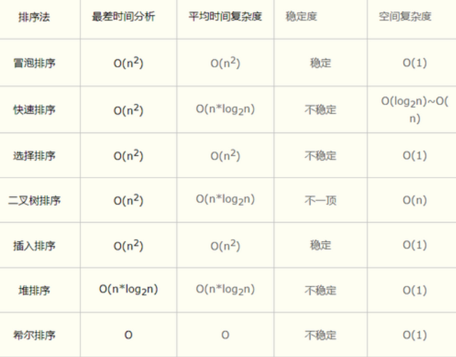
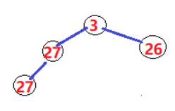

## 01.时间复杂度

### 1.1 各种算法比较

- 2层for循环都是 O（n²）
- log(n)：每次循环减半（二分查找）
- 快排：nlog(n)

 </img>

### 1.2 算法不稳定定义

- **定义：**在排序之前,有两个数相等，但是在排序结束之后,它们两个有可能改变顺序.

- **说明：**在一个待排序队列中,A和B相等,且A排在B的前面,而排序之后,A排在了B的后面.这个时候,我们说这种算法是不稳定的.

### 1.3 不稳定的几种算法

- **1）快排为什么不稳定**
     - 3 2 2 4 经过第一次快排后结果：2 2 3 4 （第3号位置的2第一次排序后跑到第1号位置了）

- **2）堆排序为什么不稳定**　　
     - 如果堆顶3先输出，则，第三层的27（最后一个27）跑到堆顶，然后堆稳定，继续输出堆顶，是刚才那个27
     - 这样说明后面的27先于第二个位置的27输出，不稳定

 </img>

- **3）选择排序为什么不稳定**
     - 5 8 5 2 9 第一次假定1号位置的5最小，但是实际最小的是4号位置的2
     - 第一次排序后为：2 8 5 5 9 以前1号位置的5跑到3号位置5的后面了

