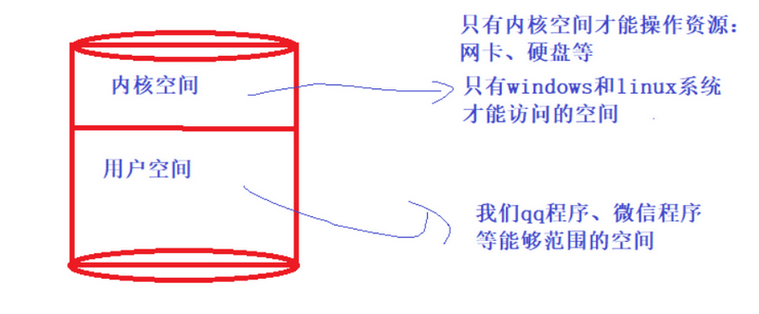
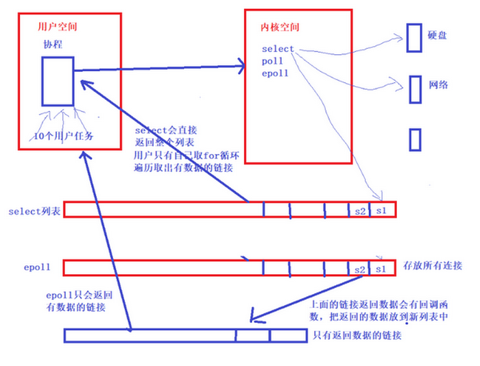

## 01.select、epoll、poll

- select、poll、epoll是内核的服务
  - windows下只有 select服务、poll
  - Linux下：select、poll、epoll
- 怎么使用
  - 协程
  - tornado

https://www.cnblogs.com/xiaonq/p/7907871.html

### 1.1 I/O 多路复用

- 特点： 用户还是要等待数据从kernel拷贝到用户进程

- IO multiplexing就是我们说的`select，poll，epoll`，有些地方也称这种IO方式为event driven IO

- 它的基本原理就是select，poll，epoll这个function会`不断的轮询所负责的所有socket，当某个socket有数据到达了，就通知用户进程`
  - 1）当用户进程调用了select，那么整个进程会被block，而同时，kernel会“监视”所有select负责的socket
  - 2）当任何一个socket中的数据准备好了，select就会返回
  - 3）这个时候用户进程再调用read操作，将数据从kernel拷贝到用户进程。
  - 4）虽然是多并发但是还有一些卡，因为都要等待数据从kernel拷贝到用户进程
  - 5）其实select，poll，epoll实质就是循环着接收数据　　
  - 6）select/epoll的优势并不是对于单个连接能处理得更快，而是在于能处理更多的连接。

### 1.2 I/O的实质是什么？

- I/O的实质是什么？

  - I/O的实质是将硬盘中的数据，或收到的数据实现从内核态 copy到 用户态的过程
  - 比如微信读取本地硬盘的过程
    - 微信进程会发送一个读取硬盘的请求----》操作系统
    - 只有内核才能够读取硬盘中的数据---》数据返回给微信程序（看上去就好像是微信直接读取）

- 用户态 & 内核态

  - 系统空间分为两个部分，一部分是内核态，一部分是用户态的部分
  - 内核态：内核态的空间资源只有操作系统能够访问
  - 用户态：我们写的普通程序使用的空间

### 1.3 select、poll、epoll特点

- select
  - 只能处理1024个连接（每一个请求都可以理解为一个连接）
  - 不能告诉用户程序，哪一个连接是活跃的

- pool

  - 只是取消了最大1024个活跃的限制
  - 不能告诉用户程序，哪一个连接是活跃的

- epool

  - 不仅取消了1024这个最大连接限制
  - 而且能告诉用户程序哪一个是活跃的

### 1.4 epoll本质

- 简单说法
  - 协程遇到I/O后自动切换，但是会保持一个socket连接，交给系统内核去处理工作
  - epoll()就工作内核中，他维护了一个链表，来存放所有的socket连接
  - 当内核处理完成后就会回调一个函数，以socket文件描述符为key，结果为value存放到字典中
  - 此时这个列表还是在内核中，需要将这个字典拷贝到用户空间（用户进程中）

- 本质
  -  1.`epoll()中内核则维护一个链表`，epoll_wait直接检查链表是不是空就知道是否有文件描述符准备好了。
  -  2.在内核实现中epoll是根据每个sockfd上面的与设备驱动程序建立起来的回调函数实现的。
  -  3.某个sockfd上的事件发生时，与它对应的回调函数就会被调用，来把这个sockfd加入链表，其他处于“空闲的”状态的则不会。
  -  4.epoll上面链表中获取文件描述，这里使用内存映射（mmap）技术，避免了复制大量文件描述符带来的开销
  -  内存映射（mmap）：内存映射文件，是由一个文件到一块内存的映射，将不必再对文件执行I/O操作

