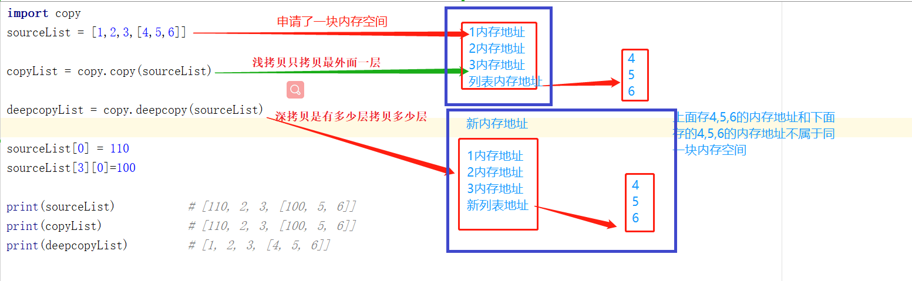
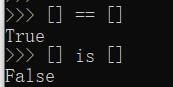

## 01.深浅拷贝


- **浅copy与deepcopy**（What）

  - **浅copy：** 不管多么复杂的数据结构，浅拷贝都只会copy一层
  - **deepcopy** : 深拷贝会完全复制原变量相关的所有数据，在内存中生成一套完全一样的内容，我们对这两个变量中任意一个修改都不会影响其他变量

- ```python
  import copy
  sourceList = [1,2,3,[4,5,6]]
  copyList = copy.copy(sourceList)
  deepcopyList = copy.deepcopy(sourceList)
  
  sourceList[3][0]=100
  
  print(sourceList)           # [1, 2, 3, [100, 5, 6]]
  print(copyList)             # [1, 2, 3, [100, 5, 6]]
  print(deepcopyList)         # [1, 2, 3, [4, 5, 6]]
  ```



## 02.变量及其存储

- 1. python的一切变量都是对象，变量的存储，采用了引用语义的方式，存储的只是一个变量的值所在的内存地址，而不是这个变量的只本身

- 2. 不管多么复杂的数据结构，浅拷贝都只会copy一层。

- **理解**：两个人公用一张桌子，只要桌子不变，桌子上的菜发生了变化两个人是共同感受的。

```python
>>> str1 = 'hello'
>>> str2 = str1

#1、让str1和str2变量都存储了‘hello’所在的内存地址
>>> id(str1)
22748280
>>> id(str1)
22748280
>>>

#2、当str1的值变成‘new hello’后str1的值被重新赋值成'new hello'的内存地址，而str2的值依旧是‘hello’的内存地址
>>> str1 = 'new hello'
>>> id(str1)
22748320
>>> id(str2)
22748280

#3、不管多么复杂的数据结构，浅拷贝都只会copy一层。
>>> sourceList = [1,2,[3,4]]
>>> newList = sourceList

>>> l[2][0]=100

>>> sourceList
[1, 2, [100, 4]]
>>> newList
[1, 2, [100, 4]]
```

## 03.is和==区别

- is不仅数据一样内存地址也一样
- == 只判断数据和数据类型一样即可

 </img>


