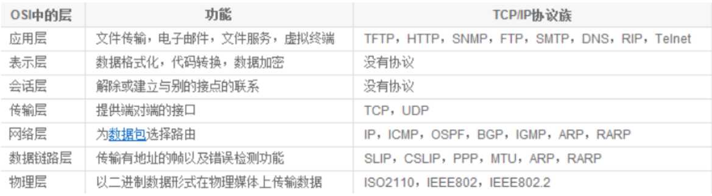
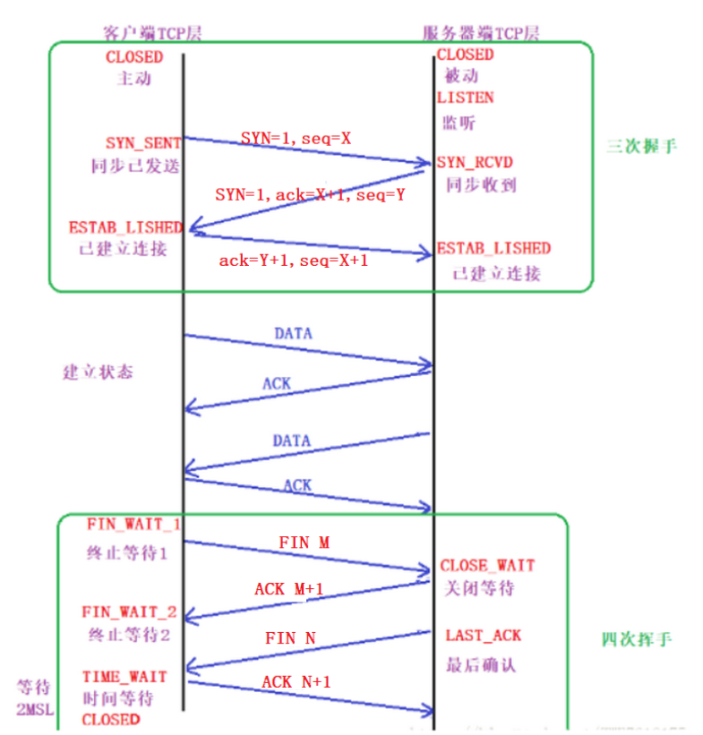

## 01.网络七层与TCP

https://www.cnblogs.com/xiaonq/p/10470551.html

### 1.1 网络七层

### 1.2 TCP三层握手

### 1.3 TCP与UDP比较

- 1.TCP面向连接（如打电话要先拨号建立连接）;UDP是无连接的，即发送数据之前不需要建立连接

- 2.TCP提供可靠的服务，也就是说，通过TCP连接传送的数据，无差错，不丢失，不重复，且按序到达;UDP尽最大努力交付，即不保证可靠交付

- 3.Tcp通过校验和，重传控制，序号标识，滑动窗口、确认应答实现可靠传输。

- 4.UDP具有较好的实时性，工作效率比TCP高，适用于对高速传输和实时性有较高的通信或广播通信。

- 5.每一条TCP连接只能是点到点的;UDP支持一对一，一对多，多对一和多对多的交互通信

- 6.TCP对系统资源要求较多，UDP对系统资源要求较少。

- 注：UDP一般用于即时通信（QQ聊天对数据准确性和丢包要求比较低，但速度必须快），在线视频等

- tcp/udp相关协议
     - 1.TCP:STMP,TELNET,HTTP,FTP
     - 2.UDP:DNS,TFTP,RIP,DHCP,SNMP

