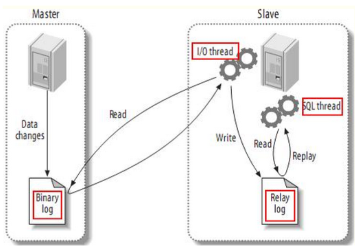

# 01.MySQL同步

## 1.1 Mysql主从复制原理

- 1、master服务器将数据的改变都记录到二进制binlog日志中，`只要master上的数据发生改变，则将其改变写入二进制日志`；

- 2、salve服务器会在一定时间间隔内对master二进制日志进行探测其是否发生改变，如果发生改变，则`开始一个I/O Thread请求master二进制事件`

- 3、同时`主节点为每个I/O线程启动一个dump线程`，用于向其发送二进制事件，并保`存至从节点本地的中继日志中`

- 4、从节点将启动SQL线程从中继日志中读取二进制日志，在本地重放，使得其数据和主节点的保持一致

- 5、最后I/O Thread和SQL Thread将进入睡眠状态，等待下一次被唤醒。

- **需要理解：**
     - 1）从库会生成两个线程,一个I/O线程,一个SQL线程;
     - 2）I/O线程会去请求主库的binlog,并将得到的binlog写到本地的relay-log(中继日志)文件中;
     - 3）主库会生成一个log dump线程,用来给从库I/O线程传binlog;
     - *4）SQL线程,会读取relay log文件中的日志,并解析成sql语句逐一执行;*

## 1.2 Mysql复制流程图

- 1、master将操作语句记录到binlog日志中

- 2、salve服务器会在一定时间间隔内对master二进制日志进行探测其是否发生改变，如果发生改变

- 3、`salave开启两个线程`：IO线程和SQL线程
     - 1）`IO线程`：负责读取master的binlog内容到中继日志relay log里；
     - 2）`SQL线程`：负责从relay log日志里读出binlog内容，并更新到slave的数据库里（保证数据一致）

 </img>

## 1.3 MySQL同步延迟

- 1、造成mysql同步延迟常见原因
     - 1）网络：如主机或者从机的带宽打满、主从之间网络延迟很大，导致主上的binlog没有全量传输到从机，造成延迟。
     - 2）机器性能：从机使用了烂机器？比如主机使用SSD而从机还是使用的SATA。
     - 3）从机高负载：有很多业务会在从机上做统计，把从机服务器搞成高负载，从而造成从机延迟很大的情况
     - 4）大事务：比如在RBR模式下，执行带有大量的delete操作，这种通过查看processlist相关信息以及使用mysqlbinlog查看binlog中的SQL就能快速进行确认
     - 5）锁: 锁冲突问题也可能导致从机的SQL线程执行慢，比如从机上有一些select .... for update的SQL，或者使用了MyISAM引擎等。

- 2、硬件方面（优化）
     - 1.采用好服务器，比如4u比2u性能明显好，2u比1u性能明显好。
     - 2.存储用ssd或者盘阵或者san，提升随机写的性能。
     - 3.主从间保证处在同一个交换机下面，并且是万兆环境。
     - 总结：硬件强劲，延迟自然会变小。一句话，缩小延迟的解决方案就是花钱和花时间。

