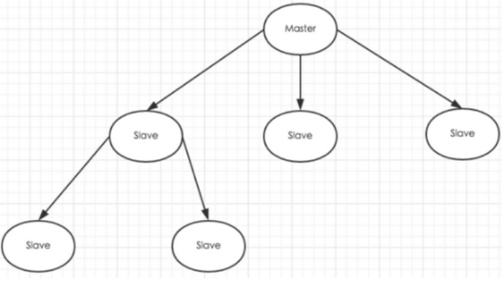
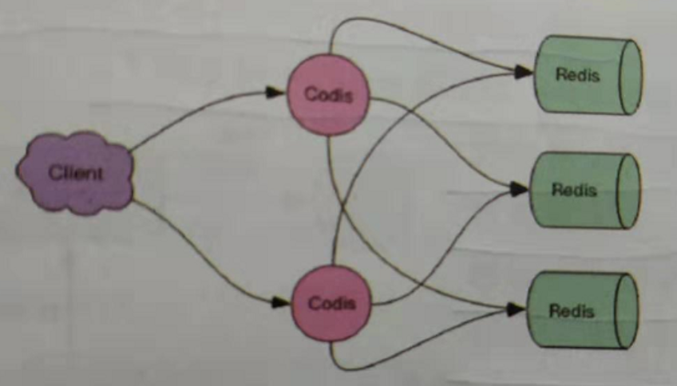

# 01.redis集群集中模式

## 1.1 redis主从

- 1、和MySQL主从复制的原因一样，Redis虽然读取写入的速度都特别快，但是也会产生读压力特别大的情况。
- 2、为了分担读压力，Redis支持主从复制，Redis的主从结构可以采用一主多从或者级联结构。
- 3、Redis主从复制可以根据是否是全量分为全量同步和增量同步。
- 注：redis主节点Master挂掉时，运维让从节点Slave接管（`redis主从默认无法自动切换，需要运维手动切换`）

 </img>

## 1.2 哨兵模式

### 1.2.1 sentinel作用

- 1.当用Redis做主从方案时，假如master宕机，Redis本身无法自动进行主备切换

- 2.而Redis-sentinel本身也是一个独立运行的进程，它能监控多个master-slave集群，发现master宕机后能进行自动切换。

### 1.2.2 sentinel原理

- 1.sentinel负责持续监控主节点的健康，当主节挂掉时，自动选择一个最优的从节点切换成主节点

- 2.从节点来连接集群时会首先连接sentinel，通过sentinel来查询主节点的地址

- 3.当主节点发生故障时，sentinel会将最新的主节点地址告诉客户端，可以实现无需重启自动切换redis

### 1.2.3 Sentinel支持集群

- 1.只使用单个sentinel进程来监控redis集群是不可靠的，当sentinel进程宕掉后sentinel本身也有单点问题

- 2.如果有多个sentinel，redis的客户端可以随意地连接任意一个sentinel来获得关于redis集群中的信息。

### 1.2.4 Sentinel版本

- 1.Sentinel当前稳定版本称为Sentinel 2，Redis2.8和Redis3.0附带稳定的哨兵版本

- 2.安装完redis-3.2.8后，redis-3.2.8/src/redis-sentinel启动程序 redis-3.2.8/sentinel.conf是配置文件。

### 1.3.5 哨兵模式配置

https://www.cnblogs.com/xiaonq/p/12348184.html

## 1.3 codis

### 1.3.1 为什么会出现codis

- 1.在大数据高并发场景下，单个redis实例往往会无法应对

- 2.首先redis内存不易过大，内存太大会导致rdb文件过大，导致主从同步时间过长

- 3.其次在CPU利用率中上，单个redis实例只能利用单核，数据量太大，压力就会特别大

### 1.3.2 什么是codis

- 1.codis是redis集群解决方案之一，codis是GO语言开发的代理中间件

- 2.当客户端向codis发送指令时，codis负责将指令转发给后面的redis实例来执行，并将返回结果转发给客户端

### 1.3.3 codis部署方案

- 1.单个codis代理支撑的QPS比较有限，通过启动多个codis代理可以显著增加整体QPS

- 2.多codis还能起到容灾功能，挂掉一个codis代理还有很多codis代理可以继续服务

 </img>

### 1.3.4 codis分片的原理

- 1.codis负责将特定key转发到特定redis实例，codis默认将所有key划分为1024个槽位

- 2.首先会对客户端传来的key进行crc32计算hash值，然后将hash后的整数值对1024进行取模，这个余数就是对应的key槽位

- 3.每个槽位都会唯一映射到后面的多个redis实例之一，codis会在内存中维护槽位和redis实例的映射关系

- 4.这样有了上面key对应的槽位，那么它应该转发到那个redis实例就很明确了

- 5.槽位数量默认是1024，如果集群中节点较多，建议将这个数值大一些，比如2048,4096

### 1.3.5 不同codis槽位如何同步

- 1.如果codis槽位值存在内存中，那么不同的codis实例间的槽位关系得不到同步

- 2.所以codis还需要一个分布式配置存储的数据库专门来持久化槽位关系

- 3.codis将槽位关系存储在zookeeper中，并且提供一个dashboard可以来观察和修改槽位关系